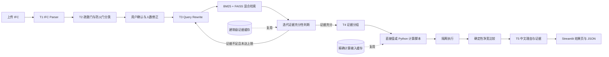

<div align="center">

# BIM Agent

**基于 IFC 模型与规范证据的疏散门净宽智能审查原型**


[快速开始](#快速开始) · [评估样本](#使用评估样本) · [项目架构](#开发架构) · [问题排查](#常见问题)

</div>

## 项目简介

BIM Agent 面向 BIM 审查研究人员、建筑设计人员和 IFC 应用开发者，将 IFC 门构件解析、疏散门识别、规范混合检索、可执行规则计算和结果解释组织为一条可交互的审查流程。当前 MVP 聚焦中小学建筑疏散门净宽检查，通过 Streamlit 页面完成模型上传、人工确认、规范证据检索和逐门结果展示。

> [!IMPORTANT]
> 本项目目前是研究与工程验证原型，输出不能替代注册专业人员的正式设计审查、消防审查或法律意见。

## 功能概览

- 解析 IFC2X3/IFC4 门构件，并将线性尺寸统一为毫米。
- 使用 LLM 判断疏散门与防火门属性，保留证据、置信度和缺失信息。
- 允许用户在前端确认 uncertain 门，并逐门修正疏散人数。
- 使用 BM25 与 FAISS Dense Retrieval 进行文本、表格和图片混合检索。
- 使用最多 3 跳的迭代检索补全实际净宽计算证据和规范阈值证据。
- 对同项目、同建筑类型的疏散门复用 T3 规范证据；对计算输入相同的门复用 T4 结果。
- 将规则脚本运行与最终 `PASS/FAIL` 比较保持为确定性步骤。
- 展示实际净宽、规范阈值、合格状态、详细理由和证据 ID，并支持 JSON 审计结果下载。

## 快速开始

### 开发前的配置要求

- [Python](https://www.python.org/) 3.11 或更高版本，推荐 Python 3.12。
- [Git](https://git-scm.com/) 与 [Git LFS](https://git-lfs.com/)。评估 IFC 约 85 MB，必须拉取真实 LFS 内容。
- Windows、macOS 或 Linux。当前完整验证环境为 Windows 11 + Python 3.12。
- 可访问的 OpenAI-compatible API，且需要支持：
  - Chat Completions；
  - JSON Object 输出；
  - 表格/图片多模态输入；
  - 与内置 FAISS 索引匹配的 `Pro/BAAI/bge-m3`、1024 维查询向量。
- 建议至少 4 GB 可用内存和 2 GB 可用磁盘空间。

### 获取代码与大文件

```powershell
git clone https://github.com/SiruiXiong123/BIM-Agent.git
Set-Location BIM-Agent
git lfs pull
```

### Windows 安装

```powershell
python -m venv .venv
.\.venv\Scripts\python.exe -m pip install --upgrade pip
.\.venv\Scripts\python.exe -m pip install -r requirements.txt
Copy-Item .env.example .env
```

### macOS / Linux 安装

```bash
python3 -m venv .venv
source .venv/bin/activate
python -m pip install --upgrade pip
python -m pip install -r requirements.txt
cp .env.example .env
```

### 配置环境变量

编辑根目录下的 `.env`：

```dotenv
base_url=https://your-openai-compatible-endpoint.example/v1
api_key=your-api-key
model_name=your-vlm-or-llm
evacuation_door_model_name=your-classification-model
embedding_model_name=Pro/BAAI/bge-m3
```

字段说明：

| 字段 | 用途 |
| --- | --- |
| `base_url` | OpenAI-compatible API 根地址 |
| `api_key` | API 密钥，不得提交到 Git |
| `model_name` | T3–T5 查询改写、证据判断、规则生成和结果说明使用的模型 |
| `evacuation_door_model_name` | T2 疏散门与防火门分类模型 |
| `embedding_model_name` | Dense Retrieval 查询嵌入模型，必须与索引 manifest 一致 |

### 检查并启动

Windows：

```powershell
.\.venv\Scripts\python.exe -m src.main --check
.\.venv\Scripts\python.exe -m src.main
```

macOS / Linux：

```bash
python -m src.main --check
python -m src.main
```

`--check` 只检查 Python、环境变量、规范索引、原始证据图片和评估 IFC，不会启动服务或调用模型。启动成功后会打开 [http://127.0.0.1:8501](http://127.0.0.1:8501)。若不希望自动打开浏览器，可运行：

```bash
python -m src.main --no-browser
```

## 使用评估样本

仓库提供 [`eval/primary_school_door_width_eval.ifc`](eval/primary_school_door_width_eval.ifc)，用于验证疏散门净宽不合格场景。

1. 打开 Web 页面并上传该 IFC。
2. “处理门数量”输入 `10`。
3. 点击“解析并识别门”，等待 T1/T2 完成。
4. 在门确认页面检查自动识别结果，可选择 uncertain 门或修改疏散人数。
5. 点击“NEXT · 进入执行阶段”。
6. 点击“开始执行 T3–T5”。
7. 在结果页查看逐门净宽、阈值、合格状态、证据和详细理由。

该样本保留 57 扇门，仅修改了两扇门的 `IfcDoor.OverallWidth`。默认处理前 10 扇门时，关键预期结果如下：

| 门 ID | OverallWidth | 预期实际净宽 | 预期规范阈值 | 预期结果 |
| --- | ---: | ---: | ---: | --- |
| Door 2610 | 700 mm | 600 mm | 700 mm | 不合格 |
| Door 43970 | 600 mm | 500 mm | 700 mm | 不合格 |

模型服务、网关或多模态输出异常可能导致单门显示为错误；系统会隔离该错误，不中断其他门。瞬态网络错误、429、5xx 和 ALB HTML 400 会采用 `0.5s → 1s → 2s` 指数退避，最多重试 3 次。

## 文件目录说明

```text
BIM_Agent/
├── app/
│   └── main.py                    # Streamlit 页面与会话交互
├── src/
│   ├── main.py                    # 统一启动入口
│   ├── startup.py                 # 环境、索引、媒体与 eval 启动检查
│   ├── ifc_parser.py              # T1 IFC 门构件事实提取
│   ├── ai/                        # T2 分类、统一模型客户端和多模态证据
│   ├── review/                    # T1–T5 批处理编排、缓存与结果契约
│   ├── search/
│   │   ├── indexes/               # BM25/FAISS 索引读写
│   │   ├── retrievers/            # BM25、Dense 与 Hybrid Retrieval
│   │   ├── iterative/             # T3 多跳检索控制器与证据历史
│   │   └── cli/                   # 索引维护和调试工具
│   ├── rules/                     # T4 证据分组、脚本生成与隔离执行
│   ├── schemas/                   # IFC、分类、规则与结果数据模型
│   ├── rule_engine.py             # 确定性净宽比较
│   └── report_generator.py        # T5 中文详细理由
├── prompt/                        # 分类、查询改写、控制器与规则提示词
├── references/
│   └── assets/
│       ├── indexes/               # 两份规范的 BM25/FAISS 离线索引
│       └── ...                    # 表格、图片和结构化规范材料
├── eval/                          # 可公开演示的 IFC 评估样本
├── examples/                      # IFC 解析和分类中间结果示例
├── tests/                         # 单元、集成、编排与 UI 测试
├── .env.example                   # 环境变量模板
├── .gitattributes                 # IFC/PDF Git LFS 规则
├── requirements.txt               # Python 运行依赖
├── requirements-dev.txt           # 测试依赖
├── LICENSE                        # MIT License
└── README.md
```

运行产生的 `artifacts/`、临时下载、缓存和索引清理备份已通过 `.gitignore` 排除，不应提交到仓库。

## 开发架构



模块边界：

- IFC Parser 只提取事实，不做规范判断。
- T3 只负责检索证据并判断证据是否足够计算实际净宽和规范阈值。
- T4 根据当前门上下文和分组证据产生两个数值，不负责生成面向用户的合规结论。
- 最终数值比较由确定性规则引擎完成，不交给 LLM。
- T5 只将确定性结果、IFC 上下文和规范证据组织为中文说明。

更详细的架构文档暂未拆分；后续可增加 `ARCHITECTURE.md`。

## 部署说明

当前版本支持本地单机 Streamlit 运行，尚未提供经过验证的生产部署方案、用户认证、任务队列、持久化数据库或多实例缓存一致性。

如需部署到测试服务器，可使用：

```bash
python -m src.main --host 0.0.0.0 --port 8501 --no-browser
```

测试或生产环境还应额外配置：

- HTTPS 反向代理；
- 身份认证与访问控制；
- API Key 密钥管理；
- 上传文件隔离、大小限制和定期清理；
- 后台任务队列、超时和并发配额；
- 审查结果与调用日志持久化；
- 对外发布规范材料前的版权审核。

在完成这些能力前，不建议将当前服务直接暴露到公网。

## 使用的技术与框架

| 技术 | 当前验证版本 | 用途 |
| --- | ---: | --- |
| [Python](https://www.python.org/) | 3.12.13 | 应用、解析、检索与规则执行 |
| [Streamlit](https://streamlit.io/) | 1.41.1 | 本地 Web UI |
| [IfcOpenShell](https://ifcopenshell.org/) | 0.8.5 | IFC 解析 |
| [Pydantic](https://docs.pydantic.dev/) | 2.13.3 | 显式输入输出契约与校验 |
| [OpenAI Python SDK](https://github.com/openai/openai-python) | 2.32.0 | OpenAI-compatible 模型与嵌入请求 |
| [FAISS](https://github.com/facebookresearch/faiss) | 1.14.2 | Dense Retrieval 向量索引 |
| [rank-bm25](https://github.com/dorianbrown/rank_bm25) | 0.2.2 | BM25 词法检索 |
| [jieba](https://github.com/fxsjy/jieba) | 0.42.1 | 中文及混合文本分词 |
| [NumPy](https://numpy.org/) | 1.26.4 | 向量数据处理 |

## 测试

运行完整测试：

```bash
python -m pip install -r requirements-dev.txt
python -m pytest -q
```

当前验证基线为 `223 passed，5 subtests passed`。测试覆盖 IFC 解析、Schema、查询改写、BM25/FAISS 检索、证据媒体定位、多跳控制、T3/T4 缓存、规则脚本执行、T5 结果、统一编排和 Streamlit 页面。

只做发布前启动检查：

```bash
python -m src.main --check
```

## 常见问题

### `.env is missing` 或环境变量仍是占位符

复制 `.env.example` 为 `.env`，填写真实 API 地址、密钥和模型名称。`.env` 已被 Git 忽略。

### 提示 IFC、PDF 或评估文件是 Git LFS pointer

```bash
git lfs install
git lfs pull
```

### `embedding dimension mismatch`

当前索引由 `Pro/BAAI/bge-m3` 构建，维度为 1024。请确认 API 的 `embedding_model_name` 返回相同维度；否则必须重新构建 FAISS 索引。

### Streamlit 端口已被占用

```bash
python -m src.main --port 8502
```

### 模型网关返回 ALB 400

统一模型客户端会对 ALB HTML 400 做最多 3 次指数退避重试。若持续失败，应检查请求正文大小、图片格式、网关限制和模型的多模态兼容性。

## 版权与许可证

项目源代码采用 [MIT License](LICENSE)。你可以在保留版权声明和许可证文本的前提下使用、复制、修改、合并、发布和分发本项目代码。

规范 PDF、规范截图、索引语料和 IFC 模型可能包含第三方权利，不因项目代码采用 MIT License 而自动获得同等授权。公开发布或用于商业场景前，请自行确认这些材料的版权、数据许可和合规要求。

## 项目状态

当前版本已经完成本地 MVP 主流程，但仍处于研究和工程验证阶段。在线演示、生产部署、用户认证、持久化任务、CI 徽章和正式问题反馈链接将在 GitHub 仓库地址确定后补充。
