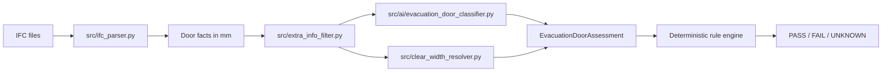
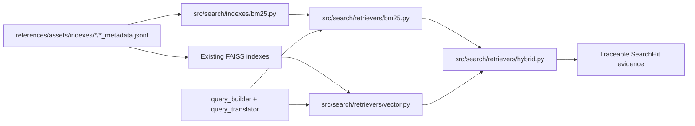

# System architecture

## Overview

??? IFC ????????????????????????????????????? FAISS + BM25 ???????? RRF ???

## Compliance module graph

## Regulation retrieval graph

## Search package boundaries

- `tokenization`: ???????????
- `indexes`: ?? BM25/FAISS ????????????????
- `retrievers`: ?? BM25?????? RRF ???
- `cli`: ????????????????
- `SearchConfig` ?????????????
- metadata ????????????????????????

## Constraints

- IFC parsing extracts facts only and normalizes linear values to millimetres.
- `IfcDoor.OverallWidth` is overall door width, never clear width.
- The LLM may classify or translate semantic input, but deterministic width resolution, compliance checks and RRF fusion remain programmatic.
- Regulation retrieval returns evidence and never makes the final compliance decision.
