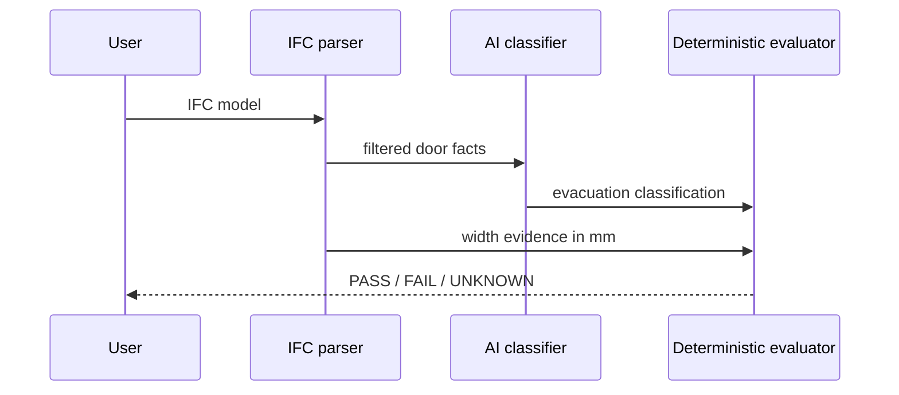
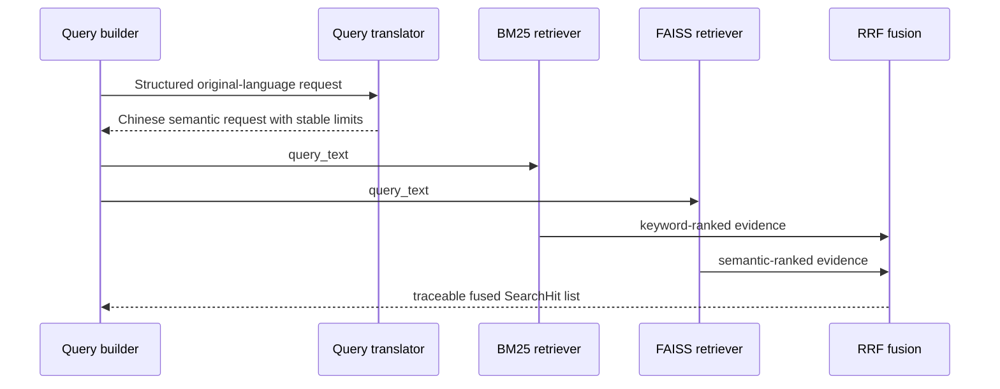

# Key flows

## Compliance flow

## Regulation retrieval flow

BM25 uses existing text, table and image metadata under `references/assets/indexes`; table and image `content`/`summary` fields are indexed without modifying the original assets.
