ICS 91.040.01

CCSP30

DB3201

南 京 市 地 方 标 准

DB 3201/T 1143—2023

# 建筑工程施工图信息模型智能审查规范

# Intelligent review specification for construction drawing information model of building engineering

2023-02-15 发布

2023-02-18 实施

南京市市场监督管理局 发 布

### 目次

前言 ..... II  
引言 ..... III  
1 范围 ..... 1  
2 规范性引用文件 ..... 1  
3 术语和定义 ..... 2  
4 总体要求 ..... 2  
5 审查程序 ..... 3  
6 审查范围 ..... 3  
7 审查结果 ..... 6  
附录 A （资料性）建筑专业 BIM 智能审查条文库 ..... 7  
附录 B （资料性）结构专业 BIM 智能审查条文库 ..... 30  
附录 C （资料性）给排水专业 BIM 智能审查条文库 ..... 50  
附录 D （资料性）电气专业 BIM 智能审查条文库 ..... 60  
附录 E （资料性）暖通专业 BIM 智能审查条文库 ..... 66  
附录 F （资料性）人防专业 BIM 智能审查条文库 ..... 72  
附录 G （资料性）节能专业 BIM 智能审查条文库 ..... 74  
附录 H （资料性）审查项不通过结论相关因素 ..... 75  
附录 I （资料性）审查意见示例 ..... 77  
参考文献 ..... 78

### 前言

本文件按照GB/T 1.1—2020《标准化工作导则 第1部分：标准化文件的结构和起草规则》的规定起草。

请注意本文件的某些内容可能涉及专利。本文件的发布机构不承担识别专利的责任。

本文件由南京市城乡建设委员会提出并归口。

本文件起草单位：南京市建设工程施工图设计审查管理中心、中通服咨询设计研究院有限公司、北京构力科技有限公司、南京市建筑工程质量安全监督站、奥格科技股份有限公司。

本文件主要起草人：彭为民、徐嵘、曹桂敏、王惠芳、许钰涓、院梅、谢维锺、陈蓉、贾凌、胡睿、汤宇红、吴大江、朱强、汪深、李兵、孙精科、孔燕、周海涛、张磊、罗磊、周盼生、周婷婷、杜娟、黄立新、杨炅澄、张朝阳、徐汉擎、王委、谢宇欣、冯川、朱佳迪、王童、张建宇、吕金健、桂尚品、陶雪峰。

## 引言

利用计算机进行施工阶段信息模型的智能化审查，能有效提高模型审查的准确性和效率。当前阶段，计算机智能化审查与人工审查仍然处于并存的状态，即以人工审查为主、机器审查为辅的方式。随着计算机智能审查的不断演进，非常有必要建立一种约定计算机智能化审查的条文拆解方式、条文设计范围的规范。

本文件明确了计算机智能化审查的方式及内容，有利于帮助审查人员区分人工审查与机器审查的界面。随着技术的发展，为审查规则的扩充提供依据，进一步完善计算机智能化审查的覆盖面，保障施工信息模型的合规性和完整性。

## DB3201

# 建筑工程施工图信息模型智能审查规范

## 1 范围

本文件规定了施工图信息模型智能化审查的总体要求、审查程序、审查范围及审查结果，通过资料性附录形式记录了建设工程BIM施工图审查系统的审查内容。

本文件适用于新建建筑工程施工图信息模型智能化审查管理，主要使用对象为审图机构等单位的专业技术人员。

## 2 规范性引用文件

下列文件中的内容通过文中的规范性引用而构成本文件必不可少的条款。其中，注日期的引用文件，仅该日期对应的版本适用于本文件；不注日期的引用文件，其最新版本（包括所有的修改单）适用于本文件。

GB 50010 混凝土结构设计规范

GB 50011-2010 建筑抗震设计规范

GB 50015 建筑给水排水设计标准

GB 50016 建筑设计防火规范

GB 50034 建筑照明设计标准

GB 50038 人民防空地下室设计规范

GB 50067 汽车库、修车库、停车场设计防火规范

GB 50084-2017 自动喷水灭火系统设计规范

GB 50096 住宅设计规范

GB 50099 中小学校设计规范

GB 50116 火灾自动报警系统设计规范

GB 50189 公共建筑节能设计标准

GB 50352 民用建筑设计统一标准

GB 50368 住宅建筑规范

GB 50400 建筑与小区雨水控制及利用工程技术规范

GB 50974 消防给水及消火栓系统技术规范

GB 51251 建筑防排烟系统技术标准

GB 51348 民用建筑电气设计标准

GB 55002 建筑与市政工程抗震通用规范

GB 55008-2021 混凝土结构通用规范

GB 55015 建筑节能与可再生能源利用通用规范

GB 55020 建筑给水排水与节水通用规范

GB 55024 建筑电气与智能化通用规范

JGJ 3-2010 高层建筑混凝土结构技术规程

JGJ 25 档案馆建筑设计规范

JGJ 39 托儿所、幼儿园建筑设计规范

JGJ/T 67 办公建筑设计标准

JGJ 310 教育建筑电气设计规范

JGJ 450 老年人照料设施建筑设计标准

DB32/3962 绿色建筑设计标准

## 3 术语和定义

下列术语和定义适用于本文件。

### 3.1

#### 建筑信息模型 building information modeling (BIM)

在建设工程及设施全生命期内，对其物理和功能特性进行数字化表达，并依此设计、施工、运营的过程和结果的总称。

[来源：GB/T 51212-2016，2.1.1]

### 3.2

#### 施工图信息模型 BIM in construction drawing

建筑工程项目施工图设计阶段，符合施工图审查要求的建筑信息模型。简称“施工图BIM”。

[来源：DB3201/T1142-2023，3.2]

### 3.3

#### 智能化审查 intelligent review

智能化审查是利用计算机对施工图信息模型进行信息解析，自动识别设计标准规范对应条文并进行审查，输出审查结论的一种方法。

### 3.4

施工图 BIM 智能审查系统 BIM intelligent review system

满足施工图信息模型的数据上传、数据存储、数据流转、数据审查、数据分析等要求，支撑施工图智能化审查的管理系统。

### 3.5

#### 施工图 BIM 宁建模 NJM of BIM in construction drawing

基于南京市施工图信息模型的开发，定义数据存储方式及数据结构等内容，实现BIM数据在工程建设项目规划、建设、运营管理全流程的无损流转与共享的一种数据格式，简称“宁建模”，缩写“NJM”。

[来源：DB3201/T1142-2023，3.4]

## 4 总体要求

4.1 施工图 BIM 智能审查系统应遵循以人工审查为主，机器审查为辅助的原则。

4.2 施工图 BIM 智能审查系统应包含对 NJM 数据和图纸的审查，系统应包含智能审查、数据统计、项目查询、规范查询等功能。

4.3 南京市施工图 BIM 智能审查系统应包含建筑、结构、给排水、电气、暖通、人防、节能专业。

## 5 审查程序

5.1 施工图 BIM 智能审查系统是在施工图数字化审查系统基础上，增加 BIM 审查功能模块，实现计算机智能审查，施工图 BIM 智能审查遵循程序，如图 1 所示。

图1 施工图 BIM 智能审查程序

5.2 窗口受理建设单位项目资料时需审核建设单位填报信息的准确性和完整性。

5.3 审图机构管理人员登录施工图 BIM 智能审查审图机构版账号，按对应专业进行项目分配，进入下一环节。

5.4 审查人员通过施工图 BIM 智能审查系统审查专家版软件进入施工图 BIM 智能审查环境。

5.5 审查人员按专业配置系统账号，使用施工图 BIM 智能审查系统分专业进行智能化审查。

5.6 非本专业模型仅能进行查看，无法进入该专业 BIM 智能审查环境。

5.7 审查人员在 BIM 智能审查环境中按照项目类型，对照本文件涉及范围选择适用规范。施工图 BIM 智能审查系统可按专业、规范筛选适用范围。

5.8 模型在 BIM 智能审查环境中以树状列表结构呈现，通过开关按钮实现专业级、楼层级、构件级（此处按分类层级顺序列出）的显示与隐藏。

5.9 审查人员在 BIM 智能审查环境中将二维图纸与三维模型进行联动，同一视图中进行审阅。

5.10 审查人员在 BIM 智能审查环境中进行测量，辅助进行距离、高度信息获取。

5.11 审查人员在 BIM 智能审查环境中进行模型视图切换，在视图控制球选择主视图、透视视图、正交视图、全视图、全方位视图等不同视图，实现对模型的全方位查看。

5.12 审查人员在 BIM 智能审查环境中进行模型动态剖解，查看模型内部构造。

5.13 需人工复核的条文内容、本文件范围未涉及的条文，审查人员需要对照图纸、模型进行复核，生成审查意见报告。

## 6 审查范围

### 6.1 建筑专业模型审查范围

建筑专业根据9本文件审查模型，如表1所示。条文详见附录A。

表1 建筑专业审查规范清单

<table border=1 style='margin: auto; word-wrap: break-word;'><tr><td style='text-align: center; word-wrap: break-word;'>序号</td><td style='text-align: center; word-wrap: break-word;'>名称</td><td style='text-align: center; word-wrap: break-word;'>编号</td></tr><tr><td style='text-align: center; word-wrap: break-word;'>1</td><td style='text-align: center; word-wrap: break-word;'>《建筑设计防火规范》</td><td style='text-align: center; word-wrap: break-word;'>GB 50016</td></tr><tr><td style='text-align: center; word-wrap: break-word;'>2</td><td style='text-align: center; word-wrap: break-word;'>《民用建筑设计统一标准》</td><td style='text-align: center; word-wrap: break-word;'>GB 50352</td></tr><tr><td style='text-align: center; word-wrap: break-word;'>3</td><td style='text-align: center; word-wrap: break-word;'>《建筑节能与可再生能源利用通用规范》</td><td style='text-align: center; word-wrap: break-word;'>GB 55015</td></tr><tr><td style='text-align: center; word-wrap: break-word;'>4</td><td style='text-align: center; word-wrap: break-word;'>《住宅设计规范》</td><td style='text-align: center; word-wrap: break-word;'>GB 50096</td></tr><tr><td style='text-align: center; word-wrap: break-word;'>5</td><td style='text-align: center; word-wrap: break-word;'>《中小学校设计规范》</td><td style='text-align: center; word-wrap: break-word;'>GB 50099</td></tr><tr><td style='text-align: center; word-wrap: break-word;'>6</td><td style='text-align: center; word-wrap: break-word;'>《档案馆建筑设计规范》</td><td style='text-align: center; word-wrap: break-word;'>JGJ 25</td></tr><tr><td style='text-align: center; word-wrap: break-word;'>7</td><td style='text-align: center; word-wrap: break-word;'>《托儿所、幼儿园建筑设计规范》</td><td style='text-align: center; word-wrap: break-word;'>JGJ 39</td></tr><tr><td style='text-align: center; word-wrap: break-word;'>8</td><td style='text-align: center; word-wrap: break-word;'>《办公建筑设计标准》</td><td style='text-align: center; word-wrap: break-word;'>JGJ/T 67</td></tr><tr><td style='text-align: center; word-wrap: break-word;'>9</td><td style='text-align: center; word-wrap: break-word;'>《老年人照料设施建筑设计标准》</td><td style='text-align: center; word-wrap: break-word;'>JGJ 450</td></tr></table>

### 6.2 结构专业模型审查范围

结构专业根据5本文件审查模型，如表2所示。条文详见附录B。

表2 结构专业审查规范清单

<table border=1 style='margin: auto; word-wrap: break-word;'><tr><td style='text-align: center; word-wrap: break-word;'>序号</td><td style='text-align: center; word-wrap: break-word;'>标准名称</td><td style='text-align: center; word-wrap: break-word;'>标准编号</td></tr><tr><td style='text-align: center; word-wrap: break-word;'>1</td><td style='text-align: center; word-wrap: break-word;'>《建筑与市政工程抗震通用规范》</td><td style='text-align: center; word-wrap: break-word;'>GB 55002</td></tr><tr><td style='text-align: center; word-wrap: break-word;'>2</td><td style='text-align: center; word-wrap: break-word;'>《混凝土结构通用规范》</td><td style='text-align: center; word-wrap: break-word;'>GB 55008</td></tr><tr><td style='text-align: center; word-wrap: break-word;'>3</td><td style='text-align: center; word-wrap: break-word;'>《混凝土结构设计规范》</td><td style='text-align: center; word-wrap: break-word;'>GB 50010</td></tr><tr><td style='text-align: center; word-wrap: break-word;'>4</td><td style='text-align: center; word-wrap: break-word;'>《建筑抗震设计规范》</td><td style='text-align: center; word-wrap: break-word;'>GB 50011</td></tr><tr><td style='text-align: center; word-wrap: break-word;'>5</td><td style='text-align: center; word-wrap: break-word;'>《高层建筑混凝土结构技术规程》</td><td style='text-align: center; word-wrap: break-word;'>JGJ 3</td></tr></table>

### 6.3 给排水专业模型审查范围

给排水专业根据11本文件审查模型，其中1至6为室内给排水，7至11为室外给排水。如表3所示。条文详见附录C。

表3 给排水专业审查规范清单

<table border=1 style='margin: auto; word-wrap: break-word;'><tr><td style='text-align: center; word-wrap: break-word;'>序号</td><td style='text-align: center; word-wrap: break-word;'>标准名称</td><td style='text-align: center; word-wrap: break-word;'>标准编号</td></tr><tr><td style='text-align: center; word-wrap: break-word;'>1</td><td style='text-align: center; word-wrap: break-word;'>《建筑设计防火规范》</td><td style='text-align: center; word-wrap: break-word;'>GB 50016</td></tr><tr><td style='text-align: center; word-wrap: break-word;'>2</td><td style='text-align: center; word-wrap: break-word;'>《汽车库、修车库、停车场设计防火规范》</td><td style='text-align: center; word-wrap: break-word;'>GB 50067</td></tr><tr><td style='text-align: center; word-wrap: break-word;'>3</td><td style='text-align: center; word-wrap: break-word;'>《消防给水及消火栓系统技术规范》</td><td style='text-align: center; word-wrap: break-word;'>GB 50974</td></tr><tr><td style='text-align: center; word-wrap: break-word;'>4</td><td style='text-align: center; word-wrap: break-word;'>《自动喷水灭火系统设计规范》</td><td style='text-align: center; word-wrap: break-word;'>GB 50084</td></tr><tr><td style='text-align: center; word-wrap: break-word;'>5</td><td style='text-align: center; word-wrap: break-word;'>《建筑给水排水与节水通用规范》</td><td style='text-align: center; word-wrap: break-word;'>GB 55020</td></tr><tr><td style='text-align: center; word-wrap: break-word;'>6</td><td style='text-align: center; word-wrap: break-word;'>《住宅建筑规范》</td><td style='text-align: center; word-wrap: break-word;'>GB 50368</td></tr><tr><td colspan="3">室内给排水</td></tr><tr><td style='text-align: center; word-wrap: break-word;'>7</td><td style='text-align: center; word-wrap: break-word;'>《消防给水及消火栓系统技术规范》</td><td style='text-align: center; word-wrap: break-word;'>GB 50974</td></tr><tr><td style='text-align: center; word-wrap: break-word;'>8</td><td style='text-align: center; word-wrap: break-word;'>《建筑给水排水与节水通用规范》</td><td style='text-align: center; word-wrap: break-word;'>GB 55020</td></tr><tr><td style='text-align: center; word-wrap: break-word;'>9</td><td style='text-align: center; word-wrap: break-word;'>《建筑给水排水设计规范》</td><td style='text-align: center; word-wrap: break-word;'>GB 50015</td></tr><tr><td style='text-align: center; word-wrap: break-word;'>10</td><td style='text-align: center; word-wrap: break-word;'>《建筑与小区雨水控制及利用工程技术规范》</td><td style='text-align: center; word-wrap: break-word;'>GB 50400</td></tr></table>

表3 给排水专业审查规范清单（续）

<table border=1 style='margin: auto; word-wrap: break-word;'><tr><td style='text-align: center; word-wrap: break-word;'>序号</td><td style='text-align: center; word-wrap: break-word;'>标准名称</td><td style='text-align: center; word-wrap: break-word;'>标准编号</td></tr><tr><td style='text-align: center; word-wrap: break-word;'>11</td><td style='text-align: center; word-wrap: break-word;'>《绿色建筑设计标准》</td><td style='text-align: center; word-wrap: break-word;'>DB32 / 3962</td></tr><tr><td colspan="3">室外给排水</td></tr></table>

### 6.4 电气专业模型审查范围

电气专业根据10本文件审查模型，如表4所示。条文详见附录D。

表4 电气专业审查规范清单

<table border=1 style='margin: auto; word-wrap: break-word;'><tr><td style='text-align: center; word-wrap: break-word;'>序号</td><td style='text-align: center; word-wrap: break-word;'>标准名称</td><td style='text-align: center; word-wrap: break-word;'>标准编号</td></tr><tr><td style='text-align: center; word-wrap: break-word;'>1</td><td style='text-align: center; word-wrap: break-word;'>《建筑设计防火规范》</td><td style='text-align: center; word-wrap: break-word;'>GB 50016</td></tr><tr><td style='text-align: center; word-wrap: break-word;'>2</td><td style='text-align: center; word-wrap: break-word;'>《汽车库、修车库、停车场设计防火规范》</td><td style='text-align: center; word-wrap: break-word;'>GB 50067</td></tr><tr><td style='text-align: center; word-wrap: break-word;'>3</td><td style='text-align: center; word-wrap: break-word;'>《火灾自动报警系统设计规范》</td><td style='text-align: center; word-wrap: break-word;'>GB 50116</td></tr><tr><td style='text-align: center; word-wrap: break-word;'>4</td><td style='text-align: center; word-wrap: break-word;'>《建筑电气与智能化通用规范》</td><td style='text-align: center; word-wrap: break-word;'>GB 55024</td></tr><tr><td style='text-align: center; word-wrap: break-word;'>5</td><td style='text-align: center; word-wrap: break-word;'>《住宅设计规范》</td><td style='text-align: center; word-wrap: break-word;'>GB 50096</td></tr><tr><td style='text-align: center; word-wrap: break-word;'>6</td><td style='text-align: center; word-wrap: break-word;'>《住宅建筑规范》</td><td style='text-align: center; word-wrap: break-word;'>GB 50368</td></tr><tr><td style='text-align: center; word-wrap: break-word;'>7</td><td style='text-align: center; word-wrap: break-word;'>《民用建筑电气设计标准》</td><td style='text-align: center; word-wrap: break-word;'>GB 51348</td></tr><tr><td style='text-align: center; word-wrap: break-word;'>8</td><td style='text-align: center; word-wrap: break-word;'>《建筑照明设计标准》</td><td style='text-align: center; word-wrap: break-word;'>GB 50034</td></tr><tr><td style='text-align: center; word-wrap: break-word;'>9</td><td style='text-align: center; word-wrap: break-word;'>《教育建筑电气设计规范》</td><td style='text-align: center; word-wrap: break-word;'>JGJ 310</td></tr><tr><td style='text-align: center; word-wrap: break-word;'>10</td><td style='text-align: center; word-wrap: break-word;'>《档案馆建筑设计规范》</td><td style='text-align: center; word-wrap: break-word;'>JGJ 25</td></tr></table>

### 6.5 暖通专业模型审查范围

暖通专业根据4本文件审查模型，如表5所示。条文详见附录E。

表5 暖通专业审查规范清单

<table border=1 style='margin: auto; word-wrap: break-word;'><tr><td style='text-align: center; word-wrap: break-word;'>序号</td><td style='text-align: center; word-wrap: break-word;'>标准名称</td><td style='text-align: center; word-wrap: break-word;'>标准编号</td></tr><tr><td style='text-align: center; word-wrap: break-word;'>1</td><td style='text-align: center; word-wrap: break-word;'>《建筑设计防火规范》</td><td style='text-align: center; word-wrap: break-word;'>GB 50016</td></tr><tr><td style='text-align: center; word-wrap: break-word;'>2</td><td style='text-align: center; word-wrap: break-word;'>《汽车库、修车库、停车场设计防火规范》</td><td style='text-align: center; word-wrap: break-word;'>GB 50067</td></tr><tr><td style='text-align: center; word-wrap: break-word;'>3</td><td style='text-align: center; word-wrap: break-word;'>《建筑防排烟系统技术标准》</td><td style='text-align: center; word-wrap: break-word;'>GB 51251</td></tr><tr><td style='text-align: center; word-wrap: break-word;'>4</td><td style='text-align: center; word-wrap: break-word;'>《住宅设计规范》</td><td style='text-align: center; word-wrap: break-word;'>GB 50096</td></tr></table>

### 6.6 人防专业模型审查范围

人防专业根据1本文件审查模型，如表6所示。条文详见附录F。

表6 人防专业审查规范清单

<table border=1 style='margin: auto; word-wrap: break-word;'><tr><td style='text-align: center; word-wrap: break-word;'>序号</td><td style='text-align: center; word-wrap: break-word;'>标准名称</td><td style='text-align: center; word-wrap: break-word;'>标准编号</td></tr><tr><td style='text-align: center; word-wrap: break-word;'>1</td><td style='text-align: center; word-wrap: break-word;'>《人民防空地下室设计规范》</td><td style='text-align: center; word-wrap: break-word;'>GB 50038</td></tr></table>

### 6.7 节能专业模型审查范围

节能专业根据2本文件审查模型，如表7所示。条文详见附录G。

表7 节能专业审查规范清单

<table border=1 style='margin: auto; word-wrap: break-word;'><tr><td style='text-align: center; word-wrap: break-word;'>序号</td><td style='text-align: center; word-wrap: break-word;'>标准名称</td><td style='text-align: center; word-wrap: break-word;'>标准编号</td></tr><tr><td style='text-align: center; word-wrap: break-word;'>1</td><td style='text-align: center; word-wrap: break-word;'>《建筑节能与可再生能源利用通用规范》</td><td style='text-align: center; word-wrap: break-word;'>GB 55015</td></tr><tr><td style='text-align: center; word-wrap: break-word;'>2</td><td style='text-align: center; word-wrap: break-word;'>《公共建筑节能设计标准》</td><td style='text-align: center; word-wrap: break-word;'>GB 50189</td></tr></table>

## 7 审查结果

7.1 施工图 BIM 智能审查意见按照建筑、结构、给排水、电气、暖通、人防、节能专业进行分类，与二维图纸审查人丁审查意见合并给出。

7.2 审查意见应准确表达专业、项目编号、审查日期、项目名称（具体到单体）、问题类型（违反强制性条文、违反审查要点、其他）、审查结论等要素。审查项不通过结论相关因素示例详见附录H。

7.3 对审查不通过构件列表详细报告违反标准规范名称、条文编号及条文内容，简述违反条文情况，同时列举错误构件ID信息。具体示例详见附录I。

7.4 审查意见无违反强制性条文、审查要点及其他的情况时，表达为通过，其他情况表达为整改。

7.5 审查意见的整改复审需同时对模型进行重新审查，审查流程与初审相同，直至无违反强制性条文、审查要点及其他的情况。

7.6 由审查机构管理人员汇总所有专业意见，形成施工图 BIM 智能审查专业意见汇总报告。

7.7 复审合格后，核发审查通过告知书。

7.8 施工图 BIM 智能审查系统记录所有工程项目审查情况，按专业统计未通过审查条文频次。

#### 附录A

#### （资料性）

#### 建筑专业BIM智能审查条文库

建筑专业根据9本文件中已拆解的条文审查模型，现已拆解条文共88条，其中强条70条，一般性条文13条，要点5条。具体条文详见表A.1～表A.9。（拆解的条文随引用规范的修订而修订本规范。）

表 A.1 建筑专业 BIM 智能审查条文表

<table border=1 style='margin: auto; word-wrap: break-word;'><tr><td style='text-align: center; word-wrap: break-word;'>序号</td><td style='text-align: center; word-wrap: break-word;'>审查条文</td><td style='text-align: center; word-wrap: break-word;'>条文类型</td><td style='text-align: center; word-wrap: break-word;'>条文内容</td><td style='text-align: center; word-wrap: break-word;'>模型关联信息</td><td style='text-align: center; word-wrap: break-word;'>准确性及说明</td></tr><tr><td style='text-align: center; word-wrap: break-word;'>1</td><td style='text-align: center; word-wrap: break-word;'>5.1.3</td><td style='text-align: center; word-wrap: break-word;'>强条</td><td style='text-align: center; word-wrap: break-word;'>民用建筑的耐火等级应根据其建筑高度、使用功能、重要性和火灾扑救难度等确定，并应符合下列规定：\n1 地下或半地下建筑（室）和一类高层建筑的耐火等级不应低于一级；\n2 单、多层重要公共建筑和二类高层建筑的耐火等级不应低于二级。</td><td style='text-align: center; word-wrap: break-word;'>建筑类型、建筑层数、耐火等级</td><td style='text-align: center; word-wrap: break-word;'>需复核\n两个安全出口距离计算有200 mm左右的误差。</td></tr><tr><td style='text-align: center; word-wrap: break-word;'>2</td><td style='text-align: center; word-wrap: break-word;'>5.1.3A</td><td style='text-align: center; word-wrap: break-word;'>强条</td><td style='text-align: center; word-wrap: break-word;'>除木结构建筑外，老年人照料设施的耐火等级不应低于三级。</td><td style='text-align: center; word-wrap: break-word;'>建筑类型、耐火等级</td><td style='text-align: center; word-wrap: break-word;'>需复核\n门开启方向。</td></tr><tr><td style='text-align: center; word-wrap: break-word;'>3</td><td style='text-align: center; word-wrap: break-word;'>5.1.4</td><td style='text-align: center; word-wrap: break-word;'>强条</td><td style='text-align: center; word-wrap: break-word;'>建筑高度大于100 m的民用建筑，其楼板的耐火极限不应低于2.00 h。\n一、二级耐火等级建筑的上人平屋顶，其屋面板的耐火极限分别不应低于1.50 h和1.00 h。</td><td style='text-align: center; word-wrap: break-word;'>建筑类型、建筑高度、耐火等级、楼板、平屋顶</td><td style='text-align: center; word-wrap: break-word;'>需复核\n楼梯宽度减去扶手宽度20 mm；\n楼梯的宽度只能计算直梯和双跑楼梯，其他形状楼梯可能计算不准确。</td></tr><tr><td colspan="2"></td><td style='text-align: center; word-wrap: break-word;'>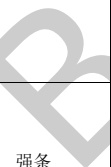</td><td style='text-align: center; word-wrap: break-word;'>除本规范另有规定外，不同耐火等级建筑的允许建筑高度或层数、防火分区最大允许建筑面积应符合表5.3.1（详见规范）的规定。</td><td style='text-align: center; word-wrap: break-word;'>建筑类型、建筑层数、建筑高度、耐火等级、区域、房间、墙、灭火系统</td><td style='text-align: center; word-wrap: break-word;'>准确</td></tr><tr><td style='text-align: center; word-wrap: break-word;'>5</td><td style='text-align: center; word-wrap: break-word;'>5.3.4</td><td style='text-align: center; word-wrap: break-word;'>强条</td><td style='text-align: center; word-wrap: break-word;'>一、二级耐火等级建筑内的商店营业厅、展览厅，当设置自动灭火系统和火灾自动报警系统并采用不燃或难燃装修材料时，其每个防火分区的最大允许建筑面积应符合下列规定：\n1 设置在高层建筑内时，不应大于4000  $ m^{{2}} $；\n2 设置在单层建筑或仅设置在多层建筑的首层内时，不应大于10000  $ m^{{2}} $；\n3 设置在地下或半地下时，不应大于2000  $ m^{{2}} $。</td><td style='text-align: center; word-wrap: break-word;'>建筑类型、建筑层数、耐火等级、区域、房间、灭火系统、火灾报警系统、楼层</td><td style='text-align: center; word-wrap: break-word;'>准确\n建模需对属性赋值。</td></tr></table>

表A.1建筑专业BIM智能审查条文表（续）

<table border=1 style='margin: auto; word-wrap: break-word;'><tr><td style='text-align: center; word-wrap: break-word;'>序号</td><td style='text-align: center; word-wrap: break-word;'>审查条文</td><td style='text-align: center; word-wrap: break-word;'>条文类型</td><td style='text-align: center; word-wrap: break-word;'>条文内容</td><td style='text-align: center; word-wrap: break-word;'>模型关联信息</td><td style='text-align: center; word-wrap: break-word;'>准确性及说明</td></tr><tr><td style='text-align: center; word-wrap: break-word;'>6</td><td style='text-align: center; word-wrap: break-word;'>5.4.2</td><td style='text-align: center; word-wrap: break-word;'>强条</td><td style='text-align: center; word-wrap: break-word;'>除为满足民用建筑使用功能所设置的附属库房外，民用建筑内不应设置生产车间和其他库房。\n经营、存放和使用甲、乙类火灾危险性物品的商店、作坊和储藏间，严禁附设在民用建筑内。</td><td style='text-align: center; word-wrap: break-word;'>建筑类型、房间</td><td style='text-align: center; word-wrap: break-word;'>准确</td></tr><tr><td style='text-align: center; word-wrap: break-word;'>7</td><td style='text-align: center; word-wrap: break-word;'>5.4.3</td><td style='text-align: center; word-wrap: break-word;'>强条</td><td style='text-align: center; word-wrap: break-word;'>商店建筑、展览建筑采用三级耐火等级建筑时，不应超过2层；采用四级耐火等级建筑时，应为单层。营业厅、展览厅设置在三级耐火等级的建筑内时，应布置在首层或二层；设置在四级耐火等级的建筑内时，应布置在首层。\n营业厅、展览厅不应设置在地下三层及以下楼层。地下或半地下营业厅、展览厅不应经营、储存和展示甲、乙类火灾危险性物品。</td><td style='text-align: center; word-wrap: break-word;'>建筑类型、建筑层数、耐火等级、房间、楼层</td><td style='text-align: center; word-wrap: break-word;'>需复核\n采光窗必须在窗户的名称中包含采光窗，采光窗的净面积需手动填写；\n飘窗、门联窗识别不准确或无法识别。</td></tr><tr><td style='text-align: center; word-wrap: break-word;'>8</td><td style='text-align: center; word-wrap: break-word;'>5.4.4</td><td style='text-align: center; word-wrap: break-word;'> 显示</td><td style='text-align: center; word-wrap: break-word;'>托儿所、幼儿园的儿童用房和儿童游乐厅等儿童活动场所宜设置在独立的建筑内，且不应设置在地下或者半地下；当采用一、二级耐火等级的建筑时，不应超过3层；采用三级耐火等级的建筑时，不应超过2层；采用四级耐火等级的建筑时，应为单层；确需设置在其他民用建筑内时，应符合下列规定：\n1 设置在一、二级耐火等级的建筑内时，应布置在首层、二层或三层；\n2 设置在三级耐火等级的建筑内时，应布置在首层或者二层；\n3 设置在四级耐火等级的建筑内时，应布置在首层；\n4 设置在高层建筑内时，应设置独立的安全出口和疏散楼梯；</td><td style='text-align: center; word-wrap: break-word;'>建筑类型、建筑层数、耐火等级、房间、楼层、门、门洞、楼梯</td><td style='text-align: center; word-wrap: break-word;'>需复核\n采光窗必须在窗户的名称中包含采光窗，采光窗的净面积需手动填写；\n飘窗、门联窗识别不准确或无法识别。</td></tr></table>

表A.1建筑专业BIM智能审查条文表（续）

<table border=1 style='margin: auto; word-wrap: break-word;'><tr><td style='text-align: center; word-wrap: break-word;'>序号</td><td style='text-align: center; word-wrap: break-word;'>审查条文</td><td style='text-align: center; word-wrap: break-word;'>条文类型</td><td style='text-align: center; word-wrap: break-word;'>条文内容</td><td style='text-align: center; word-wrap: break-word;'>模型关联信息</td><td style='text-align: center; word-wrap: break-word;'>准确性及说明</td></tr><tr><td style='text-align: center; word-wrap: break-word;'>9</td><td style='text-align: center; word-wrap: break-word;'>5.4.4B</td><td style='text-align: center; word-wrap: break-word;'>强条</td><td style='text-align: center; word-wrap: break-word;'>当老年人照料设施中的老年人公共活动用房、康复与医疗用房设置在地下、半地下时，应设置在地下一层，每间用房的建筑面积不应大于200  $ m^{{2}} $且使用人数不应大于30人。\n老年人照料设施中的老年人公共活动用房、康复与医疗用房设置在地上四层及以上时，每间用房的建筑面积不应大于200  $ m^{{2}} $且使用人数不应大于30人。</td><td style='text-align: center; word-wrap: break-word;'>建筑类型、房间、楼层、建筑面积、人数</td><td style='text-align: center; word-wrap: break-word;'>准确</td></tr><tr><td style='text-align: center; word-wrap: break-word;'>10</td><td style='text-align: center; word-wrap: break-word;'>5.4.5</td><td style='text-align: center; word-wrap: break-word;'>强条</td><td style='text-align: center; word-wrap: break-word;'>医院和疗养院的住院部分不应设置在地下或半地下。\n医院和疗养院的住院部分采用三级耐火等级建筑时，不应超过2层；采用四级耐火等级建筑时，应为单层；设置在三级耐火等级的建筑内时，应布置在首层或二层；设置在四级耐火等级的建筑内时，应布置在首层。\n医院和疗养院的病房楼内相邻护理单元之间应采用耐火极限不低于2.00 h的防火隔墙分隔，隔墙上的门应采用乙级防火门，设置在走道上的防火门应采用常开防火门。</td><td style='text-align: center; word-wrap: break-word;'>建筑类型、建筑层数、耐火等级、房间、楼层、门、门洞、楼梯、单元、墙</td><td style='text-align: center; word-wrap: break-word;'>准确\n地下室和半地下室的判断标准是房间的计算标高，当计算标高大于0.00时，认为房间不在地下室和半地下室。</td></tr><tr><td style='text-align: center; word-wrap: break-word;'>11</td><td style='text-align: center; word-wrap: break-word;'>5.4.6</td><td style='text-align: center; word-wrap: break-word;'></td><td style='text-align: center; word-wrap: break-word;'>教学建筑、食堂、菜市场采用三级耐火等级建筑时，不应超过2层；采用四级耐火等级建筑时，应为单层；设置在三级耐火等级的建筑内时，应布置在首层或二层；设置在四级耐火等级建筑内时，应布置在首层。</td><td style='text-align: center; word-wrap: break-word;'>建筑类型、建筑层数、耐火等级、房间、楼层</td><td style='text-align: center; word-wrap: break-word;'>准确\n小学默认每班为45人；\n中学默认每班为50人。</td></tr></table>

表A. 1建筑专业BIM智能审查条文表（续）

<table border=1 style='margin: auto; word-wrap: break-word;'><tr><td style='text-align: center; word-wrap: break-word;'>序号</td><td style='text-align: center; word-wrap: break-word;'>审查条文</td><td style='text-align: center; word-wrap: break-word;'>条文类型</td><td style='text-align: center; word-wrap: break-word;'>条文内容</td><td style='text-align: center; word-wrap: break-word;'>模型关联信息</td><td style='text-align: center; word-wrap: break-word;'>准确性及说明</td></tr><tr><td style='text-align: center; word-wrap: break-word;'>12</td><td style='text-align: center; word-wrap: break-word;'>5.4.9</td><td style='text-align: center; word-wrap: break-word;'>强条</td><td style='text-align: center; word-wrap: break-word;'>歌舞厅、录像厅、夜总会、卡拉OK厅（含具有卡拉OK功能的餐厅）、游艺厅（含电子游艺厅）、桑拿浴室（不包括洗浴部分）、网吧等歌舞娱乐放映游艺场所（不含剧场、电影院）的布置应符合下列规定：\n1 不应布置在地下二层及以下楼层；\n4 确需布置在地下一层时，地下一层的地面与室外出入口地坪的高差不应大于10 m；\n5 确需布置在地下或四层及以上楼层时，一个厅、室的建筑面积不应大于200  $ m^{{2}} $；\n6 厅、室之间及与建筑的其他部位之间，应采用耐火极限不低于2.00 h的防火隔墙和1.00 h的不燃性楼板分隔，设置在厅、室墙上的门和该场所与建筑内其他部位相通的门均应采用乙级防火门。</td><td style='text-align: center; word-wrap: break-word;'>建筑类型、楼</td><td style='text-align: center; word-wrap: break-word;'>准确</td></tr></table>

表A.1建筑专业BIM智能审查条文表（续）

<table border=1 style='margin: auto; word-wrap: break-word;'><tr><td style='text-align: center; word-wrap: break-word;'>序号</td><td style='text-align: center; word-wrap: break-word;'>审查条文</td><td style='text-align: center; word-wrap: break-word;'>条文类型</td><td style='text-align: center; word-wrap: break-word;'>条文内容</td><td style='text-align: center; word-wrap: break-word;'>模型关联信息</td><td style='text-align: center; word-wrap: break-word;'>准确性及说明</td></tr><tr><td style='text-align: center; word-wrap: break-word;'>13</td><td style='text-align: center; word-wrap: break-word;'>5.4.10</td><td style='text-align: center; word-wrap: break-word;'>强条</td><td style='text-align: center; word-wrap: break-word;'>除商业服务网点外，住宅建筑与其他使用功能的建筑合建时，应符合下列规定：\n1 住宅部分与非住宅部分之间，应采用耐火极限不低于2.00 h且无门、窗、洞口的防火隔墙和1.50 h的不燃性楼板完全分隔；当为高层建筑时，应采用无门、窗、洞口的防火墙和耐火极限不低于2.00 h的不燃性楼板完全分隔。建筑外墙上、下层开口之间的防火措施应符合本规范第6.2.5条的规定。\n2 住宅部分与非住宅部分的安全出口和疏散楼梯应分别独立设置；为住宅部分服务的地上车库应设置独立的疏散楼梯或安全出口，地下车库的疏散楼梯应按本规范第6.4.4条的规定进行分隔。\n3 住宅部分和非住宅部分的安全疏散、防火分区和室内消防设施配置，可根据各自的建筑高度分别按照本规范有关住宅建筑和公共建筑的规定执行；该建筑的其他防火设计应根据建筑的总高度和建筑规模按本规范有关公共建筑的规定执行。</td><td style='text-align: center; word-wrap: break-word;'>建筑类型、耐火极限、防火隔墙、门、窗、洞口、楼板、楼梯、防火分区、建筑高度</td><td style='text-align: center; word-wrap: break-word;'>准确\n临空窗台拆解时用的外窗替代，即窗户名称中含“外”说明是临空窗台。\n该条文中的第三款为一般条文。</td></tr><tr><td style='text-align: center; word-wrap: break-word;'></td><td style='text-align: center; word-wrap: break-word;'></td><td style='text-align: center; word-wrap: break-word;'>强条</td><td style='text-align: center; word-wrap: break-word;'>设置商业服务网点的住宅建筑，其居住部分与商业服务网点之间应采用耐火极限不低于2.00 h且无门、窗、洞口的防火隔墙和1.50 h的不燃性楼板完全分隔，住宅部分和商业服务网点部分的安全出口和疏散楼梯应分别独立设置。商业服务网点中每个分隔单元之间应采用耐火极限不低于2.00 h且无门、窗、洞口的防火隔墙相互分隔，当每个分隔单元任一层建筑面积大于200  $ m^{{2}} $时，该层应设置2个安全出口或疏散门。每个分隔单元内的任一点至最近直通室外的出口的直线距离不应大于本规范表5.5.17中有关多层其他建筑位于袋形走道两侧或尽端的疏散门至最近安全出口的最大直线距离。</td><td style='text-align: center; word-wrap: break-word;'>建筑类型、耐火极限、门、窗、洞口、防火隔墙、楼板、楼梯、走道</td><td style='text-align: center; word-wrap: break-word;'>需复核\n临空室内楼梯的距离可按其水平投影长度的1.5倍计算。</td></tr></table>

表A.1建筑专业BIM智能审查条文表（续）

<table border=1 style='margin: auto; word-wrap: break-word;'><tr><td style='text-align: center; word-wrap: break-word;'>序号</td><td style='text-align: center; word-wrap: break-word;'>审查条文</td><td style='text-align: center; word-wrap: break-word;'>条文类型</td><td style='text-align: center; word-wrap: break-word;'>条文内容</td><td style='text-align: center; word-wrap: break-word;'>模型关联信息</td><td style='text-align: center; word-wrap: break-word;'>准确性及说明</td></tr><tr><td style='text-align: center; word-wrap: break-word;'>15</td><td style='text-align: center; word-wrap: break-word;'>5.4.12</td><td style='text-align: center; word-wrap: break-word;'>强条</td><td style='text-align: center; word-wrap: break-word;'>燃油或燃气锅炉、油浸变压器、充有可燃油的高压电容器和多油开关等，宜设置在建筑外的专用房间内；\n确需贴邻民用建筑布置时，应采用防火墙与所贴邻的建筑分隔，且不应贴邻人员密集场所，该专用房间的耐火等级不应低于二级；\n确需布置在民用建筑内时，不应布置在人员密集场所的上一层、下一层或贴邻，并应符合下列规定：\n1 燃油或燃气锅炉房、变压器室应设置在首层或地下一层的靠外墙部位，但常（负）压燃油或燃气锅炉可设置在地下二层或屋顶上。设置在屋顶上的常（负）压燃气锅炉，距离通向屋面的安全出口不应小于6 m。\n采用相对密度（与空气密度的比值）不小于0.75的可燃气体为燃料的锅炉，不得设置在地下或半地下。\n2 锅炉房、变压器室的疏散门均应直通室外或安全出口。\n3 锅炉房、变压器室等与其他部位之间应采用耐火极限不低于2.00 h的防火隔墙和1.50 h的不燃性楼板分隔。\n在隔墙和楼板上不应开设洞口，确需在隔墙上设置门、窗时，应采用甲级防火门、窗。\n4 锅炉房内设置储油间时，其总储存量不应大于1  $ m^{{3}} $，且储油间应采用耐火极限不低于3.00 h的防火隔墙与锅炉间分隔；\n确需在防火隔墙上设置门时，应采用甲级防火门。\n5 变压器室之间、变压器室与配电室之间，应设置耐火极限不低于2.00 h的防火隔墙。\n7 应设置火灾报警装置。</td><td style='text-align: center; word-wrap: break-word;'>建筑类型、房间、墙、安全出口、门、耐火极限</td><td style='text-align: center; word-wrap: break-word;'>需复核\n人数目前需要手动填写，不准确。\n本条中的“人员密集场所”，既包括我国《消防法》定义的人员密集场所，也包括会议厅等人员密集的场所。《消防法》第七十三条（四）人员密集场所，是指公众聚集场所（宾馆、饭店、商场、集贸市场、客运车站候车室、客运码头候船厅、民用机场航站楼、体育场馆、会堂以及公共娱乐场所等），医院的门诊楼、病房楼，学校的教学楼、图书馆、食堂和集体宿舍，养老院，福利院，托儿所，幼儿园，公共图书馆的阅览室，公共展览馆、博物馆的展示厅，劳动密集型企业的生产加工车间和员工集体宿舍，旅游、宗教活动场所等。\n本条文中第6、8、9、10款未拆解。</td></tr></table>

表A.1建筑专业BIM智能审查条文表（续）

<table border=1 style='margin: auto; word-wrap: break-word;'><tr><td style='text-align: center; word-wrap: break-word;'>序号</td><td style='text-align: center; word-wrap: break-word;'>审查条文</td><td style='text-align: center; word-wrap: break-word;'>条文类型</td><td style='text-align: center; word-wrap: break-word;'>条文内容</td><td style='text-align: center; word-wrap: break-word;'>模型关联信息</td><td style='text-align: center; word-wrap: break-word;'>准确性及说明</td></tr><tr><td style='text-align: center; word-wrap: break-word;'>16</td><td style='text-align: center; word-wrap: break-word;'>5.4.13</td><td style='text-align: center; word-wrap: break-word;'>强条</td><td style='text-align: center; word-wrap: break-word;'>布置在民用建筑内的柴油发电机房应符合下列规定：\n2 不应布置在人员密集场所的上一层、下一层或贴邻。\n3 应采用耐火极限不低于2.00 h的防火隔墙和1.50 h的不燃性楼板与其他部位分隔，门应采用甲级防火门。\n4 机房内设置储油间时，其总储存量不应大于 $ 1 m^{{3}} $，储油间应采用耐火极限不低于3.00 h的防火隔墙与发电机间分隔；确需在防火隔墙上开门时，应设置甲级防火门。\n5 应设置火灾报警装置。\n6 应设置与柴油发电机容量和建筑规模相适应的灭火设施，当建筑内其他部位设置自动喷水灭火系统时，机房内应设置自动喷水灭火系统。</td><td style='text-align: center; word-wrap: break-word;'>建筑类型、房\n建筑类型、房\n建筑类型、墙、\n</td><td style='text-align: center; word-wrap: break-word;'>需复核\n门-台阶最小距离的计算台阶的标高取的底标高，revit中只支持使用楼梯族库建模。\n本条中的“人员密集场所”同上。\n本条文中第1款为一般性条文，未拆解。</td></tr><tr><td style='text-align: center; word-wrap: break-word;'>17</td><td style='text-align: center; word-wrap: break-word;'>5.5.8</td><td style='text-align: center; word-wrap: break-word;'></td><td style='text-align: center; word-wrap: break-word;'>公共建筑内每个防火分区或一个防火分区的每个楼层，其安全出口的数量应经计算确定，且不应少于2个。设置1个安全出口或1部疏散楼梯的公共建筑应符合下列条件之一：\n1 除托儿所、幼儿园外，建筑面积不大于 $ 200 m^{{2}} $且人数不超过50人的单层公共建筑或多层公共建筑的首层；\n2 除医疗建筑，老年人照料设施，托儿所、幼儿园的儿童用房，儿童游乐厅等儿童活动场所和歌舞娱乐放映游艺场所等外，符合表5.5.8规定的公共建筑。（表5.5.8略）</td><td style='text-align: center; word-wrap: break-word;'>建筑类型、防火分区、楼层、安全出口、疏散楼梯、建筑面积、人数</td><td style='text-align: center; word-wrap: break-word;'>准确</td></tr></table>

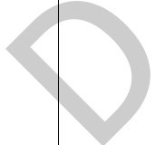

表A.1建筑专业BIM智能审查条文表（续）

<table border=1 style='margin: auto; word-wrap: break-word;'><tr><td style='text-align: center; word-wrap: break-word;'>序号</td><td style='text-align: center; word-wrap: break-word;'>审查条文</td><td style='text-align: center; word-wrap: break-word;'>条文类型</td><td style='text-align: center; word-wrap: break-word;'>条文内容</td><td style='text-align: center; word-wrap: break-word;'>模型关联信息</td><td style='text-align: center; word-wrap: break-word;'>准确性及说明</td></tr><tr><td style='text-align: center; word-wrap: break-word;'>18</td><td style='text-align: center; word-wrap: break-word;'>5.5.12</td><td style='text-align: center; word-wrap: break-word;'>强条</td><td style='text-align: center; word-wrap: break-word;'>一类高层公共建筑和建筑高度大于32 m的二类高层公共建筑，其疏散楼梯应采用防烟楼梯间。\n裙房和建筑高度不大于32 m的二类高层公共建筑，其疏散楼梯应采用封闭楼梯间。</td><td style='text-align: center; word-wrap: break-word;'>建筑类型、建筑高度、楼梯、墙</td><td style='text-align: center; word-wrap: break-word;'>需复核\n教室处于袋形走道尽端的判断，不规则教室内任一处距教室门不超过15.00 m的计算；\n当裙房与高层建筑主体之间设置防火墙时，裙房的疏散楼梯可按本规范有关单、多层建筑的要求确定。</td></tr><tr><td style='text-align: center; word-wrap: break-word;'>19</td><td style='text-align: center; word-wrap: break-word;'>5.5.13</td><td style='text-align: center; word-wrap: break-word;'>强条</td><td style='text-align: center; word-wrap: break-word;'>下列多层公共建筑的疏散楼梯，除与敞开式外廊直接相连的楼梯间外，均应采用封闭楼梯间：\n1 医疗建筑、旅馆及类似使用功能的建筑；\n2 设置歌舞娱乐放映游艺场所的建筑；\n3 商店、图书馆、展览建筑、会议中心及类似使用功能的建筑；\n4 6层及以上的其他建筑。</td><td style='text-align: center; word-wrap: break-word;'>建筑类型、建筑层数、区域、楼梯</td><td style='text-align: center; word-wrap: break-word;'>准确</td></tr><tr><td colspan="3">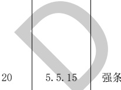</td><td style='text-align: center; word-wrap: break-word;'>公共建筑内房间的疏散门数量应经计算确定且不应少于2个。除托儿所、幼儿园、老年人照料设施、医疗建筑、教学建筑内位于走道尽端的房间外，符合下列条件之一的房间可设置1个疏散门：\n1 位于两个安全出口之间或袋形走道两侧的房间，对于托儿所、幼儿园、老年人照料设施，建筑面积不大于 $ 50 m^{{2}} $；对于医疗建筑、教学建筑，建筑面积不大于 $ 75 m^{{2}} $；对于其他建筑或场所，建筑面积不大于 $ 120 m^{{2}} $。\n2 位于走道尽端的房间，建筑面积小于 $ 50 m^{{2}} $且疏散门的净宽度不小于0.90 m，或由房间内任一点至疏散门的直线距离不大于15 m、建筑面积不大于 $ 200 m^{{2}} $且疏散门的净宽度不小于1.40 m。\n3 歌舞娱乐放映游艺场所内建筑面积不大于 $ 50 m^{{2}} $且经常停留人数不超过15人的厅、室。</td><td style='text-align: center; word-wrap: break-word;'>建筑类型、房间、面积、区域、门</td><td style='text-align: center; word-wrap: break-word;'>准确\n疏散门净宽尺寸防火门门洞尺寸扣减150 mm，其他门门洞尺寸扣减100 mm。</td></tr></table>

表A.1建筑专业BIM智能审查条文表（续）

<table border=1 style='margin: auto; word-wrap: break-word;'><tr><td style='text-align: center; word-wrap: break-word;'>序号</td><td style='text-align: center; word-wrap: break-word;'>审查条文</td><td style='text-align: center; word-wrap: break-word;'>条文类型</td><td style='text-align: center; word-wrap: break-word;'>条文内容</td><td style='text-align: center; word-wrap: break-word;'>模型关联信息</td><td style='text-align: center; word-wrap: break-word;'>准确性及说明</td></tr><tr><td style='text-align: center; word-wrap: break-word;'>21</td><td style='text-align: center; word-wrap: break-word;'>5.5.17</td><td style='text-align: center; word-wrap: break-word;'>强条</td><td style='text-align: center; word-wrap: break-word;'>公共建筑的安全疏散距离应符合下列规定：\n1 直通疏散走道的房间疏散门至最近安全出口的直线距离不应大于表5.5.17（表略）的规定。\n2 楼梯间应在首层直通室外，确有困难时，可在首层采用扩大的封闭楼梯间或防烟楼梯间前室。当层数不超过4层且未采用扩大的封闭楼梯间或防烟楼梯间前室时，可将直通室外的门设置在离楼梯间不大于15 m处。\n3 房间内任一点至房间直通疏散走道的疏散门的直线距离，不应大于表5.5.17规定的袋形走道两侧或尽端的疏散门至最近安全出口的直线距离。\n4 一、二级耐火等级建筑内疏散门或安全出口不少于2个的观众厅、展览厅、多功能厅、餐厅、营业厅等，其室内任一点至最近疏散门或安全出口的直线距离不应大于30 m；当疏散门不能直通室外地面或疏散楼梯间时，应采用长度不大于10 m的疏散走道至最近的安全出口。当该场所设置自动喷水灭火系统时，室内任一点至最近安全出口的安全疏散距离可分别增加25%。</td><td style='text-align: center; word-wrap: break-word;'>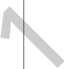</td><td style='text-align: center; word-wrap: break-word;'>准确\n支持计算双跑楼梯的井宽，旋转楼梯等复杂的形状计算可能不准确。\n疏散门净宽尺寸防火门门洞尺寸扣减150 mm，其他门门洞尺寸扣减100 mm。</td></tr><tr><td style='text-align: center; word-wrap: break-word;'>22</td><td style='text-align: center; word-wrap: break-word;'>5.5.18</td><td style='text-align: center; word-wrap: break-word;'>强条</td><td style='text-align: center; word-wrap: break-word;'>除本规范另有规定外，公共建筑内疏散门和安全出口的净宽度不应小于0.90 m，疏散走道和疏散楼梯的净宽度不应小于1.10 m。\n高层公共建筑内楼梯间的首层疏散门、首层疏散外门、疏散走道和疏散楼梯的最小净宽度应符合表5.5.18（表略）的规定。</td><td style='text-align: center; word-wrap: break-word;'>建筑类型、楼层、楼梯、区域、门、门洞</td><td style='text-align: center; word-wrap: break-word;'>准确\n地下室和半地下室的判断标准是房间的计算标高，当计算标高大于0.00时，认为房间不在地下室和半地下室；\n疏散门净宽尺寸防火门门洞尺寸扣减150 mm，其他门门洞尺寸扣减100 mm。\n疏散走道扣除粉刷层厚度需复核。</td></tr></table>

表A.1建筑专业BIM智能审查条文表（续）

<table border=1 style='margin: auto; word-wrap: break-word;'><tr><td style='text-align: center; word-wrap: break-word;'>序号</td><td style='text-align: center; word-wrap: break-word;'>审查条文</td><td style='text-align: center; word-wrap: break-word;'>条文类型</td><td style='text-align: center; word-wrap: break-word;'>条文内容</td><td style='text-align: center; word-wrap: break-word;'>模型关联信息</td><td style='text-align: center; word-wrap: break-word;'>准确性及说明</td></tr><tr><td style='text-align: center; word-wrap: break-word;'>23</td><td style='text-align: center; word-wrap: break-word;'>5.5.23</td><td style='text-align: center; word-wrap: break-word;'>强条</td><td style='text-align: center; word-wrap: break-word;'>建筑高度大于100 m的公共建筑，应设置避难层(间)。避难层(间)应符合下列规定：\n1 第一个避难层（间）的楼地面至灭火救援场地地面的高度不应大于50 m，两个避难层（间）之间的高度不宜大于50 m。\n2 通向避难层(间)的疏散楼梯应在避难层分隔、同层错位或上下层断开。\n3 避难层（间）的净面积应能满足设计避难人数避难的要求，并宜按5.0人/ $ m^{{2}} $计算。\n4 避难层可兼作设备层。设备管理宜集中布置，其中的易燃、可燃液体或气体管道应集中布置，设备管道区应采用耐火极限不低于3.00 h的防火隔墙与避难区分隔。管道井和设备间应采用耐火极限不低于2.00 h的防火隔墙与避难区分隔，管道井和设备间的门不应直接开向避难区；确需直接开向避难区时，与避难层区出入口的距离不应小于5 m，且应采用甲级防火门。\n避难间内不应设置易燃、可燃液体或气体管道，不应开设除外窗、疏散门之外的其他开口。\n5 避难层应设置消防电梯出口。\n6 应设置消火栓和消防软管卷盘。\n7 应设置消防专线电话和应急广播。\n8 在避难层（间）进入楼梯间的入口处和疏散楼梯通向避难层（间）的出口处，应设置明显的指示标志。\n9 应设置直接对外的可开启窗口或独立的机械防烟设施，外窗应采用乙级防火窗。</td><td style='text-align: center; word-wrap: break-word;'>建筑类型、建筑高度、楼层、房间、楼梯、墙、门、门洞、电梯、消防设施、通讯设施、标志设施、防烟设施、窗</td><td style='text-align: center; word-wrap: break-word;'>准确</td></tr></table>

表A.1建筑专业BIM智能审查条文表（续）

<table border=1 style='margin: auto; word-wrap: break-word;'><tr><td style='text-align: center; word-wrap: break-word;'>序号</td><td style='text-align: center; word-wrap: break-word;'>审查条文</td><td style='text-align: center; word-wrap: break-word;'>条文类型</td><td style='text-align: center; word-wrap: break-word;'>条文内容</td><td style='text-align: center; word-wrap: break-word;'>模型关联信息</td><td style='text-align: center; word-wrap: break-word;'>准确性及说明</td></tr><tr><td style='text-align: center; word-wrap: break-word;'>24</td><td style='text-align: center; word-wrap: break-word;'>5.5.24</td><td style='text-align: center; word-wrap: break-word;'>强条</td><td style='text-align: center; word-wrap: break-word;'>高层病房楼应在二层及以上的病房楼层和洁净手术部设置避难间。避难间应符合下列规定：\n1 避难间服务的护理单元不应超过2个，其净面积应按每个护理单元不小于 $ 25.0 m^{{2}} $确定。\n2 避难间兼作其他用途时，应保证人员的避难安全，且不得减少可供避难的净面积。\n3 应靠近楼梯间，并应采用耐火极限不低于 $ 2.00 h $的防火隔墙和甲级防火门与其他部位分隔。\n4 应设置消防专线电话和消防应急广播。\n5 避难间的入口处应设置明显的指示标志。\n6 应设置直接对外的可开启窗口或独立的机械防烟设施，外窗应采用乙级防火窗。</td><td style='text-align: center; word-wrap: break-word;'>楼面积、</td><td style='text-align: center; word-wrap: break-word;'>准确</td></tr><tr><td style='text-align: center; word-wrap: break-word;'>25</td><td style='text-align: center; word-wrap: break-word;'>5.5.25</td><td style='text-align: center; word-wrap: break-word;'>强条</td><td style='text-align: center; word-wrap: break-word;'>住宅建筑安全出口的设置应符合下列规定：\n1 建筑高度不大于 $ 27 m $的建筑，当每个单元任一层的建筑面积大于 $ 650 m^{{2}} $，或任一户门至最近安全出口的距离大于 $ 15 m $时，每个单元每层的安全出口不应少于2个；\n2 建筑高度大于 $ 27 m $、不大于 $ 54 m $的建筑，当每个单元任一层的建筑面积大于 $ 650 m^{{2}} $，或任一户门至最近安全出口的距离大于 $ 10 m $时，每个单元每层的安全出口不应少于2个；\n3 建筑高度大于 $ 54 m $的建筑，每个单元每层的安全出口不应少于2个。</td><td style='text-align: center; word-wrap: break-word;'>建筑类型、建筑高度、区域、楼层、门、门洞、</td><td style='text-align: center; word-wrap: break-word;'>需复核防护栏杆净高：至完成面高度的计算栏杆扶手的“至完成面高度”是计算得到。</td></tr></table>

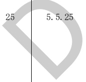

表A.1建筑专业BIM智能审查条文表（续）

<table border=1 style='margin: auto; word-wrap: break-word;'><tr><td style='text-align: center; word-wrap: break-word;'>序号</td><td style='text-align: center; word-wrap: break-word;'>审查条文</td><td style='text-align: center; word-wrap: break-word;'>条文类型</td><td style='text-align: center; word-wrap: break-word;'>条文内容</td><td style='text-align: center; word-wrap: break-word;'>模型关联信息</td><td style='text-align: center; word-wrap: break-word;'>准确性及说明</td></tr><tr><td style='text-align: center; word-wrap: break-word;'>26</td><td style='text-align: center; word-wrap: break-word;'>5.5.26</td><td style='text-align: center; word-wrap: break-word;'>强条</td><td style='text-align: center; word-wrap: break-word;'>建筑高度大于27 m，但不大于54 m的住宅建筑，每个单元设置一座疏散楼梯时，疏散楼梯应通至屋面，且单元之间的疏散楼梯应能通过屋面连通，户门应采用乙级防火门。当不能通至屋面或不能通过屋面连通时，应设置2个安全出口。</td><td style='text-align: center; word-wrap: break-word;'>建筑类型、建筑高度、单元、楼梯、平屋顶、门、洞</td><td style='text-align: center; word-wrap: break-word;'>准确\n楼梯的“楼梯井净宽”是计算得到，支持计算双跑楼梯的井宽，旋转楼梯等复杂的形状计算可能不准确。</td></tr><tr><td style='text-align: center; word-wrap: break-word;'>27</td><td style='text-align: center; word-wrap: break-word;'>5.5.29</td><td style='text-align: center; word-wrap: break-word;'>强条</td><td style='text-align: center; word-wrap: break-word;'>住宅建筑的安全疏散距离应符合下列规定：\n1 直通疏散走道的户门至最近安全出口的直线距离不应大于表5.5.29（表略）的规定。\n2 楼梯间应在首层直通室外，或在首层采用扩大的封闭楼梯间或防烟楼梯间前室。层数不超过4层时，可将直通室外的门设置在离楼梯间不大于15 m处。\n3 户内任一点至直通疏散走道的户门的直线距离不应大于表5.5.29规定的袋形走道两侧或尽端的疏散门至最近安全出口的最大直线距离。</td><td style='text-align: center; word-wrap: break-word;'>建筑类型、门、楼梯间、楼层、走道</td><td style='text-align: center; word-wrap: break-word;'>准确</td></tr><tr><td style='text-align: center; word-wrap: break-word;'>28</td><td style='text-align: center; word-wrap: break-word;'>5.5.30</td><td style='text-align: center; word-wrap: break-word;'>强条</td><td style='text-align: center; word-wrap: break-word;'>住宅建筑的户门、安全出口、疏散走道和疏散楼梯的各自总净宽度应经计算确定，且户门和安全出口的净宽度不应小于0.90 m，疏散走道、疏散楼梯和首层疏散外门的净宽度不应小于1.10 m。建筑高度不大于18 m的住宅中一边设置栏杆的疏散楼梯，其净宽度不应小于1.0 m。</td><td style='text-align: center; word-wrap: break-word;'>建筑类型、区域、楼梯、门、门洞、楼层、建筑高度、楼梯栏杆</td><td style='text-align: center; word-wrap: break-word;'>准确\n疏散门净宽尺寸防火门门洞尺寸扣减150 mm，其他门门洞尺寸扣减100 mm。\n一边设置栏杆的疏散楼梯宽度至少减去50 mm。疏散走道扣除粉刷层厚度，需复核。</td></tr><tr><td style='text-align: center; word-wrap: break-word;'>29</td><td style='text-align: center; word-wrap: break-word;'>5.5.31</td><td style='text-align: center; word-wrap: break-word;'>强条</td><td style='text-align: center; word-wrap: break-word;'>建筑高度大于100 m的住宅建筑应设置避难层，避难层的设置应符合本规范第5.5.23条有关避难层的要求。</td><td style='text-align: center; word-wrap: break-word;'>建筑类型、建筑高度、避难</td><td style='text-align: center; word-wrap: break-word;'>准确</td></tr></table>

表A.1建筑专业BIM智能审查条文表（续）

<table border=1 style='margin: auto; word-wrap: break-word;'><tr><td style='text-align: center; word-wrap: break-word;'>序号</td><td style='text-align: center; word-wrap: break-word;'>审查条文</td><td style='text-align: center; word-wrap: break-word;'>条文类型</td><td style='text-align: center; word-wrap: break-word;'>条文内容</td><td style='text-align: center; word-wrap: break-word;'>模型关联信息</td><td style='text-align: center; word-wrap: break-word;'>准确性及说明</td></tr><tr><td style='text-align: center; word-wrap: break-word;'>30</td><td style='text-align: center; word-wrap: break-word;'>6.1.5</td><td style='text-align: center; word-wrap: break-word;'>强条</td><td style='text-align: center; word-wrap: break-word;'>防火墙上不应开设门、窗、洞口，确需开设时，应设置不可开启或火灾时能自动关闭的甲级防火门、窗。\n可燃气体和甲、乙、丙类液体的管道严禁穿过防火墙。防火墙内不应设置排气道。</td><td style='text-align: center; word-wrap: break-word;'>防火墙、门、窗、洞口、管道</td><td style='text-align: center; word-wrap: break-word;'>需复核\n坡道的“坡道纵向坡度”通过计算获取；\n台阶只支持用楼梯和常规模型建模。</td></tr><tr><td style='text-align: center; word-wrap: break-word;'>31</td><td style='text-align: center; word-wrap: break-word;'>6.2.2</td><td style='text-align: center; word-wrap: break-word;'>强条</td><td style='text-align: center; word-wrap: break-word;'>医疗建筑内的手术室或手术部、产房、重症监护室、贵重精密医疗装备用房、储藏间、实验室、胶片室等，附设在建筑内的托儿所、幼儿园的儿童用房和儿童游乐厅等儿童活动场所、老年人照料设施，应采用耐火极限不低于2.00 h的防火隔墙和1.00 h的楼板与其他场所或部位分隔，墙上必须设置的门、窗应采用乙级防火门、窗。</td><td style='text-align: center; word-wrap: break-word;'>建筑类型、耐火极限、墙、楼板、门、窗</td><td style='text-align: center; word-wrap: break-word;'>准确</td></tr><tr><td style='text-align: center; word-wrap: break-word;'>32</td><td style='text-align: center; word-wrap: break-word;'>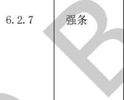</td><td style='text-align: center; word-wrap: break-word;'></td><td style='text-align: center; word-wrap: break-word;'>附设在建筑内的消防控制室、灭火设备室、消防水泵房和通风空气调节机房、变配电室等，应采用耐火极限不低于2.00 h的防火隔墙和1.50 h的楼板与其他部位分隔。\n设置在丁、戊类厂房内的通风机房，应采用耐火极限不低于1.00 h的防火隔墙和0.50 h的楼板与其他部位分隔。\n通风、空气调节机房和变配电室开向建筑内的门应采用甲级防火门，消防控制室和其他设备房开向建筑内的门应采用乙级防火门。</td><td style='text-align: center; word-wrap: break-word;'>房间、耐火极限、墙、楼板、建筑类型</td><td style='text-align: center; word-wrap: break-word;'>准确\n建模面积需含有命名为“办公区域”的空间。</td></tr></table>

表A.1建筑专业BIM智能审查条文表（续）

<table border=1 style='margin: auto; word-wrap: break-word;'><tr><td style='text-align: center; word-wrap: break-word;'>序号</td><td style='text-align: center; word-wrap: break-word;'>审查条文</td><td style='text-align: center; word-wrap: break-word;'>条文类型</td><td style='text-align: center; word-wrap: break-word;'>条文内容</td><td style='text-align: center; word-wrap: break-word;'>模型关联信息</td><td style='text-align: center; word-wrap: break-word;'>准确性及说明</td></tr><tr><td style='text-align: center; word-wrap: break-word;'>33</td><td style='text-align: center; word-wrap: break-word;'>6.4.3</td><td style='text-align: center; word-wrap: break-word;'>强条</td><td style='text-align: center; word-wrap: break-word;'>防烟楼梯间除应符合本规范第6.4.1条的规定外，尚应符合下列规定：\n1 应设置防烟设施；\n2 前室可与消防电梯间前室合用。\n3 前室的使用面积：公共建筑、高层厂房（仓库），不应小于 $ 6.0 m^{{2}} $；住宅建筑，不应小于 $ 4.5 m^{{2}} $。\n与消防电梯间前室合用时，合用前室的使用面积：公共建筑、高层厂房（仓库），不应小于 $ 10.0 m^{{2}} $；住宅建筑，不应小于 $ 6.0 m^{{2}} $。\n4 疏散走道通向前室以及前室通向楼梯间的门应采用乙级防火门。\n5 除住宅建筑的楼梯间前室外，防烟楼梯间和前室内的墙上不应开设除疏散门和送风口外的其他门、窗、洞口。\n6 楼梯间的首层可将走道和门厅等包括在楼梯间前室内形成扩大的前室，但应采用乙级防火门等与其他走道和房间分隔。</td><td style='text-align: center; word-wrap: break-word;'>建筑类型、房间、区域、防烟设施、电梯、门、门洞、墙、窗、送风口、楼层</td><td style='text-align: center; word-wrap: break-word;'>准确\n本条文第2款为一般条文。</td></tr><tr><td style='text-align: center; word-wrap: break-word;'>34</td><td style='text-align: center; word-wrap: break-word;'>6.4.5</td><td style='text-align: center; word-wrap: break-word;'></td><td style='text-align: center; word-wrap: break-word;'>室外疏散楼梯应符合下列规定：\n1 栏杆扶手的高度不应小于 $ 1.10 m $，楼梯的净宽度不应小于 $ 0.90 m $。\n4 通向室外楼梯的门应采用乙级防火门，并应向外开启。</td><td style='text-align: center; word-wrap: break-word;'>疏散楼梯、栏杆扶手、门</td><td style='text-align: center; word-wrap: break-word;'>准确\n本条文第2、3、5款未拆解。</td></tr><tr><td style='text-align: center; word-wrap: break-word;'>35</td><td style='text-align: center; word-wrap: break-word;'>6.4.10</td><td style='text-align: center; word-wrap: break-word;'>强条</td><td style='text-align: center; word-wrap: break-word;'>疏散走道在防火分区处应设置常开甲级防火门。</td><td style='text-align: center; word-wrap: break-word;'>区域、门</td><td style='text-align: center; word-wrap: break-word;'>准确</td></tr><tr><td style='text-align: center; word-wrap: break-word;'>36</td><td style='text-align: center; word-wrap: break-word;'>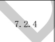</td><td style='text-align: center; word-wrap: break-word;'>强条</td><td style='text-align: center; word-wrap: break-word;'>厂房、仓库、公共建筑的外墙应在每层的适当位置设置可供消防救援人员进入的窗口。</td><td style='text-align: center; word-wrap: break-word;'>建筑类型、墙、窗</td><td style='text-align: center; word-wrap: break-word;'>准确</td></tr><tr><td style='text-align: center; word-wrap: break-word;'>37</td><td style='text-align: center; word-wrap: break-word;'>7.2.5</td><td style='text-align: center; word-wrap: break-word;'>一般</td><td style='text-align: center; word-wrap: break-word;'>供消防救援人员进入的窗口的净高度和净宽度均不应小于 $ 1.0 m $，下沿距室内地面不宜大于 $ 1.2 m $，间距不宜大于 $ 20 m $且每个防火分区不应少于2个，设置位置应与消防车登高操作场地相对应。窗口的玻璃应易于破碎，并应设置可在室外易于识别的明显标志。</td><td style='text-align: center; word-wrap: break-word;'>窗、防火分区</td><td style='text-align: center; word-wrap: break-word;'>准确</td></tr></table>

表A.1建筑专业BIM智能审查条文表（续）

<table border=1 style='margin: auto; word-wrap: break-word;'><tr><td style='text-align: center; word-wrap: break-word;'>序号</td><td style='text-align: center; word-wrap: break-word;'>审查条文</td><td style='text-align: center; word-wrap: break-word;'>条文类型</td><td style='text-align: center; word-wrap: break-word;'>条文内容</td><td style='text-align: center; word-wrap: break-word;'>模型关联信息</td><td style='text-align: center; word-wrap: break-word;'>准确性及说明</td></tr><tr><td style='text-align: center; word-wrap: break-word;'>38</td><td style='text-align: center; word-wrap: break-word;'>7.3.1</td><td style='text-align: center; word-wrap: break-word;'>强条</td><td style='text-align: center; word-wrap: break-word;'>下列建筑应设置消防电梯：\n1 建筑高度大于33 m的住宅建筑；\n2 一类高层公共建筑和建筑高度大于32 m的二类高层公共建筑、5层及以上且总建筑面积大于 $ 3000 m^{2} $（包括设置在其他建筑内五层及以上楼层）的老年人照料设施；\n3 设置消防电梯的建筑的地下室，埋深大于10 m且总建筑面积大于 $ 3000 m^{2} $的其他地下或者半地下建筑（室）。</td><td style='text-align: center; word-wrap: break-word;'>建筑类型、建筑高度、建筑层数、建筑面积、区域、建筑埋深、电梯</td><td style='text-align: center; word-wrap: break-word;'>准确</td></tr><tr><td style='text-align: center; word-wrap: break-word;'>39</td><td style='text-align: center; word-wrap: break-word;'>7.3.2</td><td style='text-align: center; word-wrap: break-word;'>强条</td><td style='text-align: center; word-wrap: break-word;'>消防电梯应分别设置在不同防火分区内，且每个防火分区不应少于1台。</td><td style='text-align: center; word-wrap: break-word;'>防火分区、电梯</td><td style='text-align: center; word-wrap: break-word;'>准确</td></tr><tr><td style='text-align: center; word-wrap: break-word;'>40</td><td style='text-align: center; word-wrap: break-word;'>7.3.6</td><td style='text-align: center; word-wrap: break-word;'>强条</td><td style='text-align: center; word-wrap: break-word;'>消防电梯井、机房与相邻电梯井、机房之间应设置耐火极限不低于2.00 h的防火隔墙，隔墙上的门应采用甲级防火门。</td><td style='text-align: center; word-wrap: break-word;'>房间、墙、门</td><td style='text-align: center; word-wrap: break-word;'>准确</td></tr><tr><td style='text-align: center; word-wrap: break-word;'>41</td><td style='text-align: center; word-wrap: break-word;'>8.1.6</td><td style='text-align: center; word-wrap: break-word;'>强条</td><td style='text-align: center; word-wrap: break-word;'>消防水泵房的设置应符合下列规定：\n1 单独建造的消防水泵房，其耐火等级不应低于二级；\n2 附设在建筑内的消防水泵房，不应设置在地下三层及以下或室内地面与室外出入口地坪高差大于10 m的地下楼层；\n3 疏散门应直通室外或安全出口。</td><td style='text-align: center; word-wrap: break-word;'>建筑、楼层、疏散门、疏散走道、消防水泵房</td><td style='text-align: center; word-wrap: break-word;'>准确</td></tr><tr><td colspan="6">注 1：准确指该条文审查准确性达 95%，无需人工复核。\n注 2：需复核指该条文中部分内容需要人工复核确认。</td></tr></table>

[来源：GB 50016-2014（2018年版）]

表 A.2 建筑专业 BIM 智能审查条文表

<table border=1 style='margin: auto; word-wrap: break-word;'><tr><td style='text-align: center; word-wrap: break-word;'>序号</td><td style='text-align: center; word-wrap: break-word;'>审查条文</td><td style='text-align: center; word-wrap: break-word;'>条文类型</td><td style='text-align: center; word-wrap: break-word;'>条文内容</td><td style='text-align: center; word-wrap: break-word;'>模型关联信息</td><td style='text-align: center; word-wrap: break-word;'>准确性及说明</td></tr><tr><td style='text-align: center; word-wrap: break-word;'>1</td><td style='text-align: center; word-wrap: break-word;'>6.7.4</td><td style='text-align: center; word-wrap: break-word;'>强条</td><td style='text-align: center; word-wrap: break-word;'>住宅、托儿所、幼儿园、中小学及其他少年儿童专用活动场所的栏杆必须采取防止攀爬的构造。当采用垂直杆件做栏杆时，其杆件净间距不应大于0.11 m。</td><td style='text-align: center; word-wrap: break-word;'>建筑类型、栏杆扶手</td><td style='text-align: center; word-wrap: break-word;'>准确\n攀爬需人工复核。</td></tr></table>

表 A.2 建筑专业 BIM 智能审查条文表（续）

<table border=1 style='margin: auto; word-wrap: break-word;'><tr><td style='text-align: center; word-wrap: break-word;'>序号</td><td style='text-align: center; word-wrap: break-word;'>审查条文</td><td style='text-align: center; word-wrap: break-word;'>条文类型</td><td style='text-align: center; word-wrap: break-word;'>条文内容</td><td style='text-align: center; word-wrap: break-word;'>模型关联信息</td><td style='text-align: center; word-wrap: break-word;'>准确性及说明</td></tr><tr><td style='text-align: center; word-wrap: break-word;'>2</td><td style='text-align: center; word-wrap: break-word;'>6.8.9</td><td style='text-align: center; word-wrap: break-word;'>强条</td><td style='text-align: center; word-wrap: break-word;'>托儿所、幼儿园、中小学校及其他少年儿童专用活动场所，当楼梯井净宽大于0.2 m时，必须采取防止少年儿童坠落的措施。</td><td style='text-align: center; word-wrap: break-word;'>建筑类型、楼梯</td><td style='text-align: center; word-wrap: break-word;'>准确\n支持计算双跑楼梯的井宽，旋转楼梯等复杂的形状计算可能不准确。\n防攀爬、防坠落需人工复核。</td></tr><tr><td colspan="6">注1：准确指该条文审查准确性达95%，无需人工复核。\n注2：需复核指该条文中部分内容需要人工复核确认。</td></tr></table>

[来源：GB 50352-2019]

表 A.3 建筑专业 BIM 智能审查条文表

<table border=1 style='margin: auto; word-wrap: break-word;'><tr><td style='text-align: center; word-wrap: break-word;'>序号</td><td style='text-align: center; word-wrap: break-word;'>审查条文</td><td style='text-align: center; word-wrap: break-word;'>条文类型</td><td style='text-align: center; word-wrap: break-word;'>条文内容</td><td style='text-align: center; word-wrap: break-word;'>模型关联信息</td><td style='text-align: center; word-wrap: break-word;'>准确性及说明</td></tr><tr><td style='text-align: center; word-wrap: break-word;'>1</td><td style='text-align: center; word-wrap: break-word;'>3.1.18</td><td style='text-align: center; word-wrap: break-word;'>强条</td><td style='text-align: center; word-wrap: break-word;'>居住建筑的主要使用房间（卧室、书房、起居室等）的房间窗地面积比不应低于1/7。</td><td style='text-align: center; word-wrap: break-word;'>建筑类型、房间、窗</td><td style='text-align: center; word-wrap: break-word;'>准确\n南京市窗地面积比不应低于1.1/7。</td></tr><tr><td style='text-align: center; word-wrap: break-word;'>2</td><td style='text-align: center; word-wrap: break-word;'>3.1.14.1</td><td style='text-align: center; word-wrap: break-word;'></td><td style='text-align: center; word-wrap: break-word;'>外窗的通风开口面积应符合下列规定：夏热冬冷、温和A区居住建筑外窗的通风开口面积不应小于房间地面面积的5%。</td><td style='text-align: center; word-wrap: break-word;'>建筑类型、房间、窗</td><td style='text-align: center; word-wrap: break-word;'>需复核\n采光窗需在窗户的名称中包含采光窗关键字，采光窗的净面积需手动填写。如果没有填写，会默认导出0；\n不支持、识别准确率低的有：飘窗、门联窗。</td></tr><tr><td colspan="6">注1：准确指该条文审查准确性达95%，无需人工复核。\n注2：需复核指该条文中部分内容需要人工复核确认。</td></tr></table>

[来源：GB 55015-2021]

表 A.4 建筑专业 BIM 智能审查条文表

<table border=1 style='margin: auto; word-wrap: break-word;'><tr><td style='text-align: center; word-wrap: break-word;'>序号</td><td style='text-align: center; word-wrap: break-word;'>审查条文</td><td style='text-align: center; word-wrap: break-word;'>条文类型</td><td style='text-align: center; word-wrap: break-word;'>条文内容</td><td style='text-align: center; word-wrap: break-word;'>模型关联信息</td><td style='text-align: center; word-wrap: break-word;'>准确性及说明</td></tr><tr><td style='text-align: center; word-wrap: break-word;'>1</td><td style='text-align: center; word-wrap: break-word;'>5.1.1</td><td style='text-align: center; word-wrap: break-word;'>强条</td><td style='text-align: center; word-wrap: break-word;'>住宅应按套型设计，每套住宅应设卧室、起居室(厅)、厨房和卫生间等基本功能空间。</td><td style='text-align: center; word-wrap: break-word;'>建筑类型、区域、房间</td><td style='text-align: center; word-wrap: break-word;'>准确\n如无套型，此条忽略。</td></tr><tr><td style='text-align: center; word-wrap: break-word;'>2</td><td style='text-align: center; word-wrap: break-word;'>5.4.4</td><td style='text-align: center; word-wrap: break-word;'>强条</td><td style='text-align: center; word-wrap: break-word;'>卫生间不应直接布置在下层住户的卧室、起居室(厅)、厨房和餐厅的上层。</td><td style='text-align: center; word-wrap: break-word;'>建筑类型、房间</td><td style='text-align: center; word-wrap: break-word;'>准确\n跃层、别墅需复核。</td></tr><tr><td style='text-align: center; word-wrap: break-word;'>3</td><td style='text-align: center; word-wrap: break-word;'>5.5.2</td><td style='text-align: center; word-wrap: break-word;'>强条</td><td style='text-align: center; word-wrap: break-word;'>卧室、起居室（厅）的室内净高不应低于2.40 m，局部净高不应低于2.10 m，且局部净高的室内面积不应大于室内使用面积的1/3。</td><td style='text-align: center; word-wrap: break-word;'>房间、净高</td><td style='text-align: center; word-wrap: break-word;'>需复核</td></tr><tr><td style='text-align: center; word-wrap: break-word;'>4</td><td style='text-align: center; word-wrap: break-word;'>5.6.2</td><td style='text-align: center; word-wrap: break-word;'>强条</td><td style='text-align: center; word-wrap: break-word;'>阳台栏杆设计必须采用防止儿童攀登的构造，栏杆的垂直杆件间净距不应大于0.11 m，放置花盆处必须采取防坠落措施。</td><td style='text-align: center; word-wrap: break-word;'>建筑类型、阳台、栏板/栏杆</td><td style='text-align: center; word-wrap: break-word;'>准确\n栏杆离楼地面完成面100 mm～900 mm\n净高度内，不能有横向构件。</td></tr><tr><td style='text-align: center; word-wrap: break-word;'>5</td><td style='text-align: center; word-wrap: break-word;'>5.6.3</td><td style='text-align: center; word-wrap: break-word;'>强条</td><td style='text-align: center; word-wrap: break-word;'>阳台栏板或栏杆净高，六层及六层以下不应低于1.05 m；七层及七层以上不应低于1.10 m。</td><td style='text-align: center; word-wrap: break-word;'>建筑类型、建筑层数、阳台、栏板/栏杆</td><td style='text-align: center; word-wrap: break-word;'>需复核\n栏杆扶手净高计算栏杆的至完成面高度是计算得到，考虑了有可踏面和无可踏面的情况。</td></tr><tr><td style='text-align: center; word-wrap: break-word;'>6</td><td style='text-align: center; word-wrap: break-word;'>5.8.1</td><td style='text-align: center; word-wrap: break-word;'></td><td style='text-align: center; word-wrap: break-word;'>窗外没有阳台或平台的外窗，窗台距楼面、地面的净高低于0.90 m时，应设置防护设施。</td><td style='text-align: center; word-wrap: break-word;'>楼层、窗、墙、房间、栏杆扶手</td><td style='text-align: center; word-wrap: break-word;'>需复核\n栏杆扶手中心线到窗玻璃不大于200 mm。</td></tr><tr><td colspan="2">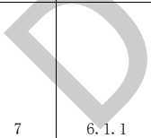</td><td style='text-align: center; word-wrap: break-word;'>强条</td><td style='text-align: center; word-wrap: break-word;'>楼梯间、电梯厅等共用部分的外窗，窗外没有阳台或平台，且窗台距楼面、地面的净高小于0.90 m时，应设置防护设施。</td><td style='text-align: center; word-wrap: break-word;'>楼层、窗、墙、房间、栏杆扶手</td><td style='text-align: center; word-wrap: break-word;'>需复核\n窗和栏杆扶手的距离计算判断时将楼梯间中楼梯上的栏杆扶手判断成窗户的防护措施。\n栏杆扶手中心线到窗玻璃不大于200 mm。</td></tr></table>

表A.4建筑专业BIM智能审查条文表（续）

<table border=1 style='margin: auto; word-wrap: break-word;'><tr><td style='text-align: center; word-wrap: break-word;'>序号</td><td style='text-align: center; word-wrap: break-word;'>审查条文</td><td style='text-align: center; word-wrap: break-word;'>条文类型</td><td style='text-align: center; word-wrap: break-word;'>条文内容</td><td style='text-align: center; word-wrap: break-word;'>模型关联信息</td><td style='text-align: center; word-wrap: break-word;'>准确性及说明</td></tr><tr><td style='text-align: center; word-wrap: break-word;'>8</td><td style='text-align: center; word-wrap: break-word;'>6.1.2</td><td style='text-align: center; word-wrap: break-word;'>强条</td><td style='text-align: center; word-wrap: break-word;'>公共出入口台阶高度超过0.70m并侧面临空时，应设置防护设施，防护设施净高不应低于1.05m。</td><td style='text-align: center; word-wrap: break-word;'>建筑类型、门、门洞、台阶/坡道、栏杆/栏杆</td><td style='text-align: center; word-wrap: break-word;'>需复核\n栏杆扶手净高计算。\n侧面临空拆解不准确。</td></tr><tr><td style='text-align: center; word-wrap: break-word;'>9</td><td style='text-align: center; word-wrap: break-word;'>6.1.3</td><td style='text-align: center; word-wrap: break-word;'>强条</td><td style='text-align: center; word-wrap: break-word;'>外廊、内天井及上人屋面等临空处的栏杆净高，六层及六层以下不应低于1.05m，七层及七层以上不应低于1.10m。防护栏杆必须采用防止儿童攀登的构造，栏杆的垂直杆件间净距不应大于0.11m。放置花盆处必须采取防坠落措施。</td><td style='text-align: center; word-wrap: break-word;'>建筑类型、楼层、区域、房间、平屋顶、栏杆/栏杆</td><td style='text-align: center; word-wrap: break-word;'>需复核\n栏杆扶手净高计算栏杆的至完成面高度是计算得到；防坠落措施需复核；栏杆离楼地面完成面100mm～900mm净高度内，不能有横向构件。</td></tr><tr><td style='text-align: center; word-wrap: break-word;'>10</td><td style='text-align: center; word-wrap: break-word;'>6.2.1</td><td style='text-align: center; word-wrap: break-word;'>强条</td><td style='text-align: center; word-wrap: break-word;'>十层以下的住宅建筑，当住宅单元任一层的建筑面积大于 $ 650 m^{2} $，或任一套房的户门至安全出口的距离大于15m时，该住宅单元每层的安全出口不应少于2个。</td><td style='text-align: center; word-wrap: break-word;'>建筑类型、建筑层数、单元、楼层面积、门、门洞</td><td style='text-align: center; word-wrap: break-word;'>需复核\n门-安全出口最小距离需计算；门-安全出口最小距离存在误差。</td></tr><tr><td style='text-align: center; word-wrap: break-word;'>11</td><td style='text-align: center; word-wrap: break-word;'>6.2.2</td><td style='text-align: center; word-wrap: break-word;'>强条</td><td style='text-align: center; word-wrap: break-word;'>十层及十层以上且不超过十八层的住宅建筑，当住宅单元任一层的建筑面积大于 $ 650 m^{2} $，或任一套房的户门至安全出口的距离大于10m时，该住宅单元每层的安全出口不应少于2个。</td><td style='text-align: center; word-wrap: break-word;'>建筑类型、建筑层数、单元、门、门洞</td><td style='text-align: center; word-wrap: break-word;'>需复核\n门-安全出口最小距离需计算；门-安全出口最小距离存在误差。</td></tr><tr><td style='text-align: center; word-wrap: break-word;'>12</td><td style='text-align: center; word-wrap: break-word;'>6.2.3</td><td style='text-align: center; word-wrap: break-word;'>强条</td><td style='text-align: center; word-wrap: break-word;'>十九层及十九层以上的住宅建筑，每层住宅单元的安全出口不应少于2个。</td><td style='text-align: center; word-wrap: break-word;'>建筑类型、建筑层数、单元、门、门洞</td><td style='text-align: center; word-wrap: break-word;'>准确\n模型需设置单元及安全出口。</td></tr><tr><td style='text-align: center; word-wrap: break-word;'>13</td><td style='text-align: center; word-wrap: break-word;'>6.2.5</td><td style='text-align: center; word-wrap: break-word;'>强条</td><td style='text-align: center; word-wrap: break-word;'>楼梯间及前室的门应向疏散方向开启。</td><td style='text-align: center; word-wrap: break-word;'>建筑类型、楼层、门、门洞</td><td style='text-align: center; word-wrap: break-word;'>需复核\n两个安全出口距离计算有误差。</td></tr><tr><td style='text-align: center; word-wrap: break-word;'>14</td><td style='text-align: center; word-wrap: break-word;'>6.3.1</td><td style='text-align: center; word-wrap: break-word;'>一般</td><td style='text-align: center; word-wrap: break-word;'>楼梯梯段净宽不应小于1.10m，不超过六层的住宅，一边设有栏杆的梯段净宽不应小于1.00m。</td><td style='text-align: center; word-wrap: break-word;'>建筑类型、房间、门、楼梯、栏板/栏杆</td><td style='text-align: center; word-wrap: break-word;'>需复核\n门开启方向不确定。</td></tr><tr><td style='text-align: center; word-wrap: break-word;'>15</td><td style='text-align: center; word-wrap: break-word;'>6.3.2</td><td style='text-align: center; word-wrap: break-word;'>强条</td><td style='text-align: center; word-wrap: break-word;'>楼梯踏步宽度不应小于0.26m，踏步高度不应大于0.175m。扶手高度不应小于0.90m。楼梯水平段栏杆长度大于0.50m时，其扶手高度不应小于1.05m。楼梯栏杆垂直杆件间净空不应大于0.11m。</td><td style='text-align: center; word-wrap: break-word;'>建筑类型、建筑层数、楼梯、栏板/栏杆</td><td style='text-align: center; word-wrap: break-word;'>需复核\n只能计算直梯和双跑楼梯的宽度，其他形状楼梯可能计算不准确。</td></tr></table>

表A.4建筑专业BIM智能审查条文表（续）

<table border=1 style='margin: auto; word-wrap: break-word;'><tr><td style='text-align: center; word-wrap: break-word;'>序号</td><td style='text-align: center; word-wrap: break-word;'>审查条文</td><td style='text-align: center; word-wrap: break-word;'>条文类型</td><td style='text-align: center; word-wrap: break-word;'>条文内容</td><td style='text-align: center; word-wrap: break-word;'>模型关联信息</td><td style='text-align: center; word-wrap: break-word;'>准确性及说明</td></tr><tr><td style='text-align: center; word-wrap: break-word;'>16</td><td style='text-align: center; word-wrap: break-word;'>6.3.5</td><td style='text-align: center; word-wrap: break-word;'>强条</td><td style='text-align: center; word-wrap: break-word;'>楼梯井净宽大于0.11 m时，必须采取防止儿童攀滑的措施。</td><td style='text-align: center; word-wrap: break-word;'>建筑类型、楼梯、栏板/栏杆</td><td style='text-align: center; word-wrap: break-word;'>准确</td></tr><tr><td style='text-align: center; word-wrap: break-word;'>17</td><td style='text-align: center; word-wrap: break-word;'>6.4.7</td><td style='text-align: center; word-wrap: break-word;'>强条</td><td style='text-align: center; word-wrap: break-word;'>电梯不应紧邻卧室布置。当受条件限制，电梯不得不紧邻兼起居的卧室布置时，应采取隔声、减振的构造措施。</td><td style='text-align: center; word-wrap: break-word;'>建筑类型、电梯、电梯井</td><td style='text-align: center; word-wrap: break-word;'>准确\n建模需对属性赋值。</td></tr><tr><td colspan="6">注1：准确指该条文审查准确性达95%，无需人工复核。\n注2：需复核指该条文中部分内容需要人工复核确认。</td></tr></table>

[来源：GB 50096-2011]

表A. 5建筑专业BIM智能审查条文表

<table border=1 style='margin: auto; word-wrap: break-word;'><tr><td style='text-align: center; word-wrap: break-word;'>序号</td><td style='text-align: center; word-wrap: break-word;'>审查条文</td><td style='text-align: center; word-wrap: break-word;'>条文类型</td><td style='text-align: center; word-wrap: break-word;'>条文内容</td><td style='text-align: center; word-wrap: break-word;'>模型关联信息</td><td style='text-align: center; word-wrap: break-word;'>准确性及说明</td></tr><tr><td style='text-align: center; word-wrap: break-word;'>1</td><td style='text-align: center; word-wrap: break-word;'>4.3.2</td><td style='text-align: center; word-wrap: break-word;'>一般</td><td style='text-align: center; word-wrap: break-word;'>各类小学的主要教学用房不应设在四层以上，各类中学的主要教学用房不应设在五层以上。</td><td style='text-align: center; word-wrap: break-word;'>建筑类型、房间</td><td style='text-align: center; word-wrap: break-word;'>准确</td></tr><tr><td style='text-align: center; word-wrap: break-word;'>2</td><td style='text-align: center; word-wrap: break-word;'>6.2.24</td><td style='text-align: center; word-wrap: break-word;'>强条\n</td><td style='text-align: center; word-wrap: break-word;'>学生宿舍不得设在地下室或半地下室。</td><td style='text-align: center; word-wrap: break-word;'>建筑类型、房间</td><td style='text-align: center; word-wrap: break-word;'>准确\n地下室和半地下室的判断标准是房间的计算标高，当计算标高大于0时，认为房间不在地下室和半地下室。</td></tr><tr><td style='text-align: center; word-wrap: break-word;'>3</td><td style='text-align: center; word-wrap: break-word;'>7.1.1</td><td style='text-align: center; word-wrap: break-word;'>一般</td><td style='text-align: center; word-wrap: break-word;'>主要教学用房的使用面积指标应符合表7.1.1的规定。（表格）</td><td style='text-align: center; word-wrap: break-word;'>建筑类型、房间</td><td style='text-align: center; word-wrap: break-word;'>准确\n小学每班按45人。\n中学每班按50人。</td></tr><tr><td style='text-align: center; word-wrap: break-word;'>4</td><td style='text-align: center; word-wrap: break-word;'>7.1.5</td><td style='text-align: center; word-wrap: break-word;'>一般</td><td style='text-align: center; word-wrap: break-word;'>主要教学辅助用房的使用面积不宜低于表7.1.5的规定。（表格）</td><td style='text-align: center; word-wrap: break-word;'>建筑类型、房间</td><td style='text-align: center; word-wrap: break-word;'>准确</td></tr><tr><td style='text-align: center; word-wrap: break-word;'>5</td><td style='text-align: center; word-wrap: break-word;'>8.1.5</td><td style='text-align: center; word-wrap: break-word;'>强条</td><td style='text-align: center; word-wrap: break-word;'>临空窗台的高度不应低于0.90 m。</td><td style='text-align: center; word-wrap: break-word;'>窗、墙</td><td style='text-align: center; word-wrap: break-word;'>准确\n临空窗台拆解时用的外窗替代，即窗户名称中含有“外”说明是临空窗台。</td></tr><tr><td style='text-align: center; word-wrap: break-word;'>6</td><td style='text-align: center; word-wrap: break-word;'>8.1.6</td><td style='text-align: center; word-wrap: break-word;'>强条</td><td style='text-align: center; word-wrap: break-word;'>上人屋面、外廊、楼梯、平台、阳台等临空部位必须设防护栏杆，防护栏杆必须牢固，安全，高度不应低于1.10 m。\n防护栏杆最薄弱处承受的最小水平推力应不小于1.5 kN/m。</td><td style='text-align: center; word-wrap: break-word;'>房间、栏杆/扶手、楼梯</td><td style='text-align: center; word-wrap: break-word;'>需复核\n是否临空需复核。</td></tr></table>

表A.5建筑专业BIM智能审查条文表（续）

<table border=1 style='margin: auto; word-wrap: break-word;'><tr><td style='text-align: center; word-wrap: break-word;'>序号</td><td style='text-align: center; word-wrap: break-word;'>审查条文</td><td style='text-align: center; word-wrap: break-word;'>条文类型</td><td style='text-align: center; word-wrap: break-word;'>条文内容</td><td style='text-align: center; word-wrap: break-word;'>模型关联信息</td><td style='text-align: center; word-wrap: break-word;'>准确性及说明</td></tr><tr><td style='text-align: center; word-wrap: break-word;'>7</td><td style='text-align: center; word-wrap: break-word;'>8.2.3</td><td style='text-align: center; word-wrap: break-word;'>要点</td><td style='text-align: center; word-wrap: break-word;'>中小学校建筑的安全出口、疏散走道、疏散楼梯和房间疏散门等处每100人的净宽度应按表8.2.3计算。同时，教学用房的内走道净宽度不应小于2.40 m，单侧走道及外廊的净宽度不应小于1.80 m。表8.2.3安全出口、疏散走道、疏散楼梯和房间、疏散门每100人的净宽度（m）。</td><td style='text-align: center; word-wrap: break-word;'>建筑类型、门、房间</td><td style='text-align: center; word-wrap: break-word;'>需复核疏散人数目前需要用户手填，不准确；疏散门净宽尺寸防火门门洞尺寸扣减150mm，其他门洞尺寸扣减100mm。楼梯净宽：栏杆扶手中心线到墙面。内走道净宽至少扣除50mm。单侧走道及外廊的净宽应扣除粉刷和保温层厚度。</td></tr><tr><td style='text-align: center; word-wrap: break-word;'>8</td><td style='text-align: center; word-wrap: break-word;'>8.5.3</td><td style='text-align: center; word-wrap: break-word;'>要点</td><td style='text-align: center; word-wrap: break-word;'>教学用建筑物出入口净通行宽度不得小于1.40 m，门内与门外各1.50 m范围内不宜设置台阶。</td><td style='text-align: center; word-wrap: break-word;'>建筑类型、门、台阶</td><td style='text-align: center; word-wrap: break-word;'>需复核门-台阶最小距离的计算；台阶的标高取的底标高，revit中只支持用楼梯建模。</td></tr><tr><td style='text-align: center; word-wrap: break-word;'>9</td><td style='text-align: center; word-wrap: break-word;'>8.7.2</td><td style='text-align: center; word-wrap: break-word;'></td><td style='text-align: center; word-wrap: break-word;'>中小学校教学用房的楼梯梯段宽度应为人流股数的整数倍。梯段宽度不应小于1.20 m，并应按0.60 m的整数倍增加梯段宽度。每个梯段可增加不超过0.15 m的摆幅宽度。</td><td style='text-align: center; word-wrap: break-word;'>建筑类型、楼梯</td><td style='text-align: center; word-wrap: break-word;'>准确</td></tr><tr><td style='text-align: center; word-wrap: break-word;'>1</td><td style='text-align: center; word-wrap: break-word;'>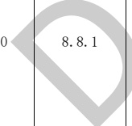</td><td style='text-align: center; word-wrap: break-word;'>要点</td><td style='text-align: center; word-wrap: break-word;'>每间教学用房的疏散门均不应少于2个，疏散门的宽度应通过计算；同时，每樘疏散门的通行净宽度不应小于0.90 m。当教室处于袋形走道末端时，若教室内任一处距教室门不超过15.00 m，且门的通行净宽度不小于1.50 m时，可设1个门。</td><td style='text-align: center; word-wrap: break-word;'>建筑类型、房间，门</td><td style='text-align: center; word-wrap: break-word;'>需复核教室处于袋形走道尽端的判断，不规则教室内任一处距教室门不超过15.00 m的计算疏散门净宽为门洞尺寸扣减100mm。</td></tr><tr><td style='text-align: center; word-wrap: break-word;'>11</td><td style='text-align: center; word-wrap: break-word;'>9.2.1</td><td style='text-align: center; word-wrap: break-word;'>要点</td><td style='text-align: center; word-wrap: break-word;'>教学用房工作面或地面上的采光系数不得低于表9.2.1的规定和现行国家标准GB/T 50033的有关规定。在建筑方案设计时，其采光窗洞口面积应按不低于表9.2.1窗地面积比的规定估算。</td><td style='text-align: center; word-wrap: break-word;'>建筑类型、房间、窗</td><td style='text-align: center; word-wrap: break-word;'>准确南京市属于IV类光气候区，所在地区的采光系数标准值应乘以南京地区的光气候系数1.1。</td></tr><tr><td colspan="6">注1：准确指该条文审查准确性达95%，无需人工复核。注2：需复核指该条文中部分内容需要人工复核确认。</td></tr></table>

表 A.6 建筑专业 BIM 智能审查条文表

<table border=1 style='margin: auto; word-wrap: break-word;'><tr><td style='text-align: center; word-wrap: break-word;'>序号</td><td style='text-align: center; word-wrap: break-word;'>审查条文</td><td style='text-align: center; word-wrap: break-word;'>条文类型</td><td style='text-align: center; word-wrap: break-word;'>条文内容</td><td style='text-align: center; word-wrap: break-word;'>模型关联信息</td><td style='text-align: center; word-wrap: break-word;'>准确性及说明</td></tr><tr><td style='text-align: center; word-wrap: break-word;'>1</td><td style='text-align: center; word-wrap: break-word;'>6.0.5</td><td style='text-align: center; word-wrap: break-word;'>强条</td><td style='text-align: center; word-wrap: break-word;'>特级、甲级档案馆和属于一类高层的乙级档案馆建筑均应设置火灾自动报警系统。其他乙级档案馆的档案库、服务器机房、缩微用房、音像技术用房、空调机房等房间应设置火灾自动报警系统。</td><td style='text-align: center; word-wrap: break-word;'>建筑类型、房间、自动报警系统</td><td style='text-align: center; word-wrap: break-word;'>准确</td></tr><tr><td style='text-align: center; word-wrap: break-word;'>2</td><td style='text-align: center; word-wrap: break-word;'>6.0.9</td><td style='text-align: center; word-wrap: break-word;'>要点</td><td style='text-align: center; word-wrap: break-word;'>档案库区缓冲间及档案库的门均应向疏散方向开启，并应为甲级防火门。</td><td style='text-align: center; word-wrap: break-word;'>房间、门</td><td style='text-align: center; word-wrap: break-word;'>需复核门开向判断。</td></tr><tr><td colspan="6">注1：准确指该条文审查准确性达95%，无需人工复核。\n注2：需复核指该条文中部分内容需要人工复核确认。</td></tr></table>

[来源：JGJ 25-2010]

表 A.7 建筑专业 BIM 智能审查条文表

<table border=1 style='margin: auto; word-wrap: break-word;'><tr><td style='text-align: center; word-wrap: break-word;'>序号</td><td style='text-align: center; word-wrap: break-word;'>审查条文</td><td style='text-align: center; word-wrap: break-word;'>条文类型</td><td style='text-align: center; word-wrap: break-word;'>条文内容</td><td style='text-align: center; word-wrap: break-word;'>模型关联信息</td><td style='text-align: center; word-wrap: break-word;'>准确性及说明</td></tr><tr><td style='text-align: center; word-wrap: break-word;'>1</td><td style='text-align: center; word-wrap: break-word;'>4.1.3</td><td style='text-align: center; word-wrap: break-word;'></td><td style='text-align: center; word-wrap: break-word;'>幼儿所、幼儿园中的生活用房不应设地下室或半地下室。</td><td style='text-align: center; word-wrap: break-word;'>建筑类型、房间、楼层</td><td style='text-align: center; word-wrap: break-word;'>准确\n地下室和半地下室的判断标准是房间的计算标高，当计算标高大于0时，认为房间不在地下室和半地下室。</td></tr><tr><td style='text-align: center; word-wrap: break-word;'>2</td><td style='text-align: center; word-wrap: break-word;'>4.1.3A</td><td style='text-align: center; word-wrap: break-word;'>一般</td><td style='text-align: center; word-wrap: break-word;'>幼儿园生活用房应布置在三层及以下。</td><td style='text-align: center; word-wrap: break-word;'>建筑类型、房间、楼层</td><td style='text-align: center; word-wrap: break-word;'>准确</td></tr><tr><td style='text-align: center; word-wrap: break-word;'>3</td><td style='text-align: center; word-wrap: break-word;'>4.1.6</td><td style='text-align: center; word-wrap: break-word;'>一般</td><td style='text-align: center; word-wrap: break-word;'>活动室、寝室、多功能活动室等幼儿使用的房间应设双扇平开门，门净宽不应小于1.20 m。</td><td style='text-align: center; word-wrap: break-word;'>房间、门</td><td style='text-align: center; word-wrap: break-word;'>准确\n疏散门净宽为门洞尺寸扣减100 mm。</td></tr><tr><td style='text-align: center; word-wrap: break-word;'>4</td><td style='text-align: center; word-wrap: break-word;'>4.1.9</td><td style='text-align: center; word-wrap: break-word;'>强条</td><td style='text-align: center; word-wrap: break-word;'>托儿所、幼儿园的外廊、室内回廊、内天井、阳台、上人屋面、平台、看台及室外楼梯等临空处应设置防护栏杆，栏杆应以坚固、耐久的材料制作。防护栏杆的高度应从可踏部位顶面起算，且净高不应小于1.30 m。防护栏杆必须采用防止幼儿攀登和穿过的构造，当采用垂直杆件做栏杆时，其杆件净距离不应大于0.09 m。</td><td style='text-align: center; word-wrap: break-word;'>建筑类型、房间、区域、楼梯、栏杆/扶手</td><td style='text-align: center; word-wrap: break-word;'>需复核\n防护栏杆净高计算得到防护栏杆离楼地面完成面100 mm～1000 mm净高度内，不能有横向构件。\n“栏杆应以坚固、耐久的材料制作”未拆解。</td></tr></table>

表 A.7 建筑专业 BIM 智能审查条文表（续）

<table border=1 style='margin: auto; word-wrap: break-word;'><tr><td style='text-align: center; word-wrap: break-word;'>序号</td><td style='text-align: center; word-wrap: break-word;'>审查条文</td><td style='text-align: center; word-wrap: break-word;'>条文类型</td><td style='text-align: center; word-wrap: break-word;'>条文内容</td><td style='text-align: center; word-wrap: break-word;'>模型关联信息</td><td style='text-align: center; word-wrap: break-word;'>准确性及说明</td></tr><tr><td style='text-align: center; word-wrap: break-word;'>5</td><td style='text-align: center; word-wrap: break-word;'>4.1.12</td><td style='text-align: center; word-wrap: break-word;'>强条</td><td style='text-align: center; word-wrap: break-word;'>幼儿使用的楼梯，当楼梯井净宽度大于0.11 m时，必须采取防止幼儿攀滑措施。楼梯栏杆应采取不易攀爬的构造，当采用垂直杆件做栏杆时，其杆件净距不应大于0.09 m。</td><td style='text-align: center; word-wrap: break-word;'>建筑类型、房间、楼梯、栏杆/扶手</td><td style='text-align: center; word-wrap: break-word;'>准确\n楼梯的“楼梯井净宽”是计算得到，支持计算双跑楼梯的井宽，旋转楼梯等复杂的形状计算不准确。</td></tr><tr><td colspan="6">注 1：准确指该条文审查准确性达 95%，无需人工复核。\n注 2：需复核指该条文中部分内容需要人工复核确认。</td></tr></table>

[来源：JGJ 39-2016(2019年版)]

表 A.8 建筑专业 BIM 智能审查条文表

<table border=1 style='margin: auto; word-wrap: break-word;'><tr><td style='text-align: center; word-wrap: break-word;'>序号</td><td style='text-align: center; word-wrap: break-word;'>审查条文</td><td style='text-align: center; word-wrap: break-word;'>条文类型</td><td style='text-align: center; word-wrap: break-word;'>条文内容</td><td style='text-align: center; word-wrap: break-word;'>模型关联信息</td><td style='text-align: center; word-wrap: break-word;'>准确性及说明</td></tr><tr><td style='text-align: center; word-wrap: break-word;'>1</td><td style='text-align: center; word-wrap: break-word;'>4.1.9</td><td style='text-align: center; word-wrap: break-word;'>一般 </td><td style='text-align: center; word-wrap: break-word;'>办公建筑的走道应符合下列规定：\n1 宽度应满足防火疏散要求，最小净宽应符合表4.1.9的规定。（表略）\n注：高层内筒结构的回廊式走道净宽最小值同单面布房走道。\n2 高差不足0.30 m时，不应设置台阶，应设坡道，其坡度不应大于1:8。</td><td style='text-align: center; word-wrap: break-word;'>建筑类型、房间、台阶、坡道</td><td style='text-align: center; word-wrap: break-word;'>需复核\n走道长度、宽度及坡道坡度是计算得到；\n台阶只支持用楼梯和常规模型建模。\n走道及外廊的净宽应扣除粉刷和保温层厚度。</td></tr><tr><td style='text-align: center; word-wrap: break-word;'>2</td><td rowspan="2">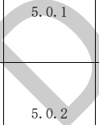</td><td style='text-align: center; word-wrap: break-word;'>一般</td><td style='text-align: center; word-wrap: break-word;'>办公建筑的耐火等级应符合下列规定：\n1 A类、B类办公建筑应为一级；\n2 C类办公建筑不应低于二级。</td><td style='text-align: center; word-wrap: break-word;'>建筑类型、办公建筑分类、耐火等级</td><td style='text-align: center; word-wrap: break-word;'>准确\n导出模型时需要填写耐火等级。</td></tr><tr><td style='text-align: center; word-wrap: break-word;'>3</td><td style='text-align: center; word-wrap: break-word;'>一般</td><td style='text-align: center; word-wrap: break-word;'>办公综合楼内办公部分的安全出口不应与同一楼层内外营业的商场、营业厅、娱乐、餐饮等人员密集场所的安全出口共用。</td><td style='text-align: center; word-wrap: break-word;'>建筑类型、房间、面积、安全出口、楼层</td><td style='text-align: center; word-wrap: break-word;'>准确\n模型空间属性要有“办公区域”。</td></tr><tr><td style='text-align: center; word-wrap: break-word;'>4</td><td style='text-align: center; word-wrap: break-word;'>5.0.4</td><td style='text-align: center; word-wrap: break-word;'>一般</td><td style='text-align: center; word-wrap: break-word;'>机要室、档案室、电子信息系统机房和重要库房等隔墙的耐火极限不应小于2 h，楼板不应小于1.5 h，并应采用甲级防火门。</td><td style='text-align: center; word-wrap: break-word;'>建筑类型、房间、墙、楼板、门、耐火极限</td><td style='text-align: center; word-wrap: break-word;'>准确</td></tr></table>

表 A.8 建筑专业 BIM 智能审查条文表（续）

<table border=1 style='margin: auto; word-wrap: break-word;'><tr><td style='text-align: center; word-wrap: break-word;'>序号</td><td style='text-align: center; word-wrap: break-word;'>审查条文</td><td style='text-align: center; word-wrap: break-word;'>条文类型</td><td style='text-align: center; word-wrap: break-word;'>条文内容</td><td style='text-align: center; word-wrap: break-word;'>模型关联信息</td><td style='text-align: center; word-wrap: break-word;'>准确性及说明</td></tr><tr><td style='text-align: center; word-wrap: break-word;'>5</td><td style='text-align: center; word-wrap: break-word;'>7.3.2</td><td style='text-align: center; word-wrap: break-word;'>一般</td><td style='text-align: center; word-wrap: break-word;'>变电所不应在厕所、浴室、盥洗室或其他蓄水、经常积水场所的直接下一层设置，且不宜与上述场所相贴邻，当贴邻时应采取防水和防潮措施。</td><td style='text-align: center; word-wrap: break-word;'>建筑类型、房间、楼层</td><td style='text-align: center; word-wrap: break-word;'>准确</td></tr><tr><td colspan="6">注1：准确指该条文审查准确性达95%，无需人工复核。\n注2：需复核指该条文中部分内容需要人工复核确认。</td></tr></table>

[来源：JGJ/T 67-2019]

表 A.9 建筑专业 BIM 智能审查条文表

<table border=1 style='margin: auto; word-wrap: break-word;'><tr><td style='text-align: center; word-wrap: break-word;'>序号</td><td style='text-align: center; word-wrap: break-word;'>审查条文</td><td style='text-align: center; word-wrap: break-word;'>条文类型</td><td style='text-align: center; word-wrap: break-word;'>条文内容</td><td style='text-align: center; word-wrap: break-word;'>模型关联信息</td><td style='text-align: center; word-wrap: break-word;'>准确性及说明</td></tr><tr><td style='text-align: center; word-wrap: break-word;'>1</td><td style='text-align: center; word-wrap: break-word;'>5.1.2</td><td style='text-align: center; word-wrap: break-word;'>强条</td><td style='text-align: center; word-wrap: break-word;'>老年人照料设施的老年人居室和老年人休息室不应设置在地下室、半地下室。</td><td style='text-align: center; word-wrap: break-word;'>建筑类型、楼层、房间、房间位置</td><td style='text-align: center; word-wrap: break-word;'>准确</td></tr><tr><td style='text-align: center; word-wrap: break-word;'>2</td><td style='text-align: center; word-wrap: break-word;'>5.6.4</td><td style='text-align: center; word-wrap: break-word;'>强条</td><td style='text-align: center; word-wrap: break-word;'>二层及以上楼层、地下室、半地下室设置老年人用房时应设电梯，电梯应为无障碍电梯，且至少1台能容纳担架。</td><td style='text-align: center; word-wrap: break-word;'>建筑类型、房间、楼层、电梯</td><td style='text-align: center; word-wrap: break-word;'>准确</td></tr><tr><td style='text-align: center; word-wrap: break-word;'>3</td><td style='text-align: center; word-wrap: break-word;'>6.5.3</td><td style='text-align: center; word-wrap: break-word;'>强条</td><td style='text-align: center; word-wrap: break-word;'>老年人照料设施的老年人居室和老年人休息室不应与电梯井道、有噪声振动的设备机房等相邻布置。</td><td style='text-align: center; word-wrap: break-word;'>建筑类型、房间</td><td style='text-align: center; word-wrap: break-word;'>准确\n“有噪声振动”需复核。</td></tr></table>

注1：准确指该条文审查准确性达95%，无需人工复核。

注2：需复核指该条文中部分内容需要人工复核确认。

[来源：JGJ 450-2018]

#### 附录 B

#### （资料性）

#### 结构专业 BIM 智能审查条文库

结构专业根据5本文件中已拆解的条文审查模型，现已拆解条文共87条，其中强条16条，一般性条文26条，要点45条。具体条文详见表B.1～表B.5。（拆解的条文随引用规范的修订而修订本规范。）

表 B.1 结构专业 BIM 智能审查条文表

<table border=1 style='margin: auto; word-wrap: break-word;'><tr><td style='text-align: center; word-wrap: break-word;'>序号</td><td style='text-align: center; word-wrap: break-word;'>审查条文</td><td style='text-align: center; word-wrap: break-word;'>条文类型</td><td style='text-align: center; word-wrap: break-word;'>内容</td><td style='text-align: center; word-wrap: break-word;'>备注</td><td style='text-align: center; word-wrap: break-word;'>完整性</td></tr><tr><td style='text-align: center; word-wrap: break-word;'>1</td><td style='text-align: center; word-wrap: break-word;'>4.2.3-1</td><td style='text-align: center; word-wrap: break-word;'>强条</td><td style='text-align: center; word-wrap: break-word;'>多遇地震下，各类建筑与市政工程结构的水平地震剪力标准值应符合下列规定：\n1 建筑结构抗震验算时，各楼层水平地震剪力标准值应符合下式（B.1）规定：\n $ V_{Eki} &gt; \lambda \sum_{j=1}^{n} G_j $ .................（B.1）\n式中：\n $ V_{Eki} $——第 i 层水平地震剪力标准值；\n $ \lambda $——最小地震剪力系数，应按本条第 3 款的规定取值，对竖向不规则结构的薄弱层，尚应乘以 1.15 的增大系数；\n $ Q_j $——第 j 层的重力荷载代表值。</td><td style='text-align: center; word-wrap: break-word;'>仅输出至计算书中。</td><td style='text-align: center; word-wrap: break-word;'>完整</td></tr><tr><td colspan="6">注 1：完整指该条文已完整拆解，无需人工复核。\n注 2：不完整指该条文中某些部分条款尚未拆解，需人工进行复核。</td></tr></table>

[来源：GB 55002-2021]

表 B.2 结构专业 BIM 智能审查条文表

<table border=1 style='margin: auto; word-wrap: break-word;'><tr><td style='text-align: center; word-wrap: break-word;'>序号</td><td style='text-align: center; word-wrap: break-word;'>审查条文</td><td style='text-align: center; word-wrap: break-word;'>条文类型</td><td style='text-align: center; word-wrap: break-word;'>内容</td><td style='text-align: center; word-wrap: break-word;'>备注</td><td style='text-align: center; word-wrap: break-word;'>完整性</td></tr><tr><td style='text-align: center; word-wrap: break-word;'>1</td><td style='text-align: center; word-wrap: break-word;'>4.3.5</td><td style='text-align: center; word-wrap: break-word;'>强条</td><td style='text-align: center; word-wrap: break-word;'>混凝土结构应进行结构整体稳定分析计算和抗倾覆验算，并应满足工程需要的安全性要求。</td><td style='text-align: center; word-wrap: break-word;'>-</td><td style='text-align: center; word-wrap: break-word;'>完整</td></tr><tr><td style='text-align: center; word-wrap: break-word;'>2</td><td style='text-align: center; word-wrap: break-word;'>4.4.7-1</td><td style='text-align: center; word-wrap: break-word;'>强条</td><td style='text-align: center; word-wrap: break-word;'>混凝土房屋建筑结构中剪力墙的最小配筋率及构造尚应符合下列规定：\n1 剪力墙的竖向和水平分布钢筋的配筋率，一、二、三级抗震等级时均不应小于0.25%，四级时不应小于0.20%。</td><td style='text-align: center; word-wrap: break-word;'>-</td><td style='text-align: center; word-wrap: break-word;'>完整</td></tr></table>

表 B.2 结构专业 BM 智能审查条文表（续）

<table border=1 style='margin: auto; word-wrap: break-word;'><tr><td style='text-align: center; word-wrap: break-word;'>序号</td><td style='text-align: center; word-wrap: break-word;'>审查条文</td><td style='text-align: center; word-wrap: break-word;'>条文类型</td><td style='text-align: center; word-wrap: break-word;'>内容</td><td style='text-align: center; word-wrap: break-word;'>备注</td><td style='text-align: center; word-wrap: break-word;'>完整性</td></tr><tr><td style='text-align: center; word-wrap: break-word;'>3</td><td style='text-align: center; word-wrap: break-word;'>4.4.7-2</td><td style='text-align: center; word-wrap: break-word;'>强条</td><td style='text-align: center; word-wrap: break-word;'>混凝土房屋建筑结构中剪力墙的最小配筋率及构造尚应符合下列规定：\n2 高层房屋建筑框架-剪力墙结构、板柱-剪力墙结构、筒体结构中，剪力墙的竖向、水平向分布钢筋的配筋率均不应小于0.25%，并应至少双排布置，各排分布钢筋之间应设置拉筋，拉筋的直径不应小于6 mm，间距不应大于600 mm。</td><td style='text-align: center; word-wrap: break-word;'>-</td><td style='text-align: center; word-wrap: break-word;'>完整</td></tr><tr><td style='text-align: center; word-wrap: break-word;'>4</td><td style='text-align: center; word-wrap: break-word;'>4.4.7-4</td><td style='text-align: center; word-wrap: break-word;'>强条</td><td style='text-align: center; word-wrap: break-word;'>混凝土房屋建筑结构中剪力墙的最小配筋率及构造尚应符合下列规定：\n4 部分框支剪力墙结构房屋建筑中，剪力墙底部加强部位墙体的水平和竖向分布钢筋的最小配筋率均不应小于0.30%，钢筋间距不应大于200 mm，钢筋直径不应小于8 mm。</td><td style='text-align: center; word-wrap: break-word;'>-</td><td style='text-align: center; word-wrap: break-word;'>完整</td></tr><tr><td style='text-align: center; word-wrap: break-word;'>5</td><td style='text-align: center; word-wrap: break-word;'>4.4.8-1</td><td style='text-align: center; word-wrap: break-word;'>强条</td><td style='text-align: center; word-wrap: break-word;'>房屋建筑混凝土框架梁设计应符合下列规定：\n1 计入受压钢筋作用的梁端截面混凝土受压区高度与有效高度之比值，一级不应大于0.25，二级、三级不应大于0.35。</td><td style='text-align: center; word-wrap: break-word;'>受压区高度x按\n $ x = (f_y A_s - f_y A_s&#x27;) / \alpha_i f_c b $ (B.2) 计算所得。</td><td style='text-align: center; word-wrap: break-word;'>完整</td></tr><tr><td style='text-align: center; word-wrap: break-word;'>6</td><td style='text-align: center; word-wrap: break-word;'>4.4.8-2</td><td style='text-align: center; word-wrap: break-word;'>强条</td><td style='text-align: center; word-wrap: break-word;'>房屋建筑混凝土框架梁设计应符合下列规定：\n2 纵向受拉钢筋的最小配筋率不应小于GB 55008-2021中表4.4.8-1规定的数值。</td><td style='text-align: center; word-wrap: break-word;'>-</td><td style='text-align: center; word-wrap: break-word;'>完整</td></tr><tr><td style='text-align: center; word-wrap: break-word;'>7</td><td style='text-align: center; word-wrap: break-word;'>4.4.8-3</td><td style='text-align: center; word-wrap: break-word;'>强条</td><td style='text-align: center; word-wrap: break-word;'>房屋建筑混凝土框架梁设计应符合下列规定：\n3 梁端截面的底面和顶面纵向钢筋截面面积的比值，除按计算确定外，一级不应小于0.5，二级、三级不应小于0.3。</td><td style='text-align: center; word-wrap: break-word;'>-</td><td style='text-align: center; word-wrap: break-word;'>完整</td></tr><tr><td style='text-align: center; word-wrap: break-word;'>8</td><td style='text-align: center; word-wrap: break-word;'>4.4.8-4</td><td style='text-align: center; word-wrap: break-word;'>强条</td><td style='text-align: center; word-wrap: break-word;'>房屋建筑混凝土框架梁设计应符合下列规定：\n4 梁端箍筋的加密区长度、箍筋最大间距和最小直径应符合GB 55008-2021中表4.4.8-2的要求；一级、二级抗震等级框架梁，当箍筋直径大于12 mm、肢数不少于4肢且肢距不大于150 mm时，箍筋加密区最大间距应允许放宽到不大于150 mm。</td><td style='text-align: center; word-wrap: break-word;'>-</td><td style='text-align: center; word-wrap: break-word;'>不完整\n未考虑箍筋间距放宽的条件。</td></tr><tr><td style='text-align: center; word-wrap: break-word;'>9</td><td style='text-align: center; word-wrap: break-word;'>4.4.9-1</td><td style='text-align: center; word-wrap: break-word;'>强条</td><td style='text-align: center; word-wrap: break-word;'>混凝土柱纵向钢筋和箍筋配置应符合下列规定：\n1 全部纵向普通钢筋的配筋率不应小于GB 55008-2021中表4.4.9-1的规定，且柱截面每一侧纵向普通钢筋配筋率不应小于0.20%；当柱的混凝土强度等级为C60以上时，应按表中规定值增加0.10%采用；当采用400 MPa级纵向受力钢筋时，应按表中规定值增加0.05%采用。</td><td style='text-align: center; word-wrap: break-word;'>-</td><td style='text-align: center; word-wrap: break-word;'>完整</td></tr></table>

表B.2 结构专业BIM智能审查条文表（续）

<table border=1 style='margin: auto; word-wrap: break-word;'><tr><td style='text-align: center; word-wrap: break-word;'>序号</td><td style='text-align: center; word-wrap: break-word;'>审查条文</td><td style='text-align: center; word-wrap: break-word;'>条文类型</td><td style='text-align: center; word-wrap: break-word;'>内容</td><td style='text-align: center; word-wrap: break-word;'>备注</td><td style='text-align: center; word-wrap: break-word;'>完整性</td></tr><tr><td style='text-align: center; word-wrap: break-word;'>10</td><td style='text-align: center; word-wrap: break-word;'>4.4.9-2</td><td style='text-align: center; word-wrap: break-word;'>强条</td><td style='text-align: center; word-wrap: break-word;'>混凝土柱纵向钢筋和箍筋配置应符合下列规定：\n2 柱箍筋在规定的范围内应加密，且加密区的箍筋间距和直径应符合下列规定：\n1) 箍筋加密区的箍筋最大间距和最小直径应按GB 55008-2021中表4.4.9-2采用。\n2) 一级框架柱的箍筋直径大于12 mm且箍筋肢距不大于150 mm及二级框架柱箍筋直径不小于10 mm且肢距不大于200 mm时，除柱根外加密区箍筋最大间距应允许采用150 mm；三级、四级框架柱的截面尺寸不大于400 mm时，箍筋最小直径应允许采用6 mm。\n3) 剪跨比不大于2的柱，箍筋应全高加密，且箍筋间距不应大于100 mm。</td><td style='text-align: center; word-wrap: break-word;'>未包含混规\n(4.4.9-2-2) 中关于框架柱的箍筋直径判断。</td><td style='text-align: center; word-wrap: break-word;'>不完整\n未考虑箍筋直径、间距。</td></tr><tr><td style='text-align: center; word-wrap: break-word;'>11</td><td style='text-align: center; word-wrap: break-word;'>4.4.10-1</td><td style='text-align: center; word-wrap: break-word;'>强条</td><td style='text-align: center; word-wrap: break-word;'>混凝土转换梁设计应符合下列规定：\n1 转换梁上、下部纵向钢筋的最小配筋率，特一级、一级和二级分别不应小于0.60%、0.50%和0.40%，其他情况不应小于0.30%。</td><td style='text-align: center; word-wrap: break-word;'>-</td><td style='text-align: center; word-wrap: break-word;'>完整</td></tr><tr><td style='text-align: center; word-wrap: break-word;'>12</td><td style='text-align: center; word-wrap: break-word;'>4.4.10-2</td><td style='text-align: center; word-wrap: break-word;'>强条</td><td style='text-align: center; word-wrap: break-word;'>混凝土转换梁设计应符合下列规定：\n2 离柱边1.5倍梁截面高度范围内的梁箍筋应加密，加密区箍筋直径不应小于10 mm，间距不应大于100 mm。加密区箍筋的最小面积配筋率，特一级、一级和二级分别不应小于1.3  $ f_r/f_{pr} $、1.2  $ f_r/f_p $和1.1  $ f_r/f_{pr} $，他情况不应小于0.9  $ f_r/f_{pr} $。</td><td style='text-align: center; word-wrap: break-word;'>-</td><td style='text-align: center; word-wrap: break-word;'>完整</td></tr><tr><td style='text-align: center; word-wrap: break-word;'>13</td><td style='text-align: center; word-wrap: break-word;'>4.4.10-3</td><td style='text-align: center; word-wrap: break-word;'>强条</td><td style='text-align: center; word-wrap: break-word;'>混凝土转换梁设计应符合下列规定：\n3 偏心受拉的转换梁的支座上部纵向钢筋至少应有50%沿梁全长贯通，下部纵向钢筋应全部直通到柱内；沿梁腹板高度应配置间距不大于200 mm、直径不小于16 mm的腰筋。</td><td style='text-align: center; word-wrap: break-word;'>-</td><td style='text-align: center; word-wrap: break-word;'>完整</td></tr><tr><td style='text-align: center; word-wrap: break-word;'>14</td><td style='text-align: center; word-wrap: break-word;'>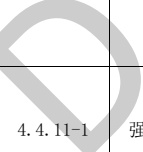</td><td style='text-align: center; word-wrap: break-word;'>条</td><td style='text-align: center; word-wrap: break-word;'>混凝土转换柱设计应符合下列规定：\n1 转换柱箍筋应采用复合螺旋箍或井字复合箍，并应沿柱全高加密，箍筋直径不应小于10 mm，箍筋间距不应大于100 mm和6倍纵向钢筋直径的较小值；</td><td style='text-align: center; word-wrap: break-word;'>-</td><td style='text-align: center; word-wrap: break-word;'>不完整\n未考虑箍筋形式。</td></tr><tr><td style='text-align: center; word-wrap: break-word;'>15</td><td style='text-align: center; word-wrap: break-word;'>4.4.11-2</td><td style='text-align: center; word-wrap: break-word;'>强条</td><td style='text-align: center; word-wrap: break-word;'>混凝土转换柱设计应符合下列规定：\n2 转换柱的箍筋配箍特征值应比普通框架柱要求的数值增加0.02采用，且箍筋体积配箍率不应小于1.50%。</td><td style='text-align: center; word-wrap: break-word;'>-</td><td style='text-align: center; word-wrap: break-word;'>完整</td></tr><tr><td colspan="6">注 1：完整指该条文已完整拆解，无需人工复核。\n注 2：不完整指该条文中某些部分条款尚未拆解，需人工进行复核。</td></tr></table>

[来源：GB 55008-2021]

表 B.3 结构专业 BIM 智能审查条文表

<table border=1 style='margin: auto; word-wrap: break-word;'><tr><td style='text-align: center; word-wrap: break-word;'>序号</td><td style='text-align: center; word-wrap: break-word;'>审查条文</td><td style='text-align: center; word-wrap: break-word;'>条文类型</td><td style='text-align: center; word-wrap: break-word;'>内容</td><td style='text-align: center; word-wrap: break-word;'>备注</td><td style='text-align: center; word-wrap: break-word;'>完整性</td></tr><tr><td style='text-align: center; word-wrap: break-word;'>1</td><td style='text-align: center; word-wrap: break-word;'>9.2.1-2</td><td style='text-align: center; word-wrap: break-word;'>要点</td><td style='text-align: center; word-wrap: break-word;'>梁的纵向受力钢筋应符合下列规定：\n2 梁高不小于 300 mm 时，钢筋直径不应小于 10 mm；梁高小于 300 mm 时，钢筋直径不应小于 8 mm。</td><td style='text-align: center; word-wrap: break-word;'>-</td><td style='text-align: center; word-wrap: break-word;'>完整</td></tr><tr><td style='text-align: center; word-wrap: break-word;'>2</td><td style='text-align: center; word-wrap: break-word;'>9.2.1-3</td><td style='text-align: center; word-wrap: break-word;'>要点</td><td style='text-align: center; word-wrap: break-word;'>梁的纵向受力钢筋应符合下列规定：\n3 梁上部钢筋水平方向的净间距不应小于 30 mm 和 1.5 d；梁下部钢筋水平方向的净间距不应小于 25 mm 和  $ d_o $。当下部钢筋多于 2 层时，2 层以上钢筋水平方向的中距应比下面 2 层的中距增大一倍；各层钢筋之间的净间距不应小于 25 mm 和  $ d_d $， $ d $ 为钢筋的最大直径。</td><td style='text-align: center; word-wrap: break-word;'>-</td><td style='text-align: center; word-wrap: break-word;'>不完整\n审查范围\n不含后一句\n多于两层的\n内容。</td></tr><tr><td style='text-align: center; word-wrap: break-word;'>3</td><td style='text-align: center; word-wrap: break-word;'>9.2.6-1</td><td style='text-align: center; word-wrap: break-word;'>要点</td><td style='text-align: center; word-wrap: break-word;'>梁的上部纵向钢筋应符合下列要求：\n1 当梁端按简支计算但实际受到部分约束时，应在支座区上部设置纵向构造钢筋。其截面面积不应小于梁跨中下部纵向受力钢筋计算所需截面面积的 1/4，且不应少于 2 根。该纵向构造钢筋自支座边缘向跨内伸出的长度不应小于  $ I_{0}/5 $， $ I_0 $ 为梁的计算跨度。</td><td style='text-align: center; word-wrap: break-word;'>-</td><td style='text-align: center; word-wrap: break-word;'>不完整\n审查范围\n不含后半句，伸出长度无需校审。</td></tr><tr><td style='text-align: center; word-wrap: break-word;'>4</td><td style='text-align: center; word-wrap: break-word;'>9.2.9-2</td><td style='text-align: center; word-wrap: break-word;'>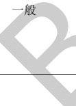</td><td style='text-align: center; word-wrap: break-word;'>梁中箍筋的配置应符合下列规定：\n2 截面高度大于 800 mm 的梁，箍筋直径不宜小于 8 mm；对截面高度不大于 800 mm 的梁，不宜小于 6 mm。梁中配有计算需要的纵向受压钢筋时，箍筋直径尚不应小于  $ d/4 $， $ d $ 为受压钢筋最大直径。</td><td style='text-align: center; word-wrap: break-word;'>关联\n高规(6.3.4-2)</td><td style='text-align: center; word-wrap: break-word;'>不完整\n审查范围\n不含后半部分计算需要的纵向受压钢筋。</td></tr><tr><td style='text-align: center; word-wrap: break-word;'>5</td><td style='text-align: center; word-wrap: break-word;'>9.2.9-3</td><td style='text-align: center; word-wrap: break-word;'>一般</td><td style='text-align: center; word-wrap: break-word;'>梁中箍筋的配置应符合下列规定：\n3 梁中箍筋的最大间距应符合表 9.2.9 的规定；当  $ V $ 大于  $ 0.7f_i/bh_{10}+0.05N_{50} $ 时，箍筋的配筋率  $ \rho_{sv}[\rho_{sv}=A_{sv}/(bs)] $ 尚不应小于  $ 0.24f_i/f_{10} $ (B.3)。</td><td style='text-align: center; word-wrap: break-word;'>-</td><td style='text-align: center; word-wrap: break-word;'>完整</td></tr><tr><td style='text-align: center; word-wrap: break-word;'>6</td><td style='text-align: center; word-wrap: break-word;'>9.3.1-1</td><td style='text-align: center; word-wrap: break-word;'>要点</td><td style='text-align: center; word-wrap: break-word;'>柱中纵向钢筋的配置应符合下列规定：\n1 纵向受力钢筋直径不宜小于 12 mm；全部纵向钢筋的配筋率不宜大于 5%；</td><td style='text-align: center; word-wrap: break-word;'>-</td><td style='text-align: center; word-wrap: break-word;'>完整</td></tr><tr><td style='text-align: center; word-wrap: break-word;'>7</td><td style='text-align: center; word-wrap: break-word;'>9.3.1-2</td><td style='text-align: center; word-wrap: break-word;'>要点</td><td style='text-align: center; word-wrap: break-word;'>柱中纵向钢筋的配置应符合下列规定：\n2 柱中纵向钢筋的净间距不应小于 50 mm，且不宜大于 300 mm；</td><td style='text-align: center; word-wrap: break-word;'>关联\n高规(6.4.4-2)</td><td style='text-align: center; word-wrap: break-word;'>完整</td></tr><tr><td style='text-align: center; word-wrap: break-word;'>8</td><td style='text-align: center; word-wrap: break-word;'>9.3.1-4</td><td style='text-align: center; word-wrap: break-word;'>要点</td><td style='text-align: center; word-wrap: break-word;'>柱中纵向钢筋的配置应符合下列规定：\n4 圆柱中纵向钢筋不宜少于8根，不应少于6根，且宜沿周边均匀布置；</td><td style='text-align: center; word-wrap: break-word;'>-</td><td style='text-align: center; word-wrap: break-word;'>完整</td></tr></table>

表B.3结构专业BIM智能审查条文表（续）

<table border=1 style='margin: auto; word-wrap: break-word;'><tr><td style='text-align: center; word-wrap: break-word;'>序号</td><td style='text-align: center; word-wrap: break-word;'>审查条文</td><td style='text-align: center; word-wrap: break-word;'>条文类型</td><td style='text-align: center; word-wrap: break-word;'>内容</td><td style='text-align: center; word-wrap: break-word;'>备注</td><td style='text-align: center; word-wrap: break-word;'>完整性</td></tr><tr><td style='text-align: center; word-wrap: break-word;'>9</td><td style='text-align: center; word-wrap: break-word;'>9.3.2-1</td><td style='text-align: center; word-wrap: break-word;'>要点</td><td style='text-align: center; word-wrap: break-word;'>柱中的箍筋应符合下列规定：\n1 柱箍筋直径不应小于 d/4，且不应小于6 mm，d 为纵向钢筋的最大直径；</td><td style='text-align: center; word-wrap: break-word;'>关联\n高规(6.4.9-3)</td><td style='text-align: center; word-wrap: break-word;'>完整</td></tr><tr><td style='text-align: center; word-wrap: break-word;'>10</td><td style='text-align: center; word-wrap: break-word;'>9.3.2-2</td><td style='text-align: center; word-wrap: break-word;'>要点</td><td style='text-align: center; word-wrap: break-word;'>柱中的箍筋应符合下列规定：\n2 箍筋间距不应大于400 mm及构件截面的短边尺寸，且不应大于15 d，d为纵向钢筋的最小直径；</td><td style='text-align: center; word-wrap: break-word;'>关联\n高规(6.4.9-2)</td><td style='text-align: center; word-wrap: break-word;'>完整</td></tr><tr><td style='text-align: center; word-wrap: break-word;'>11</td><td style='text-align: center; word-wrap: break-word;'>9.3.2-5</td><td style='text-align: center; word-wrap: break-word;'>要点</td><td style='text-align: center; word-wrap: break-word;'>柱中的箍筋应符合下列规定：\n5 柱中全部纵向受力钢筋的配筋率\n筋直径不应小于8 mm，间距不应大于受力钢筋最小直径），且不应大于20 </td><td style='text-align: center; word-wrap: break-word;'>4.9-4)</td><td style='text-align: center; word-wrap: break-word;'>不完整\n审查范围不包含后半部分(指的是弯钩部分)。</td></tr><tr><td style='text-align: center; word-wrap: break-word;'>12</td><td style='text-align: center; word-wrap: break-word;'>11.4.18</td><td style='text-align: center; word-wrap: break-word;'>要点</td><td style='text-align: center; word-wrap: break-word;'>（框架柱）在箍筋加密区外，箍筋的体积配筋率不宜小于加密区配筋率的一半；对一、二级抗震等级，箍筋间距不应大于10 d；对三、四级抗震等级，箍筋间距不应大于15 d，此处，d为纵向钢筋直径。</td><td style='text-align: center; word-wrap: break-word;'>关联\n抗规(6.3.9-4-1)\n(6.3.9-4-2)\n高规(6.4.8-3)\n抗规6.3.9-4条\n是要点，因此混规11.4.18条列为要点</td><td style='text-align: center; word-wrap: break-word;'>完整</td></tr><tr><td colspan="6">注 1：完整指该条文已完整拆解，无需人工复核。\n注 2：不完整指该条文中某些部分条款尚未拆解，需人工进行复核。</td></tr></table>

[来源：GB 50010-2010(2015年版)]

表 B.4 结构专业 BIM 智能审查条文表

<table border=1 style='margin: auto; word-wrap: break-word;'><tr><td style='text-align: center; word-wrap: break-word;'>序号</td><td style='text-align: center; word-wrap: break-word;'>审查条文</td><td style='text-align: center; word-wrap: break-word;'>条文类型</td><td style='text-align: center; word-wrap: break-word;'>内容</td><td style='text-align: center; word-wrap: break-word;'>备注</td><td style='text-align: center; word-wrap: break-word;'>完整性</td></tr><tr><td style='text-align: center; word-wrap: break-word;'>1</td><td style='text-align: center; word-wrap: break-word;'>4.2.4</td><td style='text-align: center; word-wrap: break-word;'>一般</td><td style='text-align: center; word-wrap: break-word;'>高宽比大于4的高层建筑，在地震作用下基础底面不宜出现脱离区（零应力区）；其他建筑，基础底面与地基土之间脱离区（零应力区）面积不应超过基础底面面积15%。</td><td style='text-align: center; word-wrap: break-word;'>-</td><td style='text-align: center; word-wrap: break-word;'>完整</td></tr><tr><td style='text-align: center; word-wrap: break-word;'>2</td><td style='text-align: center; word-wrap: break-word;'>6.1.14-2</td><td style='text-align: center; word-wrap: break-word;'>要点</td><td style='text-align: center; word-wrap: break-word;'>地下室顶板作为上部结构的嵌固部位时，应符合下列要求：\n2 结构地上一层的侧向刚度，不宜大于相关范围地下一层侧向刚度的0.5倍；</td><td style='text-align: center; word-wrap: break-word;'>关联\n高规(5.3.7)\n(12.2.1-2)</td><td style='text-align: center; word-wrap: break-word;'>完整</td></tr><tr><td style='text-align: center; word-wrap: break-word;'>3</td><td style='text-align: center; word-wrap: break-word;'>6.1.14-3-1</td><td style='text-align: center; word-wrap: break-word;'>要点</td><td style='text-align: center; word-wrap: break-word;'>地下室顶板作为上部结构的嵌固部位下列要求：\n3 地下室顶板对应于地上框架柱的满足抗震计算要求外，尚应符合下列规定之一：\n1) 地下一层柱截面每侧纵向钢筋不应小于地上一层柱对应纵向钢筋的1.1倍，且地下一层柱上端和节点左右梁端实配的抗震受弯承载力之和应大于地上一层柱下端实配的抗震受弯承载力1.3倍。</td><td style='text-align: center; word-wrap: break-word;'>关联\n高规\n(12.2.1-3-2)</td><td style='text-align: center; word-wrap: break-word;'>不完整\n1 只考虑矩形截面；\n2 未审查后半句。</td></tr><tr><td style='text-align: center; word-wrap: break-word;'>4</td><td style='text-align: center; word-wrap: break-word;'>6.2.13-1</td><td style='text-align: center; word-wrap: break-word;'>要点</td><td style='text-align: center; word-wrap: break-word;'>钢筋混凝土结构抗震计算时，尚应符合下列要求：\n1 侧向刚度沿竖向分布基本均匀的框架-抗震墙结构和框架-核心筒结构，任一层框架部分承担的剪力值，不应小于结构底部总地震剪力的20%和按框架-抗震墙结构、框架-核心筒结构计算的框架部分各楼层地震剪力中最大值1.5倍二者的较小值。</td><td style='text-align: center; word-wrap: break-word;'>关联\n高规(8.1.4-1)\n仅输出至计算书中</td><td style='text-align: center; word-wrap: break-word;'>完整</td></tr><tr><td style='text-align: center; word-wrap: break-word;'>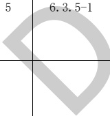</td><td style='text-align: center; word-wrap: break-word;'>要点</td><td style='text-align: center; word-wrap: break-word;'>柱的截面尺寸，宜符合下列各项要求：\n1 截面的宽度和高度，四级或不超过2层时不宜小于300 mm，一、二、三级且超过2层时不宜小于400 mm；圆柱的直径，四级或不超过2层时不宜小于350 mm，一、二、三级且超过2层时不宜小于450 mm。</td><td style='text-align: center; word-wrap: break-word;'>关联\n高规(6.4.1-1)\n(11.4.11-1)</td><td style='text-align: center; word-wrap: break-word;'>完整</td><td style='text-align: center; word-wrap: break-word;'></td></tr><tr><td style='text-align: center; word-wrap: break-word;'>6</td><td style='text-align: center; word-wrap: break-word;'>6.3.6</td><td style='text-align: center; word-wrap: break-word;'>要点</td><td style='text-align: center; word-wrap: break-word;'>柱轴压比不宜超过GB 50011-2010中表6.3.6的规定；建造于IV类场地且较高的高层建筑，柱轴压比限值应适当减小。</td><td style='text-align: center; word-wrap: break-word;'>关联\n高规(6.4.2)\n(11.4.16)\n建造于IV类场地且较高的高层建筑，以及抗规表6.3.6下面注中的各种情况，还需人工判断、校核</td><td style='text-align: center; word-wrap: break-word;'>不完整\n1 未考虑IV类场地且较高的高层建筑。\n2 不支持注3内容。\n3 不支持注4内容。</td></tr></table>

表B.4结构专业BIM智能审查条文表（续）

<table border=1 style='margin: auto; word-wrap: break-word;'><tr><td style='text-align: center; word-wrap: break-word;'>序号</td><td style='text-align: center; word-wrap: break-word;'>审查条文</td><td style='text-align: center; word-wrap: break-word;'>条文类型</td><td style='text-align: center; word-wrap: break-word;'>内容</td><td style='text-align: center; word-wrap: break-word;'>备注</td><td style='text-align: center; word-wrap: break-word;'>完整性</td></tr><tr><td style='text-align: center; word-wrap: break-word;'>7</td><td style='text-align: center; word-wrap: break-word;'>6.3.9-1-4</td><td style='text-align: center; word-wrap: break-word;'>要点</td><td style='text-align: center; word-wrap: break-word;'>柱的箍筋配置，尚应符合下列要求：\n1 柱的箍筋加密范围，应按下列规定采用：\n4）剪跨比不大于2的柱，因设置填充墙等形成的柱净高与柱截面高度之比不大于4的柱、框支柱、一级和二级框架的角柱，取全高。</td><td style='text-align: center; word-wrap: break-word;'>关联高规\n(6.4.6-4)\n(6.4.6-5)\n抗规\n(6.3.9-1-4) 条，“因设置填充墙”、不规则平面的角柱等情况，还需人工判断、校核</td><td style='text-align: center; word-wrap: break-word;'>不完整\n审查范围包含 4），未考虑设置填充墙。</td></tr><tr><td style='text-align: center; word-wrap: break-word;'>8</td><td style='text-align: center; word-wrap: break-word;'>6.3.9-2</td><td style='text-align: center; word-wrap: break-word;'>要点</td><td style='text-align: center; word-wrap: break-word;'>柱的箍筋配置，尚应符合下列要求：\n2 柱箍筋加密区的箍筋肢距，一级不宜大于200 mm，二、三级不宜大于250 mm，四级不宜大于300 mm。至少每隔一根纵向钢筋宜在两个方向有箍筋或拉筋约束；采用拉筋复合箍时，拉筋宜紧靠纵向钢筋并钩住箍筋。</td><td style='text-align: center; word-wrap: break-word;'>关联高规\n(6.4.8-2)\n(6.4.8-11) 11.4.15)</td><td style='text-align: center; word-wrap: break-word;'>不完整\n审查范围不包含本款后半句。</td></tr><tr><td style='text-align: center; word-wrap: break-word;'>9</td><td style='text-align: center; word-wrap: break-word;'>6.3.9-3</td><td style='text-align: center; word-wrap: break-word;'> 要点</td><td style='text-align: center; word-wrap: break-word;'>柱的箍筋配置，尚应符合下列要求：\n3 柱箍筋加密区的体积配箍率，应按下列规定采用：\n1）柱箍筋加密区的体积配箍率应符合下式要求：\n $ \rho_v \ge \lambda_{v}f_c/f_{yv} $ ......(B.4)\n式中：\n $ \rho_v $——柱箍筋加密区的体积配箍率，一级不应小于0.8%，二级不应小于0.6%，三、四级不应小于0.4%；\n计算复合螺旋箍的体积配箍率时，其非螺旋箍的箍筋体积应乘以折减系数0.80；\n $ f_c $——混凝土轴心抗压强度设计值，强度等级低于C35时，应按C35计算；\n $ f_{yv} $——箍筋或拉筋抗拉强度设计值；\n $ \lambda_v $——最小配箍特征值，宜按表6.3.9采用。（表6.3.9见规范）\n3）剪跨比不大于2的柱宜采用复合螺旋箍或井字复合箍，其体积配箍率不应小于1.2%，9度一级时不小于1.5%。</td><td style='text-align: center; word-wrap: break-word;'>关联高规\n(6.4.7-1)\n(6.4.7-2)\n(6.4.7-3)\n高规\n(11.4.17-1)\n(11.4.17-2)\n(11.4.17-3)\n(11.4.17-4)</td><td style='text-align: center; word-wrap: break-word;'>不完整\n未考虑复合螺旋箍中非螺旋箍校核。</td></tr></table>

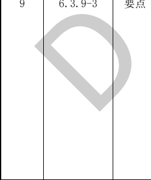

表B.4结构专业BIM智能审查条文表（续）

<table border=1 style='margin: auto; word-wrap: break-word;'><tr><td style='text-align: center; word-wrap: break-word;'>序号</td><td style='text-align: center; word-wrap: break-word;'>审查条文</td><td style='text-align: center; word-wrap: break-word;'>条文类型</td><td style='text-align: center; word-wrap: break-word;'>内容</td><td style='text-align: center; word-wrap: break-word;'>备注</td><td style='text-align: center; word-wrap: break-word;'>完整性</td></tr><tr><td style='text-align: center; word-wrap: break-word;'>10</td><td style='text-align: center; word-wrap: break-word;'>6.4.1</td><td style='text-align: center; word-wrap: break-word;'>要点</td><td style='text-align: center; word-wrap: break-word;'>抗震墙的厚度，一、二级不应小于160 mm且不宜小于层高或无支长度的1/20，三、四级不应小于140 mm且不宜小于层高或无支长度的1/25；无端柱或翼墙时，一、二级不宜小于层高或无支长度的1/16，三、四级不宜小于层高或无支长度的1/20。\n底部加强部位的墙厚，一、二级不应小于200 mm且不宜小于层高或无支长度的1/16，三、四级不应小于160 mm且不宜小于层高或无支长度的1/20；无端柱或翼墙时，一、二级不宜小于层高或无支长度的1/12，三、四级不宜小于层高或无支长度的1/16。</td><td style='text-align: center; word-wrap: break-word;'>关联\n高规(7.2.1-2)\n(7.2.1-3)\n混规(11.7.12)\n1 抗规6.4.1条\n第二段关于“底部加强部位的墙厚”不是要点；\n2 高规\n7.2.1-2、7.2.1-3条是要点；\n3 高规和抗规的表述略有不同。</td><td style='text-align: center; word-wrap: break-word;'>不完整\n1 未考虑无短柱、翼墙情况。\n2 本条规范关联高规7.2.1，未考虑一字形墙。</td></tr><tr><td style='text-align: center; word-wrap: break-word;'>11</td><td style='text-align: center; word-wrap: break-word;'>6.4.4-1</td><td style='text-align: center; word-wrap: break-word;'>一般</td><td style='text-align: center; word-wrap: break-word;'>抗震墙竖向和横向分布钢筋的配置，尚应符合下列规定：\n1 抗震墙的竖向和横向分布钢筋的间距不宜大于300 mm，部分框支抗震墙结构的落地抗震墙底部加强部位，竖向和横向分布钢筋的间距不宜大于200 mm。</td><td style='text-align: center; word-wrap: break-word;'>关联\n高规(7.2.18)\n混规(11.7.15)</td><td style='text-align: center; word-wrap: break-word;'>完整</td></tr><tr><td style='text-align: center; word-wrap: break-word;'>12</td><td style='text-align: center; word-wrap: break-word;'>6.4.4-3</td><td style='text-align: center; word-wrap: break-word;'>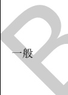</td><td style='text-align: center; word-wrap: break-word;'>抗震墙竖向和横向分布钢筋的配置，尚应符合下列规定：\n3 抗震墙竖向和横向分布钢筋的直径，均不宜大于墙厚的1/10且不应小于8 mm；</td><td style='text-align: center; word-wrap: break-word;'>关联\n高规(7.2.18)\n混规(11.7.15)\n抗规6.4.4-3条中的“竖向钢筋直径不宜小于10 mm”不做审查。</td><td style='text-align: center; word-wrap: break-word;'>完整</td></tr><tr><td colspan="2">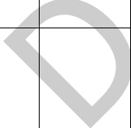</td><td style='text-align: center; word-wrap: break-word;'>要点</td><td style='text-align: center; word-wrap: break-word;'>抗震墙两端和洞口两侧应设置边缘构件，边缘构件包括暗柱、端柱和翼墙，并应符合下列要求：\n1 对于抗震墙结构，底层墙肢底截面的轴压比不大于GB 50011-2010中表6.4.5-1规定的一、二、三级抗震墙及四级抗震墙，墙肢两端可设置构造边缘构件，构造边缘构件的范围可按图6.4.5-1采用，构造边缘构件的配筋除应满足受弯承载力要求外，并宜符合表6.4.5-2的要求。</td><td style='text-align: center; word-wrap: break-word;'>关联\n高规表7.2.16\n混规表11.7.19\n此条仅判断构造边缘构件的配筋是否符合表6.4.5-2的要求，其余还需人工判断、校核。</td><td style='text-align: center; word-wrap: break-word;'>不完整\n1 审查范围不包含注2（拉筋的校审）。\n2 审查范围不包含注3（当端柱承受集中荷载时，其纵向钢筋、箍筋直径和间距应满足柱的相应要求）。</td></tr></table>

表B.4结构专业BIM智能审查条文表（续）

<table border=1 style='margin: auto; word-wrap: break-word;'><tr><td style='text-align: center; word-wrap: break-word;'>序号</td><td style='text-align: center; word-wrap: break-word;'>审查条文</td><td style='text-align: center; word-wrap: break-word;'>条文类型</td><td style='text-align: center; word-wrap: break-word;'>内容</td><td style='text-align: center; word-wrap: break-word;'>备注</td><td style='text-align: center; word-wrap: break-word;'>完整性</td></tr><tr><td style='text-align: center; word-wrap: break-word;'>14</td><td style='text-align: center; word-wrap: break-word;'>6.4.5-2</td><td style='text-align: center; word-wrap: break-word;'>要点</td><td style='text-align: center; word-wrap: break-word;'>抗震墙两端和洞口两侧应设置边缘构件，边缘构件包括暗柱、端柱和翼墙，并应符合下列要求：\n2 底层墙肢底截面的轴压比大于表6.4.5-1规定的一、二、三级抗震墙，以及部分框支抗震墙结构的抗震墙，应在底部加强部位及相邻的上一层设置约束边缘构件，在以上的其他部位可设置构造边缘构件。约束边缘构件沿墙肢的长度、配箍特征值、箍筋和纵向钢筋宜符合表6.4.5-3的要求(图6.4.5-2)。</td><td style='text-align: center; word-wrap: break-word;'>关联\n高规表7.2.15\n混规表11.7.18\n此条仅判断约束边缘构件的配筋是否符合表6.4.5-3的要求，其余还需人工判断、校核。</td><td style='text-align: center; word-wrap: break-word;'>不完整\n1 构件尺寸Lc未校审；\n2 未根据轴压比判断类型\n3 边缘构件类型提取自图纸和计算模型（图纸优先级高），未进行类型校核。</td></tr><tr><td style='text-align: center; word-wrap: break-word;'>15</td><td style='text-align: center; word-wrap: break-word;'>B.0.3-1</td><td style='text-align: center; word-wrap: break-word;'>要点</td><td style='text-align: center; word-wrap: break-word;'>高强混凝土框架的抗震构造措施，应符合下列要求：\n1 梁端纵向受拉钢筋的配筋率不宜大于3%(HRB335级钢筋)和2.6%(HRB400级钢筋)。梁端箍筋加密区的箍筋最小直径应比普通混凝土梁箍筋的最小直径增大2 mm。</td><td style='text-align: center; word-wrap: break-word;'>对应\n抗规(6.1.17)</td><td style='text-align: center; word-wrap: break-word;'>完整</td></tr><tr><td style='text-align: center; word-wrap: break-word;'>16</td><td style='text-align: center; word-wrap: break-word;'>B.0.3-2\n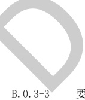</td><td style='text-align: center; word-wrap: break-word;'>要点</td><td style='text-align: center; word-wrap: break-word;'>高强混凝土框架的抗震构造措施，应符合下列要求：\n2 柱的轴压比限值宜按下列规定采用：不超过C60混凝土的柱可与普通混凝土柱相同，C65～C70混凝土的柱宜比普通混凝土柱减小0.05，C75～C80混凝土的柱宜比普通混凝土柱减小0.1。</td><td style='text-align: center; word-wrap: break-word;'>对应\n抗规(6.1.17)\n关联\n高规表6.4.2注2\n混规表11.4.16注2</td><td style='text-align: center; word-wrap: break-word;'>完整</td></tr><tr><td style='text-align: center; word-wrap: break-word;'>17</td><td style='text-align: center; word-wrap: break-word;'></td><td style='text-align: center; word-wrap: break-word;'>点</td><td style='text-align: center; word-wrap: break-word;'>高强混凝土框架的抗震构造措施，应符合下列要求：\n3 当混凝土强度等级大于C60时，柱纵向钢筋的最小总配筋率应比普通混凝土柱增大0.1%。</td><td style='text-align: center; word-wrap: break-word;'>对应\n抗规(6.1.17)</td><td style='text-align: center; word-wrap: break-word;'>完整</td></tr></table>

表B.4结构专业BIM智能审查条文表（续）

<table border=1 style='margin: auto; word-wrap: break-word;'><tr><td style='text-align: center; word-wrap: break-word;'>序号</td><td style='text-align: center; word-wrap: break-word;'>审查条文</td><td style='text-align: center; word-wrap: break-word;'>条文类型</td><td style='text-align: center; word-wrap: break-word;'>内容</td><td style='text-align: center; word-wrap: break-word;'>备注</td><td style='text-align: center; word-wrap: break-word;'>完整性</td></tr><tr><td style='text-align: center; word-wrap: break-word;'>18</td><td style='text-align: center; word-wrap: break-word;'>B. 0. 3-4</td><td style='text-align: center; word-wrap: break-word;'>要点</td><td style='text-align: center; word-wrap: break-word;'>高强混凝土框架的抗震构造措施，应符合下列要求：\n4 柱加密区的最小配箍特征值宜按下列规定采用；混凝土强度等级高于C60时，箍筋宜采用复合箍、复合螺旋箍或连续复合矩形螺旋箍。\n1) 轴压比不大于 0.6 时，宜比普通混凝土柱大 0.02；\n2) 轴压比大于 0.6 时，宜比普通混凝土柱大 0.03。</td><td style='text-align: center; word-wrap: break-word;'>对应\n抗规(6. 1. 17)</td><td style='text-align: center; word-wrap: break-word;'>完整</td></tr><tr><td colspan="6">注1：完整指该条文已完整拆解，无需人工复核。\n注2：不完整指该条文中某些部分条款尚未拆解，需人工进行复核。</td></tr></table>

[来源：GB 50011-2010(2016年版)]

表 B.5 结构专业 BIM 智能审查条文表

<table border=1 style='margin: auto; word-wrap: break-word;'><tr><td style='text-align: center; word-wrap: break-word;'>序号</td><td style='text-align: center; word-wrap: break-word;'>审查条文</td><td style='text-align: center; word-wrap: break-word;'>条文类型</td><td style='text-align: center; word-wrap: break-word;'>内容</td><td style='text-align: center; word-wrap: break-word;'>备注</td><td style='text-align: center; word-wrap: break-word;'>完整性</td></tr><tr><td style='text-align: center; word-wrap: break-word;'>1</td><td style='text-align: center; word-wrap: break-word;'>3.4.5</td><td style='text-align: center; word-wrap: break-word;'></td><td style='text-align: center; word-wrap: break-word;'>结构平面布置应减少扭转的影响。在考虑偶然偏心影响的规定水平地震力作用下，楼层竖向构件最大的水平位移和层间位移，A级高度高层建筑不宜大于该楼层平均值的1.2倍，不应大于该楼层平均值的1.5倍；B级高度高层建筑、超过A级高度的混合结构及本规程第10章所指的复杂高层建筑不宜大于该楼层平均值的1.2倍，不应大于该楼层平均值的1.4倍。\n结构扭转为主的第一自振周期Tt与平动为主的第一自振周期T1之比，A级高度高层建筑不应大于0.9，B级高度高层建筑、超过A级高度的混合结构及本规程第10章所指的复杂高层建筑不应大于0.85。\n注：当楼层的最大层间位移角不大于本规程第3.7.3条规定的限值的40%时，该楼层竖向构件的最大水平位移和层间位移与该楼层平均值的比值可适当放松，但不应大于1.6。</td><td style='text-align: center; word-wrap: break-word;'>关联抗规\n3.4.3-1(表\n3.4.3-1中的第1\n项)3.4.4-1-1\n1 高规3.4.5条\n中的周期比要求，在抗震规范中没\n有提及。\n2 高规3.4.5条\n注的内容还需人\n工判断、校核。</td><td style='text-align: center; word-wrap: break-word;'>完整</td></tr></table>

表B.5结构专业BIM智能审查条文表（续）

<table border=1 style='margin: auto; word-wrap: break-word;'><tr><td style='text-align: center; word-wrap: break-word;'>序号</td><td style='text-align: center; word-wrap: break-word;'>审查条文</td><td style='text-align: center; word-wrap: break-word;'>条文类型</td><td style='text-align: center; word-wrap: break-word;'>内容</td><td style='text-align: center; word-wrap: break-word;'>备注</td><td style='text-align: center; word-wrap: break-word;'>完整性</td></tr><tr><td style='text-align: center; word-wrap: break-word;'>2</td><td style='text-align: center; word-wrap: break-word;'>3.5.2-1</td><td style='text-align: center; word-wrap: break-word;'>要点</td><td style='text-align: center; word-wrap: break-word;'>抗震设计时，高层建筑相邻楼层的侧向刚度变化应符合下列规定：\n1 对框架结构，楼层与其相邻上层的侧向刚度比 $ \gamma_i $可按式（B.5）计算，且本层与相邻上层的比值不宜小于0.7，与相邻上部三层刚度平均值的比值不宜小于0.8。\n $ \gamma_1 = \frac{V_i \Delta_{i+1}}{V_{i+1} \Delta_i} $ ......(B.5)\n式中：\n $ \gamma_1 $——楼层侧向刚度比；\n $ V_i $、 $ V_{i+1} $——第i层和第i+1层的地震剪力标准（kN）；\n $ \Delta_i $、 $ \Delta_{i+1} $——第i层和第i+1层在地震剪力标准值作用下的层间位移（m）。</td><td style='text-align: center; word-wrap: break-word;'>关联\n抗规3.4.3-1\n（表3.4.3-2中的第1项）</td><td style='text-align: center; word-wrap: break-word;'>完整</td></tr><tr><td style='text-align: center; word-wrap: break-word;'>3</td><td style='text-align: center; word-wrap: break-word;'>3.5.2-2</td><td style='text-align: center; word-wrap: break-word;'>要点</td><td style='text-align: center; word-wrap: break-word;'>抗震设计时，高层建筑相邻楼层的侧向刚度变化应符合下列规定：\n2 对框架-剪力墙结构、板柱-剪力墙结构、剪力墙结构、框架-核心筒结构、筒中筒结构，楼层与其相邻上层的侧向刚度比  $ \gamma_i $可按式（B.6）计算，且本层与相邻上层的比值不宜小于0.9；当本层层高于相邻上层层高的1.5倍时，该比值不宜小于1.1；对于结构底部嵌固层，该比值不宜小于1.5。\n $ \gamma_2 = \frac{V_i \Delta_{i+1}}{V_{i+1} \Delta_i} \frac{\Delta_i}{\Delta_{i+1}} $ ......(B.6)\n式中：\n $ \gamma_2 $——考虑层高修正的楼层侧向刚度比。</td><td style='text-align: center; word-wrap: break-word;'>“对于结构底部嵌固层，该比值不宜小于1.5”用于：\n没有（或者不带）地下室情况下的底层；\n有地下室且嵌固在基础顶面情况下的地下室底层。</td><td style='text-align: center; word-wrap: break-word;'>完整</td></tr><tr><td style='text-align: center; word-wrap: break-word;'>4</td><td style='text-align: center; word-wrap: break-word;'>3.5.3</td><td style='text-align: center; word-wrap: break-word;'>一般</td><td style='text-align: center; word-wrap: break-word;'>A级高度高层建筑的楼层抗侧力结构的层间受剪承载力不宜小于其相邻上一层受剪承载力的80%，不应小于其相邻上一层受剪承载力的65%；B级高度高层建筑的楼层抗侧力结构的层间受剪承载力不应小于其相邻上一层受剪承载力的75%。</td><td style='text-align: center; word-wrap: break-word;'>关联\n抗规\n3.4.3-1（表3.4.3-2中的第3项）（3.4.4-2-3）</td><td style='text-align: center; word-wrap: break-word;'>完整</td></tr><tr><td style='text-align: center; word-wrap: break-word;'>5</td><td style='text-align: center; word-wrap: break-word;'>3.5.6</td><td style='text-align: center; word-wrap: break-word;'>一般</td><td style='text-align: center; word-wrap: break-word;'>楼层质量沿高度宜均匀分布，楼层质量不宜大于相邻下部楼层质量的1.5倍。</td><td style='text-align: center; word-wrap: break-word;'>规范一般是指主要结构楼层，但输出结果是所有楼层（含地下室、屋顶小塔楼），需人工判断、校核。</td><td style='text-align: center; word-wrap: break-word;'>完整</td></tr></table>

表B.5结构专业BIM智能审查条文表（续）

<table border=1 style='margin: auto; word-wrap: break-word;'><tr><td style='text-align: center; word-wrap: break-word;'>序号</td><td style='text-align: center; word-wrap: break-word;'>审查条文</td><td style='text-align: center; word-wrap: break-word;'>条文类型</td><td style='text-align: center; word-wrap: break-word;'>内容</td><td style='text-align: center; word-wrap: break-word;'>备注</td><td style='text-align: center; word-wrap: break-word;'>完整性</td></tr><tr><td style='text-align: center; word-wrap: break-word;'>6</td><td style='text-align: center; word-wrap: break-word;'>3.7.3-1</td><td style='text-align: center; word-wrap: break-word;'>要点</td><td style='text-align: center; word-wrap: break-word;'>按弹性方法计算的风荷载或多遇地震标准值作用下的楼层层间最大水平位移与层高之比  $ \Delta u/h $宜符合下列规定：\n1 高度不大于150 m的高层建筑，其楼层层间最大位移与层高之比  $ \Delta u/h $不宜大于JGJ 3-2010中表3.7.3的限值。</td><td style='text-align: center; word-wrap: break-word;'>关联\n抗规(5.5.1)\n建筑高度从室外地坪算起。\n抗规5.5.1条是要点，因此高规3.7.3-1条列为要点。</td><td style='text-align: center; word-wrap: break-word;'>完整</td></tr><tr><td style='text-align: center; word-wrap: break-word;'>7</td><td style='text-align: center; word-wrap: break-word;'>3.7.3-2</td><td style='text-align: center; word-wrap: break-word;'>一般</td><td style='text-align: center; word-wrap: break-word;'>按弹性方法计算的风荷载或多遇地震标准值作用下的楼层层间最大水平位移与层高之比  $ \Delta u/h $宜符合下列规定：\n2 高度不小于250 m的高层建筑，其楼层层间最大位移与层高之比  $ \Delta u/h $不宜大于1/500。</td><td style='text-align: center; word-wrap: break-word;'>建筑高度从室外地坪算起。</td><td style='text-align: center; word-wrap: break-word;'>完整</td></tr><tr><td style='text-align: center; word-wrap: break-word;'>8</td><td style='text-align: center; word-wrap: break-word;'>3.7.3-3</td><td style='text-align: center; word-wrap: break-word;'>一般</td><td style='text-align: center; word-wrap: break-word;'>按弹性方法计算的风荷载或多遇地震标准值作用下的楼层层间最大水平位移与层高之比  $ \Delta u/h $宜符合下列规定：\n3 高度在150 m～250 m之间的高层建筑，其楼层层间最大位移与层高之比  $ \Delta u/h $的限值可按本条第1款和第2款的限值线性插入取用。</td><td style='text-align: center; word-wrap: break-word;'>建筑高度从室外地坪算起。</td><td style='text-align: center; word-wrap: break-word;'>完整</td></tr><tr><td style='text-align: center; word-wrap: break-word;'>9</td><td style='text-align: center; word-wrap: break-word;'>3.7.6</td><td style='text-align: center; word-wrap: break-word;'>一般</td><td style='text-align: center; word-wrap: break-word;'>房屋高度不小于150 m的高层混凝土建筑结构应满足风振舒适度要求。在现行国家标准GB 50009规定的十年一遇的风荷载标准值作用下，结构顶点的顺风向和横风向振动最大加速度计算值不应超过JGJ 3-2010中表3.7.6的限值。</td><td style='text-align: center; word-wrap: break-word;'>建筑高度从室外地坪算起。</td><td style='text-align: center; word-wrap: break-word;'>完整</td></tr><tr><td style='text-align: center; word-wrap: break-word;'>10</td><td style='text-align: center; word-wrap: break-word;'>3.10.2-3</td><td style='text-align: center; word-wrap: break-word;'>一般</td><td style='text-align: center; word-wrap: break-word;'>特一级框架柱应符合下列规定：\n3 钢筋混凝土框架柱柱端加密区最小配箍特征值 $ \lambda $，应按本规程表6.4.7规定的数值增加0.02采用；全部纵向钢筋构造配筋百分率，中、边柱不应小于1.4%，角柱不应小于1.6%。</td><td style='text-align: center; word-wrap: break-word;'>-</td><td style='text-align: center; word-wrap: break-word;'>完整</td></tr><tr><td style='text-align: center; word-wrap: break-word;'>11</td><td style='text-align: center; word-wrap: break-word;'>3.10.4-3</td><td style='text-align: center; word-wrap: break-word;'>一般</td><td style='text-align: center; word-wrap: break-word;'>特一级框架柱应符合下列规定：\n3 钢筋混凝土柱柱端加密区最小配箍特征值  $ \lambda $。应按本规程表6.4.7规定的数值增大0.03采用，且箍筋体积配箍率不应小于1.6%；全部纵向钢筋最小构造配筋百分率取1.6%。</td><td style='text-align: center; word-wrap: break-word;'>-</td><td style='text-align: center; word-wrap: break-word;'>不完整\n菱形箍、圆柱不支持。</td></tr><tr><td style='text-align: center; word-wrap: break-word;'>12</td><td style='text-align: center; word-wrap: break-word;'>3.10.5-2</td><td style='text-align: center; word-wrap: break-word;'>一般</td><td style='text-align: center; word-wrap: break-word;'>特一级剪力墙、筒体墙应符合下列规定：\n2 一般部位的水平和竖向分布钢筋最小配筋率应取为0.35%，底部加强部位的水平和竖向分布钢筋的最小配筋率应取为0.40%。</td><td style='text-align: center; word-wrap: break-word;'>-</td><td style='text-align: center; word-wrap: break-word;'>不完整\n该条文审查未考虑筒体墙。</td></tr></table>

表B.5结构专业BIM智能审查条文表（续）

<table border=1 style='margin: auto; word-wrap: break-word;'><tr><td style='text-align: center; word-wrap: break-word;'>序号</td><td style='text-align: center; word-wrap: break-word;'>审查条文</td><td style='text-align: center; word-wrap: break-word;'>条文类型</td><td style='text-align: center; word-wrap: break-word;'>内容</td><td style='text-align: center; word-wrap: break-word;'>备注</td><td style='text-align: center; word-wrap: break-word;'>完整性</td></tr><tr><td style='text-align: center; word-wrap: break-word;'>13</td><td style='text-align: center; word-wrap: break-word;'>3.10.5-3</td><td style='text-align: center; word-wrap: break-word;'>一般</td><td style='text-align: center; word-wrap: break-word;'>特一级剪力墙、筒体墙应符合下列规定：\n3 约束边缘构件纵向钢筋最小构造配筋率应取为1.4%，配箍特征值宜增大20%；构造边缘构件纵向钢筋的配筋率不应小于1.2%。</td><td style='text-align: center; word-wrap: break-word;'>-</td><td style='text-align: center; word-wrap: break-word;'>不完整\n该条文审查未考虑筒体墙。</td></tr><tr><td style='text-align: center; word-wrap: break-word;'>14</td><td style='text-align: center; word-wrap: break-word;'>5.1.13-1</td><td style='text-align: center; word-wrap: break-word;'>一般</td><td style='text-align: center; word-wrap: break-word;'>各振型参与质量之和不小于总质量的90%。</td><td style='text-align: center; word-wrap: break-word;'>高规5.1.13-1\n条仅针对B级高度、混合结构、复杂高层，但程序对所有结构均判断，并输出至计算书中。</td><td style='text-align: center; word-wrap: break-word;'>不完整\n审查范围仅包含各阵型参与质量之和不小于总质量的90%。</td></tr><tr><td style='text-align: center; word-wrap: break-word;'>15</td><td style='text-align: center; word-wrap: break-word;'>5.4.1-1</td><td style='text-align: center; word-wrap: break-word;'>一般\n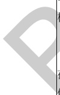</td><td style='text-align: center; word-wrap: break-word;'>当高层建筑结构满足下列规定时，弹性计算分析时可不考虑重力二阶效应的不利影响。\n1 剪力墙结构、框架-剪力墙结构、板柱剪力墙结构、筒体结构：\n $ EJ_d \ge 2.7H^2 \sum_{i=1}^{n} G_i $ ......(B.7)\n式中：\n $ EJ_d $——结构一个主轴方向的弹性等效侧向刚度，可按倒三角形分布荷载作用下结构顶点位移相等的原则，将结构的侧向刚度折算为竖向悬臂受弯构件的等效侧向刚度；\n $ H $——房屋高度；\n $ G_i $——第i楼层重力荷载设计值，取1.2倍的永久荷载标准值与1.4倍的楼面可变荷载标准值的组合值；\n $ n $——结构计算总层数。</td><td style='text-align: center; word-wrap: break-word;'>以刚重比的验算结果输出至计算书中。</td><td style='text-align: center; word-wrap: break-word;'>完整</td></tr><tr><td style='text-align: center; word-wrap: break-word;'>16</td><td style='text-align: center; word-wrap: break-word;'>5.4.1-2</td><td style='text-align: center; word-wrap: break-word;'>一般</td><td style='text-align: center; word-wrap: break-word;'>当高层建筑结构满足下列规定时，弹性计算分析时可不考虑重力二阶效应的不利影响。\n2 框架结构：\n $ D_i \ge 20 \sum_{i=1}^{n} G_j / h_i $ ......(B.8)\n式中：\n $ h_i $——第i楼层层高；\n $ D_i $——第i楼层的弹性等效侧向刚度，可取该层剪力与层间位移的比值；\n $ G_j $——第j楼层重力荷载设计值，取1.2倍的永久荷载标准值与1.4倍的楼面可变荷载标准值的组合值；\n $ n $——结构计算总层数。</td><td style='text-align: center; word-wrap: break-word;'>以刚重比的验算结果输出至计算书中。</td><td style='text-align: center; word-wrap: break-word;'>完整</td></tr></table>

表B.5结构专业BIM智能审查条文表（续）

<table border=1 style='margin: auto; word-wrap: break-word;'><tr><td style='text-align: center; word-wrap: break-word;'>序号</td><td style='text-align: center; word-wrap: break-word;'>审查条文</td><td style='text-align: center; word-wrap: break-word;'>条文类型</td><td style='text-align: center; word-wrap: break-word;'>内容</td><td style='text-align: center; word-wrap: break-word;'>备注</td><td style='text-align: center; word-wrap: break-word;'>完整性</td></tr><tr><td style='text-align: center; word-wrap: break-word;'>17</td><td style='text-align: center; word-wrap: break-word;'>6.3.3-1</td><td style='text-align: center; word-wrap: break-word;'>一般</td><td style='text-align: center; word-wrap: break-word;'>（框架）梁的纵向钢筋配置，尚应符合下列规定：\n1 抗震设计时，梁端纵向受拉钢筋的配筋率不宜大于2.5%，不应大于2.75%；当梁端受拉钢筋的配筋率大于2.5%时，受压钢筋的配筋率不应小于受拉钢筋的一半。</td><td style='text-align: center; word-wrap: break-word;'>关联\n抗规(6.3.4-1)\n混规(11.3.7)</td><td style='text-align: center; word-wrap: break-word;'>完整</td></tr><tr><td style='text-align: center; word-wrap: break-word;'>18</td><td style='text-align: center; word-wrap: break-word;'>6.3.3-2</td><td style='text-align: center; word-wrap: break-word;'>一般</td><td style='text-align: center; word-wrap: break-word;'>框架梁的纵向钢筋配置，尚应符合下列规定：\n2 沿梁全长顶面和底面应至少各配置两根纵向配筋，一、二级抗震设计时钢筋直径不应小于14 mm，且分别不应小于梁两端顶面和底面纵向配筋中较大截面面积的1/4；三、四级抗震设计和非抗震设计时钢筋直径不应小于12 mm。</td><td style='text-align: center; word-wrap: break-word;'>关联\n抗规(6.3.4-1)\n混规(11.3.7)\n架立筋不在本条审查范围内。</td><td style='text-align: center; word-wrap: break-word;'>完整</td></tr><tr><td style='text-align: center; word-wrap: break-word;'>19</td><td style='text-align: center; word-wrap: break-word;'>6.3.5-1</td><td style='text-align: center; word-wrap: break-word;'>一般</td><td style='text-align: center; word-wrap: break-word;'>抗震设计时，框架梁的箍筋尚应符合下列构造要求：\n1 沿梁全长箍筋的面积配筋率应符合下列规定：\n一级  $ \rho_{sv} \ge 0.30f_t/f_{yv} $ ......(B.9)\n二级  $ \rho_{sv} \ge 0.28f_t/f_{yv} $ ......(B.10)\n三级、四级  $ \rho_{sv} \ge 0.26f_t/f_{yv} $ ......(B.11)\n式中：\n $ \rho_{sv} $——框架梁沿梁全长箍筋的面积配筋率。</td><td style='text-align: center; word-wrap: break-word;'>关联\n混规(11.3.9)</td><td style='text-align: center; word-wrap: break-word;'>完整</td></tr><tr><td style='text-align: center; word-wrap: break-word;'>20</td><td style='text-align: center; word-wrap: break-word;'>6.3.5-2</td><td style='text-align: center; word-wrap: break-word;'></td><td style='text-align: center; word-wrap: break-word;'>抗震设计时，框架梁的箍筋尚应符合下列构造要求：\n2 在箍筋加密区范围内的箍筋肢距：一级不宜大于200 mm和20倍箍筋直径的较大值，二、三级不宜大于250 mm和20倍箍筋直径的较大值，四级不宜大于300 mm。</td><td style='text-align: center; word-wrap: break-word;'>关联\n抗规(6.3.4-3)\n混规(11.3.8)</td><td style='text-align: center; word-wrap: break-word;'>完整</td></tr><tr><td colspan="3">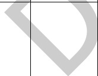</td><td rowspan="2">柱的纵向钢筋配置，尚应满足下列规定：\n2 截面尺寸大于400 mm的柱，一、二、三级抗震设计时其纵向钢筋间距不宜大于200 mm；抗震等级为四级和非抗震设计时，柱纵向钢筋间距不宜大于300 mm；柱纵向钢筋净距均不应小于50 mm。</td><td rowspan="2">关联\n抗规(6.3.8-2)\n混规(11.4.13)\n混规(9.3.1-2)\n（此条是要点）\n有与混规\n9.3.1-2条重复的地方；\n混规(9.3.1-2条：柱中纵向钢筋的净间距不应小于50 mm，且不宜大于300 mm。</td><td rowspan="2">完整</td></tr><tr><td style='text-align: center; word-wrap: break-word;'>21</td><td style='text-align: center; word-wrap: break-word;'>6.4.4-2</td><td style='text-align: center; word-wrap: break-word;'>一般</td></tr></table>

表B.5结构专业BIM智能审查条文表（续）

<table border=1 style='margin: auto; word-wrap: break-word;'><tr><td style='text-align: center; word-wrap: break-word;'>序号</td><td style='text-align: center; word-wrap: break-word;'>审查条文</td><td style='text-align: center; word-wrap: break-word;'>条文类型</td><td style='text-align: center; word-wrap: break-word;'>内容</td><td style='text-align: center; word-wrap: break-word;'>备注</td><td style='text-align: center; word-wrap: break-word;'>完整性</td></tr><tr><td style='text-align: center; word-wrap: break-word;'>22</td><td style='text-align: center; word-wrap: break-word;'>6.4.4-3</td><td style='text-align: center; word-wrap: break-word;'>一般</td><td style='text-align: center; word-wrap: break-word;'>柱的纵向钢筋配置，尚应满足下列规定：\n3 全部纵向钢筋的配筋率，非抗震设计时不宜大于5%、不应大于6%，抗震设计时不应大于5%。\n</td><td style='text-align: center; word-wrap: break-word;'>关联\n抗规(6.3.8-3)\n混规(11.4.13)\n混规9.3.1-1\n（此条是要点）\n有与混规\n9.3.1-1条重复的地方；\n混规9.3.1-1\n条：纵向受力钢筋直径不宜小于12mm，全部纵向钢筋的配筋率不宜大于5%。</td><td style='text-align: center; word-wrap: break-word;'>完整</td></tr><tr><td style='text-align: center; word-wrap: break-word;'>23</td><td style='text-align: center; word-wrap: break-word;'>6.4.4-4</td><td style='text-align: center; word-wrap: break-word;'>一般</td><td style='text-align: center; word-wrap: break-word;'>柱的纵向钢筋配置，尚应满足下列规定：\n4 一级且剪跨比不大于2的柱，其单侧纵向受拉钢筋的配筋率不宜大于1.2%。</td><td style='text-align: center; word-wrap: break-word;'>关联\n抗规(6.3.8-3)\n混规(11.4.13)</td><td style='text-align: center; word-wrap: break-word;'>完整</td></tr><tr><td style='text-align: center; word-wrap: break-word;'>24</td><td style='text-align: center; word-wrap: break-word;'>7.2.2-1</td><td style='text-align: center; word-wrap: break-word;'>要点</td><td style='text-align: center; word-wrap: break-word;'>抗震设计时，短肢剪力墙的设计应符合下列规定：\n1 短肢剪力墙截面厚度除应符合本规程第7.2.1条的要求外，底部加强部位尚不应小于200 mm，其他部位尚不应小于180 mm。</td><td style='text-align: center; word-wrap: break-word;'>-</td><td style='text-align: center; word-wrap: break-word;'>完整</td></tr><tr><td style='text-align: center; word-wrap: break-word;'>25</td><td style='text-align: center; word-wrap: break-word;'>7.2.2-2</td><td style='text-align: center; word-wrap: break-word;'>要点</td><td style='text-align: center; word-wrap: break-word;'>抗震设计时，短肢剪力墙的设计应符合下列规定：\n2 一、二、三级短肢剪力墙的轴压比，分别不宜大于0.45、0.50、0.55，一字形截面短肢剪力墙的轴压比限值应相应减少0.1。</td><td style='text-align: center; word-wrap: break-word;'>-</td><td style='text-align: center; word-wrap: break-word;'>不完整\n未考虑一字形短肢剪力墙。</td></tr><tr><td style='text-align: center; word-wrap: break-word;'>26</td><td colspan="2">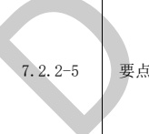</td><td style='text-align: center; word-wrap: break-word;'>抗震设计时，短肢剪力墙的设计应符合下列规定：\n5 短肢剪力墙的全部竖向钢筋的配筋率，底部加强部位一、二级不宜小于1.2%，三、四级不宜小于1.0%；其他部位一、二级不宜小于1.0%，三、四级不宜小于0.8%。</td><td style='text-align: center; word-wrap: break-word;'>-</td><td style='text-align: center; word-wrap: break-word;'>完整</td></tr><tr><td style='text-align: center; word-wrap: break-word;'>27</td><td style='text-align: center; word-wrap: break-word;'>7.2.16-4</td><td style='text-align: center; word-wrap: break-word;'>一般</td><td style='text-align: center; word-wrap: break-word;'>抗震设计时，对于连体结构、错层结构以及B级高度高层建筑结构中的剪力墙（筒体），其构造边缘构件的最小配筋应符合下列要求：\n1）竖向钢筋最小量应比表7.2.16中的数值提高0.001Ac采用；\n2）箍筋的配筋范围宜取图7.2.16中阴影部分，其配箍特征值  $ \lambda v $ 不宜小于0.1。</td><td style='text-align: center; word-wrap: break-word;'>-</td><td style='text-align: center; word-wrap: break-word;'>完整</td></tr></table>

表B.5结构专业BIM智能审查条文表（续）

<table border=1 style='margin: auto; word-wrap: break-word;'><tr><td style='text-align: center; word-wrap: break-word;'>序号</td><td style='text-align: center; word-wrap: break-word;'>审查条文</td><td style='text-align: center; word-wrap: break-word;'>条文类型</td><td style='text-align: center; word-wrap: break-word;'>内容</td><td style='text-align: center; word-wrap: break-word;'>备注</td><td style='text-align: center; word-wrap: break-word;'>完整性</td></tr><tr><td style='text-align: center; word-wrap: break-word;'>28</td><td style='text-align: center; word-wrap: break-word;'>7.2.24</td><td style='text-align: center; word-wrap: break-word;'>一般</td><td style='text-align: center; word-wrap: break-word;'>跨高比（ $ 1/h_{{0}} $）不大于1.5的连梁，非抗震设计时，其纵向钢筋的最小配筋率可取为0.2%；抗震设计时，其纵向钢筋的最小配筋率宜符合JGJ 3-2010中表7.2.24的要求；跨高比大于1.5的连梁，其纵向钢筋的最小配筋率可按框架梁的要求采用。</td><td style='text-align: center; word-wrap: break-word;'>-</td><td style='text-align: center; word-wrap: break-word;'>完整</td></tr><tr><td style='text-align: center; word-wrap: break-word;'>29</td><td style='text-align: center; word-wrap: break-word;'>7.2.25</td><td style='text-align: center; word-wrap: break-word;'>一般</td><td style='text-align: center; word-wrap: break-word;'>剪力墙结构连梁中，非抗震设计时，顶面及底面单侧纵向钢筋的最大配筋率不宜大于2.5%；抗震设计时，顶面及底面单侧纵向钢筋的最大配筋率宜符合JGJ 3-2010中表7.2.25的要求。如不满足，则应按实配钢筋进行连梁强剪弱弯的验算。</td><td style='text-align: center; word-wrap: break-word;'>-</td><td style='text-align: center; word-wrap: break-word;'>不完整\n未考虑强剪弱弯验算。</td></tr><tr><td style='text-align: center; word-wrap: break-word;'>30</td><td style='text-align: center; word-wrap: break-word;'>7.2.27-2</td><td style='text-align: center; word-wrap: break-word;'>要点</td><td style='text-align: center; word-wrap: break-word;'>连梁的配筋构造应符合下列规定：\n2 抗震设计时，沿连梁全长箍筋的构造应符合本规程第6.3.2条框架梁端箍筋加密区的箍筋构造要求；非抗震设计时，沿连梁全长的箍筋直径不应小于6 mm，间距不应大于150 mm。</td><td style='text-align: center; word-wrap: break-word;'>-</td><td style='text-align: center; word-wrap: break-word;'>完整</td></tr><tr><td style='text-align: center; word-wrap: break-word;'>31</td><td style='text-align: center; word-wrap: break-word;'>7.2.27-4</td><td style='text-align: center; word-wrap: break-word;'></td><td style='text-align: center; word-wrap: break-word;'></td><td style='text-align: center; word-wrap: break-word;'>关联\n混规\n(11.7.11-5)\n1 混规\n11.7.11-5条：“当梁的腹板高度 $ h_{{v}} $不小于450 mm时，其两侧面沿梁高范围设置的纵向构造钢筋的直径不应小于8 mm，间距不应大于200 mm；\n其表述与高规7.2.27-4条略有不同：\n2 腰筋总配筋率的计算公式中，面积按照腹板高度 $ h_{{v}} $计算。</td><td style='text-align: center; word-wrap: break-word;'>完整</td></tr></table>

表B.5结构专业BIM智能审查条文表（续）

<table border=1 style='margin: auto; word-wrap: break-word;'><tr><td style='text-align: center; word-wrap: break-word;'>序号</td><td style='text-align: center; word-wrap: break-word;'>审查条文</td><td style='text-align: center; word-wrap: break-word;'>条文类型</td><td style='text-align: center; word-wrap: break-word;'>内容</td><td style='text-align: center; word-wrap: break-word;'>备注</td><td style='text-align: center; word-wrap: break-word;'>完整性</td></tr><tr><td style='text-align: center; word-wrap: break-word;'>32</td><td style='text-align: center; word-wrap: break-word;'>8.1.3-1</td><td style='text-align: center; word-wrap: break-word;'>要点</td><td style='text-align: center; word-wrap: break-word;'>抗震设计的框架-剪力墙结构，应根据在规定的水平力作用下结构底层框架部分承受的地震倾覆力矩与结构总地震倾覆力矩的比值，确定相应的设计方法，并应符合下列规定：\n1 框架部分承受的地震倾覆力矩不大于结构总地震倾覆力矩的10%时，按剪力墙结构进行设计，其中的框架部分应按框架-剪力墙结构的框架进行设计；</td><td style='text-align: center; word-wrap: break-word;'>仅输出至计算书中。</td><td style='text-align: center; word-wrap: break-word;'>完整</td></tr><tr><td style='text-align: center; word-wrap: break-word;'>33</td><td style='text-align: center; word-wrap: break-word;'>8.1.3-2</td><td style='text-align: center; word-wrap: break-word;'>要点</td><td style='text-align: center; word-wrap: break-word;'>抗震设计的框架-剪力墙结构，应根据在规定的水平力作用下结构底层框架部分承受的地震倾覆力矩与结构总地震倾覆力矩的比值，确定相应的设计方法，并应符合下列规定：\n2 当框架部分承受的地震倾覆力矩大于结构总地震倾覆力矩的10%但不大于50%时，按框架-剪力墙结构进行设计；</td><td style='text-align: center; word-wrap: break-word;'>仅输出至计算书中。</td><td style='text-align: center; word-wrap: break-word;'>完整</td></tr><tr><td style='text-align: center; word-wrap: break-word;'>34</td><td style='text-align: center; word-wrap: break-word;'>8.1.3-3</td><td style='text-align: center; word-wrap: break-word;'>要点\n</td><td style='text-align: center; word-wrap: break-word;'>抗震设计的框架-剪力墙结构，应根据在规定的水平力作用下结构底层框架部分承受的地震倾覆力矩与结构总地震倾覆力矩的比值，确定相应的设计方法，并应符合下列规定：\n3 当框架部分承受的地震倾覆力矩大于结构总地震倾覆力矩的50%但不大于80%时，按框架-剪力墙结构进行设计，其最大适用高度可比框架结构适当增加，框架部分的抗震等级和轴压比限值宜按框架结构的规定采用；</td><td style='text-align: center; word-wrap: break-word;'>仅输出至计算书中。</td><td style='text-align: center; word-wrap: break-word;'>完整</td></tr><tr><td style='text-align: center; word-wrap: break-word;'>35</td><td style='text-align: center; word-wrap: break-word;'>8.1.3-4</td><td style='text-align: center; word-wrap: break-word;'>要点</td><td style='text-align: center; word-wrap: break-word;'>抗震设计的框架-剪力墙结构，应根据在规定的水平力作用下结构底层框架部分承受的地震倾覆力矩与结构总地震倾覆力矩的比值，确定相应的设计方法，并应符合下列规定：\n4 当框架部分承受的地震倾覆力矩大于结构总地震倾覆力矩的80%时，按框架-剪力墙结构进行设计，但其最大适用高度宜按框架结构采用，框架部分的抗震等级和轴压比限值应按框架结构的规定采用。</td><td style='text-align: center; word-wrap: break-word;'>仅输出至计算书中。</td><td style='text-align: center; word-wrap: break-word;'>完整</td></tr><tr><td style='text-align: center; word-wrap: break-word;'>36</td><td style='text-align: center; word-wrap: break-word;'>8.1.10</td><td style='text-align: center; word-wrap: break-word;'>要点</td><td style='text-align: center; word-wrap: break-word;'>抗风设计时，板柱-剪力墙结构中各层筒体或剪力墙应能承担不小于80%相应方向该层承担的风荷载作用下的剪力；抗震设计时，应能承担各层全部相应方向该层承担的地震剪力，而各层板柱部分尚应能承担不小于20%相应方向该层承担的地震剪力，且应符合有关抗震构造要求。</td><td style='text-align: center; word-wrap: break-word;'>关联\n抗6.6.3-1\n仅输出至计算书中。</td><td style='text-align: center; word-wrap: break-word;'>不完整\n未考虑抗风设计。</td></tr></table>

表B.5结构专业BIM智能审查条文表（续）

<table border=1 style='margin: auto; word-wrap: break-word;'><tr><td style='text-align: center; word-wrap: break-word;'>序号</td><td style='text-align: center; word-wrap: break-word;'>审查条文</td><td style='text-align: center; word-wrap: break-word;'>条文类型</td><td style='text-align: center; word-wrap: break-word;'>内容</td><td style='text-align: center; word-wrap: break-word;'>备注</td><td style='text-align: center; word-wrap: break-word;'>完整性</td></tr><tr><td style='text-align: center; word-wrap: break-word;'>37</td><td style='text-align: center; word-wrap: break-word;'>9.1.11-29.1.11-3</td><td style='text-align: center; word-wrap: break-word;'>要点</td><td style='text-align: center; word-wrap: break-word;'>抗震设计时，筒体结构的框架部分按侧向刚度分配的楼层地震剪力标准值应符合下列规定：\n2 当框架部分分配的地震剪力标准值的最大值小于结构底部总地震剪力标准值的10%时，各层框架部分承担的地震剪力标准值应增大到结构底部总地震剪力标准的15%；此时，各层核心筒墙体的地震剪力标准值宜乘以增大系数1.1，但可不大于结构底部总地震剪力标准值，墙体的抗震构造措施应按抗震等级提高一级后采用，已为特一级的可不再提高。\n3 当框架部分分配的地震剪力标准值小于结构底部总地震剪力标准值的20%，但其最大值不小于结构底部总地震剪力标准值的10%时，应按结构底部总地震剪力标准值的20%和框架部分楼层地震剪力标准值中最大值的1.5倍二者的较小值进行调整。</td><td style='text-align: center; word-wrap: break-word;'>仅输出至计算书中。\n高规9.1.11-2条中的“墙体的抗震构造措施应按抗震等级提高一级”需人工校验。</td><td style='text-align: center; word-wrap: break-word;'>完整</td></tr><tr><td style='text-align: center; word-wrap: break-word;'>38</td><td style='text-align: center; word-wrap: break-word;'>10.2.11-7</td><td style='text-align: center; word-wrap: break-word;'>要点</td><td style='text-align: center; word-wrap: break-word;'>转换柱设计尚应符合下列规定：\n7 纵向钢筋间距均不应小于80 mm，且抗震设计时不宜大于200 mm，非抗震设计时不宜大于250 mm；\n抗震设计时，柱内全部纵向钢筋配筋率不宜大于4.0%。</td><td style='text-align: center; word-wrap: break-word;'>-</td><td style='text-align: center; word-wrap: break-word;'>完整</td></tr><tr><td style='text-align: center; word-wrap: break-word;'>39</td><td style='text-align: center; word-wrap: break-word;'>10.2.16-7</td><td style='text-align: center; word-wrap: break-word;'>要点</td><td style='text-align: center; word-wrap: break-word;'>部分框支剪力墙结构的布置应符合下列规定：\n7 框支框架承担的地震倾覆力矩应小于结构总地震倾覆力矩的50%；</td><td style='text-align: center; word-wrap: break-word;'>关联\n抗规6.1.9-4</td><td style='text-align: center; word-wrap: break-word;'>完整</td></tr></table>

表B.5结构专业BIM智能审查条文表（续）

<table border=1 style='margin: auto; word-wrap: break-word;'><tr><td style='text-align: center; word-wrap: break-word;'>序号</td><td style='text-align: center; word-wrap: break-word;'>审查条文</td><td style='text-align: center; word-wrap: break-word;'>条文类型</td><td style='text-align: center; word-wrap: break-word;'>内容</td><td style='text-align: center; word-wrap: break-word;'>备注</td><td style='text-align: center; word-wrap: break-word;'>完整性</td></tr><tr><td style='text-align: center; word-wrap: break-word;'>40</td><td style='text-align: center; word-wrap: break-word;'>E. 0.1</td><td style='text-align: center; word-wrap: break-word;'>一般</td><td style='text-align: center; word-wrap: break-word;'>当转换层设置在1、2层时，可近似采用转换层与其相邻上层结构的等效剪切刚度比  $ \gamma_{{e1}} $表示转换层上、下层结构刚度的变化， $ \gamma_{{e1}} $宜接近1，非抗震设计时  $ \gamma_{{e1}} $不应小于0.4，抗震设计时  $ \gamma_{{e1}} $不应小于0.5。\n $ \gamma_{{e1}} $可按下列公式计算：\n $  \gamma_{{e1}} = \frac{{G_{{1}}A_{{1}}}}{{G_{{2}}A_{{2}}}} \times \frac{{h_{{2}}}}{h_{{1}}}}  $  $ \cdots $(B. 12)\n $  A_{{i}} = A_{{w,i}} + \sum_{{j}} C_{{i,j}} A_{{c,i,j}}  $ （ $ i=1,2 $)  $ \cdots $(B. 13)\n $  C_{{i,j}} = 2.5 \left( \frac{{h_{{c,i,j}}}}{{h_{{i}}}} \right)^{{2}}  $ （ $ i=1,2 $)  $ \cdots $(B. 14)\n\n式中：\n $ G_{{1}} $、 $ G_{{2}} $——分别为转换层和转换层上层的混凝土剪变模量；\n $ A_{{1}} $、 $ A_{{2}} $——分别为转换层和转换层上层的折算抗剪截面面积，可按式（E. 0.1-2）计算；\n $ A_{{w,i}} $——第i层全部剪力墙在计算方向的有效截面面积（不包括翼缘面积）；\n $ A_{{c,i,j}} $——第i层第j根柱的截面面积；\n $ h_{{i}} $——第i层的层高；\n $ h_{{c,i,j}} $——第i层第j根柱沿计算方向的截面高度；\n $ C_{{i,j}} $——第i层第j根柱截面面积折算系数，当计算值大于1时取1。</td><td style='text-align: center; word-wrap: break-word;'>对应\n高规(10.2.3)\n仅输出至计算书中。</td><td style='text-align: center; word-wrap: break-word;'>完整</td></tr></table>

表B.5结构专业BIM智能审查条文表（续）

<table border=1 style='margin: auto; word-wrap: break-word;'><tr><td style='text-align: center; word-wrap: break-word;'>序号</td><td style='text-align: center; word-wrap: break-word;'>审查条文</td><td style='text-align: center; word-wrap: break-word;'>条文类型</td><td style='text-align: center; word-wrap: break-word;'>内容</td><td style='text-align: center; word-wrap: break-word;'>备注</td><td style='text-align: center; word-wrap: break-word;'>完整性</td></tr><tr><td style='text-align: center; word-wrap: break-word;'>41</td><td style='text-align: center; word-wrap: break-word;'>E. 0.3</td><td style='text-align: center; word-wrap: break-word;'>一般</td><td style='text-align: center; word-wrap: break-word;'>当转换层设置在第2层以上时，尚宜采用剪弯刚度计算转换层下部结构与上部结构的等效侧向刚度比\n $ \gamma_{{e2}} $。\n $ \gamma_{{e2}} $宜接近1，非抗震设计时不应小于0.5，抗震设计时 $ \gamma_{{e2}} $不应小于0.8。\n $ \gamma_{{e2}} = \frac{\Delta_{{2}}H_{{1}}}{\Delta_{{1}}H_{{2}}} $ ......(B. 15)\n\n式中：\n $ \gamma_{{e2}} $——转换层下部结构与上部结构的等效侧向刚度比；\n $ H_{{1}} $——转换层及其下部结构（计算模型1）的高度；\n $ \Delta_{{1}} $——转换层及其下部结构（计算模型1）的顶部在单位水平作用下的侧向位移；\n $ H_{{2}} $——转换层上部若干层结构（计算模型2）的高度，其值应等于或接近计算模型1的高度 $ H_{{1}} $，且不大于 $ H_{{1}} $；\n $ \Delta_{{2}} $——转换层上部若干层结构（计算模型2）的顶部在单位水平力作用下的侧向位移。</td><td style='text-align: center; word-wrap: break-word;'>对应\n高规(10.2.3)\n仅输出至计算\n书中。</td><td style='text-align: center; word-wrap: break-word;'>完整</td></tr><tr><td colspan="6">注1：完整指该条文已完整拆解，无需人工复核。\n注2：不完整指该条文中某些部分条款尚未拆解，需人工进行复核。</td></tr></table>

[来源：JGJ 3-2010]

#### 附录 C

#### （资料性）

#### 给排水专业BIM智能审查条文库

给排水专业分为室内给排水和室外给排水两个部分，共根据11本文件中已拆解的条文审查模型，1至6为室内给排水，7至11为室外给排水。现已拆解条文共51条，强条40条，一般性条文7条，要点4条。其中室内给排水37条，强条31条，一般性条文2条，要点4条，具体条文详见表C.1～表C.6；室外给排水14条，强条9条，一般性条文5条。具体条文详见表C.7～表C.11。（拆解的条文随引用规范的修订而修订本规范。）

表C.1给排水专业BIM智能审查条文表

<table border=1 style='margin: auto; word-wrap: break-word;'><tr><td style='text-align: center; word-wrap: break-word;'>序号</td><td style='text-align: center; word-wrap: break-word;'>审查条文</td><td style='text-align: center; word-wrap: break-word;'>条文类型</td><td style='text-align: center; word-wrap: break-word;'>条文内容</td><td style='text-align: center; word-wrap: break-word;'>模型关联信息</td><td style='text-align: center; word-wrap: break-word;'>准确性及说明</td></tr><tr><td style='text-align: center; word-wrap: break-word;'>1</td><td style='text-align: center; word-wrap: break-word;'>8.2.1</td><td style='text-align: center; word-wrap: break-word;'>强条</td><td style='text-align: center; word-wrap: break-word;'>下列建筑或场所应设置室内消火栓系统：\n1 建筑占地面积大于 $ 300 m^{2} $的厂房和仓库；\n2 高层公共建筑和建筑高度大于21 m的住宅建筑；\n注：建筑高度不大于27 m的住宅建筑，设置室内消火栓系统确有困难时，可只设置干式消防竖管和不带消火栓箱的DN 65的室内消火栓。\n3 体积大于 $ 5000 m^{3} $的车站、码头、机场的候车(船、机)建筑、展览建筑、商店建筑、旅馆建筑、医疗建筑、老年人照料设施和图书馆建筑等单、多层建筑；\n4 特等、甲等剧场，超过800个座位的其他等级的剧场和电影院等以及超过1200个座位的礼堂、体育馆等单、多层建筑；\n5 建筑高度大于15 m或体积大于 $ 10000 m^{3} $的办公建筑、教学建筑和其他单、多层民用建筑。</td><td style='text-align: center; word-wrap: break-word;'>建筑类型、建筑高度、建筑面积、建筑体积、建筑座位数、消火栓、组合消火栓箱</td><td style='text-align: center; word-wrap: break-word;'>准确</td></tr><tr><td style='text-align: center; word-wrap: break-word;'>2</td><td style='text-align: center; word-wrap: break-word;'></td><td style='text-align: center; word-wrap: break-word;'>冬</td><td style='text-align: center; word-wrap: break-word;'>除本规范另有规定和不宜用水保护或灭火的场所外，下列厂房或生产部位应设置自动灭火系统，并宜采用自动喷水灭火系统：\n1 不小于50000纱锭的棉纺厂的开包、清花车间，不小于5000锭的麻纺厂的分级、梳麻车间，火柴厂的烤梗、筛选部位；\n2 占地面积大于 $ 1500 m^{2} $或总建筑面积大于 $ 3000 m^{2} $的单、多层制鞋、制衣、玩具及电子等类似生产的厂房；\n3 占地面积大于 $ 1500 m^{2} $的木器厂房；\n6 建筑面积大于 $ 500 m^{2} $的地下或半地下丙类厂房。</td><td style='text-align: center; word-wrap: break-word;'>建筑类型、厂房纱锭量、占地面积、建筑面积、灭火系统、房间、喷头</td><td style='text-align: center; word-wrap: break-word;'>需复核需要复核是否属于电气设备间等不设置喷头的情况。</td></tr></table>

表C.1给排水专业BIM智能审查条文表（续）

<table border=1 style='margin: auto; word-wrap: break-word;'><tr><td style='text-align: center; word-wrap: break-word;'>序号</td><td style='text-align: center; word-wrap: break-word;'>审查条文</td><td style='text-align: center; word-wrap: break-word;'>条文类型</td><td style='text-align: center; word-wrap: break-word;'>条文内容</td><td style='text-align: center; word-wrap: break-word;'>模型关联信息</td><td style='text-align: center; word-wrap: break-word;'>准确性及说明</td></tr><tr><td style='text-align: center; word-wrap: break-word;'>3</td><td style='text-align: center; word-wrap: break-word;'>8.3.2 (1、2、3、5、6、7)</td><td style='text-align: center; word-wrap: break-word;'>强条</td><td style='text-align: center; word-wrap: break-word;'>除本规范另有规定和不宜用水保护或灭火的仓库外，下列仓库应设置自动灭火系统，并宜采用自动喷水灭火系统：\n1 每座占地面积大于1000  $ m^{2} $的棉、毛、丝、麻、化纤、毛皮及其制品的仓库；\n注：单层占地面积不大于2000  $ m^{2} $的棉花库房，可不设置自动喷水灭火系统。\n2 每座占地面积大于600  $ m^{2} $的火柴仓库；\n3 邮政建筑内建筑面积大于500  $ m^{2} $的空邮袋库；\n5 设计温度高于0°C的高架冷库，设计温度高于0°C且每个防火分区建筑面积大于1500  $ m^{2} $的非高架冷库；\n6 总建筑面积大于500  $ m^{2} $的可燃物品地下仓库；\n7 每座占地面积大于1500  $ m^{2} $或总建筑面积大于3000  $ m^{2} $的其他单层或多层丙类物品仓库。</td><td style='text-align: center; word-wrap: break-word;'>建筑类型、占地面积、建筑面积、冷库设计温度、灭火系统、房间、喷头、区域</td><td style='text-align: center; word-wrap: break-word;'>需复核需要复核是否属于电气设备间等不设置喷头的情况。</td></tr><tr><td style='text-align: center; word-wrap: break-word;'>4</td><td style='text-align: center; word-wrap: break-word;'>8.3.3 (1～4)</td><td style='text-align: center; word-wrap: break-word;'>强条</td><td style='text-align: center; word-wrap: break-word;'>除本规范另有规定和不宜用水保护或灭火的场所外，下列高层民用建筑或场所应设置自动灭火系统，并宜采用自动喷水灭火系统：\n1 一类高层公共建筑(除游泳池、溜冰场外)及其地下、半地下室；\n2 二类高层公共建筑及其地下、半地下室的公共活动用房、走道、办公室和旅馆的客房、可燃物品库房、自动扶梯底部；\n3 高层民用建筑内的歌舞娱乐放映游艺场所；\n4 建筑高度大于100 m的住宅建筑。</td><td style='text-align: center; word-wrap: break-word;'>建筑类型、建筑高度、灭火系统、房间、喷头</td><td style='text-align: center; word-wrap: break-word;'>需复核需要复核是否属于电气设备间等不设置喷头的情况。</td></tr></table>

表C.1给排水专业BIM智能审查条文表（续）

<table border=1 style='margin: auto; word-wrap: break-word;'><tr><td style='text-align: center; word-wrap: break-word;'>序号</td><td style='text-align: center; word-wrap: break-word;'>审查条文</td><td style='text-align: center; word-wrap: break-word;'>条文类型</td><td style='text-align: center; word-wrap: break-word;'>条文内容</td><td style='text-align: center; word-wrap: break-word;'>模型关联信息</td><td style='text-align: center; word-wrap: break-word;'>准确性及说明</td></tr><tr><td style='text-align: center; word-wrap: break-word;'>5</td><td style='text-align: center; word-wrap: break-word;'>8.3.4\n(1~7)</td><td style='text-align: center; word-wrap: break-word;'>强条</td><td style='text-align: center; word-wrap: break-word;'>除本规范另有规定和不适用水保护或灭火的场所外，下列单、多层民用建筑或场所应设置自动灭火系统，并宜采用自动喷水灭火系统：\n1 特等、甲等剧场，超过1500个座位的其他等级的剧场，超过2000个座位的会堂或礼堂，超过3000个座位的体育馆，超过5000人的体育场的室内人员休息室与器材间等；\n2 任一层建筑面积大于 $ 1500 m^{2} $或总建筑面积大于 $ 3000 m^{2} $的展览、商店、餐饮和旅馆建筑以及医院中同样建筑规模的病房楼、门诊楼和手术部；\n3 设置送回风道(管)的集中空气调节系统且总建筑面积大于 $ 3000 m^{2} $的办公建筑等；\n4 藏书量超过50万册的图书馆；\n5 大、中型幼儿园，老年人照料设施；\n6 总建筑面积大于 $ 500 m^{2} $的地下或半地下商店；\n7 设置在地下或半地下或地上四层及以上楼层的歌舞娱乐放映游艺场所(除游泳场所外)，设置在首层、二层和三层且任一层建筑面积大于 $ 300 m^{2} $的地上歌舞娱乐放映游艺场所(除游泳场所外)。</td><td style='text-align: center; word-wrap: break-word;'>建筑类型、建筑层数、建筑面积、建筑座位数、灭火系统、房间、喷头、楼层、空调系统</td><td style='text-align: center; word-wrap: break-word;'>需复核\n需要复核是否属于电气设备间等不设置喷头的情况。</td></tr><tr><td colspan="6">注1：完整指该条文已完整拆解，无需人工复核。\n注2：不完整指该条文中某些部分条款尚未拆解，需人工进行复核。</td></tr></table>

[来源：GB 50016-2014(2018年版)]

表 C.2 给排水专业 BIM 智能审查条文表

<table border=1 style='margin: auto; word-wrap: break-word;'><tr><td style='text-align: center; word-wrap: break-word;'>序号</td><td style='text-align: center; word-wrap: break-word;'>审查条文</td><td style='text-align: center; word-wrap: break-word;'>条文类型</td><td style='text-align: center; word-wrap: break-word;'>条文内容</td><td style='text-align: center; word-wrap: break-word;'>模型关联信息</td><td style='text-align: center; word-wrap: break-word;'>准确性及说明</td></tr><tr><td style='text-align: center; word-wrap: break-word;'>1</td><td style='text-align: center; word-wrap: break-word;'>7.2.1</td><td style='text-align: center; word-wrap: break-word;'>强条</td><td style='text-align: center; word-wrap: break-word;'>除敞开式汽车库、屋面停车场外，下列汽车库、修车库应设置自动灭火系统：\n1 Ⅰ、Ⅱ、Ⅲ类地上汽车库；\n2 停车数大于10辆的地下、半地下汽车库；\n3 机械式汽车库；\n4 采用汽车专用升降机作汽车疏散出口的汽车库；\n5 Ⅰ类修车库。</td><td style='text-align: center; word-wrap: break-word;'>建筑、给排水全局属性</td><td style='text-align: center; word-wrap: break-word;'>准确</td></tr></table>

表C.2 给排水专业BIM智能审查条文表（续）

<table border=1 style='margin: auto; word-wrap: break-word;'><tr><td style='text-align: center; word-wrap: break-word;'>序号</td><td style='text-align: center; word-wrap: break-word;'>审查条文</td><td style='text-align: center; word-wrap: break-word;'>条文类型</td><td style='text-align: center; word-wrap: break-word;'>条文内容</td><td style='text-align: center; word-wrap: break-word;'>模型关联信息</td><td style='text-align: center; word-wrap: break-word;'>准确性及说明</td></tr><tr><td style='text-align: center; word-wrap: break-word;'>2</td><td style='text-align: center; word-wrap: break-word;'>7.1.5</td><td style='text-align: center; word-wrap: break-word;'>强条</td><td style='text-align: center; word-wrap: break-word;'>除本规范另有规定外，汽车库、修车库、停车场应设置室外消火栓系统，其室外消防用水量应按消防用水量最大的一座计算，并应符合下列规定：\n1 Ⅰ、Ⅱ类汽车库、修车库、停车场，不应小于20 L/s；\n2 Ⅲ类汽车库、修车库、停车场，不应小于15 L/s；\n3 Ⅳ类汽车库、修车库、停车场，不应小于10 L/s。</td><td style='text-align: center; word-wrap: break-word;'>建筑、给排水全局属性</td><td style='text-align: center; word-wrap: break-word;'>准确</td></tr><tr><td style='text-align: center; word-wrap: break-word;'>3</td><td style='text-align: center; word-wrap: break-word;'>7.1.8</td><td style='text-align: center; word-wrap: break-word;'>强条</td><td style='text-align: center; word-wrap: break-word;'>除本规范另有规定外，汽车库、修车库应设置室内消火栓系统，其消防用水量应符合下列规定：\n1 Ⅰ、Ⅱ、Ⅲ类汽车库及Ⅰ、Ⅱ类修车库的用水量不应小于10 L/s，系统管道内的压力应保证相邻两个消火栓的水枪充实水柱同时到达室内任何部位；\n2 Ⅳ类汽车库及Ⅲ、Ⅳ类修车库的用水量不应小于5 L/s，系统管道内的压力应保证一个消火栓的水枪充实水柱到达室内任何部位。</td><td style='text-align: center; word-wrap: break-word;'>建筑、给排水全局属性</td><td style='text-align: center; word-wrap: break-word;'>准确</td></tr><tr><td colspan="6">注 1：准确指该条文审查准确性达 95%，无需人工复核。\n注 2：需复核指该条文中部分内容需要人工复核确认。</td></tr></table>

[来源：GB 50067-2014]

表C. 3给排水专业BIM智能审查条文表

<table border=1 style='margin: auto; word-wrap: break-word;'><tr><td style='text-align: center; word-wrap: break-word;'>序号</td><td style='text-align: center; word-wrap: break-word;'>审查条文</td><td style='text-align: center; word-wrap: break-word;'>条文类型</td><td style='text-align: center; word-wrap: break-word;'>条文内容</td><td style='text-align: center; word-wrap: break-word;'>模型关联信息</td><td style='text-align: center; word-wrap: break-word;'>准确性及说明</td></tr><tr><td style='text-align: center; word-wrap: break-word;'></td><td style='text-align: center; word-wrap: break-word;'></td><td style='text-align: center; word-wrap: break-word;'></td><td style='text-align: center; word-wrap: break-word;'>下列场所的室内消火栓给水系统应设置消防水泵接合器：\n1 高层民用建筑；\n2 设有消防给水的住宅、超过五层的其他多层民用建筑；\n3 超过2层或建筑面积大于10000  $ m^{{2}} $的地下或半地下建筑（室）、室内消火栓设计流量大于10 L/s平战结合的人防工程；\n4 高层工业建筑和超过四层的多层工业建筑；\n5 城市交通隧道。</td><td style='text-align: center; word-wrap: break-word;'>建筑、管道、水泵接合器、消火栓</td><td style='text-align: center; word-wrap: break-word;'>需复核\n需专家复核是否属于合用水泵接合器的情形。</td></tr><tr><td style='text-align: center; word-wrap: break-word;'>2</td><td style='text-align: center; word-wrap: break-word;'>5.4.2</td><td style='text-align: center; word-wrap: break-word;'>强条</td><td style='text-align: center; word-wrap: break-word;'>自动喷水灭火系统、水喷雾灭火系统、泡沫灭火系统和固定消防炮灭火系统等水灭火系统，均应设置消防水泵接合器。</td><td style='text-align: center; word-wrap: break-word;'>灭火系统、水泵接合器</td><td style='text-align: center; word-wrap: break-word;'>需复核\n需专家复核是否属于合用水泵接合器的情形。</td></tr><tr><td style='text-align: center; word-wrap: break-word;'>3</td><td style='text-align: center; word-wrap: break-word;'>7.4.3</td><td style='text-align: center; word-wrap: break-word;'>强条</td><td style='text-align: center; word-wrap: break-word;'>设置室内消火栓的建筑，包括设备层在内的各层均应设置消火栓。</td><td style='text-align: center; word-wrap: break-word;'>建筑、楼层、消火栓</td><td style='text-align: center; word-wrap: break-word;'>准确</td></tr></table>

表C. 3给排水专业BIM智能审查条文表（续）

<table border=1 style='margin: auto; word-wrap: break-word;'><tr><td style='text-align: center; word-wrap: break-word;'>序号</td><td style='text-align: center; word-wrap: break-word;'>审查条文</td><td style='text-align: center; word-wrap: break-word;'>条文类型</td><td style='text-align: center; word-wrap: break-word;'>条文内容</td><td style='text-align: center; word-wrap: break-word;'>模型关联信息</td><td style='text-align: center; word-wrap: break-word;'>准确性及说明</td></tr><tr><td style='text-align: center; word-wrap: break-word;'>4</td><td style='text-align: center; word-wrap: break-word;'>7.4.5</td><td style='text-align: center; word-wrap: break-word;'>要点</td><td style='text-align: center; word-wrap: break-word;'>消防电梯前室应设置室内消火栓，并应计入消火栓使用数量。</td><td style='text-align: center; word-wrap: break-word;'>建筑、消防电梯前室、消火栓/消火栓箱</td><td style='text-align: center; word-wrap: break-word;'>准确</td></tr><tr><td style='text-align: center; word-wrap: break-word;'>5</td><td style='text-align: center; word-wrap: break-word;'>7.4.9</td><td style='text-align: center; word-wrap: break-word;'>要点</td><td style='text-align: center; word-wrap: break-word;'>设有室内消火栓的建筑应设置带有压力表的试验消火栓，其设置位置应符合下列规定：\n1 多层和高层建筑应在其屋顶设置，严寒、寒冷等冬季结冰地区可设置在顶层出口处或水箱间内等便于操作和防冻的位置；\n2 单层建筑宜设置在水力最不利处，且应靠近出入口。</td><td style='text-align: center; word-wrap: break-word;'>建筑、试验\n实验消火栓或试验\n实验消火栓箱</td><td style='text-align: center; word-wrap: break-word;'>准确</td></tr><tr><td style='text-align: center; word-wrap: break-word;'>6</td><td style='text-align: center; word-wrap: break-word;'>6.1.9 (1)</td><td style='text-align: center; word-wrap: break-word;'>强条</td><td style='text-align: center; word-wrap: break-word;'>室内采用临时高压消防给水系统时，高位消防水箱的设置应符合下列规定：\n1 高层民用建筑、总建筑面积大于10000  $ m^{{2}} $且层数超过2层的公共建筑和其他重要建筑，必须设置高位消防水箱；</td><td style='text-align: center; word-wrap: break-word;'>建筑类型、总建筑面积、建筑层数、给水系统、水箱/池</td><td style='text-align: center; word-wrap: break-word;'>需复核\n需要复核是否属于合用消防水箱的情况。</td></tr><tr><td style='text-align: center; word-wrap: break-word;'>7</td><td style='text-align: center; word-wrap: break-word;'>9.2.3</td><td style='text-align: center; word-wrap: break-word;'>强条</td><td style='text-align: center; word-wrap: break-word;'>消防电梯的井底排水设施应符合下列规定：\n1 排水泵集水井的有效容量不应小于2.00  $ m^{{3}} $；\n2 排水泵的排水量不应小于10 L/s。</td><td style='text-align: center; word-wrap: break-word;'>建筑、消防电梯井、集水井</td><td style='text-align: center; word-wrap: break-word;'>准确</td></tr><tr><td colspan="6">注 1：准确指该条文审查准确性达 95%，无需人工复核。\n注 2：需复核指该条文中部分内容需要人工复核确认。</td></tr></table>

[来源：GB 50974-2014]

表C.4给排水专业BIM智能审查条文表

<table border=1 style='margin: auto; word-wrap: break-word;'><tr><td style='text-align: center; word-wrap: break-word;'>序号</td><td style='text-align: center; word-wrap: break-word;'>审查条文</td><td style='text-align: center; word-wrap: break-word;'>条文类型</td><td style='text-align: center; word-wrap: break-word;'>条文内容</td><td style='text-align: center; word-wrap: break-word;'>模型关联信息</td><td style='text-align: center; word-wrap: break-word;'>准确性及说明</td></tr><tr><td style='text-align: center; word-wrap: break-word;'>1</td><td style='text-align: center; word-wrap: break-word;'>5.0.1</td><td style='text-align: center; word-wrap: break-word;'>强条</td><td style='text-align: center; word-wrap: break-word;'>民用建筑和厂房采用湿式系统时的设计基本参数不应低于GB 50084-2017中表5.0.1的规定。</td><td style='text-align: center; word-wrap: break-word;'>建筑、管道、喷头</td><td style='text-align: center; word-wrap: break-word;'>准确</td></tr><tr><td style='text-align: center; word-wrap: break-word;'>2</td><td style='text-align: center; word-wrap: break-word;'>5.0.2</td><td style='text-align: center; word-wrap: break-word;'>强条</td><td style='text-align: center; word-wrap: break-word;'>民用建筑和厂房高大空间场所采用湿式系统的设计基本参数不应低于GB 50084-2017中表5.0.2的规定。</td><td style='text-align: center; word-wrap: break-word;'>建筑、管道、喷头</td><td style='text-align: center; word-wrap: break-word;'>准确</td></tr><tr><td style='text-align: center; word-wrap: break-word;'>3</td><td style='text-align: center; word-wrap: break-word;'>5.0.4</td><td style='text-align: center; word-wrap: break-word;'>强条</td><td style='text-align: center; word-wrap: break-word;'>仓库及类似场所采用湿式系统的设计基本参数应符合下列要求：\n1 当设置场所的火灾危险等级为仓库危险级 I 级～III级时，系统设计基本参数不应低于GB 50084-2017中表5.0.4-1～表5.0.4-4的规定；\n2 当仓库危险级 I 级、仓库危险级 II 级场所中混杂储存仓库危险级 III 级物品时，系统设计基本参数不应低于GB 50084-2017中表5.0.4-5的规定。</td><td style='text-align: center; word-wrap: break-word;'>建筑、喷头</td><td style='text-align: center; word-wrap: break-word;'>准确</td></tr></table>

表C.4给排水专业BIM智能审查条文表（续）

<table border=1 style='margin: auto; word-wrap: break-word;'><tr><td style='text-align: center; word-wrap: break-word;'>序号</td><td style='text-align: center; word-wrap: break-word;'>审查条文</td><td style='text-align: center; word-wrap: break-word;'>条文类型</td><td style='text-align: center; word-wrap: break-word;'>条文内容</td><td style='text-align: center; word-wrap: break-word;'>模型关联信息</td><td style='text-align: center; word-wrap: break-word;'>准确性及说明</td></tr><tr><td style='text-align: center; word-wrap: break-word;'>4</td><td style='text-align: center; word-wrap: break-word;'>5.0.5</td><td style='text-align: center; word-wrap: break-word;'>强条</td><td style='text-align: center; word-wrap: break-word;'>仓库及类似场所采用早期抑制快速响应喷头时，系统的设计基本参数不应低于GB 50084-2017中表5.0.5的规定。</td><td style='text-align: center; word-wrap: break-word;'>建筑、喷头</td><td style='text-align: center; word-wrap: break-word;'>准确</td></tr><tr><td style='text-align: center; word-wrap: break-word;'>5</td><td style='text-align: center; word-wrap: break-word;'>5.0.6</td><td style='text-align: center; word-wrap: break-word;'>强条</td><td style='text-align: center; word-wrap: break-word;'>仓库及类似场所采用仓库型特殊应用喷头时，湿式系统的设计基本参数不应低于GB 50084-2017中表5.0.6的规定。</td><td style='text-align: center; word-wrap: break-word;'>建筑、喷头</td><td style='text-align: center; word-wrap: break-word;'>准确</td></tr><tr><td style='text-align: center; word-wrap: break-word;'>6</td><td style='text-align: center; word-wrap: break-word;'>6.3.1</td><td style='text-align: center; word-wrap: break-word;'>要点</td><td style='text-align: center; word-wrap: break-word;'>除报警阀组控制的洒水喷头只保护不超过防火分区面积的同层场所外，每个防火分区、每个楼层均应设水流指示器。</td><td style='text-align: center; word-wrap: break-word;'>建筑、楼层、防火分区、水流指示器</td><td style='text-align: center; word-wrap: break-word;'>准确</td></tr><tr><td style='text-align: center; word-wrap: break-word;'>7</td><td style='text-align: center; word-wrap: break-word;'>6.3.3</td><td style='text-align: center; word-wrap: break-word;'>要点</td><td style='text-align: center; word-wrap: break-word;'>当水流指示器入口前设置控制阀时，应采用信号阀。</td><td style='text-align: center; word-wrap: break-word;'>建筑、楼层、防火分区、水流指示器、信号阀</td><td style='text-align: center; word-wrap: break-word;'>准确</td></tr><tr><td style='text-align: center; word-wrap: break-word;'>8</td><td style='text-align: center; word-wrap: break-word;'>6.5.1</td><td style='text-align: center; word-wrap: break-word;'>强条</td><td style='text-align: center; word-wrap: break-word;'>每个报警阀组控制的最不利点洒水喷头处应设末端试水装置，其他防火分区、楼层均应设直径为25mm的试水阀。</td><td style='text-align: center; word-wrap: break-word;'>建筑、防火分区、试水阀、管道、喷头</td><td style='text-align: center; word-wrap: break-word;'>需复核需要专家复核最不利点的位置是否为最高楼层。</td></tr><tr><td style='text-align: center; word-wrap: break-word;'>9</td><td style='text-align: center; word-wrap: break-word;'>8.0.10</td><td style='text-align: center; word-wrap: break-word;'>一般</td><td style='text-align: center; word-wrap: break-word;'>短立管及末端试水装置的连接管，其管径不应小于25 mm。</td><td style='text-align: center; word-wrap: break-word;'>管道、试水阀、管件（弯头、三通、四通、变径）</td><td style='text-align: center; word-wrap: break-word;'>准确</td></tr><tr><td style='text-align: center; word-wrap: break-word;'>10</td><td style='text-align: center; word-wrap: break-word;'>10.3.4</td><td style='text-align: center; word-wrap: break-word;'>一般</td><td style='text-align: center; word-wrap: break-word;'>高位消防水箱的出水管应符合下列规定：\n1 应设止回阀，并应与报警阀入口前管道连接；\n2 出水管管径应经计算确定，且不应小于100 mm。</td><td style='text-align: center; word-wrap: break-word;'>高位消防水箱、管道、止回阀</td><td style='text-align: center; word-wrap: break-word;'>准确</td></tr><tr><td style='text-align: center; word-wrap: break-word;'>11</td><td style='text-align: center; word-wrap: break-word;'>12.0.1</td><td style='text-align: center; word-wrap: break-word;'>强条</td><td style='text-align: center; word-wrap: break-word;'>局部应用系统应用于室内最大净空高度不超过8 m的民用建筑中，为局部设置且保护区域总建筑面积不超过1000  $ m^{{2}} $的湿式系统。设置局部应用系统的场所应为轻危险级或中危险级 I 级场所。</td><td style='text-align: center; word-wrap: break-word;'>建筑类型、灭火系统、区域、火灾危险等级</td><td style='text-align: center; word-wrap: break-word;'>准确</td></tr><tr><td colspan="6">注 1：准确指该条文审查准确性达 95%，无需人工复核。\n注 2：需复核指该条文中部分内容需要人工复核确认。</td></tr></table>

[来源：GB 50084-2017]

表C. 5给排水专业BIM智能审查条文表

<table border=1 style='margin: auto; word-wrap: break-word;'><tr><td style='text-align: center; word-wrap: break-word;'>序号</td><td style='text-align: center; word-wrap: break-word;'>审查条文</td><td style='text-align: center; word-wrap: break-word;'>条文类型</td><td style='text-align: center; word-wrap: break-word;'>条文内容</td><td style='text-align: center; word-wrap: break-word;'>模型关联信息</td><td style='text-align: center; word-wrap: break-word;'>准确性及说明</td></tr><tr><td style='text-align: center; word-wrap: break-word;'>1</td><td style='text-align: center; word-wrap: break-word;'>3.1.4</td><td style='text-align: center; word-wrap: break-word;'>强条</td><td style='text-align: center; word-wrap: break-word;'>自建供水设施的供水管道严禁与城镇供水管道直接连接。生活饮用水管道严禁与建筑中水、回用雨水等非生活饮用水管道连接。</td><td style='text-align: center; word-wrap: break-word;'>建筑、水箱</td><td style='text-align: center; word-wrap: break-word;'>准确</td></tr></table>

表C.5给排水专业BIM智能审查条文表（续）

<table border=1 style='margin: auto; word-wrap: break-word;'><tr><td style='text-align: center; word-wrap: break-word;'>序号</td><td style='text-align: center; word-wrap: break-word;'>审查条文</td><td style='text-align: center; word-wrap: break-word;'>条文类型</td><td style='text-align: center; word-wrap: break-word;'>条文内容</td><td style='text-align: center; word-wrap: break-word;'>模型关联信息</td><td style='text-align: center; word-wrap: break-word;'>准确性及说明</td></tr><tr><td style='text-align: center; word-wrap: break-word;'>2</td><td style='text-align: center; word-wrap: break-word;'>3.2.6</td><td style='text-align: center; word-wrap: break-word;'>强条</td><td style='text-align: center; word-wrap: break-word;'>建筑室内生活饮用水管道的布置应符合下列规定：\n1 不应布置在遇水会引起燃烧、爆炸的原料、产品和设备的上面；\n2 管道的布置不得受到污染，不得影响结构安全和建筑物的正常使用。</td><td style='text-align: center; word-wrap: break-word;'>建筑、水箱、消防水箱</td><td style='text-align: center; word-wrap: break-word;'>准确</td></tr><tr><td style='text-align: center; word-wrap: break-word;'>3</td><td style='text-align: center; word-wrap: break-word;'>3.2.8</td><td style='text-align: center; word-wrap: break-word;'>强条</td><td style='text-align: center; word-wrap: break-word;'>从生活饮用水管网向消防、中水和雨水回用等其他非生活饮用水贮水池(箱)充水或补水时，补水管应从水池(箱)上部或顶部接入，其出水口最低点高出溢流边缘的空气间隙不应小于150 mm，中水和雨水回用水池且不得小于进水管管径的2.5倍，补水管严禁采用淹没式浮球阀补水。</td><td style='text-align: center; word-wrap: break-word;'>管道系统类\n空间名称</td><td style='text-align: center; word-wrap: break-word;'>需复核\n需专家复核是否采用淹没式补水情况；</td></tr><tr><td style='text-align: center; word-wrap: break-word;'>4</td><td style='text-align: center; word-wrap: break-word;'>3.3.1</td><td style='text-align: center; word-wrap: break-word;'>强条</td><td style='text-align: center; word-wrap: break-word;'>生活饮用水水池(箱)、水塔的设置应防止污废水、雨水等非饮用水渗入和污染，应采取保证储水不变质、不冻结的措施，且应符合下列规定：\n1 建筑物内的生活饮用水水池(箱)、水塔应采用独立结构形式，不得利用建筑物本体结构作为水池(箱)的壁板、底板及顶盖。与消防用水水池(箱)并列设置时，应有各自独立的池(箱)壁。\n2 埋地式生活饮用水贮水池周围10 m内，不得有化粪池、污水处理构筑物、渗水井、垃圾堆放点等污染源。生活饮用水水池(箱)周围2 m内不得有污水管和污染物。\n3 排水管道不得布置在生活饮用水水池(箱)的上方。\n4 生活饮用水池(箱)、水塔人孔应密闭并设锁具，通气管、溢流管应有防止生物进入水池(箱)的措施。\n5 生活饮用水水池(箱)、水塔应设置消毒设施。</td><td style='text-align: center; word-wrap: break-word;'>房间、管道</td><td style='text-align: center; word-wrap: break-word;'>准确</td></tr><tr><td style='text-align: center; word-wrap: break-word;'>5</td><td rowspan="2">4.3.5</td><td rowspan="2">强条</td><td style='text-align: center; word-wrap: break-word;'>水封装置的水封深度不得小于50 mm，卫生器具排水管段上不得重复设置水封。</td><td style='text-align: center; word-wrap: break-word;'>建筑、坐便器</td><td style='text-align: center; word-wrap: break-word;'>准确</td></tr><tr><td style='text-align: center; word-wrap: break-word;'>6</td><td style='text-align: center; word-wrap: break-word;'>设有淋浴器和洗衣机的部位应设置地面排水设施。</td><td style='text-align: center; word-wrap: break-word;'>建筑、管道，\n管件（弯头、三通、四通、变径）、阀门</td><td style='text-align: center; word-wrap: break-word;'>准确</td></tr></table>

表C.5给排水专业BIM智能审查条文表（续）

<table border=1 style='margin: auto; word-wrap: break-word;'><tr><td style='text-align: center; word-wrap: break-word;'>序号</td><td style='text-align: center; word-wrap: break-word;'>审查条文</td><td style='text-align: center; word-wrap: break-word;'>条文类型</td><td style='text-align: center; word-wrap: break-word;'>条文内容</td><td style='text-align: center; word-wrap: break-word;'>模型关联信息</td><td style='text-align: center; word-wrap: break-word;'>准确性及说明</td></tr><tr><td style='text-align: center; word-wrap: break-word;'>7</td><td style='text-align: center; word-wrap: break-word;'>4.2.4</td><td style='text-align: center; word-wrap: break-word;'>强条</td><td style='text-align: center; word-wrap: break-word;'>室内生活废水排水沟与室外生活污水管道连接处应设水封装置。</td><td style='text-align: center; word-wrap: break-word;'>管道系统类型、管道附件</td><td style='text-align: center; word-wrap: break-word;'>需复核需定义管道类型为“室内生活废水”和“室外生活污水”。</td></tr><tr><td style='text-align: center; word-wrap: break-word;'>8</td><td style='text-align: center; word-wrap: break-word;'>5.3.5</td><td style='text-align: center; word-wrap: break-word;'>强条</td><td style='text-align: center; word-wrap: break-word;'>膨胀管上严禁设置阀门。</td><td style='text-align: center; word-wrap: break-word;'>建筑、地漏</td><td style='text-align: center; word-wrap: break-word;'>准确</td></tr><tr><td colspan="6">注 1：准确指该条文审查准确性达 95%，无需人工复核。\n注 2：需复核指该条文中部分内容需要人工复核确认。</td></tr></table>

[来源：GB 55020-2021]

表 C.6 给排水专业 BIM 智能审查条文表

<table border=1 style='margin: auto; word-wrap: break-word;'><tr><td style='text-align: center; word-wrap: break-word;'>序号</td><td style='text-align: center; word-wrap: break-word;'>审查条文</td><td style='text-align: center; word-wrap: break-word;'>条文类型</td><td style='text-align: center; word-wrap: break-word;'>条文内容</td><td style='text-align: center; word-wrap: break-word;'>模型关联信息</td><td style='text-align: center; word-wrap: break-word;'>准确性及说明</td></tr><tr><td style='text-align: center; word-wrap: break-word;'>1</td><td style='text-align: center; word-wrap: break-word;'>8.2.6</td><td style='text-align: center; word-wrap: break-word;'>强条</td><td style='text-align: center; word-wrap: break-word;'>卫生器具和配件应采用节水型产品，不得使用一次冲水量大于6L的坐便器。</td><td style='text-align: center; word-wrap: break-word;'>建筑、坐便器</td><td style='text-align: center; word-wrap: break-word;'>准确</td></tr><tr><td style='text-align: center; word-wrap: break-word;'>2</td><td style='text-align: center; word-wrap: break-word;'>9.6.1</td><td style='text-align: center; word-wrap: break-word;'>强条</td><td style='text-align: center; word-wrap: break-word;'>8层及8层以上的住宅建筑应设置室内消防给水设施。</td><td style='text-align: center; word-wrap: break-word;'>建筑类型、建筑层数、消火栓</td><td style='text-align: center; word-wrap: break-word;'>准确</td></tr><tr><td style='text-align: center; word-wrap: break-word;'>3</td><td style='text-align: center; word-wrap: break-word;'>9.6.2</td><td style='text-align: center; word-wrap: break-word;'>强条</td><td style='text-align: center; word-wrap: break-word;'>35层及35层以上的住宅建筑应设置自动喷水灭火系统。</td><td style='text-align: center; word-wrap: break-word;'>建筑类型、建筑层数、灭火系统、管道类型</td><td style='text-align: center; word-wrap: break-word;'>准确</td></tr><tr><td colspan="6">注1：准确指该条文审查准确性达95%，无需人工复核。\n注2：需复核指该条文中部分内容需要人工复核确认。</td></tr></table>

[来源：GB 50368-2005]

表C. 7给排水专业BIM智能审查条文表

<table border=1 style='margin: auto; word-wrap: break-word;'><tr><td style='text-align: center; word-wrap: break-word;'>序号</td><td style='text-align: center; word-wrap: break-word;'>审查条文</td><td style='text-align: center; word-wrap: break-word;'>条文类型</td><td style='text-align: center; word-wrap: break-word;'>条文内容</td><td style='text-align: center; word-wrap: break-word;'>模型关联信息</td><td style='text-align: center; word-wrap: break-word;'>准确性及说明</td></tr><tr><td style='text-align: center; word-wrap: break-word;'>1</td><td style='text-align: center; word-wrap: break-word;'>7.2.6</td><td style='text-align: center; word-wrap: break-word;'>一般</td><td style='text-align: center; word-wrap: break-word;'>市政消火栓应布置在消防车易于接近的人行道和绿地等地点，且不应妨碍交通，并应符合下列规定：\n1 市政消火栓距路边不宜小于0.5 m，并不应大于2.0 m；\n2 市政消火栓距建筑外墙或外墙边缘不宜小于5.0 m；\n3 市政消火栓应避免设置在机械易撞击的地点，确有困难时，应采取防撞措施。</td><td style='text-align: center; word-wrap: break-word;'>管道附件、间距，道路</td><td style='text-align: center; word-wrap: break-word;'>需复核\n需定义道路边缘。</td></tr><tr><td colspan="6">注 1：准确指该条文审查准确性达 95%，无需人工复核。\n注 2：需复核指该条文中部分内容需要人工复核确认。</td></tr></table>

[来源：GB 50974-2014]

表C. 8给排水专业BIM智能审查条文表

<table border=1 style='margin: auto; word-wrap: break-word;'><tr><td style='text-align: center; word-wrap: break-word;'>序号</td><td style='text-align: center; word-wrap: break-word;'>审查条文</td><td style='text-align: center; word-wrap: break-word;'>条文类型</td><td style='text-align: center; word-wrap: break-word;'>条文内容</td><td style='text-align: center; word-wrap: break-word;'>模型关联信息</td><td style='text-align: center; word-wrap: break-word;'>准确性及说明</td></tr><tr><td style='text-align: center; word-wrap: break-word;'>1</td><td style='text-align: center; word-wrap: break-word;'>2.0.13</td><td style='text-align: center; word-wrap: break-word;'>强条</td><td style='text-align: center; word-wrap: break-word;'>室外检查井井盖应有防盗、防盗措施，检查井、阀门井井盖上应具有属性标识。位于车行道的检查井、阀门井，应采用具有足够承载力和稳定性良好的井盖与井座。</td><td style='text-align: center; word-wrap: break-word;'>管道附件</td><td style='text-align: center; word-wrap: break-word;'>准确</td></tr><tr><td style='text-align: center; word-wrap: break-word;'>2</td><td style='text-align: center; word-wrap: break-word;'>3.1.4</td><td style='text-align: center; word-wrap: break-word;'>强条</td><td style='text-align: center; word-wrap: break-word;'>自建供水设施的供水管道严禁与城镇供水管道直接连接。生活饮用水管道严禁与建筑中水、回用雨水等非生活饮用水管道连接。</td><td style='text-align: center; word-wrap: break-word;'>管道系统类型</td><td style='text-align: center; word-wrap: break-word;'>准确</td></tr><tr><td style='text-align: center; word-wrap: break-word;'>3</td><td style='text-align: center; word-wrap: break-word;'>3.1.5</td><td style='text-align: center; word-wrap: break-word;'>强条</td><td style='text-align: center; word-wrap: break-word;'>生活饮用水给水系统不得因管道、设施产生回流而受污染，应根据回流性质、回流污染危害程度，采取可靠的防回流措施。</td><td style='text-align: center; word-wrap: break-word;'>管道系统类型、管道附件</td><td style='text-align: center; word-wrap: break-word;'>需复核系统名称需为“生活饮用水”。</td></tr><tr><td style='text-align: center; word-wrap: break-word;'>4</td><td style='text-align: center; word-wrap: break-word;'>3.3.1\n(2)</td><td style='text-align: center; word-wrap: break-word;'>强条</td><td style='text-align: center; word-wrap: break-word;'>2 埋地式生活饮用水贮水池周围10 m内，不得有化粪池、污水处理构筑物、渗水井、垃圾堆放点等污染源。生活饮用水水池（箱）周围2 m内不得有污水管和污染物。</td><td style='text-align: center; word-wrap: break-word;'>房间、族名称、管道附件、机械设备</td><td style='text-align: center; word-wrap: break-word;'>需复核生活饮用水贮水池需进行房间名称定义。</td></tr><tr><td style='text-align: center; word-wrap: break-word;'>5</td><td style='text-align: center; word-wrap: break-word;'>4.4.7</td><td style='text-align: center; word-wrap: break-word;'>强条</td><td style='text-align: center; word-wrap: break-word;'>化粪池与地下取水构筑物的净距不得小于30 m。</td><td style='text-align: center; word-wrap: break-word;'>房间名称、族名称、间距</td><td style='text-align: center; word-wrap: break-word;'>需复核\n需定义化粪池、地下取水构筑物。</td></tr><tr><td style='text-align: center; word-wrap: break-word;'>6</td><td style='text-align: center; word-wrap: break-word;'>7.1.2</td><td style='text-align: center; word-wrap: break-word;'>强条</td><td style='text-align: center; word-wrap: break-word;'>非传统水源供水系统必须独立设置。</td><td style='text-align: center; word-wrap: break-word;'>管道系统类型</td><td style='text-align: center; word-wrap: break-word;'>准确</td></tr><tr><td style='text-align: center; word-wrap: break-word;'>7</td><td style='text-align: center; word-wrap: break-word;'>7.2.2</td><td style='text-align: center; word-wrap: break-word;'>强条</td><td style='text-align: center; word-wrap: break-word;'>建筑中水不得用作生活饮用水水源。</td><td style='text-align: center; word-wrap: break-word;'>管道系统类型</td><td style='text-align: center; word-wrap: break-word;'>准确</td></tr><tr><td style='text-align: center; word-wrap: break-word;'>8</td><td style='text-align: center; word-wrap: break-word;'>8.2.4</td><td style='text-align: center; word-wrap: break-word;'>强条</td><td style='text-align: center; word-wrap: break-word;'>建筑中水、雨水回用、海水利用管道严禁与生活饮用水管道系统连接。</td><td style='text-align: center; word-wrap: break-word;'>管道系统类型、管道附件</td><td style='text-align: center; word-wrap: break-word;'>准确</td></tr><tr><td style='text-align: center; word-wrap: break-word;'>9</td><td style='text-align: center; word-wrap: break-word;'>8.2.5</td><td style='text-align: center; word-wrap: break-word;'>强条</td><td style='text-align: center; word-wrap: break-word;'>地下构筑物（罐）的室外人孔应采取防止人员坠落的措施。</td><td style='text-align: center; word-wrap: break-word;'>房间名称、族名称</td><td style='text-align: center; word-wrap: break-word;'>需复核\n需定义人孔。</td></tr><tr><td colspan="6">注 1：准确指该条文审查准确性达 95%，无需人工复核。\n注 2：需复核指该条文中部分内容需要人工复核确认。</td></tr></table>

[来源：GB 55020-2021]

表C. 9给排水专业BIM智能审查条文表

<table border=1 style='margin: auto; word-wrap: break-word;'><tr><td style='text-align: center; word-wrap: break-word;'>序号</td><td style='text-align: center; word-wrap: break-word;'>审查条文</td><td style='text-align: center; word-wrap: break-word;'>条文类型</td><td style='text-align: center; word-wrap: break-word;'>条文内容</td><td style='text-align: center; word-wrap: break-word;'>模型关联信息</td><td style='text-align: center; word-wrap: break-word;'>准确性及说明</td></tr><tr><td style='text-align: center; word-wrap: break-word;'>1</td><td style='text-align: center; word-wrap: break-word;'>3.13.8</td><td style='text-align: center; word-wrap: break-word;'>一般</td><td style='text-align: center; word-wrap: break-word;'>设有室外消火栓的室外给水管道，管径不得小于100 mm。</td><td style='text-align: center; word-wrap: break-word;'>管道系统类型、管道直径</td><td style='text-align: center; word-wrap: break-word;'>准确</td></tr><tr><td colspan="6">注1：准确指该条文审查准确性达95%，无需人工复核。\n注2：需复核指该条文中部分内容需要人工复核确认。</td></tr></table>

[来源：GB 50015-2019]

表C. 10给排水专业BIM智能审查条文表

<table border=1 style='margin: auto; word-wrap: break-word;'><tr><td style='text-align: center; word-wrap: break-word;'>序号</td><td style='text-align: center; word-wrap: break-word;'>审查条文</td><td style='text-align: center; word-wrap: break-word;'>条文类型</td><td style='text-align: center; word-wrap: break-word;'>条文内容</td><td style='text-align: center; word-wrap: break-word;'>模型关联信息</td><td style='text-align: center; word-wrap: break-word;'>准确性及说明</td></tr><tr><td style='text-align: center; word-wrap: break-word;'>1</td><td style='text-align: center; word-wrap: break-word;'>5.1.8</td><td style='text-align: center; word-wrap: break-word;'>一般</td><td style='text-align: center; word-wrap: break-word;'>雨水收集回用系统均应设置弃流设施，雨水入渗收集系统宜设弃流设施。</td><td style='text-align: center; word-wrap: break-word;'>管道系统类型、管道附件</td><td style='text-align: center; word-wrap: break-word;'>准确</td></tr><tr><td style='text-align: center; word-wrap: break-word;'>2</td><td style='text-align: center; word-wrap: break-word;'>5.2.4</td><td style='text-align: center; word-wrap: break-word;'>一般</td><td style='text-align: center; word-wrap: break-word;'>雨水收集宜采用具有拦污截污功能的雨水口或雨水沟，且污物应便于清理。</td><td style='text-align: center; word-wrap: break-word;'>管道附件、说明</td><td style='text-align: center; word-wrap: break-word;'>准确</td></tr><tr><td colspan="6">注1：准确指该条文审查准确性达95%，无需人工复核。\n注2：需复核指该条文中部分内容需要人工复核确认。</td></tr></table>

[来源：GB 50400-2016]

表 C.11 给排水专业 BIM 智能审查条文表

<table border=1 style='margin: auto; word-wrap: break-word;'><tr><td style='text-align: center; word-wrap: break-word;'>序号</td><td style='text-align: center; word-wrap: break-word;'>审查条文</td><td style='text-align: center; word-wrap: break-word;'>条文类型</td><td style='text-align: center; word-wrap: break-word;'>条文内容</td><td style='text-align: center; word-wrap: break-word;'>模型关联信息</td><td style='text-align: center; word-wrap: break-word;'>准确性及说明</td></tr><tr><td style='text-align: center; word-wrap: break-word;'></td><td style='text-align: center; word-wrap: break-word;'>-般</td><td style='text-align: center; word-wrap: break-word;'></td><td style='text-align: center; word-wrap: break-word;'>应制定项目水资源综合利用方案，并符合下列规定：\n1 用地面积大于等于20000  $ m^{{2}} $的新建项目应采取雨水回用措施，用地面积大于100000  $ m^{{2}} $的场地应进行雨水控制利用专项设计。\n2 室外景观用水不得使用市政自来水和地下水。\n3 游泳池、游乐池、水上乐园、洗车场、集中空调系统冷却水等用水系统应采取循环处理措施减少耗水量。\n4 非传统水源利用构筑物应与主体建筑同步设计、同步施工。</td><td style='text-align: center; word-wrap: break-word;'>管道系统类型、水池有效容积</td><td style='text-align: center; word-wrap: break-word;'>准确</td></tr><tr><td colspan="6">注 1：准确指该条文审查准确性达 95%，无需人工复核。\n注 2：需复核指该条文中部分内容需要人工复核确认。</td></tr></table>

[来源：DB32/3962-2020]

#### 附 录 D

#### （资料性）

#### 电气专业 BIM 智能审查条文库

电气专业共根据10本文件中已拆解的条文审查模型，现已拆解条文共24条，其中强条18条，一般性条文6条。具体条文详见表D.1～表D.10。（拆解的条文随引用规范的修订而修订本规范。）

表D.1电气专业BIM智能审查条文表

<table border=1 style='margin: auto; word-wrap: break-word;'><tr><td style='text-align: center; word-wrap: break-word;'>序号</td><td style='text-align: center; word-wrap: break-word;'>审查条文</td><td style='text-align: center; word-wrap: break-word;'>条文类型</td><td style='text-align: center; word-wrap: break-word;'>条文内容</td><td style='text-align: center; word-wrap: break-word;'>模型关联信息</td><td style='text-align: center; word-wrap: break-word;'>准确性及说明</td></tr><tr><td style='text-align: center; word-wrap: break-word;'>1</td><td style='text-align: center; word-wrap: break-word;'>8.4.1</td><td style='text-align: center; word-wrap: break-word;'>强条</td><td style='text-align: center; word-wrap: break-word;'>下列建筑或场所应设置火灾自动报警系统：\n1 任一层建筑面积大于1500  $ m^{{2}} $或总建筑面积大于3000  $ m^{{2}} $的制鞋、制衣、玩具、电子等类似用途的厂房；\n2 每座占地面积大于1000  $ m^{{2}} $的棉、毛、丝、麻、化纤及其制品的仓库，占地面积大于500  $ m^{{2}} $或总建筑面积大于1000  $ m^{{2}} $的卷烟仓库；\n3 任一层建筑面积大于1500  $ m^{{2}} $或总建筑面积大于3000  $ m^{{2}} $的商店、展览、财贸金融、客运和货运等类似用途的建筑，总建筑面积大于500  $ m^{{2}} $的地下或半地下商店；\n4 图书或文物的珍藏库，每座藏书超过50万册的图书馆，重要的档案馆；\n5 地市级及以上广播电视建筑、邮政建筑、电信建筑，城市或区域性电力、交通和防灾等指挥调度建筑；\n6 特等、甲等剧场，座位数超过1500个的其他等级的剧场或电影院，座位数超过2000个的会堂或礼堂，座位数超过3000个的体育馆；\n7 大、中型幼儿园的儿童用房等场所，老年人照料设施，任一层建筑面积大于1500  $ m^{{2}} $或总建筑面积大于3000  $ m^{{2}} $的疗养院的病房楼、旅馆建筑和其他儿童活动场所，不少于200床位的医院门诊楼、病房楼和手术部等；\n8 歌舞娱乐放映游艺场所；\n9 净高大于2.6 m且可燃物较多的技术夹层，净高大于0.8 m且有可燃物的闷顶或吊顶内；\n10 电子信息系统的主机房及其控制室、记录介质库，特殊贵重或火灾危险性大的机器、仪表、仪器设备室、贵重物品库房；\n11 二类高层公共建筑内建筑面积大于50  $ m^{{2}} $的可燃物品库房和建筑面积大于500  $ m^{{2}} $的营业厅；\n12 其他一类高层公共建筑；\n13 设置机械排烟、防烟系统，雨淋或预作用自动喷水灭火系统，固定消防水炮灭火系统、气体灭火系统等需与火灾自动报警系统联锁动作的场所或部位。\n注：老年人照料设施中的老年人用房及其公共走道，均应设置火灾探测器和声警报装置或消防广播。</td><td style='text-align: center; word-wrap: break-word;'>建筑类型、建筑面积、占地面积、楼层面积、建筑座位数、建筑藏书量、房间、火警设备（温烟感、报警器）</td><td style='text-align: center; word-wrap: break-word;'>需复核需要专家复核是否属于可燃物库房。</td></tr></table>

表D.1电气专业BIM智能审查条文表（续）

<table border=1 style='margin: auto; word-wrap: break-word;'><tr><td style='text-align: center; word-wrap: break-word;'>序号</td><td style='text-align: center; word-wrap: break-word;'>审查条文</td><td style='text-align: center; word-wrap: break-word;'>条文类型</td><td style='text-align: center; word-wrap: break-word;'>条文内容</td><td style='text-align: center; word-wrap: break-word;'>模型关联信息</td><td style='text-align: center; word-wrap: break-word;'>准确性及说明</td></tr><tr><td style='text-align: center; word-wrap: break-word;'>2</td><td style='text-align: center; word-wrap: break-word;'>10.1.1</td><td style='text-align: center; word-wrap: break-word;'>强条</td><td style='text-align: center; word-wrap: break-word;'>下列建筑物的消防用电应按一级负荷供电：\n1 建筑高度大于50 m的乙、丙类厂房和丙类仓库；\n2 一类高层民用建筑。</td><td style='text-align: center; word-wrap: break-word;'>建筑类型、建筑高度、电源</td><td style='text-align: center; word-wrap: break-word;'>准确</td></tr><tr><td style='text-align: center; word-wrap: break-word;'>3</td><td style='text-align: center; word-wrap: break-word;'>10.1.2</td><td style='text-align: center; word-wrap: break-word;'>强条</td><td style='text-align: center; word-wrap: break-word;'>下列建筑物、储罐（区）和堆场的消防用电应按二级负荷供电：\n1 室外消防用水量大于30 L/s的厂房（仓库）；\n2 室外消防用水量大于35 L/s的可燃材料堆场、可燃气体储罐（区）和甲、乙类液体储罐（区）；\n3 粮食仓库及粮食筒仓；\n4 二类高层民用建筑；\n5 座位数超过1500个的电影院、剧场，座位数超过3000个的体育馆，任一层建筑面积大于3000  $ m^{{2}} $的商店和展览建筑，省（市）级及以上的广播电视、电信和财贸金融建筑，室外消防用水量大于25 L/s的其他公共建筑。</td><td style='text-align: center; word-wrap: break-word;'>建筑类型、楼层、建筑面积、建筑座位、消防用水量、电气数、电源</td><td style='text-align: center; word-wrap: break-word;'>准确</td></tr><tr><td style='text-align: center; word-wrap: break-word;'>4</td><td style='text-align: center; word-wrap: break-word;'>10.1.5</td><td style='text-align: center; word-wrap: break-word;'>强条</td><td style='text-align: center; word-wrap: break-word;'>建筑内消防应急照明和灯光疏散指示标志的备用电源的连续供电时间应符合下列规定：\n1 建筑高度大于100 m的民用建筑，不应小于1.50 h；\n2 医疗建筑、老年人照料设施、总建筑面积大于100000  $ m^{{2}} $的公共建筑和总建筑面积大于20000  $ m^{{2}} $的地下、半地下建筑，不应少于1.00 h；\n3 其他建筑，不应少于0.50 h。</td><td style='text-align: center; word-wrap: break-word;'>建筑类型、建筑高度、总建筑面积、房间、照明设备（消防应急照明、灯光疏散指示标志）、供电电源</td><td style='text-align: center; word-wrap: break-word;'>准确</td></tr><tr><td colspan="3"></td><td style='text-align: center; word-wrap: break-word;'>除建筑高度小于27 m的住宅建筑外，民用建筑、厂房和丙类仓库的下列部位应设置疏散照明：\n1 封闭楼梯间、防烟楼梯间及其前室、消防电梯间的前室或合用前室、避难走道、避难层（间）；\n2 观众厅、展览厅、多功能厅和建筑面积大于200  $ m^{{2}} $的营业厅、餐厅、演播室等人员密集的场所；\n3 建筑面积大于100  $ m^{{2}} $的地下或半地下公共活动场所；\n4 公共建筑内的疏散走道；\n5 人员密集的厂房内的生产场所及疏散走道。</td><td style='text-align: center; word-wrap: break-word;'>建筑类型、建筑高度、建筑楼层、房间、照明设备（灯具）</td><td style='text-align: center; word-wrap: break-word;'>准确</td></tr><tr><td colspan="6">注 1：准确指该条文审查准确性达 95%，无需人工复核。\n注 2：需复核指该条文中部分内容需要人工复核确认。</td></tr></table>

[来源：GB 50016-2014(2018年版)]

表D.2电气专业BIM智能审查条文表

<table border=1 style='margin: auto; word-wrap: break-word;'><tr><td style='text-align: center; word-wrap: break-word;'>序号</td><td style='text-align: center; word-wrap: break-word;'>审查条文</td><td style='text-align: center; word-wrap: break-word;'>条文类型</td><td style='text-align: center; word-wrap: break-word;'>条文内容</td><td style='text-align: center; word-wrap: break-word;'>模型关联信息</td><td style='text-align: center; word-wrap: break-word;'>准确性及说明</td></tr><tr><td style='text-align: center; word-wrap: break-word;'>1</td><td style='text-align: center; word-wrap: break-word;'>9.0.7</td><td style='text-align: center; word-wrap: break-word;'>强条</td><td style='text-align: center; word-wrap: break-word;'>除敞开式汽车库、屋面停车场外，下列汽车库、修车库应设置火灾自动报警系统：\n1 Ⅰ类汽车库、修车库；\n2 Ⅱ类地下、半地下汽车库、修车库；\n3 Ⅲ类高层汽车库、修车库；\n4 机械式汽车库；\n5 采用汽车专用升降机作汽车疏散出口的汽车库。</td><td style='text-align: center; word-wrap: break-word;'>建筑、电气全局属性 准确</td><td style='text-align: center; word-wrap: break-word;'></td></tr><tr><td colspan="6">注 1：准确指该条文审查准确性达 95%，无需人工复核。\n注 2：需复核指该条文中部分内容需要人工复核确认。</td></tr></table>

[来源：GB 50067-2014]

表D.3电气专业BIM智能审查条文表

<table border=1 style='margin: auto; word-wrap: break-word;'><tr><td style='text-align: center; word-wrap: break-word;'>序号</td><td style='text-align: center; word-wrap: break-word;'>审查条文</td><td style='text-align: center; word-wrap: break-word;'>条文类型</td><td style='text-align: center; word-wrap: break-word;'>条文内容</td><td style='text-align: center; word-wrap: break-word;'>模型关联信息</td><td style='text-align: center; word-wrap: break-word;'>准确性及说明</td></tr><tr><td style='text-align: center; word-wrap: break-word;'>1</td><td style='text-align: center; word-wrap: break-word;'>4.8.7</td><td style='text-align: center; word-wrap: break-word;'>强条</td><td style='text-align: center; word-wrap: break-word;'>集中报警系统和控制中心报警系统应设置消防应急广播。</td><td style='text-align: center; word-wrap: break-word;'>建筑、火警设备（广播）</td><td style='text-align: center; word-wrap: break-word;'>准确</td></tr><tr><td style='text-align: center; word-wrap: break-word;'>2</td><td style='text-align: center; word-wrap: break-word;'>4.8.1</td><td style='text-align: center; word-wrap: break-word;'>强条</td><td style='text-align: center; word-wrap: break-word;'>火灾自动报警系统应设置火灾声光警报器，并应在确认火灾后启动建筑内的所有火灾声光警报器。</td><td style='text-align: center; word-wrap: break-word;'>建筑、声光报警器</td><td style='text-align: center; word-wrap: break-word;'>准确</td></tr><tr><td style='text-align: center; word-wrap: break-word;'>3</td><td style='text-align: center; word-wrap: break-word;'>3.4.6</td><td style='text-align: center; word-wrap: break-word;'></td><td style='text-align: center; word-wrap: break-word;'>消防控制室内严禁穿过与消防设施无关的电气线路及管路。</td><td style='text-align: center; word-wrap: break-word;'>建筑、房间、管道、线管、电缆桥架</td><td style='text-align: center; word-wrap: break-word;'>需复核需要复核线管是否穿越。</td></tr><tr><td style='text-align: center; word-wrap: break-word;'>4</td><td style='text-align: center; word-wrap: break-word;'>6.1.1</td><td style='text-align: center; word-wrap: break-word;'>一般</td><td style='text-align: center; word-wrap: break-word;'>火灾报警控制器和消防联动控制器，应设置在消防控制室内或有人值班的房间和场所。</td><td style='text-align: center; word-wrap: break-word;'>房间、火警设备（火灾报警控制器、消防联动控制器）</td><td style='text-align: center; word-wrap: break-word;'>需复核需要复核是否属于有人值班的场所。</td></tr><tr><td style='text-align: center; word-wrap: break-word;'>5</td><td style='text-align: center; word-wrap: break-word;'>6.2.5</td><td style='text-align: center; word-wrap: break-word;'>一般</td><td style='text-align: center; word-wrap: break-word;'>点型探测器至墙壁、梁边的水平距离，不应小于0.5 m 。</td><td style='text-align: center; word-wrap: break-word;'>房间、墙、火警设备（点型探测器）</td><td style='text-align: center; word-wrap: break-word;'>准确</td></tr><tr><td style='text-align: center; word-wrap: break-word;'>6</td><td style='text-align: center; word-wrap: break-word;'>6.7.2</td><td style='text-align: center; word-wrap: break-word;'>一般</td><td style='text-align: center; word-wrap: break-word;'>消防控制室应设置消防专用电话总机。</td><td style='text-align: center; word-wrap: break-word;'>房间（消防控制室）、火警设备（消防专用电话总机）</td><td style='text-align: center; word-wrap: break-word;'>准确</td></tr><tr><td style='text-align: center; word-wrap: break-word;'>7</td><td style='text-align: center; word-wrap: break-word;'>6.11.1</td><td style='text-align: center; word-wrap: break-word;'>一般</td><td style='text-align: center; word-wrap: break-word;'>防火门监控器应设置在消防控制室内，未设置消防控制室时，应设置在有人值班的场所。</td><td style='text-align: center; word-wrap: break-word;'>房间、火警设备（防火门监控器）</td><td style='text-align: center; word-wrap: break-word;'>需复核需要复核是否属于有人值班的场所。</td></tr><tr><td style='text-align: center; word-wrap: break-word;'>8</td><td style='text-align: center; word-wrap: break-word;'>9.5.2</td><td style='text-align: center; word-wrap: break-word;'>一般</td><td style='text-align: center; word-wrap: break-word;'>未设消防控制室时，电气火灾监控器应设置在有人值班的场所。</td><td style='text-align: center; word-wrap: break-word;'>房间、火警设备（电气火灾监控器）</td><td style='text-align: center; word-wrap: break-word;'>需要复核是否属于有人值班的场所。</td></tr><tr><td colspan="6">注 1：准确指该条文审查准确性达 95%，无需人工复核。\n注 2：需复核指该条文中部分内容需要人工复核确认。</td></tr></table>

[来源：GB 50116-2013]

表D.4电气专业BIM智能审查条文表

<table border=1 style='margin: auto; word-wrap: break-word;'><tr><td style='text-align: center; word-wrap: break-word;'>序号</td><td style='text-align: center; word-wrap: break-word;'>审查条文</td><td style='text-align: center; word-wrap: break-word;'>条文类型</td><td style='text-align: center; word-wrap: break-word;'>条文内容</td><td style='text-align: center; word-wrap: break-word;'>模型关联信息</td><td style='text-align: center; word-wrap: break-word;'>准确性及说明</td></tr><tr><td style='text-align: center; word-wrap: break-word;'>1</td><td style='text-align: center; word-wrap: break-word;'>11.2.3</td><td style='text-align: center; word-wrap: break-word;'>强条</td><td style='text-align: center; word-wrap: break-word;'>各类防雷建筑物应设接闪器、引下线、接地装置，兵营采取防闪电电涌侵入的措施。建筑物雷电防护分类应符合下列规定：\n1 符合下列条件之一的建筑物应划为第三类防雷建筑物：\n1) 高度超过20 m，且不高于100 m的建筑物；\n2) 预计雷击次数大于或等于0.05次/a，且小于或等于0.25次/a的建筑物；\n3) 在平均雷暴日大于15 d/a的地区，高度在15 m及以上的烟囱、水塔等孤立的高耸建筑物；在平均雷暴日小于或等于15 d/a的地区，高度在20 m及以上的烟囱、水塔等孤立的高耸建筑物。\n2 符合下列条件之一的建筑物应划为第二类防雷建筑物：\n1) 高度超过100 m的建筑物；\n2) 预计雷击次数大于0.25次/a的建筑物。</td><td style='text-align: center; word-wrap: break-word;'>建筑、电气全局属性</td><td style='text-align: center; word-wrap: break-word;'>准确</td></tr><tr><td colspan="6">注 1：准确指该条文审查准确性达 95%，无需人工复核。\n注 2：需复核指该条文中部分内容需要人工复核确认。</td></tr></table>

[来源：GB 55024-2022]

表D.5电气专业BIM智能审查条文表

<table border=1 style='margin: auto; word-wrap: break-word;'><tr><td style='text-align: center; word-wrap: break-word;'>序号</td><td style='text-align: center; word-wrap: break-word;'>审查条文</td><td style='text-align: center; word-wrap: break-word;'>条文类型</td><td style='text-align: center; word-wrap: break-word;'>条文内容</td><td style='text-align: center; word-wrap: break-word;'>模型关联信息</td><td style='text-align: center; word-wrap: break-word;'>准确性及说明</td></tr><tr><td style='text-align: center; word-wrap: break-word;'>1</td><td style='text-align: center; word-wrap: break-word;'>8.7.4条</td><td style='text-align: center; word-wrap: break-word;'>强条</td><td style='text-align: center; word-wrap: break-word;'>套内安装在1.80 m及以下的插座均应采用安全型插座。</td><td style='text-align: center; word-wrap: break-word;'>套型、插座</td><td style='text-align: center; word-wrap: break-word;'>准确</td></tr><tr><td colspan="6">注1：准确指该条文审查准确性达95%，无需人工复核。\n注2：需复核指该条文中部分内容需要人工复核确认。</td></tr></table>

[来源：GB 50096-2011]

表D.6电气专业BIM智能审查条文表

<table border=1 style='margin: auto; word-wrap: break-word;'><tr><td style='text-align: center; word-wrap: break-word;'>序号</td><td style='text-align: center; word-wrap: break-word;'>审查条文</td><td style='text-align: center; word-wrap: break-word;'>条文类型</td><td style='text-align: center; word-wrap: break-word;'>条文内容</td><td style='text-align: center; word-wrap: break-word;'>模型关联信息</td><td style='text-align: center; word-wrap: break-word;'>准确性及说明</td></tr><tr><td style='text-align: center; word-wrap: break-word;'>1</td><td style='text-align: center; word-wrap: break-word;'>8.5.5条</td><td style='text-align: center; word-wrap: break-word;'>强条</td><td style='text-align: center; word-wrap: break-word;'>住宅套内的电源插座与照明，应分路配电。安装在1.8 m及以下的插座均应采用安全型插座。</td><td style='text-align: center; word-wrap: break-word;'>房间、电气设备（插座）</td><td style='text-align: center; word-wrap: break-word;'>准确</td></tr><tr><td style='text-align: center; word-wrap: break-word;'>2</td><td style='text-align: center; word-wrap: break-word;'>9.7.2条</td><td style='text-align: center; word-wrap: break-word;'>强条</td><td style='text-align: center; word-wrap: break-word;'>35层及35层以上的住宅建筑应设置火灾自动报警系统。</td><td style='text-align: center; word-wrap: break-word;'>建筑、火警设备（温烟感、报警器）</td><td style='text-align: center; word-wrap: break-word;'>准确</td></tr></table>

表D.6电气专业BIM智能审查条文表（续）

<table border=1 style='margin: auto; word-wrap: break-word;'><tr><td style='text-align: center; word-wrap: break-word;'>序号</td><td style='text-align: center; word-wrap: break-word;'>审查条文</td><td style='text-align: center; word-wrap: break-word;'>条文类型</td><td style='text-align: center; word-wrap: break-word;'>条文内容</td><td style='text-align: center; word-wrap: break-word;'>模型关联信息</td><td style='text-align: center; word-wrap: break-word;'>准确性及说明</td></tr><tr><td style='text-align: center; word-wrap: break-word;'>3</td><td style='text-align: center; word-wrap: break-word;'>9.7.3条</td><td style='text-align: center; word-wrap: break-word;'>强条</td><td style='text-align: center; word-wrap: break-word;'>10层及10层以上的住宅建筑的楼梯间、电梯间及其前室应设置应急照明。</td><td style='text-align: center; word-wrap: break-word;'>建筑、房间、照明设备（应急照明）</td><td style='text-align: center; word-wrap: break-word;'>准确</td></tr><tr><td colspan="6">注1：准确指该条文审查准确性达95%，无需人工复核。\n注2：需复核指该条文中部分内容需要人工复核确认。</td></tr></table>

[来源：GB 50368-2005]

表D.7电气专业BIM智能审查条文表

<table border=1 style='margin: auto; word-wrap: break-word;'><tr><td style='text-align: center; word-wrap: break-word;'>序号</td><td style='text-align: center; word-wrap: break-word;'>审查条文</td><td style='text-align: center; word-wrap: break-word;'>条文类型</td><td style='text-align: center; word-wrap: break-word;'>条文内容</td><td style='text-align: center; word-wrap: break-word;'>模型关联信息</td><td style='text-align: center; word-wrap: break-word;'>准确性及说明</td></tr><tr><td style='text-align: center; word-wrap: break-word;'>1</td><td style='text-align: center; word-wrap: break-word;'>8.11.11</td><td style='text-align: center; word-wrap: break-word;'>一般</td><td style='text-align: center; word-wrap: break-word;'>竖井内应设电气照明及单相三孔电源插座。</td><td style='text-align: center; word-wrap: break-word;'>房间、照明设备（灯具）、单相三孔电源插座</td><td style='text-align: center; word-wrap: break-word;'>准确</td></tr><tr><td colspan="6">注1：准确指该条文审查准确性达95%，无需人工复核。\n注2：需复核指该条文中部分内容需要人工复核确认。</td></tr></table>

[来源：GB 51348-2019]

表D.8电气专业BIM智能审查条文表

<table border=1 style='margin: auto; word-wrap: break-word;'><tr><td style='text-align: center; word-wrap: break-word;'>序号</td><td style='text-align: center; word-wrap: break-word;'>审查条文</td><td style='text-align: center; word-wrap: break-word;'>条文类型</td><td style='text-align: center; word-wrap: break-word;'>条文内容</td><td style='text-align: center; word-wrap: break-word;'>模型关联信息</td><td style='text-align: center; word-wrap: break-word;'>准确性及说明</td></tr><tr><td style='text-align: center; word-wrap: break-word;'>1</td><td style='text-align: center; word-wrap: break-word;'>3.3.7</td><td style='text-align: center; word-wrap: break-word;'></td><td style='text-align: center; word-wrap: break-word;'>全装修居住建筑每户、居住建筑公共机动车库、办公建筑及具有办公用途的场所、商店建筑、医疗建筑、教育建筑、会展建筑、交通建筑、金融建筑、工业建筑及通用房间或场所的照明功率密度限值。的照明功率密度限值应符合表3.3.7的规定。</td><td style='text-align: center; word-wrap: break-word;'>建筑、电气照明空间</td><td style='text-align: center; word-wrap: break-word;'>需复核\n1 目前是审核现行值，没有审核目标值；\n2 需复核是否属于高档办公室。</td></tr><tr><td style='text-align: center; word-wrap: break-word;'></td><td style='text-align: center; word-wrap: break-word;'>强条</td><td style='text-align: center; word-wrap: break-word;'>强条</td><td style='text-align: center; word-wrap: break-word;'>商店建筑、医疗建筑、教育建筑、会展建筑、交通建筑、金融建筑、工业建筑及通用房间或场所的照明功率密度限值。的照明功率密度限值应符合表3.3.7的规定。\n当一般商店营业厅、高档商店营业厅、专卖店营业厅需装设重点照明时，该营业厅的照明功率密度限值可增加5  $ W/m^{{2}} $。</td><td style='text-align: center; word-wrap: break-word;'>建筑、电气照明空间</td><td style='text-align: center; word-wrap: break-word;'>需复核\n1 目前是审核现行值，没有审核目标值；\n2 需复核是否属于高档商店营业厅、高档超市营业厅。</td></tr><tr><td colspan="6">注 1：准确指该条文审查准确性达 95%，无需人工复核。\n注 2：需复核指该条文中部分内容需要人工复核确认。</td></tr></table>

[来源：GB 50034-2013]

表D.9电气专业BIM智能审查条文表

<table border=1 style='margin: auto; word-wrap: break-word;'><tr><td style='text-align: center; word-wrap: break-word;'>序号</td><td style='text-align: center; word-wrap: break-word;'>审查条文</td><td style='text-align: center; word-wrap: break-word;'>条文类型</td><td style='text-align: center; word-wrap: break-word;'>条文内容</td><td style='text-align: center; word-wrap: break-word;'>模型关联信息</td><td style='text-align: center; word-wrap: break-word;'>准确性及说明</td></tr><tr><td style='text-align: center; word-wrap: break-word;'>1</td><td style='text-align: center; word-wrap: break-word;'>5.2.4</td><td style='text-align: center; word-wrap: break-word;'>强条</td><td style='text-align: center; word-wrap: break-word;'>中小学、幼儿园的电源插座必须采用安全型。幼儿活动场所电源插座底边距地不应低于1.8 m。</td><td style='text-align: center; word-wrap: break-word;'>建筑名称、房间名称、插座</td><td style='text-align: center; word-wrap: break-word;'>需复核\n幼儿活动场所审查不准确。</td></tr><tr><td colspan="6">注1：准确指该条文审查准确性达95%，无需人工复核。\n注2：需复核指该条文中部分内容需要人工复核确认。</td></tr></table>

[来源：JGJ 310-2013]

表D. 10电气专业BIM智能审查条文表

<table border=1 style='margin: auto; word-wrap: break-word;'><tr><td style='text-align: center; word-wrap: break-word;'>序号</td><td style='text-align: center; word-wrap: break-word;'>审查条文</td><td style='text-align: center; word-wrap: break-word;'>条文类型</td><td style='text-align: center; word-wrap: break-word;'>条文内容</td><td style='text-align: center; word-wrap: break-word;'>模型关联信息</td><td style='text-align: center; word-wrap: break-word;'>准确性及说明</td></tr><tr><td style='text-align: center; word-wrap: break-word;'>1</td><td style='text-align: center; word-wrap: break-word;'>7.3.2</td><td style='text-align: center; word-wrap: break-word;'>强条</td><td style='text-align: center; word-wrap: break-word;'>特级档案馆应设自备电源。</td><td style='text-align: center; word-wrap: break-word;'>建筑类型、自备电源</td><td style='text-align: center; word-wrap: break-word;'>准确</td></tr><tr><td colspan="6">注1：准确指该条文审查准确性达95%，无需人工复核。\n注2：需复核指该条文中部分内容需要人工复核确认。</td></tr></table>

[来源：JGJ 25-2010]

#### 附录E

#### （资料性）

#### 暖通专业BIM智能审查条文库

暖通专业共根据4本文件中已拆解的条文审查模型，现已拆解条文共21条，其中强条21条。具体条文详见表E.1～表E.4。（拆解的条文随引用规范的修订而修订本规范。）

表E.1暖通专业BIM智能审查条文表

<table border=1 style='margin: auto; word-wrap: break-word;'><tr><td style='text-align: center; word-wrap: break-word;'>序号</td><td style='text-align: center; word-wrap: break-word;'>审查条文</td><td style='text-align: center; word-wrap: break-word;'>条文类型</td><td style='text-align: center; word-wrap: break-word;'>条文内容</td><td style='text-align: center; word-wrap: break-word;'>模型关联信息</td><td style='text-align: center; word-wrap: break-word;'>准确性及说明</td></tr><tr><td style='text-align: center; word-wrap: break-word;'>1</td><td style='text-align: center; word-wrap: break-word;'>8.5.1</td><td style='text-align: center; word-wrap: break-word;'>强条</td><td style='text-align: center; word-wrap: break-word;'>建筑的下列场所或部位应设置防烟设施：\n1 防烟楼梯间及其前室；\n2 消防电梯间前室或合用前室；\n3 避难走道的前室、避难层(间)。\n建筑高度不大于50 m的公共建筑、厂房、仓库和建筑高度不大于100 m的住宅建筑，当其防烟楼梯间的前室或合用前室符合下列条件之一时，楼梯间可不设置防烟系统：\n1 前室或合用前室采用敞开的阳台、凹廊；\n2 前室或合用前室具有不同朝向的可开启外窗，且可开启外窗的面积满足自然排烟口的面积要求。</td><td style='text-align: center; word-wrap: break-word;'>房间、防烟系统、建筑高度、建筑类型、可开启外窗</td><td style='text-align: center; word-wrap: break-word;'>需复核\n建筑高度小于50 m的公共建筑、工业建筑和建筑高度小于100 m的住宅建筑，当采用独立前室且其仅有一个门与走道或房间相通的情况。</td></tr><tr><td style='text-align: center; word-wrap: break-word;'>2</td><td style='text-align: center; word-wrap: break-word;'>8.5.2</td><td style='text-align: center; word-wrap: break-word;'>强条</td><td style='text-align: center; word-wrap: break-word;'>厂房或仓库的下列场所或部位应设置排烟设施：\n1 人员或可燃物较多的丙类生产场所，丙类厂房内建筑面积大于300  $ m^{{2}} $且经常有人停留或可燃物较多的地上房间；\n2 建筑面积大于5000  $ m^{{2}} $的丁类生产车间；\n3 占地面积大于1000  $ m^{{2}} $的丙类仓库；\n4 高度大于32 m的高层厂房(仓库)内长度大于20 m的疏散走道，其他厂房(仓库)内长度大于40 m的疏散走道。</td><td style='text-align: center; word-wrap: break-word;'>房间，排烟系统，建筑类型</td><td style='text-align: center; word-wrap: break-word;'>需复核\n人员或可燃物较多、经常有人停留或可燃物较多需要专家复核。</td></tr></table>

表E.1暖通专业BIM智能审查条文表（续）

<table border=1 style='margin: auto; word-wrap: break-word;'><tr><td style='text-align: center; word-wrap: break-word;'>序号</td><td style='text-align: center; word-wrap: break-word;'>审查条文</td><td style='text-align: center; word-wrap: break-word;'>条文类型</td><td style='text-align: center; word-wrap: break-word;'>条文内容</td><td style='text-align: center; word-wrap: break-word;'>模型关联信息</td><td style='text-align: center; word-wrap: break-word;'>准确性及说明</td></tr><tr><td style='text-align: center; word-wrap: break-word;'>3</td><td style='text-align: center; word-wrap: break-word;'>8.5.3</td><td style='text-align: center; word-wrap: break-word;'>强条</td><td style='text-align: center; word-wrap: break-word;'>民用建筑的下列场所或部位应设置排烟设施：\n1 设置在一、二、三层且房间建筑面积大于 $ 100 m^{2} $的歌舞娱乐放映游艺场所，设置在四层及以上楼层、地下或半地下的歌舞娱乐放映游艺场所；\n2 中庭；\n3 公共建筑内建筑面积大于 $ 100 m^{2} $且经常有人停留的地上房间；\n4 公共建筑内建筑面积大于 $ 300 m^{2} $且可燃物较多的地上房间；\n5 建筑内长度大于20 m的疏散走道。</td><td style='text-align: center; word-wrap: break-word;'>排烟系统、房间</td><td style='text-align: center; word-wrap: break-word;'>需复核\n对人员或可燃物较多、经常有人停留或可燃物较多的场所需判定。</td></tr><tr><td style='text-align: center; word-wrap: break-word;'>4</td><td style='text-align: center; word-wrap: break-word;'>8.5.4</td><td style='text-align: center; word-wrap: break-word;'>强条</td><td style='text-align: center; word-wrap: break-word;'>地下或半地下建筑(室)、地上建筑内的无窗房间，当总建筑面积大于 $ 200 m^{2} $或一个房间建筑面积大于 $ 50 m^{2} $，且经常有人停留或可燃物较多时，应设置排烟设施。</td><td style='text-align: center; word-wrap: break-word;'>排烟系统、房间</td><td style='text-align: center; word-wrap: break-word;'>需复核\n对经常有人停留或可燃物较多的场所需要判定。</td></tr><tr><td style='text-align: center; word-wrap: break-word;'>5</td><td style='text-align: center; word-wrap: break-word;'>9.3.11</td><td style='text-align: center; word-wrap: break-word;'></td><td style='text-align: center; word-wrap: break-word;'>通风、空气调节系统的风管在下列部位应设置公称动作温度为70°C的防火阀：\n1 穿越防火分区处；\n2 穿越通风、空气调节机房的房间隔墙和楼板处；\n3 穿越重要或火灾危险性大的场所的房间隔墙和楼板处；\n4 穿越防火分隔处的变形缝两侧；\n5 竖向风管与每层水平风管交接处的水平管段上。\n注：当建筑内每个防火分区的通风、空气调节系统均独立设置时，水平风管与竖向总管的交接处可不设置防火阀。</td><td style='text-align: center; word-wrap: break-word;'>防火阀、通风系统、空调系统、变形缝、防火分区、房间</td><td style='text-align: center; word-wrap: break-word;'>需复核\n对重要或火灾危险性大的场所需要判定。</td></tr></table>

表E.1暖通专业BIM智能审查条文表（续）

<table border=1 style='margin: auto; word-wrap: break-word;'><tr><td style='text-align: center; word-wrap: break-word;'>序号</td><td style='text-align: center; word-wrap: break-word;'>审查条文</td><td style='text-align: center; word-wrap: break-word;'>条文类型</td><td style='text-align: center; word-wrap: break-word;'>条文内容</td><td style='text-align: center; word-wrap: break-word;'>模型关联信息</td><td style='text-align: center; word-wrap: break-word;'>准确性及说明</td></tr><tr><td style='text-align: center; word-wrap: break-word;'>6</td><td style='text-align: center; word-wrap: break-word;'>9.3.16</td><td style='text-align: center; word-wrap: break-word;'>强条</td><td style='text-align: center; word-wrap: break-word;'>燃油或燃气锅炉房应设置自然通风或机械通风设施。燃气锅炉房应选用防爆型的事故排风机。当采取机械通风时，机械通风设施应设置除静电的接地装置，通风量应符合下列规定：\n1 燃油锅炉房的正常通风量应按换气次数不少于3次/h确定，事故排风量应按换气次数不少于6次/h确定；\n2 燃气锅炉房的正常通风量应按换气次数不少于6次/h确定，事故排风量应按换气次数不少于12次/h确定。</td><td style='text-align: center; word-wrap: break-word;'>房间、锅炉、排风系统、窗户</td><td style='text-align: center; word-wrap: break-word;'>准确</td></tr><tr><td colspan="6">注 1：准确指该条文审查准确性达 95%，无需人工复核。\n注 2：需复核指该条文中部分内容需要人工复核确认。</td></tr></table>

[来源：GB 50016-2014(2018年版)]

表E.2暖通专业BIM智能审查条文表

<table border=1 style='margin: auto; word-wrap: break-word;'><tr><td style='text-align: center; word-wrap: break-word;'>序号</td><td style='text-align: center; word-wrap: break-word;'>审查条文</td><td style='text-align: center; word-wrap: break-word;'>条文类型</td><td style='text-align: center; word-wrap: break-word;'>条文内容</td><td style='text-align: center; word-wrap: break-word;'>模型关联信息</td><td style='text-align: center; word-wrap: break-word;'>准确性及说明</td></tr><tr><td style='text-align: center; word-wrap: break-word;'>1</td><td style='text-align: center; word-wrap: break-word;'>8.2.1</td><td style='text-align: center; word-wrap: break-word;'>强条</td><td style='text-align: center; word-wrap: break-word;'>除敞开式汽车库、建筑面积小于1000 $ m^{2} $的地下一层汽车库和修车库外，汽车库、修车库应设置排烟系统，并应划分防烟分区。</td><td style='text-align: center; word-wrap: break-word;'>楼层、房间、排烟系统、防烟分区</td><td style='text-align: center; word-wrap: break-word;'>准确</td></tr><tr><td colspan="6">注 1. 准确指该条文审查准确性达 95%，无需人工复核。</td></tr></table>

1：准确指该条文审查准确性达95%，无需人工复核。

注2：需复核指该条文中部分内容需要人工复核确认。

[来源：GB 50067-2014]

表 E.3 暖通专业 BIM 智能审查条文表

<table border=1 style='margin: auto; word-wrap: break-word;'><tr><td style='text-align: center; word-wrap: break-word;'>序号</td><td style='text-align: center; word-wrap: break-word;'>审查条文</td><td style='text-align: center; word-wrap: break-word;'>条文类型</td><td style='text-align: center; word-wrap: break-word;'>条文内容</td><td style='text-align: center; word-wrap: break-word;'>模型关联信息</td><td style='text-align: center; word-wrap: break-word;'>准确性及说明</td></tr><tr><td style='text-align: center; word-wrap: break-word;'>1</td><td style='text-align: center; word-wrap: break-word;'>3.1.2</td><td style='text-align: center; word-wrap: break-word;'>强条</td><td style='text-align: center; word-wrap: break-word;'>建筑高度大于50 m的公共建筑、工业建筑和建筑高度大于100 m的住宅建筑，其防烟楼梯间、独立前室、共用前室、合用前室及消防电梯前室应采用机械加压送风系统。</td><td style='text-align: center; word-wrap: break-word;'>建筑类型、建筑高度、房间、送风系统</td><td style='text-align: center; word-wrap: break-word;'>准确</td></tr></table>

表E.3暖通专业BIM智能审查条文表（续）

<table border=1 style='margin: auto; word-wrap: break-word;'><tr><td style='text-align: center; word-wrap: break-word;'>序号</td><td style='text-align: center; word-wrap: break-word;'>审查条文</td><td style='text-align: center; word-wrap: break-word;'>条文类型</td><td style='text-align: center; word-wrap: break-word;'>条文内容</td><td style='text-align: center; word-wrap: break-word;'>模型关联信息</td><td style='text-align: center; word-wrap: break-word;'>准确性及说明</td></tr><tr><td style='text-align: center; word-wrap: break-word;'>2</td><td style='text-align: center; word-wrap: break-word;'>3.1.5</td><td style='text-align: center; word-wrap: break-word;'>强条</td><td style='text-align: center; word-wrap: break-word;'>防烟楼梯间及其前室的机械加压送风系统的设置应符合下列规定：\n2 当采用合用前室时，楼梯间、合用前室应分别独立设置机械加压送风系统。\n3 当采用剪刀楼梯时，其两个楼梯间及其前室的机械加压送风系统应分别独立设置。</td><td style='text-align: center; word-wrap: break-word;'>房间、机械加压送风装置、楼梯</td><td style='text-align: center; word-wrap: break-word;'>准确</td></tr><tr><td style='text-align: center; word-wrap: break-word;'>3</td><td style='text-align: center; word-wrap: break-word;'>3.2.1</td><td style='text-align: center; word-wrap: break-word;'>强条</td><td style='text-align: center; word-wrap: break-word;'>采用自然通风方式的封闭楼梯间、防烟楼梯间，应在最高部位设置面积不小于 $ 1.0 m^{2} $的可开启外窗或开口；当建筑高度大于10 m时，尚应在楼梯间的外墙上每5层内设置总面积不小于 $ 2.0 m^{2} $的可开启外窗或开口，且布置间隔不大于3层。</td><td style='text-align: center; word-wrap: break-word;'>房间、窗、建筑高度、楼层</td><td style='text-align: center; word-wrap: break-word;'>准确</td></tr><tr><td style='text-align: center; word-wrap: break-word;'>4</td><td style='text-align: center; word-wrap: break-word;'>3.2.2</td><td style='text-align: center; word-wrap: break-word;'>强条</td><td style='text-align: center; word-wrap: break-word;'>前室采用自然通风方式时，独立前室、消防电梯前室可开启外窗或开口的面积不应小于 $ 2.0 m^{2} $，共用前室、合用前室不应小于 $ 3.0 m^{2} $。</td><td style='text-align: center; word-wrap: break-word;'>房间、窗</td><td style='text-align: center; word-wrap: break-word;'>准确</td></tr><tr><td style='text-align: center; word-wrap: break-word;'>5</td><td style='text-align: center; word-wrap: break-word;'>3.2.3</td><td rowspan="2">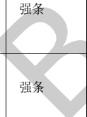</td><td style='text-align: center; word-wrap: break-word;'>采用自然通风方式的避难层（间）应设有不同朝向的可开启外窗，其有效面积不应小于该避难层（间）地面面积的2%，且每个朝向的面积不应小于 $ 2.0 m^{2} $。</td><td style='text-align: center; word-wrap: break-word;'>楼层、房间、窗、地面面积</td><td style='text-align: center; word-wrap: break-word;'>准确</td></tr><tr><td style='text-align: center; word-wrap: break-word;'>6</td><td style='text-align: center; word-wrap: break-word;'>3.3.1</td><td style='text-align: center; word-wrap: break-word;'>建筑高度大于100 m的建筑，其机械加压送风系统应应分段独立设置，且每段高度不应超过100 m。</td><td style='text-align: center; word-wrap: break-word;'>建筑高度、房间、送风系统</td><td style='text-align: center; word-wrap: break-word;'>准确</td></tr><tr><td style='text-align: center; word-wrap: break-word;'></td><td style='text-align: center; word-wrap: break-word;'>强条</td><td style='text-align: center; word-wrap: break-word;'>机械加压送风系统应采用管道送风，且不应采用土建风道。送风管道应采用不燃材料制作且内壁应光滑。当送风管道内壁为金属时，设计风速不应大于20 m/s；当送风管道内壁为非金属时，设计风速不应大于15 m/s；送风管道的厚度应符合现行国家标准《通风与空调工程施工质量验收规范》GB 50243的规定。</td><td style='text-align: center; word-wrap: break-word;'>加压送风系统（风管、风口、风机）</td><td style='text-align: center; word-wrap: break-word;'>准确</td><td style='text-align: center; word-wrap: break-word;'></td></tr><tr><td style='text-align: center; word-wrap: break-word;'>8</td><td style='text-align: center; word-wrap: break-word;'>3.3.11</td><td style='text-align: center; word-wrap: break-word;'>强条</td><td style='text-align: center; word-wrap: break-word;'>设置机械加压送风系统的封闭楼梯间、防烟楼梯间，尚应在其顶部设置不小于 $ 1 m^{2} $的固定窗。靠外墙的防烟楼梯间，尚应在其外墙上每5层内设置总面积不小于 $ 2 m^{2} $的固定窗。</td><td style='text-align: center; word-wrap: break-word;'>房间、机械加压送风装置、窗、楼层</td><td style='text-align: center; word-wrap: break-word;'>准确</td></tr></table>

表E.3暖通专业BIM智能审查条文表（续）

<table border=1 style='margin: auto; word-wrap: break-word;'><tr><td style='text-align: center; word-wrap: break-word;'>序号</td><td style='text-align: center; word-wrap: break-word;'>审查条文</td><td style='text-align: center; word-wrap: break-word;'>条文类型</td><td style='text-align: center; word-wrap: break-word;'>条文内容</td><td style='text-align: center; word-wrap: break-word;'>模型关联信息</td><td style='text-align: center; word-wrap: break-word;'>准确性及说明</td></tr><tr><td style='text-align: center; word-wrap: break-word;'>9</td><td style='text-align: center; word-wrap: break-word;'>4.4.1</td><td style='text-align: center; word-wrap: break-word;'>强条</td><td style='text-align: center; word-wrap: break-word;'>当建筑的机械排烟系统沿水平方向布置时，每个防火分区的机械排烟系统应独立设置。</td><td style='text-align: center; word-wrap: break-word;'>排烟系统、楼层、防火分区</td><td style='text-align: center; word-wrap: break-word;'>准确</td></tr><tr><td style='text-align: center; word-wrap: break-word;'>10</td><td style='text-align: center; word-wrap: break-word;'>4.4.2</td><td style='text-align: center; word-wrap: break-word;'>强条</td><td style='text-align: center; word-wrap: break-word;'>建筑高度超过50 m的公共建筑和建筑高度超过100 m的住宅，其排烟系统应竖向分段独立设置，且公共建筑每段高度不应超过50 m，住宅建筑每段高度不应超过100 m。</td><td style='text-align: center; word-wrap: break-word;'>房间、排烟系统</td><td style='text-align: center; word-wrap: break-word;'>准确</td></tr><tr><td style='text-align: center; word-wrap: break-word;'>11</td><td style='text-align: center; word-wrap: break-word;'>4.4.7</td><td style='text-align: center; word-wrap: break-word;'>强条</td><td style='text-align: center; word-wrap: break-word;'>机械排烟系统应采用管道排烟，且不应采用土建风道。排烟管道应采用不燃材料制作且内壁应光滑。当排烟管道内壁为金属时，管道设计风速不应大于20 m/s；当排烟管道内壁为非金属时，管道设计风速不应大于15 m/s；排烟管道的厚度应按现行国家标准《通风与空调工程施工质量验收规范》GB 50243的有关规定执行。</td><td style='text-align: center; word-wrap: break-word;'>\n排烟系统（风管、风口、风机）</td><td style='text-align: center; word-wrap: break-word;'>准确</td></tr><tr><td style='text-align: center; word-wrap: break-word;'>12</td><td style='text-align: center; word-wrap: break-word;'>4.4.10</td><td style='text-align: center; word-wrap: break-word;'></td><td style='text-align: center; word-wrap: break-word;'>排烟管道下列部位应设置排烟防火阀：\n1 垂直风管与每层水平风管交接处的水平管段上；\n2 一个排烟系统负担多个防烟分区的排烟支管上；\n3 排烟风机入口处；\n4 穿越防火分区处。</td><td style='text-align: center; word-wrap: break-word;'>风管、排烟防火阀、防火分区、风机、风口、房间、防烟分区</td><td style='text-align: center; word-wrap: break-word;'>准确</td></tr><tr><td style='text-align: center; word-wrap: break-word;'>13</td><td style='text-align: center; word-wrap: break-word;'></td><td style='text-align: center; word-wrap: break-word;'>强条</td><td style='text-align: center; word-wrap: break-word;'>除地上建筑的走道或建筑面积小于500  $ m^{{2}} $的房间外，设置排烟系统的场所应设置补风系统。</td><td style='text-align: center; word-wrap: break-word;'>楼层、房间、区域、排烟系统、补风系统</td><td style='text-align: center; word-wrap: break-word;'>需复核\n需专家复核属于直通室外出口进行补风的情况；</td></tr><tr><td colspan="6">注 1：准确指该条文审查准确性达 95%，无需人工复核。\n注 2：需复核指该条文中部分内容需要人工复核确认。</td></tr></table>

[来源：GB 51251-2017]

表E.4暖通专业BIM智能审查条文表

<table border=1 style='margin: auto; word-wrap: break-word;'><tr><td style='text-align: center; word-wrap: break-word;'>序号</td><td style='text-align: center; word-wrap: break-word;'>审查条文</td><td style='text-align: center; word-wrap: break-word;'>条文类型</td><td style='text-align: center; word-wrap: break-word;'>条文内容</td><td style='text-align: center; word-wrap: break-word;'>模型关联信息</td><td style='text-align: center; word-wrap: break-word;'>准确性及说明</td></tr><tr><td style='text-align: center; word-wrap: break-word;'>1</td><td style='text-align: center; word-wrap: break-word;'>8.5.3</td><td style='text-align: center; word-wrap: break-word;'>强条</td><td style='text-align: center; word-wrap: break-word;'>无外留的暗卫生间，应设置防止回流的机械通风设施或预留机械通风设置条件。</td><td style='text-align: center; word-wrap: break-word;'>排风系统、房间、止回阀</td><td style='text-align: center; word-wrap: break-word;'>需复核需要专家复核是否属于管道直通室外的情况。</td></tr><tr><td colspan="6">注1：准确指该条文审查准确性达95%，无需人工复核。\n注2：需复核指该条文中部分内容需要人工复核确认。</td></tr></table>

[来源：GB 50096-2011]

#### 附录 F

#### （资料性）

#### 人防专业 BIM 智能审查条文库

人防专业共根据1本文件中已拆解的条文审查模型，现已拆解条文共6条，其中强条3条，一般性条文3条。具体条文详见表F.1。（拆解的条文随引用规范的修订而修订本规范。）

表F.1 人防专业BIM智能审查条文表

<table border=1 style='margin: auto; word-wrap: break-word;'><tr><td style='text-align: center; word-wrap: break-word;'>序号</td><td style='text-align: center; word-wrap: break-word;'>审查条文</td><td style='text-align: center; word-wrap: break-word;'>条文类型</td><td style='text-align: center; word-wrap: break-word;'>条文内容</td><td style='text-align: center; word-wrap: break-word;'>模型关联信息</td><td style='text-align: center; word-wrap: break-word;'>准确性及说明</td></tr><tr><td style='text-align: center; word-wrap: break-word;'>1</td><td style='text-align: center; word-wrap: break-word;'>3.2.6</td><td style='text-align: center; word-wrap: break-word;'>一般</td><td style='text-align: center; word-wrap: break-word;'>医疗救护工程、防空专业队工程、人员掩蔽工程和配套工程应按下列规定划分防护单元和抗爆单元：\n1 上部建筑层数为九层或不足九层(包括没有上部建筑)的防空地下室应按表3.2.6的要求划分防护单元和抗爆单元（表格）；\n注：防空地下内部为小房间布置时，可不划分抗爆单元。\n2 上部建筑的层数为十层或多于十层(其中一部分上部建筑可不足十层或没有上部建筑，但其建筑面积不得大于200  $ m^{{2}} $)的防空地下室，可不划分防护单元和抗爆单元(注：位于多层地下室底层的防空地下室，其上方的地下室层数可计入上部建筑的层数)；\n3 对于多层的乙类防空地下室和多层的核心5级、核6级、核6B级的甲类防空地下室，当其上下相邻楼层划分为不同防护单元时，位于下层及以下的各层可不再划分防护单元和抗爆单元。</td><td style='text-align: center; word-wrap: break-word;'>建筑类型、区域、建筑层数、人防等级</td><td style='text-align: center; word-wrap: break-word;'>准确</td></tr><tr><td style='text-align: center; word-wrap: break-word;'>2</td><td style='text-align: center; word-wrap: break-word;'>3.2.13</td><td style='text-align: center; word-wrap: break-word;'>强条</td><td style='text-align: center; word-wrap: break-word;'>在染毒区与清洁区之间应设置整体浇筑的钢筋混凝土密闭隔墙，其厚度不应小于200 mm，并应在染毒区一侧墙面用水泥砂浆抹光。当密闭隔墙上有管道穿过时，应采取密闭措施。在密闭隔墙上开设门洞时，应设置密闭门。</td><td style='text-align: center; word-wrap: break-word;'>建筑类型、区域、墙、水管、风管、门</td><td style='text-align: center; word-wrap: break-word;'>准确</td></tr></table>

表F.1 人防专业BIM智能审查条文表（续）

<table border=1 style='margin: auto; word-wrap: break-word;'><tr><td style='text-align: center; word-wrap: break-word;'>序号</td><td style='text-align: center; word-wrap: break-word;'>审查条文</td><td style='text-align: center; word-wrap: break-word;'>条文类型</td><td style='text-align: center; word-wrap: break-word;'>条文内容</td><td style='text-align: center; word-wrap: break-word;'>模型关联信息</td><td style='text-align: center; word-wrap: break-word;'>准确性及说明</td></tr><tr><td style='text-align: center; word-wrap: break-word;'>3</td><td style='text-align: center; word-wrap: break-word;'>3.3.1</td><td style='text-align: center; word-wrap: break-word;'>强条</td><td style='text-align: center; word-wrap: break-word;'>防空地下室战时使用的出入口，其设置应符合下列规定：\n1 防空地下室的每个防护单元不应少于两个出入口(不包括竖井式出入口、防护单元之间的连通口)，其中至少有一个室外出入口（竖井式除外）。战时主要出入口应设在室外出入口(符合第3.3.2条规定的防空地下室除外)；</td><td style='text-align: center; word-wrap: break-word;'>本条文仅第1款为强条，仅拆解此部分。</td><td style='text-align: center; word-wrap: break-word;'>准确</td></tr><tr><td style='text-align: center; word-wrap: break-word;'>4</td><td style='text-align: center; word-wrap: break-word;'>3.3.5</td><td style='text-align: center; word-wrap: break-word;'>一般</td><td style='text-align: center; word-wrap: break-word;'>出入口通道、楼梯和门洞尺寸应根据战时及平时的使用要求，以及防护密闭门、密闭门的尺寸确定。并应符合下列规定：\n1 防空地下室的战时人员出入口的最小尺寸应符合表3.3.5的规定；战时车辆出入口的最小尺寸应根据进出车辆的车型尺寸确定（表格）；\n注：战时备用出入口的门洞最小尺寸可按宽 $ \times $高= $ 0.70 m \times 1.60 m $；通道最小尺寸可按 $ 1.00 m \times 2.00 m $。\n2 人防物资库的主要出入口宜按物资进出口设计，建筑面积不大于 $ 2000 m^{2} $物资库的物资进出口门洞净宽不应小于 $ 1.50 m $、建筑面积大于 $ 2000 m^{2} $物资库的物资进出口门洞净宽不应小于 $ 2.00 m $；\n3 出入口通道的净宽不应小于门洞净宽。</td><td style='text-align: center; word-wrap: break-word;'>建筑类型、房间、门、门洞、楼梯、区域</td><td style='text-align: center; word-wrap: break-word;'>准确</td></tr><tr><td style='text-align: center; word-wrap: break-word;'>5</td><td style='text-align: center; word-wrap: break-word;'>3.3.26</td><td style='text-align: center; word-wrap: break-word;'>强条</td><td style='text-align: center; word-wrap: break-word;'>当电梯通至地下室时，电梯必须设置在防空地下室的防护密闭区以外。</td><td style='text-align: center; word-wrap: break-word;'>建筑类型、区域、电梯</td><td style='text-align: center; word-wrap: break-word;'>准确</td></tr><tr><td style='text-align: center; word-wrap: break-word;'>6</td><td style='text-align: center; word-wrap: break-word;'>3.5.3</td><td style='text-align: center; word-wrap: break-word;'>一般</td><td style='text-align: center; word-wrap: break-word;'>中心医院、急救医院应设开水间。其它防空地下室当人员较多，且有条件时可设开水间。</td><td style='text-align: center; word-wrap: break-word;'>建筑类型、房间</td><td style='text-align: center; word-wrap: break-word;'>准确</td></tr><tr><td colspan="6">注 1：准确指该条文审查准确性达 95%，无需人工复核。\n注 2：需复核指该条文中部分内容需要人工复核确认。</td></tr></table>

[来源：GB 50038-2005]

#### 附录G

#### （资料性）

#### 节能专业BIM智能审查条文库

节能专业共根据2本文件中已拆解的条文审查模型，现已拆解条文共4条，强条2条，一般性条文2条。具体条文详见表G.1～表G.2。（拆解的条文随引用规范的修订而修订本规范。）

表G.1节能专业BIM智能审查条文表

<table border=1 style='margin: auto; word-wrap: break-word;'><tr><td style='text-align: center; word-wrap: break-word;'>序号</td><td style='text-align: center; word-wrap: break-word;'>审查条文</td><td style='text-align: center; word-wrap: break-word;'>条文类型</td><td style='text-align: center; word-wrap: break-word;'>条文内容</td><td style='text-align: center; word-wrap: break-word;'>模型关联信息</td><td style='text-align: center; word-wrap: break-word;'>准确性及说明</td></tr><tr><td style='text-align: center; word-wrap: break-word;'>1</td><td style='text-align: center; word-wrap: break-word;'>3.1.6</td><td style='text-align: center; word-wrap: break-word;'>强条</td><td style='text-align: center; word-wrap: break-word;'>甲类公共建筑的屋顶透光部分面积不应大于屋顶总面积的20%。当不能满足本条的规定时，必须按本文件规定的方法进行权衡判断。</td><td style='text-align: center; word-wrap: break-word;'>建筑类型、屋顶、窗</td><td style='text-align: center; word-wrap: break-word;'>准确</td></tr><tr><td style='text-align: center; word-wrap: break-word;'>2</td><td style='text-align: center; word-wrap: break-word;'>3.1.13</td><td style='text-align: center; word-wrap: break-word;'>强条</td><td style='text-align: center; word-wrap: break-word;'>当公共建筑入口大堂采用全玻璃墙时，全玻璃墙中非中空玻璃的面积不应超过同一立面透光面积（门窗和玻璃幕墙）的15%，且应按同一立面透光面积（含全玻璃墙面积）加权计算平均传热系数。</td><td style='text-align: center; word-wrap: break-word;'>建筑类型、区域、墙（幕墙）</td><td style='text-align: center; word-wrap: break-word;'>准确</td></tr><tr><td colspan="6">注 1：准确指该条文审查准确性达 95%，无需人工复核。\n注 2：需复核指该条文中部分内容需要人工复核确认。</td></tr></table>

[来源：GB 55015-2021]

表G.2节能专业BIM智能审查条文表

<table border=1 style='margin: auto; word-wrap: break-word;'><tr><td style='text-align: center; word-wrap: break-word;'>序号</td><td style='text-align: center; word-wrap: break-word;'>审查条文</td><td style='text-align: center; word-wrap: break-word;'>条文类型</td><td style='text-align: center; word-wrap: break-word;'>条文内容</td><td style='text-align: center; word-wrap: break-word;'>模型关联信息</td><td style='text-align: center; word-wrap: break-word;'>准确性及说明</td></tr><tr><td style='text-align: center; word-wrap: break-word;'>1</td><td style='text-align: center; word-wrap: break-word;'>3.2.2</td><td style='text-align: center; word-wrap: break-word;'>一般</td><td style='text-align: center; word-wrap: break-word;'>严寒地区甲类公共建筑各单一立面窗墙面积比(包括透光幕墙)均不宜大于0.60；其他地区甲类公共建筑各单一立面窗墙面积比(包括透光幕墙)均不宜大于0.70。</td><td style='text-align: center; word-wrap: break-word;'>建筑类型、墙、窗</td><td style='text-align: center; word-wrap: break-word;'>准确</td></tr><tr><td style='text-align: center; word-wrap: break-word;'>2</td><td style='text-align: center; word-wrap: break-word;'>3.2.4</td><td style='text-align: center; word-wrap: break-word;'>一般</td><td style='text-align: center; word-wrap: break-word;'>甲类公共建筑单一立面窗墙面积比小于0.40时，透光材料的可见光透射比不应小于0.60；甲类公共建筑单一立面窗墙面积比大于等于0.40时，透光材料的可见光透射比不应小于0.40。</td><td style='text-align: center; word-wrap: break-word;'>建筑类型、墙、窗</td><td style='text-align: center; word-wrap: break-word;'>准确</td></tr><tr><td colspan="6">注1：准确指该条文审查准确性达95%，无需人工复核。\n注2：需复核指该条文中部分内容需要人工复核确认。</td></tr></table>

[来源：GB 50189-2015]

#### 附 录 H

#### （资料性）

#### 审查项不通过结论相关因素

结构专业审查项不通过结论相关因素可见表H.1查验。

表 H.1 结构构件审查项不通过结论相关因素

<table border=1 style='margin: auto; word-wrap: break-word;'><tr><td style='text-align: center; word-wrap: break-word;'>审查对象</td><td style='text-align: center; word-wrap: break-word;'>审查项</td><td style='text-align: center; word-wrap: break-word;'>审查内容</td><td style='text-align: center; word-wrap: break-word;'>不通过结论相关因素</td></tr><tr><td rowspan="12">柱</td><td rowspan="7">纵筋</td><td style='text-align: center; word-wrap: break-word;'>圆柱纵筋最少根数</td><td style='text-align: center; word-wrap: break-word;'>圆柱纵筋根数过少</td></tr><tr><td style='text-align: center; word-wrap: break-word;'>最小直径</td><td style='text-align: center; word-wrap: break-word;'>柱纵筋直径过小</td></tr><tr><td style='text-align: center; word-wrap: break-word;'>最大间距</td><td style='text-align: center; word-wrap: break-word;'>柱纵筋根数过少</td></tr><tr><td style='text-align: center; word-wrap: break-word;'>最小间距</td><td style='text-align: center; word-wrap: break-word;'>柱纵筋根数过多</td></tr><tr><td rowspan="2">最小配筋率</td><td style='text-align: center; word-wrap: break-word;'>柱纵筋根数过少/直径过小</td></tr><tr><td style='text-align: center; word-wrap: break-word;'>框支柱纵筋根数过少/直径过小</td></tr><tr><td style='text-align: center; word-wrap: break-word;'>最大配筋率</td><td style='text-align: center; word-wrap: break-word;'>柱纵筋根数过多/直径过大</td></tr><tr><td rowspan="3">箍筋</td><td style='text-align: center; word-wrap: break-word;'>最小直径</td><td style='text-align: center; word-wrap: break-word;'>柱箍筋直径过小</td></tr><tr><td rowspan="2">最小体积配箍率</td><td style='text-align: center; word-wrap: break-word;'>柱箍筋间距过大/直径过小</td></tr><tr><td style='text-align: center; word-wrap: break-word;'>框支柱箍筋间距过大/直径过小</td></tr><tr><td rowspan="2">截面</td><td style='text-align: center; word-wrap: break-word;'>最小截面尺寸</td><td style='text-align: center; word-wrap: break-word;'>柱截面尺寸过小</td></tr><tr><td style='text-align: center; word-wrap: break-word;'>截面边长比</td><td style='text-align: center; word-wrap: break-word;'>柱截面长边与短边的边长比过大</td></tr><tr><td rowspan="19">梁</td><td rowspan="8">纵筋</td><td style='text-align: center; word-wrap: break-word;'>最小直径</td><td style='text-align: center; word-wrap: break-word;'>梁纵筋直径过小</td></tr><tr><td style='text-align: center; word-wrap: break-word;'>最大直径</td><td style='text-align: center; word-wrap: break-word;'>梁纵筋直径过大</td></tr><tr><td style='text-align: center; word-wrap: break-word;'>最大配筋率</td><td style='text-align: center; word-wrap: break-word;'>梁纵筋根数过多/直径过大</td></tr><tr><td rowspan="2">最小配筋率</td><td style='text-align: center; word-wrap: break-word;'>梁纵筋根数过少/直径过小</td></tr><tr><td style='text-align: center; word-wrap: break-word;'>转换梁纵筋根数过少/直径过小</td></tr><tr><td style='text-align: center; word-wrap: break-word;'>底面和顶面钢筋面积比</td><td style='text-align: center; word-wrap: break-word;'>梁端截面顶面筋过多/梁端截面底面筋过少</td></tr><tr><td style='text-align: center; word-wrap: break-word;'>通长筋</td><td style='text-align: center; word-wrap: break-word;'>转换梁通长筋根数过少/直径过小</td></tr><tr><td style='text-align: center; word-wrap: break-word;'>纵筋净间距</td><td style='text-align: center; word-wrap: break-word;'>梁纵筋排布错误</td></tr><tr><td rowspan="7">箍筋</td><td style='text-align: center; word-wrap: break-word;'>加密区最小直径</td><td style='text-align: center; word-wrap: break-word;'>梁箍筋直径过小</td></tr><tr><td rowspan="2">加密区长度和间距</td><td style='text-align: center; word-wrap: break-word;'>梁箍筋间距过大</td></tr><tr><td style='text-align: center; word-wrap: break-word;'>转换梁箍筋间距过大</td></tr><tr><td style='text-align: center; word-wrap: break-word;'>加密区肢距</td><td style='text-align: center; word-wrap: break-word;'>梁箍筋肢数过少</td></tr><tr><td style='text-align: center; word-wrap: break-word;'>非加密区间距</td><td style='text-align: center; word-wrap: break-word;'>梁箍筋间距过大</td></tr><tr><td style='text-align: center; word-wrap: break-word;'>非加密区肢距</td><td style='text-align: center; word-wrap: break-word;'>梁箍筋肢数过少</td></tr><tr><td style='text-align: center; word-wrap: break-word;'>最小面积配筋率</td><td style='text-align: center; word-wrap: break-word;'>梁箍筋间距过大/直径过小</td></tr><tr><td rowspan="2">腰筋</td><td style='text-align: center; word-wrap: break-word;'>腰筋最小配筋率</td><td style='text-align: center; word-wrap: break-word;'>转换梁腰筋根数过少/直径过小</td></tr><tr><td style='text-align: center; word-wrap: break-word;'>最小直径</td><td style='text-align: center; word-wrap: break-word;'>梁腰筋直径过小</td></tr><tr><td rowspan="2">截面</td><td style='text-align: center; word-wrap: break-word;'>截面宽度</td><td style='text-align: center; word-wrap: break-word;'>梁截面宽度过小</td></tr><tr><td style='text-align: center; word-wrap: break-word;'>截面高宽比</td><td style='text-align: center; word-wrap: break-word;'>梁截面高度与宽度的比值过大</td></tr></table>

表 H.1 结构构件审查项不通过结论相关因素（续）

<table border=1 style='margin: auto; word-wrap: break-word;'><tr><td style='text-align: center; word-wrap: break-word;'>审查对象</td><td style='text-align: center; word-wrap: break-word;'>审查项</td><td style='text-align: center; word-wrap: break-word;'>审查内容</td><td style='text-align: center; word-wrap: break-word;'>不通过结论相关因素</td></tr><tr><td rowspan="22">结构墙</td><td rowspan="4">约束边缘构件</td><td style='text-align: center; word-wrap: break-word;'>纵筋最小配筋率</td><td style='text-align: center; word-wrap: break-word;'>约束边缘构件纵筋根数过少/直径过小</td></tr><tr><td style='text-align: center; word-wrap: break-word;'>纵筋最小量</td><td style='text-align: center; word-wrap: break-word;'>约束边缘构件纵筋根数过少/直径过小</td></tr><tr><td style='text-align: center; word-wrap: break-word;'>最小体积配箍率</td><td style='text-align: center; word-wrap: break-word;'>约束边缘构件箍筋间距过大/直径过小</td></tr><tr><td style='text-align: center; word-wrap: break-word;'>箍筋沿竖向最大间距</td><td style='text-align: center; word-wrap: break-word;'>约束边缘构件箍筋沿竖向间距过大</td></tr><tr><td rowspan="6">构造边缘构件</td><td style='text-align: center; word-wrap: break-word;'>纵筋最小配筋率</td><td style='text-align: center; word-wrap: break-word;'>构造边缘构件纵筋根数过少/直径过小</td></tr><tr><td style='text-align: center; word-wrap: break-word;'>纵筋最小量</td><td style='text-align: center; word-wrap: break-word;'>构造边缘构件纵筋根数过少/直径过小</td></tr><tr><td style='text-align: center; word-wrap: break-word;'>箍筋最小直径</td><td style='text-align: center; word-wrap: break-word;'>构造边缘构件箍筋直径过小</td></tr><tr><td style='text-align: center; word-wrap: break-word;'>箍筋沿竖向最大间距</td><td style='text-align: center; word-wrap: break-word;'>构造边缘构件箍筋沿竖向间距过大</td></tr><tr><td style='text-align: center; word-wrap: break-word;'>箍筋最大肢距</td><td style='text-align: center; word-wrap: break-word;'>构造边缘构件箍筋肢距过大</td></tr><tr><td style='text-align: center; word-wrap: break-word;'>最小体积配箍率</td><td style='text-align: center; word-wrap: break-word;'>构造边缘构件箍筋间距过大/直径过小</td></tr><tr><td rowspan="5">墙身分布筋</td><td style='text-align: center; word-wrap: break-word;'>短肢墙全部竖向钢筋最小配筋率</td><td style='text-align: center; word-wrap: break-word;'>短肢墙竖向分布筋间距过大/直径过小</td></tr><tr><td style='text-align: center; word-wrap: break-word;'>最小配筋率</td><td style='text-align: center; word-wrap: break-word;'>墙竖向和水平分布筋间距过大/直径过小</td></tr><tr><td style='text-align: center; word-wrap: break-word;'>最小直径</td><td style='text-align: center; word-wrap: break-word;'>墙竖向和水平分布筋直径过小</td></tr><tr><td style='text-align: center; word-wrap: break-word;'>最大直径</td><td style='text-align: center; word-wrap: break-word;'>墙竖向和水平分布筋直径过大</td></tr><tr><td style='text-align: center; word-wrap: break-word;'>最大间距</td><td style='text-align: center; word-wrap: break-word;'>墙竖向和水平分布筋间距过大</td></tr><tr><td rowspan="6">连梁</td><td style='text-align: center; word-wrap: break-word;'>纵筋最小配筋率</td><td style='text-align: center; word-wrap: break-word;'>连梁纵筋根数过少/直径过小</td></tr><tr><td style='text-align: center; word-wrap: break-word;'>纵筋最大配筋率</td><td style='text-align: center; word-wrap: break-word;'>连梁纵筋根数过多/直径过大</td></tr><tr><td style='text-align: center; word-wrap: break-word;'>箍筋最小直径</td><td style='text-align: center; word-wrap: break-word;'>连梁箍筋直径过小</td></tr><tr><td style='text-align: center; word-wrap: break-word;'>箍筋最大间距</td><td style='text-align: center; word-wrap: break-word;'>连梁箍筋间距过大</td></tr><tr><td style='text-align: center; word-wrap: break-word;'>腰筋最小直径</td><td style='text-align: center; word-wrap: break-word;'>连梁腰筋直径过小</td></tr><tr><td style='text-align: center; word-wrap: break-word;'>腰筋最小配筋率</td><td style='text-align: center; word-wrap: break-word;'>连梁腰筋根数过少/直径过小</td></tr><tr><td style='text-align: center; word-wrap: break-word;'>截面</td><td style='text-align: center; word-wrap: break-word;'>最小厚度</td><td style='text-align: center; word-wrap: break-word;'>墙厚过小</td></tr></table>

#### 附录Ⅰ

#### （资料性）

#### 审查意见示例

各专业审查意见格式可见表I.1，以暖通专业为例。

# 表1.1 审查意见（暖通专业）

# 审查意见（暖通专业）

项目编号：XXXX-XXXX

项目名称：XXXX-1#

审查日期：XXXX/X/XX

##### 审查意见：

### 一、违反强制性条文

1. 不符合《建筑设计防火规范》第8.5.3条。未设置排烟系统；

错误构件ID：3339810，3345805，3345808，3340034，3345344，3345407，3345932

2. 不符合《建筑设计防火规范》第8.5.4条。地上大于50平米的无窗房间未设置排烟系统；总面积大于200平米的无窗房间未设置排烟系统；

错误构件ID:

3339808,3339810,3338910,3338926,3338924,3338928,3338930,3338932,3339812,3411609,3339937,3339933,3339935,3339959,3339951,3344830,3344833,3339953,3339955,3339963

### 二、违反审查要点

无

三、其他

无

审查结论：整改

<table border=1 style='margin: auto; word-wrap: break-word;'><tr><td style='text-align: center; word-wrap: break-word;'>审查人</td><td style='text-align: center; word-wrap: break-word;'></td><td style='text-align: center; word-wrap: break-word;'>审查人</td><td style='text-align: center; word-wrap: break-word;'></td></tr></table>

参 考 文 献

[1] DB3201/T 1142 建筑工程施工图信息模型智能审查系统数据规范