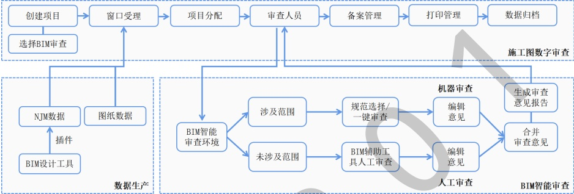

## 5 审查程序

5.1 施工图 BIM 智能审查系统是在施工图数字化审查系统基础上，增加 BIM 审查功能模块，实现计算机智能审查，施工图 BIM 智能审查遵循程序，如图 1 所示。

图1 施工图 BIM 智能审查程序

5.2 窗口受理建设单位项目资料时需审核建设单位填报信息的准确性和完整性。

5.3 审图机构管理人员登录施工图 BIM 智能审查审图机构版账号，按对应专业进行项目分配，进入下一环节。

5.4 审查人员通过施工图 BIM 智能审查系统审查专家版软件进入施工图 BIM 智能审查环境。

5.5 审查人员按专业配置系统账号，使用施工图 BIM 智能审查系统分专业进行智能化审查。

5.6 非本专业模型仅能进行查看，无法进入该专业 BIM 智能审查环境。

5.7 审查人员在 BIM 智能审查环境中按照项目类型，对照本文件涉及范围选择适用规范。施工图 BIM 智能审查系统可按专业、规范筛选适用范围。

5.8 模型在 BIM 智能审查环境中以树状列表结构呈现，通过开关按钮实现专业级、楼层级、构件级（此处按分类层级顺序列出）的显示与隐藏。

5.9 审查人员在 BIM 智能审查环境中将二维图纸与三维模型进行联动，同一视图中进行审阅。

5.10 审查人员在 BIM 智能审查环境中进行测量，辅助进行距离、高度信息获取。

5.11 审查人员在 BIM 智能审查环境中进行模型视图切换，在视图控制球选择主视图、透视视图、正交视图、全视图、全方位视图等不同视图，实现对模型的全方位查看。

5.12 审查人员在 BIM 智能审查环境中进行模型动态剖解，查看模型内部构造。

5.13 需人工复核的条文内容、本文件范围未涉及的条文，审查人员需要对照图纸、模型进行复核，生成审查意见报告。

## 6 审查范围

### 6.1 建筑专业模型审查范围

建筑专业根据9本文件审查模型，如表1所示。条文详见附录A。