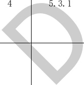

## 附录A

## （资料性）

## 建筑专业BIM智能审查条文库

建筑专业根据9本文件中已拆解的条文审查模型，现已拆解条文共88条，其中强条70条，一般性条文13条，要点5条。具体条文详见表A.1～表A.9。（拆解的条文随引用规范的修订而修订本规范。）

表 A.1 建筑专业 BIM 智能审查条文表

<table border=1 style='margin: auto; word-wrap: break-word;'><tr><td style='text-align: center; word-wrap: break-word;'>序号</td><td style='text-align: center; word-wrap: break-word;'>审查条文</td><td style='text-align: center; word-wrap: break-word;'>条文类型</td><td style='text-align: center; word-wrap: break-word;'>条文内容</td><td style='text-align: center; word-wrap: break-word;'>模型关联信息</td><td style='text-align: center; word-wrap: break-word;'>准确性及说明</td></tr><tr><td style='text-align: center; word-wrap: break-word;'>1</td><td style='text-align: center; word-wrap: break-word;'>5.1.3</td><td style='text-align: center; word-wrap: break-word;'>强条</td><td style='text-align: center; word-wrap: break-word;'>民用建筑的耐火等级应根据其建筑高度、使用功能、重要性和火灾扑救难度等确定，并应符合下列规定：\n1 地下或半地下建筑（室）和一类高层建筑的耐火等级不应低于一级；\n2 单、多层重要公共建筑和二类高层建筑的耐火等级不应低于二级。</td><td style='text-align: center; word-wrap: break-word;'>建筑类型、建筑层数、耐火等级</td><td style='text-align: center; word-wrap: break-word;'>需复核\n两个安全出口距离计算有200 mm左右的误差。</td></tr><tr><td style='text-align: center; word-wrap: break-word;'>2</td><td style='text-align: center; word-wrap: break-word;'>5.1.3A</td><td style='text-align: center; word-wrap: break-word;'>强条</td><td style='text-align: center; word-wrap: break-word;'>除木结构建筑外，老年人照料设施的耐火等级不应低于三级。</td><td style='text-align: center; word-wrap: break-word;'>建筑类型、耐火等级</td><td style='text-align: center; word-wrap: break-word;'>需复核\n门开启方向。</td></tr><tr><td style='text-align: center; word-wrap: break-word;'>3</td><td style='text-align: center; word-wrap: break-word;'>5.1.4</td><td style='text-align: center; word-wrap: break-word;'>强条</td><td style='text-align: center; word-wrap: break-word;'>建筑高度大于100 m的民用建筑，其楼板的耐火极限不应低于2.00 h。\n一、二级耐火等级建筑的上人平屋顶，其屋面板的耐火极限分别不应低于1.50 h和1.00 h。</td><td style='text-align: center; word-wrap: break-word;'>建筑类型、建筑高度、耐火等级、楼板、平屋顶</td><td style='text-align: center; word-wrap: break-word;'>需复核\n楼梯宽度减去扶手宽度20 mm；\n楼梯的宽度只能计算直梯和双跑楼梯，其他形状楼梯可能计算不准确。</td></tr><tr><td colspan="2"></td><td style='text-align: center; word-wrap: break-word;'></td><td style='text-align: center; word-wrap: break-word;'>除本规范另有规定外，不同耐火等级建筑的允许建筑高度或层数、防火分区最大允许建筑面积应符合表5.3.1（详见规范）的规定。</td><td style='text-align: center; word-wrap: break-word;'>建筑类型、建筑层数、建筑高度、耐火等级、区域、房间、墙、灭火系统</td><td style='text-align: center; word-wrap: break-word;'>准确</td></tr><tr><td style='text-align: center; word-wrap: break-word;'>5</td><td style='text-align: center; word-wrap: break-word;'>5.3.4</td><td style='text-align: center; word-wrap: break-word;'>强条</td><td style='text-align: center; word-wrap: break-word;'>一、二级耐火等级建筑内的商店营业厅、展览厅，当设置自动灭火系统和火灾自动报警系统并采用不燃或难燃装修材料时，其每个防火分区的最大允许建筑面积应符合下列规定：\n1 设置在高层建筑内时，不应大于4000  $ m^{{2}} $；\n2 设置在单层建筑或仅设置在多层建筑的首层内时，不应大于10000  $ m^{{2}} $；\n3 设置在地下或半地下时，不应大于2000  $ m^{{2}} $。</td><td style='text-align: center; word-wrap: break-word;'>建筑类型、建筑层数、耐火等级、区域、房间、灭火系统、火灾报警系统、楼层</td><td style='text-align: center; word-wrap: break-word;'>准确\n建模需对属性赋值。</td></tr></table>