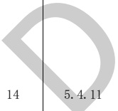

表A.1建筑专业BIM智能审查条文表（续）

<table border=1 style='margin: auto; word-wrap: break-word;'><tr><td style='text-align: center; word-wrap: break-word;'>序号</td><td style='text-align: center; word-wrap: break-word;'>审查条文</td><td style='text-align: center; word-wrap: break-word;'>条文类型</td><td style='text-align: center; word-wrap: break-word;'>条文内容</td><td style='text-align: center; word-wrap: break-word;'>模型关联信息</td><td style='text-align: center; word-wrap: break-word;'>准确性及说明</td></tr><tr><td style='text-align: center; word-wrap: break-word;'>13</td><td style='text-align: center; word-wrap: break-word;'>5.4.10</td><td style='text-align: center; word-wrap: break-word;'>强条</td><td style='text-align: center; word-wrap: break-word;'>除商业服务网点外，住宅建筑与其他使用功能的建筑合建时，应符合下列规定：\n1 住宅部分与非住宅部分之间，应采用耐火极限不低于2.00 h且无门、窗、洞口的防火隔墙和1.50 h的不燃性楼板完全分隔；当为高层建筑时，应采用无门、窗、洞口的防火墙和耐火极限不低于2.00 h的不燃性楼板完全分隔。建筑外墙上、下层开口之间的防火措施应符合本规范第6.2.5条的规定。\n2 住宅部分与非住宅部分的安全出口和疏散楼梯应分别独立设置；为住宅部分服务的地上车库应设置独立的疏散楼梯或安全出口，地下车库的疏散楼梯应按本规范第6.4.4条的规定进行分隔。\n3 住宅部分和非住宅部分的安全疏散、防火分区和室内消防设施配置，可根据各自的建筑高度分别按照本规范有关住宅建筑和公共建筑的规定执行；该建筑的其他防火设计应根据建筑的总高度和建筑规模按本规范有关公共建筑的规定执行。</td><td style='text-align: center; word-wrap: break-word;'>建筑类型、耐火极限、防火隔墙、门、窗、洞口、楼板、楼梯、防火分区、建筑高度</td><td style='text-align: center; word-wrap: break-word;'>准确\n临空窗台拆解时用的外窗替代，即窗户名称中含“外”说明是临空窗台。\n该条文中的第三款为一般条文。</td></tr><tr><td style='text-align: center; word-wrap: break-word;'></td><td style='text-align: center; word-wrap: break-word;'></td><td style='text-align: center; word-wrap: break-word;'>强条</td><td style='text-align: center; word-wrap: break-word;'>设置商业服务网点的住宅建筑，其居住部分与商业服务网点之间应采用耐火极限不低于2.00 h且无门、窗、洞口的防火隔墙和1.50 h的不燃性楼板完全分隔，住宅部分和商业服务网点部分的安全出口和疏散楼梯应分别独立设置。商业服务网点中每个分隔单元之间应采用耐火极限不低于2.00 h且无门、窗、洞口的防火隔墙相互分隔，当每个分隔单元任一层建筑面积大于200  $ m^{{2}} $时，该层应设置2个安全出口或疏散门。每个分隔单元内的任一点至最近直通室外的出口的直线距离不应大于本规范表5.5.17中有关多层其他建筑位于袋形走道两侧或尽端的疏散门至最近安全出口的最大直线距离。</td><td style='text-align: center; word-wrap: break-word;'>建筑类型、耐火极限、门、窗、洞口、防火隔墙、楼板、楼梯、走道</td><td style='text-align: center; word-wrap: break-word;'>需复核\n临空室内楼梯的距离可按其水平投影长度的1.5倍计算。</td></tr></table>