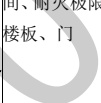

表A.1建筑专业BIM智能审查条文表（续）

<table border=1 style='margin: auto; word-wrap: break-word;'><tr><td style='text-align: center; word-wrap: break-word;'>序号</td><td style='text-align: center; word-wrap: break-word;'>审查条文</td><td style='text-align: center; word-wrap: break-word;'>条文类型</td><td style='text-align: center; word-wrap: break-word;'>条文内容</td><td style='text-align: center; word-wrap: break-word;'>模型关联信息</td><td style='text-align: center; word-wrap: break-word;'>准确性及说明</td></tr><tr><td style='text-align: center; word-wrap: break-word;'>16</td><td style='text-align: center; word-wrap: break-word;'>5.4.13</td><td style='text-align: center; word-wrap: break-word;'>强条</td><td style='text-align: center; word-wrap: break-word;'>布置在民用建筑内的柴油发电机房应符合下列规定：\n2 不应布置在人员密集场所的上一层、下一层或贴邻。\n3 应采用耐火极限不低于2.00 h的防火隔墙和1.50 h的不燃性楼板与其他部位分隔，门应采用甲级防火门。\n4 机房内设置储油间时，其总储存量不应大于 $ 1 m^{{3}} $，储油间应采用耐火极限不低于3.00 h的防火隔墙与发电机间分隔；确需在防火隔墙上开门时，应设置甲级防火门。\n5 应设置火灾报警装置。\n6 应设置与柴油发电机容量和建筑规模相适应的灭火设施，当建筑内其他部位设置自动喷水灭火系统时，机房内应设置自动喷水灭火系统。</td><td style='text-align: center; word-wrap: break-word;'>建筑类型、房\n建筑类型、房\n建筑类型、墙、\n</td><td style='text-align: center; word-wrap: break-word;'>需复核\n门-台阶最小距离的计算台阶的标高取的底标高，revit中只支持使用楼梯族库建模。\n本条中的“人员密集场所”同上。\n本条文中第1款为一般性条文，未拆解。</td></tr><tr><td style='text-align: center; word-wrap: break-word;'>17</td><td style='text-align: center; word-wrap: break-word;'>5.5.8</td><td style='text-align: center; word-wrap: break-word;'></td><td style='text-align: center; word-wrap: break-word;'>公共建筑内每个防火分区或一个防火分区的每个楼层，其安全出口的数量应经计算确定，且不应少于2个。设置1个安全出口或1部疏散楼梯的公共建筑应符合下列条件之一：\n1 除托儿所、幼儿园外，建筑面积不大于 $ 200 m^{{2}} $且人数不超过50人的单层公共建筑或多层公共建筑的首层；\n2 除医疗建筑，老年人照料设施，托儿所、幼儿园的儿童用房，儿童游乐厅等儿童活动场所和歌舞娱乐放映游艺场所等外，符合表5.5.8规定的公共建筑。（表5.5.8略）</td><td style='text-align: center; word-wrap: break-word;'>建筑类型、防火分区、楼层、安全出口、疏散楼梯、建筑面积、人数</td><td style='text-align: center; word-wrap: break-word;'>准确</td></tr></table>

