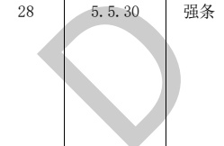

表A.1建筑专业BIM智能审查条文表（续）

<table border=1 style='margin: auto; word-wrap: break-word;'><tr><td style='text-align: center; word-wrap: break-word;'>序号</td><td style='text-align: center; word-wrap: break-word;'>审查条文</td><td style='text-align: center; word-wrap: break-word;'>条文类型</td><td style='text-align: center; word-wrap: break-word;'>条文内容</td><td style='text-align: center; word-wrap: break-word;'>模型关联信息</td><td style='text-align: center; word-wrap: break-word;'>准确性及说明</td></tr><tr><td style='text-align: center; word-wrap: break-word;'>26</td><td style='text-align: center; word-wrap: break-word;'>5.5.26</td><td style='text-align: center; word-wrap: break-word;'>强条</td><td style='text-align: center; word-wrap: break-word;'>建筑高度大于27 m，但不大于54 m的住宅建筑，每个单元设置一座疏散楼梯时，疏散楼梯应通至屋面，且单元之间的疏散楼梯应能通过屋面连通，户门应采用乙级防火门。当不能通至屋面或不能通过屋面连通时，应设置2个安全出口。</td><td style='text-align: center; word-wrap: break-word;'>建筑类型、建筑高度、单元、楼梯、平屋顶、门、洞</td><td style='text-align: center; word-wrap: break-word;'>准确\n楼梯的“楼梯井净宽”是计算得到，支持计算双跑楼梯的井宽，旋转楼梯等复杂的形状计算可能不准确。</td></tr><tr><td style='text-align: center; word-wrap: break-word;'>27</td><td style='text-align: center; word-wrap: break-word;'>5.5.29</td><td style='text-align: center; word-wrap: break-word;'>强条</td><td style='text-align: center; word-wrap: break-word;'>住宅建筑的安全疏散距离应符合下列规定：\n1 直通疏散走道的户门至最近安全出口的直线距离不应大于表5.5.29（表略）的规定。\n2 楼梯间应在首层直通室外，或在首层采用扩大的封闭楼梯间或防烟楼梯间前室。层数不超过4层时，可将直通室外的门设置在离楼梯间不大于15 m处。\n3 户内任一点至直通疏散走道的户门的直线距离不应大于表5.5.29规定的袋形走道两侧或尽端的疏散门至最近安全出口的最大直线距离。</td><td style='text-align: center; word-wrap: break-word;'>建筑类型、门、楼梯间、楼层、走道</td><td style='text-align: center; word-wrap: break-word;'>准确</td></tr><tr><td style='text-align: center; word-wrap: break-word;'>28</td><td style='text-align: center; word-wrap: break-word;'>5.5.30</td><td style='text-align: center; word-wrap: break-word;'>强条</td><td style='text-align: center; word-wrap: break-word;'>住宅建筑的户门、安全出口、疏散走道和疏散楼梯的各自总净宽度应经计算确定，且户门和安全出口的净宽度不应小于0.90 m，疏散走道、疏散楼梯和首层疏散外门的净宽度不应小于1.10 m。建筑高度不大于18 m的住宅中一边设置栏杆的疏散楼梯，其净宽度不应小于1.0 m。</td><td style='text-align: center; word-wrap: break-word;'>建筑类型、区域、楼梯、门、门洞、楼层、建筑高度、楼梯栏杆</td><td style='text-align: center; word-wrap: break-word;'>准确\n疏散门净宽尺寸防火门门洞尺寸扣减150 mm，其他门门洞尺寸扣减100 mm。\n一边设置栏杆的疏散楼梯宽度至少减去50 mm。疏散走道扣除粉刷层厚度，需复核。</td></tr><tr><td style='text-align: center; word-wrap: break-word;'>29</td><td style='text-align: center; word-wrap: break-word;'>5.5.31</td><td style='text-align: center; word-wrap: break-word;'>强条</td><td style='text-align: center; word-wrap: break-word;'>建筑高度大于100 m的住宅建筑应设置避难层，避难层的设置应符合本规范第5.5.23条有关避难层的要求。</td><td style='text-align: center; word-wrap: break-word;'>建筑类型、建筑高度、避难</td><td style='text-align: center; word-wrap: break-word;'>准确</td></tr></table>

