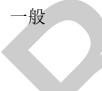

表A.5建筑专业BIM智能审查条文表（续）

<table border=1 style='margin: auto; word-wrap: break-word;'><tr><td style='text-align: center; word-wrap: break-word;'>序号</td><td style='text-align: center; word-wrap: break-word;'>审查条文</td><td style='text-align: center; word-wrap: break-word;'>条文类型</td><td style='text-align: center; word-wrap: break-word;'>条文内容</td><td style='text-align: center; word-wrap: break-word;'>模型关联信息</td><td style='text-align: center; word-wrap: break-word;'>准确性及说明</td></tr><tr><td style='text-align: center; word-wrap: break-word;'>7</td><td style='text-align: center; word-wrap: break-word;'>8.2.3</td><td style='text-align: center; word-wrap: break-word;'>要点</td><td style='text-align: center; word-wrap: break-word;'>中小学校建筑的安全出口、疏散走道、疏散楼梯和房间疏散门等处每100人的净宽度应按表8.2.3计算。同时，教学用房的内走道净宽度不应小于2.40 m，单侧走道及外廊的净宽度不应小于1.80 m。表8.2.3安全出口、疏散走道、疏散楼梯和房间、疏散门每100人的净宽度（m）。</td><td style='text-align: center; word-wrap: break-word;'>建筑类型、门、房间</td><td style='text-align: center; word-wrap: break-word;'>需复核疏散人数目前需要用户手填，不准确；疏散门净宽尺寸防火门门洞尺寸扣减150mm，其他门洞尺寸扣减100mm。楼梯净宽：栏杆扶手中心线到墙面。内走道净宽至少扣除50mm。单侧走道及外廊的净宽应扣除粉刷和保温层厚度。</td></tr><tr><td style='text-align: center; word-wrap: break-word;'>8</td><td style='text-align: center; word-wrap: break-word;'>8.5.3</td><td style='text-align: center; word-wrap: break-word;'>要点</td><td style='text-align: center; word-wrap: break-word;'>教学用建筑物出入口净通行宽度不得小于1.40 m，门内与门外各1.50 m范围内不宜设置台阶。</td><td style='text-align: center; word-wrap: break-word;'>建筑类型、门、台阶</td><td style='text-align: center; word-wrap: break-word;'>需复核门-台阶最小距离的计算；台阶的标高取的底标高，revit中只支持用楼梯建模。</td></tr><tr><td style='text-align: center; word-wrap: break-word;'>9</td><td style='text-align: center; word-wrap: break-word;'>8.7.2</td><td style='text-align: center; word-wrap: break-word;'></td><td style='text-align: center; word-wrap: break-word;'>中小学校教学用房的楼梯梯段宽度应为人流股数的整数倍。梯段宽度不应小于1.20 m，并应按0.60 m的整数倍增加梯段宽度。每个梯段可增加不超过0.15 m的摆幅宽度。</td><td style='text-align: center; word-wrap: break-word;'>建筑类型、楼梯</td><td style='text-align: center; word-wrap: break-word;'>准确</td></tr><tr><td style='text-align: center; word-wrap: break-word;'>1</td><td style='text-align: center; word-wrap: break-word;'></td><td style='text-align: center; word-wrap: break-word;'>要点</td><td style='text-align: center; word-wrap: break-word;'>每间教学用房的疏散门均不应少于2个，疏散门的宽度应通过计算；同时，每樘疏散门的通行净宽度不应小于0.90 m。当教室处于袋形走道末端时，若教室内任一处距教室门不超过15.00 m，且门的通行净宽度不小于1.50 m时，可设1个门。</td><td style='text-align: center; word-wrap: break-word;'>建筑类型、房间，门</td><td style='text-align: center; word-wrap: break-word;'>需复核教室处于袋形走道尽端的判断，不规则教室内任一处距教室门不超过15.00 m的计算疏散门净宽为门洞尺寸扣减100mm。</td></tr><tr><td style='text-align: center; word-wrap: break-word;'>11</td><td style='text-align: center; word-wrap: break-word;'>9.2.1</td><td style='text-align: center; word-wrap: break-word;'>要点</td><td style='text-align: center; word-wrap: break-word;'>教学用房工作面或地面上的采光系数不得低于表9.2.1的规定和现行国家标准GB/T 50033的有关规定。在建筑方案设计时，其采光窗洞口面积应按不低于表9.2.1窗地面积比的规定估算。</td><td style='text-align: center; word-wrap: break-word;'>建筑类型、房间、窗</td><td style='text-align: center; word-wrap: break-word;'>准确南京市属于IV类光气候区，所在地区的采光系数标准值应乘以南京地区的光气候系数1.1。</td></tr><tr><td colspan="6">注1：准确指该条文审查准确性达95%，无需人工复核。注2：需复核指该条文中部分内容需要人工复核确认。</td></tr></table>