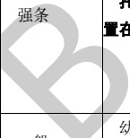

表 A.6 建筑专业 BIM 智能审查条文表

<table border=1 style='margin: auto; word-wrap: break-word;'><tr><td style='text-align: center; word-wrap: break-word;'>序号</td><td style='text-align: center; word-wrap: break-word;'>审查条文</td><td style='text-align: center; word-wrap: break-word;'>条文类型</td><td style='text-align: center; word-wrap: break-word;'>条文内容</td><td style='text-align: center; word-wrap: break-word;'>模型关联信息</td><td style='text-align: center; word-wrap: break-word;'>准确性及说明</td></tr><tr><td style='text-align: center; word-wrap: break-word;'>1</td><td style='text-align: center; word-wrap: break-word;'>6.0.5</td><td style='text-align: center; word-wrap: break-word;'>强条</td><td style='text-align: center; word-wrap: break-word;'>特级、甲级档案馆和属于一类高层的乙级档案馆建筑均应设置火灾自动报警系统。其他乙级档案馆的档案库、服务器机房、缩微用房、音像技术用房、空调机房等房间应设置火灾自动报警系统。</td><td style='text-align: center; word-wrap: break-word;'>建筑类型、房间、自动报警系统</td><td style='text-align: center; word-wrap: break-word;'>准确</td></tr><tr><td style='text-align: center; word-wrap: break-word;'>2</td><td style='text-align: center; word-wrap: break-word;'>6.0.9</td><td style='text-align: center; word-wrap: break-word;'>要点</td><td style='text-align: center; word-wrap: break-word;'>档案库区缓冲间及档案库的门均应向疏散方向开启，并应为甲级防火门。</td><td style='text-align: center; word-wrap: break-word;'>房间、门</td><td style='text-align: center; word-wrap: break-word;'>需复核门开向判断。</td></tr><tr><td colspan="6">注1：准确指该条文审查准确性达95%，无需人工复核。\n注2：需复核指该条文中部分内容需要人工复核确认。</td></tr></table>

[来源：JGJ 25-2010]

表 A.7 建筑专业 BIM 智能审查条文表

<table border=1 style='margin: auto; word-wrap: break-word;'><tr><td style='text-align: center; word-wrap: break-word;'>序号</td><td style='text-align: center; word-wrap: break-word;'>审查条文</td><td style='text-align: center; word-wrap: break-word;'>条文类型</td><td style='text-align: center; word-wrap: break-word;'>条文内容</td><td style='text-align: center; word-wrap: break-word;'>模型关联信息</td><td style='text-align: center; word-wrap: break-word;'>准确性及说明</td></tr><tr><td style='text-align: center; word-wrap: break-word;'>1</td><td style='text-align: center; word-wrap: break-word;'>4.1.3</td><td style='text-align: center; word-wrap: break-word;'></td><td style='text-align: center; word-wrap: break-word;'>幼儿所、幼儿园中的生活用房不应设地下室或半地下室。</td><td style='text-align: center; word-wrap: break-word;'>建筑类型、房间、楼层</td><td style='text-align: center; word-wrap: break-word;'>准确\n地下室和半地下室的判断标准是房间的计算标高，当计算标高大于0时，认为房间不在地下室和半地下室。</td></tr><tr><td style='text-align: center; word-wrap: break-word;'>2</td><td style='text-align: center; word-wrap: break-word;'>4.1.3A</td><td style='text-align: center; word-wrap: break-word;'>一般</td><td style='text-align: center; word-wrap: break-word;'>幼儿园生活用房应布置在三层及以下。</td><td style='text-align: center; word-wrap: break-word;'>建筑类型、房间、楼层</td><td style='text-align: center; word-wrap: break-word;'>准确</td></tr><tr><td style='text-align: center; word-wrap: break-word;'>3</td><td style='text-align: center; word-wrap: break-word;'>4.1.6</td><td style='text-align: center; word-wrap: break-word;'>一般</td><td style='text-align: center; word-wrap: break-word;'>活动室、寝室、多功能活动室等幼儿使用的房间应设双扇平开门，门净宽不应小于1.20 m。</td><td style='text-align: center; word-wrap: break-word;'>房间、门</td><td style='text-align: center; word-wrap: break-word;'>准确\n疏散门净宽为门洞尺寸扣减100 mm。</td></tr><tr><td style='text-align: center; word-wrap: break-word;'>4</td><td style='text-align: center; word-wrap: break-word;'>4.1.9</td><td style='text-align: center; word-wrap: break-word;'>强条</td><td style='text-align: center; word-wrap: break-word;'>托儿所、幼儿园的外廊、室内回廊、内天井、阳台、上人屋面、平台、看台及室外楼梯等临空处应设置防护栏杆，栏杆应以坚固、耐久的材料制作。防护栏杆的高度应从可踏部位顶面起算，且净高不应小于1.30 m。防护栏杆必须采用防止幼儿攀登和穿过的构造，当采用垂直杆件做栏杆时，其杆件净距离不应大于0.09 m。</td><td style='text-align: center; word-wrap: break-word;'>建筑类型、房间、区域、楼梯、栏杆/扶手</td><td style='text-align: center; word-wrap: break-word;'>需复核\n防护栏杆净高计算得到防护栏杆离楼地面完成面100 mm～1000 mm净高度内，不能有横向构件。\n“栏杆应以坚固、耐久的材料制作”未拆解。</td></tr></table>