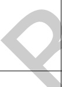

表 A.7 建筑专业 BIM 智能审查条文表（续）

<table border=1 style='margin: auto; word-wrap: break-word;'><tr><td style='text-align: center; word-wrap: break-word;'>序号</td><td style='text-align: center; word-wrap: break-word;'>审查条文</td><td style='text-align: center; word-wrap: break-word;'>条文类型</td><td style='text-align: center; word-wrap: break-word;'>条文内容</td><td style='text-align: center; word-wrap: break-word;'>模型关联信息</td><td style='text-align: center; word-wrap: break-word;'>准确性及说明</td></tr><tr><td style='text-align: center; word-wrap: break-word;'>5</td><td style='text-align: center; word-wrap: break-word;'>4.1.12</td><td style='text-align: center; word-wrap: break-word;'>强条</td><td style='text-align: center; word-wrap: break-word;'>幼儿使用的楼梯，当楼梯井净宽度大于0.11 m时，必须采取防止幼儿攀滑措施。楼梯栏杆应采取不易攀爬的构造，当采用垂直杆件做栏杆时，其杆件净距不应大于0.09 m。</td><td style='text-align: center; word-wrap: break-word;'>建筑类型、房间、楼梯、栏杆/扶手</td><td style='text-align: center; word-wrap: break-word;'>准确\n楼梯的“楼梯井净宽”是计算得到，支持计算双跑楼梯的井宽，旋转楼梯等复杂的形状计算不准确。</td></tr><tr><td colspan="6">注 1：准确指该条文审查准确性达 95%，无需人工复核。\n注 2：需复核指该条文中部分内容需要人工复核确认。</td></tr></table>

[来源：JGJ 39-2016(2019年版)]

表 A.8 建筑专业 BIM 智能审查条文表

<table border=1 style='margin: auto; word-wrap: break-word;'><tr><td style='text-align: center; word-wrap: break-word;'>序号</td><td style='text-align: center; word-wrap: break-word;'>审查条文</td><td style='text-align: center; word-wrap: break-word;'>条文类型</td><td style='text-align: center; word-wrap: break-word;'>条文内容</td><td style='text-align: center; word-wrap: break-word;'>模型关联信息</td><td style='text-align: center; word-wrap: break-word;'>准确性及说明</td></tr><tr><td style='text-align: center; word-wrap: break-word;'>1</td><td style='text-align: center; word-wrap: break-word;'>4.1.9</td><td style='text-align: center; word-wrap: break-word;'>一般 </td><td style='text-align: center; word-wrap: break-word;'>办公建筑的走道应符合下列规定：\n1 宽度应满足防火疏散要求，最小净宽应符合表4.1.9的规定。（表略）\n注：高层内筒结构的回廊式走道净宽最小值同单面布房走道。\n2 高差不足0.30 m时，不应设置台阶，应设坡道，其坡度不应大于1:8。</td><td style='text-align: center; word-wrap: break-word;'>建筑类型、房间、台阶、坡道</td><td style='text-align: center; word-wrap: break-word;'>需复核\n走道长度、宽度及坡道坡度是计算得到；\n台阶只支持用楼梯和常规模型建模。\n走道及外廊的净宽应扣除粉刷和保温层厚度。</td></tr><tr><td style='text-align: center; word-wrap: break-word;'>2</td><td rowspan="2"></td><td style='text-align: center; word-wrap: break-word;'>一般</td><td style='text-align: center; word-wrap: break-word;'>办公建筑的耐火等级应符合下列规定：\n1 A类、B类办公建筑应为一级；\n2 C类办公建筑不应低于二级。</td><td style='text-align: center; word-wrap: break-word;'>建筑类型、办公建筑分类、耐火等级</td><td style='text-align: center; word-wrap: break-word;'>准确\n导出模型时需要填写耐火等级。</td></tr><tr><td style='text-align: center; word-wrap: break-word;'>3</td><td style='text-align: center; word-wrap: break-word;'>一般</td><td style='text-align: center; word-wrap: break-word;'>办公综合楼内办公部分的安全出口不应与同一楼层内外营业的商场、营业厅、娱乐、餐饮等人员密集场所的安全出口共用。</td><td style='text-align: center; word-wrap: break-word;'>建筑类型、房间、面积、安全出口、楼层</td><td style='text-align: center; word-wrap: break-word;'>准确\n模型空间属性要有“办公区域”。</td></tr><tr><td style='text-align: center; word-wrap: break-word;'>4</td><td style='text-align: center; word-wrap: break-word;'>5.0.4</td><td style='text-align: center; word-wrap: break-word;'>一般</td><td style='text-align: center; word-wrap: break-word;'>机要室、档案室、电子信息系统机房和重要库房等隔墙的耐火极限不应小于2 h，楼板不应小于1.5 h，并应采用甲级防火门。</td><td style='text-align: center; word-wrap: break-word;'>建筑类型、房间、墙、楼板、门、耐火极限</td><td style='text-align: center; word-wrap: break-word;'>准确</td></tr></table>