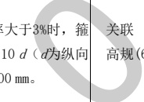

表B.3结构专业BIM智能审查条文表（续）

<table border=1 style='margin: auto; word-wrap: break-word;'><tr><td style='text-align: center; word-wrap: break-word;'>序号</td><td style='text-align: center; word-wrap: break-word;'>审查条文</td><td style='text-align: center; word-wrap: break-word;'>条文类型</td><td style='text-align: center; word-wrap: break-word;'>内容</td><td style='text-align: center; word-wrap: break-word;'>备注</td><td style='text-align: center; word-wrap: break-word;'>完整性</td></tr><tr><td style='text-align: center; word-wrap: break-word;'>9</td><td style='text-align: center; word-wrap: break-word;'>9.3.2-1</td><td style='text-align: center; word-wrap: break-word;'>要点</td><td style='text-align: center; word-wrap: break-word;'>柱中的箍筋应符合下列规定：\n1 柱箍筋直径不应小于 d/4，且不应小于6 mm，d 为纵向钢筋的最大直径；</td><td style='text-align: center; word-wrap: break-word;'>关联\n高规(6.4.9-3)</td><td style='text-align: center; word-wrap: break-word;'>完整</td></tr><tr><td style='text-align: center; word-wrap: break-word;'>10</td><td style='text-align: center; word-wrap: break-word;'>9.3.2-2</td><td style='text-align: center; word-wrap: break-word;'>要点</td><td style='text-align: center; word-wrap: break-word;'>柱中的箍筋应符合下列规定：\n2 箍筋间距不应大于400 mm及构件截面的短边尺寸，且不应大于15 d，d为纵向钢筋的最小直径；</td><td style='text-align: center; word-wrap: break-word;'>关联\n高规(6.4.9-2)</td><td style='text-align: center; word-wrap: break-word;'>完整</td></tr><tr><td style='text-align: center; word-wrap: break-word;'>11</td><td style='text-align: center; word-wrap: break-word;'>9.3.2-5</td><td style='text-align: center; word-wrap: break-word;'>要点</td><td style='text-align: center; word-wrap: break-word;'>柱中的箍筋应符合下列规定：\n5 柱中全部纵向受力钢筋的配筋率\n筋直径不应小于8 mm，间距不应大于受力钢筋最小直径），且不应大于20 </td><td style='text-align: center; word-wrap: break-word;'>4.9-4)</td><td style='text-align: center; word-wrap: break-word;'>不完整\n审查范围不包含后半部分(指的是弯钩部分)。</td></tr><tr><td style='text-align: center; word-wrap: break-word;'>12</td><td style='text-align: center; word-wrap: break-word;'>11.4.18</td><td style='text-align: center; word-wrap: break-word;'>要点</td><td style='text-align: center; word-wrap: break-word;'>（框架柱）在箍筋加密区外，箍筋的体积配筋率不宜小于加密区配筋率的一半；对一、二级抗震等级，箍筋间距不应大于10 d；对三、四级抗震等级，箍筋间距不应大于15 d，此处，d为纵向钢筋直径。</td><td style='text-align: center; word-wrap: break-word;'>关联\n抗规(6.3.9-4-1)\n(6.3.9-4-2)\n高规(6.4.8-3)\n抗规6.3.9-4条\n是要点，因此混规11.4.18条列为要点</td><td style='text-align: center; word-wrap: break-word;'>完整</td></tr><tr><td colspan="6">注 1：完整指该条文已完整拆解，无需人工复核。\n注 2：不完整指该条文中某些部分条款尚未拆解，需人工进行复核。</td></tr></table>

[来源：GB 50010-2010(2015年版)]

