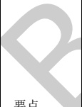

表B.5结构专业BIM智能审查条文表（续）

<table border=1 style='margin: auto; word-wrap: break-word;'><tr><td style='text-align: center; word-wrap: break-word;'>序号</td><td style='text-align: center; word-wrap: break-word;'>审查条文</td><td style='text-align: center; word-wrap: break-word;'>条文类型</td><td style='text-align: center; word-wrap: break-word;'>内容</td><td style='text-align: center; word-wrap: break-word;'>备注</td><td style='text-align: center; word-wrap: break-word;'>完整性</td></tr><tr><td style='text-align: center; word-wrap: break-word;'>28</td><td style='text-align: center; word-wrap: break-word;'>7.2.24</td><td style='text-align: center; word-wrap: break-word;'>一般</td><td style='text-align: center; word-wrap: break-word;'>跨高比（ $ 1/h_{{0}} $）不大于1.5的连梁，非抗震设计时，其纵向钢筋的最小配筋率可取为0.2%；抗震设计时，其纵向钢筋的最小配筋率宜符合JGJ 3-2010中表7.2.24的要求；跨高比大于1.5的连梁，其纵向钢筋的最小配筋率可按框架梁的要求采用。</td><td style='text-align: center; word-wrap: break-word;'>-</td><td style='text-align: center; word-wrap: break-word;'>完整</td></tr><tr><td style='text-align: center; word-wrap: break-word;'>29</td><td style='text-align: center; word-wrap: break-word;'>7.2.25</td><td style='text-align: center; word-wrap: break-word;'>一般</td><td style='text-align: center; word-wrap: break-word;'>剪力墙结构连梁中，非抗震设计时，顶面及底面单侧纵向钢筋的最大配筋率不宜大于2.5%；抗震设计时，顶面及底面单侧纵向钢筋的最大配筋率宜符合JGJ 3-2010中表7.2.25的要求。如不满足，则应按实配钢筋进行连梁强剪弱弯的验算。</td><td style='text-align: center; word-wrap: break-word;'>-</td><td style='text-align: center; word-wrap: break-word;'>不完整\n未考虑强剪弱弯验算。</td></tr><tr><td style='text-align: center; word-wrap: break-word;'>30</td><td style='text-align: center; word-wrap: break-word;'>7.2.27-2</td><td style='text-align: center; word-wrap: break-word;'>要点</td><td style='text-align: center; word-wrap: break-word;'>连梁的配筋构造应符合下列规定：\n2 抗震设计时，沿连梁全长箍筋的构造应符合本规程第6.3.2条框架梁端箍筋加密区的箍筋构造要求；非抗震设计时，沿连梁全长的箍筋直径不应小于6 mm，间距不应大于150 mm。</td><td style='text-align: center; word-wrap: break-word;'>-</td><td style='text-align: center; word-wrap: break-word;'>完整</td></tr><tr><td style='text-align: center; word-wrap: break-word;'>31</td><td style='text-align: center; word-wrap: break-word;'>7.2.27-4</td><td style='text-align: center; word-wrap: break-word;'></td><td style='text-align: center; word-wrap: break-word;'></td><td style='text-align: center; word-wrap: break-word;'>关联\n混规\n(11.7.11-5)\n1 混规\n11.7.11-5条：“当梁的腹板高度 $ h_{{v}} $不小于450 mm时，其两侧面沿梁高范围设置的纵向构造钢筋的直径不应小于8 mm，间距不应大于200 mm；\n其表述与高规7.2.27-4条略有不同：\n2 腰筋总配筋率的计算公式中，面积按照腹板高度 $ h_{{v}} $计算。</td><td style='text-align: center; word-wrap: break-word;'>完整</td></tr></table>

