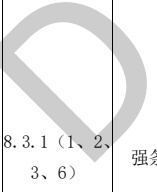

## 附录 C

## （资料性）

## 给排水专业BIM智能审查条文库

给排水专业分为室内给排水和室外给排水两个部分，共根据11本文件中已拆解的条文审查模型，1至6为室内给排水，7至11为室外给排水。现已拆解条文共51条，强条40条，一般性条文7条，要点4条。其中室内给排水37条，强条31条，一般性条文2条，要点4条，具体条文详见表C.1～表C.6；室外给排水14条，强条9条，一般性条文5条。具体条文详见表C.7～表C.11。（拆解的条文随引用规范的修订而修订本规范。）

表C.1给排水专业BIM智能审查条文表

<table border=1 style='margin: auto; word-wrap: break-word;'><tr><td style='text-align: center; word-wrap: break-word;'>序号</td><td style='text-align: center; word-wrap: break-word;'>审查条文</td><td style='text-align: center; word-wrap: break-word;'>条文类型</td><td style='text-align: center; word-wrap: break-word;'>条文内容</td><td style='text-align: center; word-wrap: break-word;'>模型关联信息</td><td style='text-align: center; word-wrap: break-word;'>准确性及说明</td></tr><tr><td style='text-align: center; word-wrap: break-word;'>1</td><td style='text-align: center; word-wrap: break-word;'>8.2.1</td><td style='text-align: center; word-wrap: break-word;'>强条</td><td style='text-align: center; word-wrap: break-word;'>下列建筑或场所应设置室内消火栓系统：\n1 建筑占地面积大于 $ 300 m^{2} $的厂房和仓库；\n2 高层公共建筑和建筑高度大于21 m的住宅建筑；\n注：建筑高度不大于27 m的住宅建筑，设置室内消火栓系统确有困难时，可只设置干式消防竖管和不带消火栓箱的DN 65的室内消火栓。\n3 体积大于 $ 5000 m^{3} $的车站、码头、机场的候车(船、机)建筑、展览建筑、商店建筑、旅馆建筑、医疗建筑、老年人照料设施和图书馆建筑等单、多层建筑；\n4 特等、甲等剧场，超过800个座位的其他等级的剧场和电影院等以及超过1200个座位的礼堂、体育馆等单、多层建筑；\n5 建筑高度大于15 m或体积大于 $ 10000 m^{3} $的办公建筑、教学建筑和其他单、多层民用建筑。</td><td style='text-align: center; word-wrap: break-word;'>建筑类型、建筑高度、建筑面积、建筑体积、建筑座位数、消火栓、组合消火栓箱</td><td style='text-align: center; word-wrap: break-word;'>准确</td></tr><tr><td style='text-align: center; word-wrap: break-word;'>2</td><td style='text-align: center; word-wrap: break-word;'></td><td style='text-align: center; word-wrap: break-word;'>冬</td><td style='text-align: center; word-wrap: break-word;'>除本规范另有规定和不宜用水保护或灭火的场所外，下列厂房或生产部位应设置自动灭火系统，并宜采用自动喷水灭火系统：\n1 不小于50000纱锭的棉纺厂的开包、清花车间，不小于5000锭的麻纺厂的分级、梳麻车间，火柴厂的烤梗、筛选部位；\n2 占地面积大于 $ 1500 m^{2} $或总建筑面积大于 $ 3000 m^{2} $的单、多层制鞋、制衣、玩具及电子等类似生产的厂房；\n3 占地面积大于 $ 1500 m^{2} $的木器厂房；\n6 建筑面积大于 $ 500 m^{2} $的地下或半地下丙类厂房。</td><td style='text-align: center; word-wrap: break-word;'>建筑类型、厂房纱锭量、占地面积、建筑面积、灭火系统、房间、喷头</td><td style='text-align: center; word-wrap: break-word;'>需复核需要复核是否属于电气设备间等不设置喷头的情况。</td></tr></table>