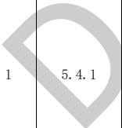

表C.2 给排水专业BIM智能审查条文表（续）

<table border=1 style='margin: auto; word-wrap: break-word;'><tr><td style='text-align: center; word-wrap: break-word;'>序号</td><td style='text-align: center; word-wrap: break-word;'>审查条文</td><td style='text-align: center; word-wrap: break-word;'>条文类型</td><td style='text-align: center; word-wrap: break-word;'>条文内容</td><td style='text-align: center; word-wrap: break-word;'>模型关联信息</td><td style='text-align: center; word-wrap: break-word;'>准确性及说明</td></tr><tr><td style='text-align: center; word-wrap: break-word;'>2</td><td style='text-align: center; word-wrap: break-word;'>7.1.5</td><td style='text-align: center; word-wrap: break-word;'>强条</td><td style='text-align: center; word-wrap: break-word;'>除本规范另有规定外，汽车库、修车库、停车场应设置室外消火栓系统，其室外消防用水量应按消防用水量最大的一座计算，并应符合下列规定：\n1 Ⅰ、Ⅱ类汽车库、修车库、停车场，不应小于20 L/s；\n2 Ⅲ类汽车库、修车库、停车场，不应小于15 L/s；\n3 Ⅳ类汽车库、修车库、停车场，不应小于10 L/s。</td><td style='text-align: center; word-wrap: break-word;'>建筑、给排水全局属性</td><td style='text-align: center; word-wrap: break-word;'>准确</td></tr><tr><td style='text-align: center; word-wrap: break-word;'>3</td><td style='text-align: center; word-wrap: break-word;'>7.1.8</td><td style='text-align: center; word-wrap: break-word;'>强条</td><td style='text-align: center; word-wrap: break-word;'>除本规范另有规定外，汽车库、修车库应设置室内消火栓系统，其消防用水量应符合下列规定：\n1 Ⅰ、Ⅱ、Ⅲ类汽车库及Ⅰ、Ⅱ类修车库的用水量不应小于10 L/s，系统管道内的压力应保证相邻两个消火栓的水枪充实水柱同时到达室内任何部位；\n2 Ⅳ类汽车库及Ⅲ、Ⅳ类修车库的用水量不应小于5 L/s，系统管道内的压力应保证一个消火栓的水枪充实水柱到达室内任何部位。</td><td style='text-align: center; word-wrap: break-word;'>建筑、给排水全局属性</td><td style='text-align: center; word-wrap: break-word;'>准确</td></tr><tr><td colspan="6">注 1：准确指该条文审查准确性达 95%，无需人工复核。\n注 2：需复核指该条文中部分内容需要人工复核确认。</td></tr></table>

[来源：GB 50067-2014]

表C. 3给排水专业BIM智能审查条文表

<table border=1 style='margin: auto; word-wrap: break-word;'><tr><td style='text-align: center; word-wrap: break-word;'>序号</td><td style='text-align: center; word-wrap: break-word;'>审查条文</td><td style='text-align: center; word-wrap: break-word;'>条文类型</td><td style='text-align: center; word-wrap: break-word;'>条文内容</td><td style='text-align: center; word-wrap: break-word;'>模型关联信息</td><td style='text-align: center; word-wrap: break-word;'>准确性及说明</td></tr><tr><td style='text-align: center; word-wrap: break-word;'></td><td style='text-align: center; word-wrap: break-word;'></td><td style='text-align: center; word-wrap: break-word;'></td><td style='text-align: center; word-wrap: break-word;'>下列场所的室内消火栓给水系统应设置消防水泵接合器：\n1 高层民用建筑；\n2 设有消防给水的住宅、超过五层的其他多层民用建筑；\n3 超过2层或建筑面积大于10000  $ m^{{2}} $的地下或半地下建筑（室）、室内消火栓设计流量大于10 L/s平战结合的人防工程；\n4 高层工业建筑和超过四层的多层工业建筑；\n5 城市交通隧道。</td><td style='text-align: center; word-wrap: break-word;'>建筑、管道、水泵接合器、消火栓</td><td style='text-align: center; word-wrap: break-word;'>需复核\n需专家复核是否属于合用水泵接合器的情形。</td></tr><tr><td style='text-align: center; word-wrap: break-word;'>2</td><td style='text-align: center; word-wrap: break-word;'>5.4.2</td><td style='text-align: center; word-wrap: break-word;'>强条</td><td style='text-align: center; word-wrap: break-word;'>自动喷水灭火系统、水喷雾灭火系统、泡沫灭火系统和固定消防炮灭火系统等水灭火系统，均应设置消防水泵接合器。</td><td style='text-align: center; word-wrap: break-word;'>灭火系统、水泵接合器</td><td style='text-align: center; word-wrap: break-word;'>需复核\n需专家复核是否属于合用水泵接合器的情形。</td></tr><tr><td style='text-align: center; word-wrap: break-word;'>3</td><td style='text-align: center; word-wrap: break-word;'>7.4.3</td><td style='text-align: center; word-wrap: break-word;'>强条</td><td style='text-align: center; word-wrap: break-word;'>设置室内消火栓的建筑，包括设备层在内的各层均应设置消火栓。</td><td style='text-align: center; word-wrap: break-word;'>建筑、楼层、消火栓</td><td style='text-align: center; word-wrap: break-word;'>准确</td></tr></table>