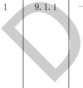

表C. 9给排水专业BIM智能审查条文表

<table border=1 style='margin: auto; word-wrap: break-word;'><tr><td style='text-align: center; word-wrap: break-word;'>序号</td><td style='text-align: center; word-wrap: break-word;'>审查条文</td><td style='text-align: center; word-wrap: break-word;'>条文类型</td><td style='text-align: center; word-wrap: break-word;'>条文内容</td><td style='text-align: center; word-wrap: break-word;'>模型关联信息</td><td style='text-align: center; word-wrap: break-word;'>准确性及说明</td></tr><tr><td style='text-align: center; word-wrap: break-word;'>1</td><td style='text-align: center; word-wrap: break-word;'>3.13.8</td><td style='text-align: center; word-wrap: break-word;'>一般</td><td style='text-align: center; word-wrap: break-word;'>设有室外消火栓的室外给水管道，管径不得小于100 mm。</td><td style='text-align: center; word-wrap: break-word;'>管道系统类型、管道直径</td><td style='text-align: center; word-wrap: break-word;'>准确</td></tr><tr><td colspan="6">注1：准确指该条文审查准确性达95%，无需人工复核。\n注2：需复核指该条文中部分内容需要人工复核确认。</td></tr></table>

[来源：GB 50015-2019]

表C. 10给排水专业BIM智能审查条文表

<table border=1 style='margin: auto; word-wrap: break-word;'><tr><td style='text-align: center; word-wrap: break-word;'>序号</td><td style='text-align: center; word-wrap: break-word;'>审查条文</td><td style='text-align: center; word-wrap: break-word;'>条文类型</td><td style='text-align: center; word-wrap: break-word;'>条文内容</td><td style='text-align: center; word-wrap: break-word;'>模型关联信息</td><td style='text-align: center; word-wrap: break-word;'>准确性及说明</td></tr><tr><td style='text-align: center; word-wrap: break-word;'>1</td><td style='text-align: center; word-wrap: break-word;'>5.1.8</td><td style='text-align: center; word-wrap: break-word;'>一般</td><td style='text-align: center; word-wrap: break-word;'>雨水收集回用系统均应设置弃流设施，雨水入渗收集系统宜设弃流设施。</td><td style='text-align: center; word-wrap: break-word;'>管道系统类型、管道附件</td><td style='text-align: center; word-wrap: break-word;'>准确</td></tr><tr><td style='text-align: center; word-wrap: break-word;'>2</td><td style='text-align: center; word-wrap: break-word;'>5.2.4</td><td style='text-align: center; word-wrap: break-word;'>一般</td><td style='text-align: center; word-wrap: break-word;'>雨水收集宜采用具有拦污截污功能的雨水口或雨水沟，且污物应便于清理。</td><td style='text-align: center; word-wrap: break-word;'>管道附件、说明</td><td style='text-align: center; word-wrap: break-word;'>准确</td></tr><tr><td colspan="6">注1：准确指该条文审查准确性达95%，无需人工复核。\n注2：需复核指该条文中部分内容需要人工复核确认。</td></tr></table>

[来源：GB 50400-2016]

表 C.11 给排水专业 BIM 智能审查条文表

<table border=1 style='margin: auto; word-wrap: break-word;'><tr><td style='text-align: center; word-wrap: break-word;'>序号</td><td style='text-align: center; word-wrap: break-word;'>审查条文</td><td style='text-align: center; word-wrap: break-word;'>条文类型</td><td style='text-align: center; word-wrap: break-word;'>条文内容</td><td style='text-align: center; word-wrap: break-word;'>模型关联信息</td><td style='text-align: center; word-wrap: break-word;'>准确性及说明</td></tr><tr><td style='text-align: center; word-wrap: break-word;'></td><td style='text-align: center; word-wrap: break-word;'>-般</td><td style='text-align: center; word-wrap: break-word;'></td><td style='text-align: center; word-wrap: break-word;'>应制定项目水资源综合利用方案，并符合下列规定：\n1 用地面积大于等于20000  $ m^{{2}} $的新建项目应采取雨水回用措施，用地面积大于100000  $ m^{{2}} $的场地应进行雨水控制利用专项设计。\n2 室外景观用水不得使用市政自来水和地下水。\n3 游泳池、游乐池、水上乐园、洗车场、集中空调系统冷却水等用水系统应采取循环处理措施减少耗水量。\n4 非传统水源利用构筑物应与主体建筑同步设计、同步施工。</td><td style='text-align: center; word-wrap: break-word;'>管道系统类型、水池有效容积</td><td style='text-align: center; word-wrap: break-word;'>准确</td></tr><tr><td colspan="6">注 1：准确指该条文审查准确性达 95%，无需人工复核。\n注 2：需复核指该条文中部分内容需要人工复核确认。</td></tr></table>

[来源：DB32/3962-2020]