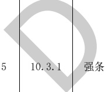

表D.1电气专业BIM智能审查条文表（续）

<table border=1 style='margin: auto; word-wrap: break-word;'><tr><td style='text-align: center; word-wrap: break-word;'>序号</td><td style='text-align: center; word-wrap: break-word;'>审查条文</td><td style='text-align: center; word-wrap: break-word;'>条文类型</td><td style='text-align: center; word-wrap: break-word;'>条文内容</td><td style='text-align: center; word-wrap: break-word;'>模型关联信息</td><td style='text-align: center; word-wrap: break-word;'>准确性及说明</td></tr><tr><td style='text-align: center; word-wrap: break-word;'>2</td><td style='text-align: center; word-wrap: break-word;'>10.1.1</td><td style='text-align: center; word-wrap: break-word;'>强条</td><td style='text-align: center; word-wrap: break-word;'>下列建筑物的消防用电应按一级负荷供电：\n1 建筑高度大于50 m的乙、丙类厂房和丙类仓库；\n2 一类高层民用建筑。</td><td style='text-align: center; word-wrap: break-word;'>建筑类型、建筑高度、电源</td><td style='text-align: center; word-wrap: break-word;'>准确</td></tr><tr><td style='text-align: center; word-wrap: break-word;'>3</td><td style='text-align: center; word-wrap: break-word;'>10.1.2</td><td style='text-align: center; word-wrap: break-word;'>强条</td><td style='text-align: center; word-wrap: break-word;'>下列建筑物、储罐（区）和堆场的消防用电应按二级负荷供电：\n1 室外消防用水量大于30 L/s的厂房（仓库）；\n2 室外消防用水量大于35 L/s的可燃材料堆场、可燃气体储罐（区）和甲、乙类液体储罐（区）；\n3 粮食仓库及粮食筒仓；\n4 二类高层民用建筑；\n5 座位数超过1500个的电影院、剧场，座位数超过3000个的体育馆，任一层建筑面积大于3000  $ m^{{2}} $的商店和展览建筑，省（市）级及以上的广播电视、电信和财贸金融建筑，室外消防用水量大于25 L/s的其他公共建筑。</td><td style='text-align: center; word-wrap: break-word;'>建筑类型、楼层、建筑面积、建筑座位、消防用水量、电气数、电源</td><td style='text-align: center; word-wrap: break-word;'>准确</td></tr><tr><td style='text-align: center; word-wrap: break-word;'>4</td><td style='text-align: center; word-wrap: break-word;'>10.1.5</td><td style='text-align: center; word-wrap: break-word;'>强条</td><td style='text-align: center; word-wrap: break-word;'>建筑内消防应急照明和灯光疏散指示标志的备用电源的连续供电时间应符合下列规定：\n1 建筑高度大于100 m的民用建筑，不应小于1.50 h；\n2 医疗建筑、老年人照料设施、总建筑面积大于100000  $ m^{{2}} $的公共建筑和总建筑面积大于20000  $ m^{{2}} $的地下、半地下建筑，不应少于1.00 h；\n3 其他建筑，不应少于0.50 h。</td><td style='text-align: center; word-wrap: break-word;'>建筑类型、建筑高度、总建筑面积、房间、照明设备（消防应急照明、灯光疏散指示标志）、供电电源</td><td style='text-align: center; word-wrap: break-word;'>准确</td></tr><tr><td colspan="3"></td><td style='text-align: center; word-wrap: break-word;'>除建筑高度小于27 m的住宅建筑外，民用建筑、厂房和丙类仓库的下列部位应设置疏散照明：\n1 封闭楼梯间、防烟楼梯间及其前室、消防电梯间的前室或合用前室、避难走道、避难层（间）；\n2 观众厅、展览厅、多功能厅和建筑面积大于200  $ m^{{2}} $的营业厅、餐厅、演播室等人员密集的场所；\n3 建筑面积大于100  $ m^{{2}} $的地下或半地下公共活动场所；\n4 公共建筑内的疏散走道；\n5 人员密集的厂房内的生产场所及疏散走道。</td><td style='text-align: center; word-wrap: break-word;'>建筑类型、建筑高度、建筑楼层、房间、照明设备（灯具）</td><td style='text-align: center; word-wrap: break-word;'>准确</td></tr><tr><td colspan="6">注 1：准确指该条文审查准确性达 95%，无需人工复核。\n注 2：需复核指该条文中部分内容需要人工复核确认。</td></tr></table>

[来源：GB 50016-2014(2018年版)]