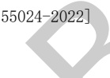

[来源：GB 50116-2013]

表D.4电气专业BIM智能审查条文表

<table border=1 style='margin: auto; word-wrap: break-word;'><tr><td style='text-align: center; word-wrap: break-word;'>序号</td><td style='text-align: center; word-wrap: break-word;'>审查条文</td><td style='text-align: center; word-wrap: break-word;'>条文类型</td><td style='text-align: center; word-wrap: break-word;'>条文内容</td><td style='text-align: center; word-wrap: break-word;'>模型关联信息</td><td style='text-align: center; word-wrap: break-word;'>准确性及说明</td></tr><tr><td style='text-align: center; word-wrap: break-word;'>1</td><td style='text-align: center; word-wrap: break-word;'>11.2.3</td><td style='text-align: center; word-wrap: break-word;'>强条</td><td style='text-align: center; word-wrap: break-word;'>各类防雷建筑物应设接闪器、引下线、接地装置，兵营采取防闪电电涌侵入的措施。建筑物雷电防护分类应符合下列规定：\n1 符合下列条件之一的建筑物应划为第三类防雷建筑物：\n1) 高度超过20 m，且不高于100 m的建筑物；\n2) 预计雷击次数大于或等于0.05次/a，且小于或等于0.25次/a的建筑物；\n3) 在平均雷暴日大于15 d/a的地区，高度在15 m及以上的烟囱、水塔等孤立的高耸建筑物；在平均雷暴日小于或等于15 d/a的地区，高度在20 m及以上的烟囱、水塔等孤立的高耸建筑物。\n2 符合下列条件之一的建筑物应划为第二类防雷建筑物：\n1) 高度超过100 m的建筑物；\n2) 预计雷击次数大于0.25次/a的建筑物。</td><td style='text-align: center; word-wrap: break-word;'>建筑、电气全局属性</td><td style='text-align: center; word-wrap: break-word;'>准确</td></tr><tr><td colspan="6">注 1：准确指该条文审查准确性达 95%，无需人工复核。\n注 2：需复核指该条文中部分内容需要人工复核确认。</td></tr></table>

[来源：GB 55024-2022]

表D.5电气专业BIM智能审查条文表

<table border=1 style='margin: auto; word-wrap: break-word;'><tr><td style='text-align: center; word-wrap: break-word;'>序号</td><td style='text-align: center; word-wrap: break-word;'>审查条文</td><td style='text-align: center; word-wrap: break-word;'>条文类型</td><td style='text-align: center; word-wrap: break-word;'>条文内容</td><td style='text-align: center; word-wrap: break-word;'>模型关联信息</td><td style='text-align: center; word-wrap: break-word;'>准确性及说明</td></tr><tr><td style='text-align: center; word-wrap: break-word;'>1</td><td style='text-align: center; word-wrap: break-word;'>8.7.4条</td><td style='text-align: center; word-wrap: break-word;'>强条</td><td style='text-align: center; word-wrap: break-word;'>套内安装在1.80 m及以下的插座均应采用安全型插座。</td><td style='text-align: center; word-wrap: break-word;'>套型、插座</td><td style='text-align: center; word-wrap: break-word;'>准确</td></tr><tr><td colspan="6">注1：准确指该条文审查准确性达95%，无需人工复核。\n注2：需复核指该条文中部分内容需要人工复核确认。</td></tr></table>

[来源：GB 50096-2011]

表D.6电气专业BIM智能审查条文表

<table border=1 style='margin: auto; word-wrap: break-word;'><tr><td style='text-align: center; word-wrap: break-word;'>序号</td><td style='text-align: center; word-wrap: break-word;'>审查条文</td><td style='text-align: center; word-wrap: break-word;'>条文类型</td><td style='text-align: center; word-wrap: break-word;'>条文内容</td><td style='text-align: center; word-wrap: break-word;'>模型关联信息</td><td style='text-align: center; word-wrap: break-word;'>准确性及说明</td></tr><tr><td style='text-align: center; word-wrap: break-word;'>1</td><td style='text-align: center; word-wrap: break-word;'>8.5.5条</td><td style='text-align: center; word-wrap: break-word;'>强条</td><td style='text-align: center; word-wrap: break-word;'>住宅套内的电源插座与照明，应分路配电。安装在1.8 m及以下的插座均应采用安全型插座。</td><td style='text-align: center; word-wrap: break-word;'>房间、电气设备（插座）</td><td style='text-align: center; word-wrap: break-word;'>准确</td></tr><tr><td style='text-align: center; word-wrap: break-word;'>2</td><td style='text-align: center; word-wrap: break-word;'>9.7.2条</td><td style='text-align: center; word-wrap: break-word;'>强条</td><td style='text-align: center; word-wrap: break-word;'>35层及35层以上的住宅建筑应设置火灾自动报警系统。</td><td style='text-align: center; word-wrap: break-word;'>建筑、火警设备（温烟感、报警器）</td><td style='text-align: center; word-wrap: break-word;'>准确</td></tr></table>