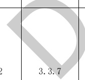

表D.6电气专业BIM智能审查条文表（续）

<table border=1 style='margin: auto; word-wrap: break-word;'><tr><td style='text-align: center; word-wrap: break-word;'>序号</td><td style='text-align: center; word-wrap: break-word;'>审查条文</td><td style='text-align: center; word-wrap: break-word;'>条文类型</td><td style='text-align: center; word-wrap: break-word;'>条文内容</td><td style='text-align: center; word-wrap: break-word;'>模型关联信息</td><td style='text-align: center; word-wrap: break-word;'>准确性及说明</td></tr><tr><td style='text-align: center; word-wrap: break-word;'>3</td><td style='text-align: center; word-wrap: break-word;'>9.7.3条</td><td style='text-align: center; word-wrap: break-word;'>强条</td><td style='text-align: center; word-wrap: break-word;'>10层及10层以上的住宅建筑的楼梯间、电梯间及其前室应设置应急照明。</td><td style='text-align: center; word-wrap: break-word;'>建筑、房间、照明设备（应急照明）</td><td style='text-align: center; word-wrap: break-word;'>准确</td></tr><tr><td colspan="6">注1：准确指该条文审查准确性达95%，无需人工复核。\n注2：需复核指该条文中部分内容需要人工复核确认。</td></tr></table>

[来源：GB 50368-2005]

表D.7电气专业BIM智能审查条文表

<table border=1 style='margin: auto; word-wrap: break-word;'><tr><td style='text-align: center; word-wrap: break-word;'>序号</td><td style='text-align: center; word-wrap: break-word;'>审查条文</td><td style='text-align: center; word-wrap: break-word;'>条文类型</td><td style='text-align: center; word-wrap: break-word;'>条文内容</td><td style='text-align: center; word-wrap: break-word;'>模型关联信息</td><td style='text-align: center; word-wrap: break-word;'>准确性及说明</td></tr><tr><td style='text-align: center; word-wrap: break-word;'>1</td><td style='text-align: center; word-wrap: break-word;'>8.11.11</td><td style='text-align: center; word-wrap: break-word;'>一般</td><td style='text-align: center; word-wrap: break-word;'>竖井内应设电气照明及单相三孔电源插座。</td><td style='text-align: center; word-wrap: break-word;'>房间、照明设备（灯具）、单相三孔电源插座</td><td style='text-align: center; word-wrap: break-word;'>准确</td></tr><tr><td colspan="6">注1：准确指该条文审查准确性达95%，无需人工复核。\n注2：需复核指该条文中部分内容需要人工复核确认。</td></tr></table>

[来源：GB 51348-2019]

表D.8电气专业BIM智能审查条文表

<table border=1 style='margin: auto; word-wrap: break-word;'><tr><td style='text-align: center; word-wrap: break-word;'>序号</td><td style='text-align: center; word-wrap: break-word;'>审查条文</td><td style='text-align: center; word-wrap: break-word;'>条文类型</td><td style='text-align: center; word-wrap: break-word;'>条文内容</td><td style='text-align: center; word-wrap: break-word;'>模型关联信息</td><td style='text-align: center; word-wrap: break-word;'>准确性及说明</td></tr><tr><td style='text-align: center; word-wrap: break-word;'>1</td><td style='text-align: center; word-wrap: break-word;'>3.3.7</td><td style='text-align: center; word-wrap: break-word;'></td><td style='text-align: center; word-wrap: break-word;'>全装修居住建筑每户、居住建筑公共机动车库、办公建筑及具有办公用途的场所、商店建筑、医疗建筑、教育建筑、会展建筑、交通建筑、金融建筑、工业建筑及通用房间或场所的照明功率密度限值。的照明功率密度限值应符合表3.3.7的规定。</td><td style='text-align: center; word-wrap: break-word;'>建筑、电气照明空间</td><td style='text-align: center; word-wrap: break-word;'>需复核\n1 目前是审核现行值，没有审核目标值；\n2 需复核是否属于高档办公室。</td></tr><tr><td style='text-align: center; word-wrap: break-word;'></td><td style='text-align: center; word-wrap: break-word;'>强条</td><td style='text-align: center; word-wrap: break-word;'>强条</td><td style='text-align: center; word-wrap: break-word;'>商店建筑、医疗建筑、教育建筑、会展建筑、交通建筑、金融建筑、工业建筑及通用房间或场所的照明功率密度限值。的照明功率密度限值应符合表3.3.7的规定。\n当一般商店营业厅、高档商店营业厅、专卖店营业厅需装设重点照明时，该营业厅的照明功率密度限值可增加5  $ W/m^{{2}} $。</td><td style='text-align: center; word-wrap: break-word;'>建筑、电气照明空间</td><td style='text-align: center; word-wrap: break-word;'>需复核\n1 目前是审核现行值，没有审核目标值；\n2 需复核是否属于高档商店营业厅、高档超市营业厅。</td></tr><tr><td colspan="6">注 1：准确指该条文审查准确性达 95%，无需人工复核。\n注 2：需复核指该条文中部分内容需要人工复核确认。</td></tr></table>

[来源：GB 50034-2013]