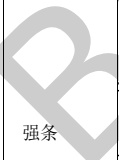

表E.1暖通专业BIM智能审查条文表（续）

<table border=1 style='margin: auto; word-wrap: break-word;'><tr><td style='text-align: center; word-wrap: break-word;'>序号</td><td style='text-align: center; word-wrap: break-word;'>审查条文</td><td style='text-align: center; word-wrap: break-word;'>条文类型</td><td style='text-align: center; word-wrap: break-word;'>条文内容</td><td style='text-align: center; word-wrap: break-word;'>模型关联信息</td><td style='text-align: center; word-wrap: break-word;'>准确性及说明</td></tr><tr><td style='text-align: center; word-wrap: break-word;'>3</td><td style='text-align: center; word-wrap: break-word;'>8.5.3</td><td style='text-align: center; word-wrap: break-word;'>强条</td><td style='text-align: center; word-wrap: break-word;'>民用建筑的下列场所或部位应设置排烟设施：\n1 设置在一、二、三层且房间建筑面积大于 $ 100 m^{2} $的歌舞娱乐放映游艺场所，设置在四层及以上楼层、地下或半地下的歌舞娱乐放映游艺场所；\n2 中庭；\n3 公共建筑内建筑面积大于 $ 100 m^{2} $且经常有人停留的地上房间；\n4 公共建筑内建筑面积大于 $ 300 m^{2} $且可燃物较多的地上房间；\n5 建筑内长度大于20 m的疏散走道。</td><td style='text-align: center; word-wrap: break-word;'>排烟系统、房间</td><td style='text-align: center; word-wrap: break-word;'>需复核\n对人员或可燃物较多、经常有人停留或可燃物较多的场所需判定。</td></tr><tr><td style='text-align: center; word-wrap: break-word;'>4</td><td style='text-align: center; word-wrap: break-word;'>8.5.4</td><td style='text-align: center; word-wrap: break-word;'>强条</td><td style='text-align: center; word-wrap: break-word;'>地下或半地下建筑(室)、地上建筑内的无窗房间，当总建筑面积大于 $ 200 m^{2} $或一个房间建筑面积大于 $ 50 m^{2} $，且经常有人停留或可燃物较多时，应设置排烟设施。</td><td style='text-align: center; word-wrap: break-word;'>排烟系统、房间</td><td style='text-align: center; word-wrap: break-word;'>需复核\n对经常有人停留或可燃物较多的场所需要判定。</td></tr><tr><td style='text-align: center; word-wrap: break-word;'>5</td><td style='text-align: center; word-wrap: break-word;'>9.3.11</td><td style='text-align: center; word-wrap: break-word;'></td><td style='text-align: center; word-wrap: break-word;'>通风、空气调节系统的风管在下列部位应设置公称动作温度为70°C的防火阀：\n1 穿越防火分区处；\n2 穿越通风、空气调节机房的房间隔墙和楼板处；\n3 穿越重要或火灾危险性大的场所的房间隔墙和楼板处；\n4 穿越防火分隔处的变形缝两侧；\n5 竖向风管与每层水平风管交接处的水平管段上。\n注：当建筑内每个防火分区的通风、空气调节系统均独立设置时，水平风管与竖向总管的交接处可不设置防火阀。</td><td style='text-align: center; word-wrap: break-word;'>防火阀、通风系统、空调系统、变形缝、防火分区、房间</td><td style='text-align: center; word-wrap: break-word;'>需复核\n对重要或火灾危险性大的场所需要判定。</td></tr></table>