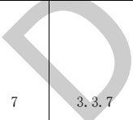

表E.3暖通专业BIM智能审查条文表（续）

<table border=1 style='margin: auto; word-wrap: break-word;'><tr><td style='text-align: center; word-wrap: break-word;'>序号</td><td style='text-align: center; word-wrap: break-word;'>审查条文</td><td style='text-align: center; word-wrap: break-word;'>条文类型</td><td style='text-align: center; word-wrap: break-word;'>条文内容</td><td style='text-align: center; word-wrap: break-word;'>模型关联信息</td><td style='text-align: center; word-wrap: break-word;'>准确性及说明</td></tr><tr><td style='text-align: center; word-wrap: break-word;'>2</td><td style='text-align: center; word-wrap: break-word;'>3.1.5</td><td style='text-align: center; word-wrap: break-word;'>强条</td><td style='text-align: center; word-wrap: break-word;'>防烟楼梯间及其前室的机械加压送风系统的设置应符合下列规定：\n2 当采用合用前室时，楼梯间、合用前室应分别独立设置机械加压送风系统。\n3 当采用剪刀楼梯时，其两个楼梯间及其前室的机械加压送风系统应分别独立设置。</td><td style='text-align: center; word-wrap: break-word;'>房间、机械加压送风装置、楼梯</td><td style='text-align: center; word-wrap: break-word;'>准确</td></tr><tr><td style='text-align: center; word-wrap: break-word;'>3</td><td style='text-align: center; word-wrap: break-word;'>3.2.1</td><td style='text-align: center; word-wrap: break-word;'>强条</td><td style='text-align: center; word-wrap: break-word;'>采用自然通风方式的封闭楼梯间、防烟楼梯间，应在最高部位设置面积不小于 $ 1.0 m^{2} $的可开启外窗或开口；当建筑高度大于10 m时，尚应在楼梯间的外墙上每5层内设置总面积不小于 $ 2.0 m^{2} $的可开启外窗或开口，且布置间隔不大于3层。</td><td style='text-align: center; word-wrap: break-word;'>房间、窗、建筑高度、楼层</td><td style='text-align: center; word-wrap: break-word;'>准确</td></tr><tr><td style='text-align: center; word-wrap: break-word;'>4</td><td style='text-align: center; word-wrap: break-word;'>3.2.2</td><td style='text-align: center; word-wrap: break-word;'>强条</td><td style='text-align: center; word-wrap: break-word;'>前室采用自然通风方式时，独立前室、消防电梯前室可开启外窗或开口的面积不应小于 $ 2.0 m^{2} $，共用前室、合用前室不应小于 $ 3.0 m^{2} $。</td><td style='text-align: center; word-wrap: break-word;'>房间、窗</td><td style='text-align: center; word-wrap: break-word;'>准确</td></tr><tr><td style='text-align: center; word-wrap: break-word;'>5</td><td style='text-align: center; word-wrap: break-word;'>3.2.3</td><td rowspan="2"></td><td style='text-align: center; word-wrap: break-word;'>采用自然通风方式的避难层（间）应设有不同朝向的可开启外窗，其有效面积不应小于该避难层（间）地面面积的2%，且每个朝向的面积不应小于 $ 2.0 m^{2} $。</td><td style='text-align: center; word-wrap: break-word;'>楼层、房间、窗、地面面积</td><td style='text-align: center; word-wrap: break-word;'>准确</td></tr><tr><td style='text-align: center; word-wrap: break-word;'>6</td><td style='text-align: center; word-wrap: break-word;'>3.3.1</td><td style='text-align: center; word-wrap: break-word;'>建筑高度大于100 m的建筑，其机械加压送风系统应应分段独立设置，且每段高度不应超过100 m。</td><td style='text-align: center; word-wrap: break-word;'>建筑高度、房间、送风系统</td><td style='text-align: center; word-wrap: break-word;'>准确</td></tr><tr><td style='text-align: center; word-wrap: break-word;'></td><td style='text-align: center; word-wrap: break-word;'>强条</td><td style='text-align: center; word-wrap: break-word;'>机械加压送风系统应采用管道送风，且不应采用土建风道。送风管道应采用不燃材料制作且内壁应光滑。当送风管道内壁为金属时，设计风速不应大于20 m/s；当送风管道内壁为非金属时，设计风速不应大于15 m/s；送风管道的厚度应符合现行国家标准《通风与空调工程施工质量验收规范》GB 50243的规定。</td><td style='text-align: center; word-wrap: break-word;'>加压送风系统（风管、风口、风机）</td><td style='text-align: center; word-wrap: break-word;'>准确</td><td style='text-align: center; word-wrap: break-word;'></td></tr><tr><td style='text-align: center; word-wrap: break-word;'>8</td><td style='text-align: center; word-wrap: break-word;'>3.3.11</td><td style='text-align: center; word-wrap: break-word;'>强条</td><td style='text-align: center; word-wrap: break-word;'>设置机械加压送风系统的封闭楼梯间、防烟楼梯间，尚应在其顶部设置不小于 $ 1 m^{2} $的固定窗。靠外墙的防烟楼梯间，尚应在其外墙上每5层内设置总面积不小于 $ 2 m^{2} $的固定窗。</td><td style='text-align: center; word-wrap: break-word;'>房间、机械加压送风装置、窗、楼层</td><td style='text-align: center; word-wrap: break-word;'>准确</td></tr></table>