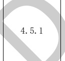

表E.3暖通专业BIM智能审查条文表（续）

<table border=1 style='margin: auto; word-wrap: break-word;'><tr><td style='text-align: center; word-wrap: break-word;'>序号</td><td style='text-align: center; word-wrap: break-word;'>审查条文</td><td style='text-align: center; word-wrap: break-word;'>条文类型</td><td style='text-align: center; word-wrap: break-word;'>条文内容</td><td style='text-align: center; word-wrap: break-word;'>模型关联信息</td><td style='text-align: center; word-wrap: break-word;'>准确性及说明</td></tr><tr><td style='text-align: center; word-wrap: break-word;'>9</td><td style='text-align: center; word-wrap: break-word;'>4.4.1</td><td style='text-align: center; word-wrap: break-word;'>强条</td><td style='text-align: center; word-wrap: break-word;'>当建筑的机械排烟系统沿水平方向布置时，每个防火分区的机械排烟系统应独立设置。</td><td style='text-align: center; word-wrap: break-word;'>排烟系统、楼层、防火分区</td><td style='text-align: center; word-wrap: break-word;'>准确</td></tr><tr><td style='text-align: center; word-wrap: break-word;'>10</td><td style='text-align: center; word-wrap: break-word;'>4.4.2</td><td style='text-align: center; word-wrap: break-word;'>强条</td><td style='text-align: center; word-wrap: break-word;'>建筑高度超过50 m的公共建筑和建筑高度超过100 m的住宅，其排烟系统应竖向分段独立设置，且公共建筑每段高度不应超过50 m，住宅建筑每段高度不应超过100 m。</td><td style='text-align: center; word-wrap: break-word;'>房间、排烟系统</td><td style='text-align: center; word-wrap: break-word;'>准确</td></tr><tr><td style='text-align: center; word-wrap: break-word;'>11</td><td style='text-align: center; word-wrap: break-word;'>4.4.7</td><td style='text-align: center; word-wrap: break-word;'>强条</td><td style='text-align: center; word-wrap: break-word;'>机械排烟系统应采用管道排烟，且不应采用土建风道。排烟管道应采用不燃材料制作且内壁应光滑。当排烟管道内壁为金属时，管道设计风速不应大于20 m/s；当排烟管道内壁为非金属时，管道设计风速不应大于15 m/s；排烟管道的厚度应按现行国家标准《通风与空调工程施工质量验收规范》GB 50243的有关规定执行。</td><td style='text-align: center; word-wrap: break-word;'>\n排烟系统（风管、风口、风机）</td><td style='text-align: center; word-wrap: break-word;'>准确</td></tr><tr><td style='text-align: center; word-wrap: break-word;'>12</td><td style='text-align: center; word-wrap: break-word;'>4.4.10</td><td style='text-align: center; word-wrap: break-word;'></td><td style='text-align: center; word-wrap: break-word;'>排烟管道下列部位应设置排烟防火阀：\n1 垂直风管与每层水平风管交接处的水平管段上；\n2 一个排烟系统负担多个防烟分区的排烟支管上；\n3 排烟风机入口处；\n4 穿越防火分区处。</td><td style='text-align: center; word-wrap: break-word;'>风管、排烟防火阀、防火分区、风机、风口、房间、防烟分区</td><td style='text-align: center; word-wrap: break-word;'>准确</td></tr><tr><td style='text-align: center; word-wrap: break-word;'>13</td><td style='text-align: center; word-wrap: break-word;'></td><td style='text-align: center; word-wrap: break-word;'>强条</td><td style='text-align: center; word-wrap: break-word;'>除地上建筑的走道或建筑面积小于500  $ m^{{2}} $的房间外，设置排烟系统的场所应设置补风系统。</td><td style='text-align: center; word-wrap: break-word;'>楼层、房间、区域、排烟系统、补风系统</td><td style='text-align: center; word-wrap: break-word;'>需复核\n需专家复核属于直通室外出口进行补风的情况；</td></tr><tr><td colspan="6">注 1：准确指该条文审查准确性达 95%，无需人工复核。\n注 2：需复核指该条文中部分内容需要人工复核确认。</td></tr></table>

[来源：GB 51251-2017]